# FreeSBC Design

This document describes FreeSBC as it is implemented in this repository
(module `github.com/freesbc/freesbc`, Go 1.25.7). It describes code that
exists. It contains no roadmap, no tutorial, and no generic protocol
background; where a behaviour is unusual or fragile it is stated as the
current behaviour without a recommendation.

---

## 1. What FreeSBC is

FreeSBC is a single-process, single-binary session border controller. It has
no database, no external media process, no kernel module and no clustering
layer. All runtime state (calls, dialogs, registrations, bans, media
sessions, port reservations) lives in memory and is lost on restart.

It contains **two independent SIP planes**, either of which may be enabled
alone or both together in one process:

| Plane | Package | Role | Enabled when |
|---|---|---|---|
| Trunk | `internal/trunk` | **B2BUA** between carriers and a PBX/softswitch | `len(cfg.Peers) > 0` (`internal/app/app.go:69`) |
| Edge | `internal/edge` | **Stateful SIP proxy** between public endpoints (SIP phones, browsers) and FreeSWITCH, plus a PSTN trunk side | `cfg.ProxyEnabled()`, i.e. `sip.upstream.address` or `sip.upstreams.nodes` is set (`internal/config/proxy.go:271`) |

If neither is enabled, `app.Run` refuses to start:
`"nothing to run: configure trunk peers, sip.upstream.address (or sip.upstreams.nodes), or both"`
(`internal/app/app.go:85`).

### 1.1 Boundaries

**Toward public endpoints (edge plane).** FreeSBC terminates SIP over UDP, WS
and WSS, and terminates the media path: RTP, SRTP-over-DTLS, and ICE-Lite.
A public endpoint never learns FreeSWITCH's address, because every SDP body
the edge plane emits is *constructed* by `internal/sip/sdp.Build` and is never
derived from the other leg's body.

**Toward FreeSWITCH (edge plane, private side).** UDP only. FreeSWITCH is the
authoritative registrar and owns all call logic: dial plans, forking, media
treatment, PSTN bridging decisions. FreeSBC proxies REGISTER verbatim
(including the digest challenge and response) and never holds a credential.

**Toward carriers/PBX (trunk plane).** FreeSBC is a back-to-back user agent:
two legs with their own Call-ID, From-tag, Via and Contact, joined by an
anchored media session. Peers are identified by transport source IP only.

**Toward media endpoints.** FreeSBC anchors every stream on its own UDP port
pair (or, for a browser leg, one ICE-muxed socket). It never bridges media
end-to-end.

### 1.2 What FreeSBC owns vs delegates

| Owned by FreeSBC | Delegated |
|---|---|
| Peer identification, routing, failover, cooldown | SIP transaction state machines, retransmission, Timer B/F/J — `emiago/sipgo` v1.4.3 |
| B2BUA call and leg state (`trunk`), proxy dialog state (`edge`) | Trunk dialog bookkeeping — `sipgo.DialogServerCache` / `DialogClientCache` |
| Port allocation, latching, relay loops, watchdog | SRTP transforms — `pion/srtp/v3`; DTLS handshake and key export — `pion/dtls/v3`; ICE connectivity checks — `pion/ice/v4` |
| SDP parsing limits, codec intersection, body construction (the trunk plane also parses and writes SDP itself, `trunk/sdp.go`) | SDP syntax on the edge plane — `pion/sdp/v3` |
| In-memory ban table, rate limiting, scanner signatures | — (there is no kernel-level ban enforcement) |
| Config schema, validation, atomic hot-swap | YAML parsing — `goccy/go-yaml`; file-change notification — `fsnotify` |
| Admin HTTP API, WebUI, metric collection | Metric exposition — `prometheus/client_golang` |
| — | **All call logic on the edge plane**: FreeSWITCH decides what a call does; the edge plane decides only where a message goes and how media is anchored |

### 1.3 Explicit structural properties

- **No transcoding anywhere.** RTP payloads cross the relay byte-for-byte.
  Codec negotiation preserves the offerer's payload-type numbers; an answer
  that renumbers a codec is rejected (`sdp.ErrRenumbered`) rather than
  rewritten.
- **No persistence.** A restart drops every in-flight call, dialog and
  binding.
- **No clustering.** The upstream pool's hash is local; the shared state it
  depends on (the FreeSWITCH registration database) lives outside FreeSBC.

---

## 2. Architecture and dependency direction

Verified by extracting the non-test imports of every package under
`internal/` and `cmd/`:

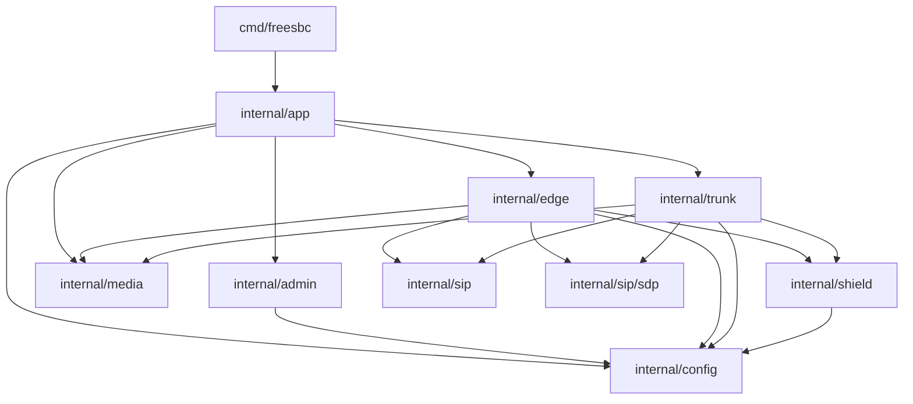

`internal/config`, `internal/media`, `internal/sip` and `internal/sip/sdp`
import nothing from this module. `internal/sip`'s package doc states this
explicitly (`internal/sip/doc.go:1-12`): the two signalling planes share
protocol, never workflow.

Consequences that hold by construction:

- `trunk` and `edge` never import each other. There is no shared call table,
  no shared dialog concept, and no cross-plane routing. A message is handled
  entirely by the plane whose listener it arrived on.
- `media` knows nothing about SIP. It is handed addresses, ports, latch modes
  and SRTP keys; it never parses a SIP message or an SDP body.
- `config` is the only package both planes and `shield` read, and it is
  read-only after publication.

One deliberate exception to the clean separation: `edge.New` calls
`raiseUDPSendLimit()` (`internal/edge/edge.go:94-100`), a `sync.Once`
process-wide raise of **sipgo's** `sip.UDPMTUSize` to 8192, applied only when
it is currently lower. Constructing an edge server
therefore changes the trunk plane's UDP send ceiling too; the code documents
this as intentional (`internal/edge/edge.go:90-93`).

---

## 3. Runtime model

### 3.1 Long-lived objects

Created once, alive for the process lifetime:

| Object | Package | Created at | Notes |
|---|---|---|---|
| `config.Store` | config | `app.Run` (`app.go:53`) | `atomic.Pointer[Config]` + subscriber list |
| trunk `media.PlanePool` (name `"trunk"`) | media | `trunk.NewMediaPool(store)` (`app.go:55`) | one pool; both sides of a trunk call allocate from it |
| edge `pubPool` / `privPool` | media | `edge.New` → `newMediaPools` | two pools with disjoint validated ranges |
| `trunk.Server` | trunk | `app.go:68-71` | binds nothing until `Run` |
| `edge.Server` | edge | `app.go:77-83` | binds nothing until `Run` |
| `trunk.Registrar` | trunk | inside `trunk.Server.Run` (`server.go:285`) | one goroutine per `register: true` peer |
| `trunk.Resolver` | trunk | `NewServer` | SRV cache + singleflight + seeded `rand` |
| `trunk.endpointHealth` | trunk | `NewServer` | endpoint cooldown map |
| `edge.topology` | edge | `edge.New`, re-pinned in `Run` (`edge.go:268`) | immutable snapshot afterwards |
| `edge.Location` | edge | `edge.New` | registration binding table |
| `edge.dialogTable` | edge | `edge.New` (`edge.go:143`) | grouped by Call-ID, matched on Call-ID + both tags |
| `edge.cooldownTable` ×2 | edge | `edge.New` (`edge.go:136-137`) | `upstreamCooldown`, `pstnCooldown`; always allocated |
| `edge.privateSources` | edge | `edge.New` | 256-entry, 10-minute TTL map of private-listener sources |
| `media.DTLSIdentity` | media | `edge.New` when `webrtc.enabled` | one per process, shared by every WebRTC leg |
| `shield.Shield` ×(0..2) | shield | trunk `Run` (`shield.New`), edge `Run` (`shield.NewNoKernel`) | separate instances; both ban in process memory only |
| `admin.Server` | admin | `app.go:120-122` | only when an `admin:` section exists at startup |

### 3.2 Per-unit-of-work objects

| Object | Scope | Owner |
|---|---|---|
| `trunk.call` (+ `aLeg`, `bLeg`, `legSRTP`, `legSDP`) | one bridged call | the `onInvite` goroutine that created it |
| `sipgo.DialogServerSession` / `DialogClientSession` | one trunk leg | same goroutine; single-use objects |
| `trunk.registration` | one `register: true` peer | its own goroutine, generation-stamped |
| `edge.dialog` | one Call-ID | `dialogTable`, under `dialogTable.mu` |
| `edge.inviteAttempt` | one forwarded INVITE in a failover series | the dialog's `inFlight` slot |
| `edge.Binding` | one (AoR, Call-ID) registration | `Location`, under `Location.mu` |
| `edge.mediaSession` | one dialog | attached once via `dialog.attach`, only ever closed |
| `media.Session` | one call/dialog | 2 port pairs = 4 UDP sockets |
| `media.WebRTCLeg` + `media.WebRTCSession` | one browser leg | 1 muxed public socket + 1 private pair |
| `media.SRTPContext` | one direction of one leg | `atomic.Pointer` slots on the session |
| port reservation (`PlanePool.inUse`) | one RTP even port | released by `Session.Close` / `WebRTCLeg.Close` |
| shield ban entry, rate-limit bucket | one source IP (a UDP socket ban: one IP:port; a rate-limit bucket: an IPv4 address or an IPv6 /64) | the owning `Shield` |
| `*config.Config` snapshot | one publication | immutable once stored |

### 3.3 Goroutine inventory

**Process-level (errgroup members, `app.go:91-129`)**

1. `config.Watch` — always; never fatal (`app.Run`'s wrapper logs whatever
   `Watch` returns and returns nil itself, `app.go:93-99`).
2. `trunk.Server.Run` — if the trunk plane is on; its error is fatal.
3. `edge.Server.Run` — if the edge plane is on; fatal.
4. `admin.Server.Run` — if `admin:` exists at startup; fatal.

**Trunk plane**

| Goroutine | Started | Exits |
|---|---|---|
| per listener: `bindListener` + serve | `Run` (`server.go:291-303`) | socket close / serve error |
| per listener: close-watcher (`<-ctx.Done(); ln.Close()`) | `bindListener` | `listenCtx` cancel |
| registrar driver (`Registrar.Run`) | `Run` (`server.go:287`) | `regCtx` cancel |
| per `register: true` peer: `registration.run` | `Registrar.reconcile` | peer removed/changed, or `stopAll` |
| per request: sipgo handler goroutine | sipgo | handler return — for `onInvite`, the whole call |
| per dial attempt: B-leg waiter | `dialTarget` (`b2bua.go:956`) | `WaitAnswer` returns; may outlive the attempt to sipgo Timer_B (~32 s) |
| per forked B-leg 2xx: ACK + BYE | `forkWatch.handleLocked` (`forks.go`) | the BYE's final response or its 5 s `byeContext` |
| per session-timer leg the SBC refreshes: `refreshLoop` | `startRefreshers` (`sessiontimer.go`) | the call's kick context, cancelled by `endCall` |
| shield prune loop | `shield.New` | `Shield.Close` |

**Edge plane**

| Goroutine | Started | Exits |
|---|---|---|
| per listener: closer, and `ln.Serve` | `Run` (`edge.go:272-283`) | `listenCtx` cancel / serve error |
| `Location.Prune` ticker (30 s) | `Run` (`edge.go:297-312`) | `listenCtx` cancel |
| per confirmed dialog: media watcher (`<-sess.Done(); d.end()`) | `dialog.confirm` (`dialog.go:659`) | session `Done` closed |
| WebRTC establishment + fingerprint verification | `allocateWebRTC` (`media.go:261`) | `WebRTCSession.Start` returns |
| `ackThenBye` cleanup | several INVITE paths | its 5 s BYE context |
| shield prune loop | `shield.NewNoKernel` | `Shield.Close` |

**Media**

Per plain `media.Session`: 4 forward loops (RTP A→B, RTP B→A, RTCP A→B,
RTCP B→A) plus 1 watchdog = **5 goroutines**. Per `WebRTCSession`: 1
`publicToPrivate`, 2 `privateToPublic` (RTP and RTCP), 1 watchdog, plus the
leg's `demux.readLoop`, its `establish` goroutine, and a `<-closed` DTLS
closer — about **6** excluding pion's internal goroutines.

---

## 4. Process lifecycle

### 4.1 Entry point

`cmd/freesbc/main.go` accepts exactly two subcommands and one flag:

| Invocation | Behaviour | Exit |
|---|---|---|
| no args | usage to stderr | 2 |
| `-h` / `--help` / `help` | usage to stdout | 0 |
| `check [-c path]` | `app.Check` → `config.Load`; prints `"<path>: config OK"`. It parses and validates only: it opens no certificate or key file and binds no socket, so a missing cert file or a port another process holds is found by `run` alone. Everything validation can decide from the file — literal edge addresses, socket collisions between listeners — `check` rejects exactly as `run` would | 0 / 1 |
| `run [-c path]` | `app.Run` under `signal.NotifyContext(SIGINT, SIGTERM)` | 0 / 1 |
| `check`/`run` with an unrecognised flag | Go's own flag usage to stderr; the flag set is `flag.ExitOnError` (`main.go:37`), so `app.Run` is never reached | 2 |
| anything else | usage to stderr | 2 |

`-c` defaults to `sbc.yaml`. Positional arguments are ignored, so
`freesbc check sbc.yaml` checks the default path, not the named one
(`main.go:39`). The logger is a `slog.TextHandler` on stderr at the default
level; there is no log-level flag. `version` is a link-time variable
(`-X main.version=…`), default `"dev"`.

**There is no SIGHUP handler anywhere in the repository.** Reload is
fsnotify-driven exclusively.

### 4.2 Startup order (`app.Run`)

1. `config.Load(path)` — read file, `config.Parse`. Failure returns
   `load config: %w` and the process exits 1. Nothing has bound.
2. `config.NewStore(cfg)`.
3. `trunk.NewMediaPool(store)` — a `*media.PlanePool` whose `PlaneParams`
   closure re-reads `store.Current()` on every allocation. No sockets bind.
4. Log `"media plane ready"` with the trunk port range and RTP timeout.
5. If `len(Peers) > 0`: `trunk.NewServer(store, pool, log)`. Allocates maps,
   the resolver, endpoint health, `tcpMaxConns = 1024`,
   `tcpIdleTimeout = 120s`. **Binds nothing.** Dialog caches, the registrar
   and the shield are `Run`-only, which is why the accessors
   (`IsRegistered`, `ShieldStats`) all nil-guard.
6. If `ProxyEnabled()`: `edge.New(store, log)`. Builds the topology, raises
   the process-wide UDP MTU, builds two media pools, `Location`, `Metrics`,
   two cooldown tables, the dialog table, and the DTLS identity when
   `webrtc.enabled`. **Binds nothing.** Failure → `edge proxy: %w` before any
   goroutine starts.
7. Both nil → error (see §1).
8. `errgroup.WithContext(ctx)`.
9. Start the errgroup members for the config watcher, the trunk plane and
   the edge plane (`app.go:93-118`).
10. If `admin:` is present in `store.Current()` — read **after** those three
    members are already running, so a reload landing in that window is what
    admin is built from — build `admin.Deps`, call `admin.New`, and start the
    admin member (`app.go:120-130`).
11. Log `"freesbc started"`, block on `<-gctx.Done()`, log
    `"shutting down"`, return `g.Wait()`.

The first non-nil error from a fatal goroutine cancels `gctx`; the other
goroutines see `gctx.Err() != nil` and suppress their own errors, so
`g.Wait()` returns exactly the first error. A clean cancel returns nil from
every member, so `Run` returns nil and the process exits 0.

### 4.3 Listener binding

**Trunk** (`bindListener`, `server.go:349-402`) implements exactly three
transports: `tcp`, `tls`, and `udp` (the `default:` case). There is no
ws/wss listener on the trunk plane. TCP and TLS listeners are wrapped in
`newTCPLimitListener`; UDP is not. `tls` uses the configured
`listen.tls_cert`/`tls_key` if present, otherwise mints a self-signed
certificate and logs `"TLS listener using self-signed certificate"`.

**Edge** (`edge.go:223-283`) binds **every socket synchronously before
serving any of them**; on any failure every already-opened listener is closed
and `Run` returns. The unexported `ready` channel closes once every socket
is open; nothing in production waits on it (the exported `Ready()` was dead
code and was removed) — it is the happens-before edge the test harness uses.
The listener list is
every enabled `cfg.PublicSIPListeners()` entry (`udp`, `ws`, `wss`) plus one
synthetic `"udp-private"` entry for `sip.private.bind`.

Both planes deliberately bypass sipgo's `ListenAndServe*` helpers and call
`tl.ServeUDP` / `ServeTCP` / `ServeTLS` / `ln.Serve` directly, because in
sipgo v1.4.3 those wrappers close an internal listener through an
unsynchronised variable, which the race detector flags on every graceful
shutdown.

After binding, the edge plane replaces its topology with
`s.topo = s.topo.pinned(opened)` (`edge.go:268`). A wildcard bind does not
come up as the address it was written with — on a dual-stack host `0.0.0.0`
yields a socket whose local address is `[::]:port` — and sipgo keys its
connection pool by the socket's real local address. Without pinning, an
outbound request pinned to the configured address misses the pool and sipgo
opens a second socket on the same port (EADDRINUSE). The assignment happens
before any goroutine that reads the topology is created; that ordering is the
happens-before edge which lets the snapshot be read lock-free for the rest of
the process's life.

### 4.4 Reload

Reload is driven only by `config.Watch` (`internal/config/reload.go`, `Watch` and `linkTracker`):

- `fsnotify` watches **the parent directory**, not the file, so atomic-rename
  saves are seen.
- Events are filtered by `Op & (Write|Create|Rename) != 0` (`Chmod` and
  `Remove` are ignored) and by `linkTracker.affects`: an event on the config
  path itself, or on the file it resolves to, reloads; any other entry in the
  directory reloads only if `filepath.EvalSymlinks(path)` now resolves
  somewhere new. That catches a Kubernetes ConfigMap update, which renames a
  new `..data` link into place and never touches the visible file, and any
  other symlink swap on the way (audit P2-CFG-011). When the path resolves
  into another directory, that directory is watched too, so an in-place edit
  of the target reloads.
- **Debounce: 200 ms** (`reloadDebounce`), implemented as a `time.AfterFunc`
  that does a non-blocking send into a buffer-1 `fire` channel.
- On fire: `loadNoPanic(abs)`, which is `Load` behind a last-resort
  `recover()`. On failure, log
  `"config reload failed, keeping previous config"` and continue — the
  running config is untouched and the process never dies from a bad reload.
  `Parse` itself never panics: null map/list entries are rejected before
  defaults run, and a go-yaml decoder panic is turned into a parse error
  (audit P2-CFG-001, P3-CORE-001). On success, `store.Replace(cfg)` and log
  `"config reloaded"`.
- Event-loop errors are logged, never fatal, and the loop always returns nil.
  `Watch` itself can still fail before the loop starts — `filepath.Abs`,
  `fsnotify.NewWatcher`, `w.Add` of the config's directory. Failing to watch
  a symlink target's other directory is only a warning. `app.Run`'s wrapper
  goroutine logs that error and returns nil anyway (`app.go:93-99`), so a
  watcher that never started silently disables reload for the process's life.

`Store.Replace` stores the new pointer atomically, then does a non-blocking
send into every subscriber channel (coalescing). `Store.Current()` is
lock-free and never nil. Snapshots are immutable by contract: a `*Config`
handed to a `Store` is never mutated, and compiled fields
(`Peer.allowedNets`, `Route.matchTo`, `PstnRoute.matchTo`) are populated
during `validate`, before publication.

There is **no reload-failure metric**.

#### What is hot vs restart-only

| Hot (re-read per use) | Restart-only |
|---|---|
| `peers.*` (address, allowed_ips, auth, srtp, transport, quotas) — read per packet in the trunk read filter and per call in the B2BUA | The listener set: `listen.sip` / `sip.bind_ip`, `sip.public.*`, `sip.private.bind` |
| `routes` | Trunk dialog-cache Contact (resolved once in `trunk.Server.Run`) |
| `shield.rate_limit`, `shield.peer_rate_limit`, `shield.auto_ban.duration` | — |
| `admin.auth.username` / `password_hash` (effective on the next request) | `admin.listen`, `admin.tls_cert`, `admin.tls_key`; the **existence** of the `admin:` section |
| RTP port ranges and bind IPs, for **new** sessions only | Edge topology: upstream nodes, PSTN gateways/routes/match, `webrtc.*`, DTLS identity |
| `listen.media.rtp_timeout`, for new sessions | Outbound per-peer TLS material (`newClientTLS`, once at trunk `Run`; §6.14) |
| `sip.upstreams.cooldown`, `sip.pstn.attempt_timeout`, `sip.pstn.cooldown` — re-read per call/registration | Inbound TLS certificates (built once at bind) |

The only `Store.Subscribe()` consumers are `trunk.Registrar.Run` (which
reconciles the registration set on every publication) and
`admin.Server.watchListenChange`, which only logs a warning when
`admin.listen` differs from the bound address. `Subscribe` has no
unsubscribe.

The admin credential path has a deliberate fallback: if the reloaded config
has **no** `admin:` section at all, `adminAuth()` returns the
construction-time credentials rather than denying everyone
(`admin/server.go:255-260`).

### 4.5 Shutdown

SIGINT/SIGTERM cancels the root context; `app.Run` unblocks at
`<-gctx.Done()` and calls `g.Wait()`. **There is no overall shutdown
deadline at the app level.**

**Trunk** uses two root contexts deliberately (`server.go:266-313`).
`regCtx` and `listenCtx` are both derived from `context.Background()`, not
from the caller's context, and a `stopCh` + `sync.Once` fires on either a
caller cancel or a fatal bind failure. The stop sequence is:

```
regCancel()  →  <-regDone  →  listenCancel()  →  wg.Wait()  →  first bind error or nil
```

The registrar must finish its `Expires: 0` un-REGISTERs **while the listener
sockets are still open**, because sipgo reuses a pooled UDP listener
connection for outbound requests; closing listeners concurrently made the
un-REGISTER fail with `net.ErrClosed`. Each un-REGISTER has its own ~2 s
budget from `context.Background()`, independent of the already-cancelled run
context. `defer sh.Close()` on the shield fires after all of this.

**Edge**: `listenCancel()` → each listener's watcher closes its socket →
`wg.Wait()` → `s.dialogs.closeAll()`, which ends every dialog and therefore
closes every media session. There is no BYE-on-shutdown; calls are dropped.

**Admin**: on `ctx.Done()`, `srv.Shutdown` under a fresh **5 s** timeout.
In-flight HTTP requests are drained up to that budget.

**Shield.Close**: cancel the prune loop and wait for it. Bans are in memory
only, so none survive the process.

Exit codes: 0 on a clean shutdown, 1 on any fatal component error or a bad
config at startup, 2 on a usage error.

---

## 5. Configuration

`config.Parse` (`loader.go`) runs five steps in order:

1. `unmarshalStrict` — `yaml.UnmarshalWithOptions(data, &c, yaml.Strict())`;
   **unknown keys are errors**, formatted with line numbers via
   `yaml.FormatError`. A panic inside go-yaml (v1.19.2 has one on some
   malformed tags) is recovered and reported as a parse error.
2. `rejectNullEntries(&c)` — a null `peers`, `sip.upstreams.nodes` or
   `sip.pstn.gateways` entry (an empty `name:` block) or a null `routes` /
   `sip.pstn.routes` item (`- ~`) is an error. Later steps dereference them.
3. `expandEnv(&c)` — `${VAR}` expansion.
4. `withDefaults(&c)`.
5. `c.validate()` — collects **every** error and joins them with newlines.

Env expansion runs after the strict unmarshal and before defaults so that
parse errors can never echo a secret. The only supported syntax is
`${NAME}`; `${VAR:-default}` is rejected as malformed, and `${1}`-style
numeric references are passed through verbatim. Expanded values are never
re-scanned. Missing variables are reported once each.

- **Plain string fields only.** Expansion walks every exported field whose Go
  type is `string` (including inside slices, maps and pointers). Typed scalars
  — durations, `port_range`, `listen.sip` URLs, `host:port` keys such as
  `sip.public.*.bind` and `sip.pstn.match`, and every int or bool — are
  decoded in step 1, before expansion, so `ring_timeout: ${RT}` fails with
  `invalid duration "${RT}"`. Keep secrets in string keys (`password`,
  `username`, `password_hash`, `address`, file paths).
- **`routes[].transform.to` is never expanded** (`env:"-"` on
  `RouteTransform.To`). It is a regexp replacement template: `$1`, `${1}` and
  `${name}` all refer to capture groups of `match.to`. An env-shaped
  `${name}` that `match.to` does not define as a named group is a validation
  error, so a config that used to rely on env expansion there fails loudly
  instead of expanding to nothing.
- **Validation errors never echo an expanded value.** `expandEnv` records each
  substitution on the `Config` (`envRedaction`). `validate`'s `fail` collector
  redacts every argument: an expanded field's value is shown as the template
  the operator wrote (`"${FS_ADDR}:5060"`), and any leftover environment value
  as `${NAME}`. Errors that quote only part of a value (regexp compile errors,
  rate-limit and bcrypt errors) are withheld altogether when the value came
  from expansion. This covers `freesbc check` output and the 400 body of
  `PUT /api/config`.

Validation rules are exhaustive in `internal/config/validate.go` (trunk,
shield, admin, NAT topology) and `internal/config/validate_proxy.go` (edge
plane). Only the relationships that shape deployment are summarised here.

### 5.1 Mode matrix

| Mode | Requires | Skipped requirements |
|---|---|---|
| Trunk-only | ≥1 SIP listener (`listen.sip` or `sip.bind_ip`) and ≥1 peer | the entire edge block must be absent — configuring any of `sip.public`/`sip.private`/`sip.pstn`/`rtp.public`/`rtp.private`/`webrtc` without an upstream is rejected (`validate_proxy.go:21-26`) |
| Edge-only | `sip.upstream.address` or `sip.upstreams.nodes`; ≥1 public listener; `sip.private.bind`; both `rtp.public` and `rtp.private` ranges; advertised IPs for both planes | "at least one SIP listener" and "at least one peer" are skipped when `ProxyEnabled()` |
| Both | all of the above, and a trunk listener must have peers (`validate_proxy.go:34-36`); all three media ranges must be pairwise disjoint where their binds can collide (`validatePoolOverlap`, `validate_proxy.go:270-295`); no two listeners on either plane or the admin API may bind the same socket (`validateSockets`, `validate_proxy.go:326-355`) | — |

Pinned by `TestProxyOnlyConfigIsValid`, `TestProxyAndTrunkCoexist`,
`TestTrunkOnlyConfigUnaffected` (`internal/config/proxy_test.go`).

### 5.2 Trunk / global keys

| Key | Type | Default |
|---|---|---|
| `listen.sip[]` | `udp\|tcp\|tls://host:port` | none |
| `listen.media.port_range` | `"min-max"` | `16384-32768`, applied only when neither `rtp.port_min` nor `rtp.port_max` is set. With peers configured the range must hold one trunk call: two RTP/RTCP pairs, RTP on an even port (so at least 4 ports from an even start) |
| `listen.media.public_ip` | IP or `"auto"` | `"auto"` |
| `listen.media.rtp_timeout` | duration | `5m` |
| `listen.tls_cert` / `tls_key` / `tls_client_ca` | path | "" |
| `ring_timeout` | duration | `60s` |
| `register_expires` | duration | `3600s` |
| `session_expires` | duration | `1800s` |
| `min_se` | duration | `90s` |
| `peer_cooldown` | duration | `30s` |
| `srv_cache_ttl` | duration | `300s` |
| `max_concurrent_calls` | int | 0 = unlimited |
| `peers.<n>.address` | `host[:port]` or hostname | required |
| `peers.<n>.transport` | `udp\|tcp\|tls` | `udp` |
| `peers.<n>.allowed_ips[]` | CIDR or IP | **≥1 required**, canonicalised with `.Masked()`, no wider than IPv4 /8 or IPv6 /32. An IPv4-mapped entry (`::ffff:10.0.0.1`, `::ffff:10.0.0.0/104`) is stored as the IPv4 prefix it maps, because sources are unmapped before matching; one shorter than /96 is rejected |
| `peers.<n>.auth.{username,password,realm}` | | `realm: ""` accepts any challenge realm |
| `peers.<n>.register` | bool | false; `true` requires `auth` |
| `peers.<n>.media_latch` | `strict\|loose` | `strict` |
| `peers.<n>.srtp` | `disabled\|optional\|required` | `disabled` |
| `peers.<n>.register_expires` | duration | 0 = use global; must be ≥ 1s when set |
| `peers.<n>.max_concurrent_calls` | int | 0 = unlimited |
| `peers.<n>.tls_ca` / `tls_client_cert` / `tls_client_key` | path | "" ; cert and key both-or-neither; two `transport: tls` peers may not share an address host (hostname or IP, any port) |
| `routes[].{name,from,match.to,transform.to,to[]}` | | first match wins; `to` order is failover order |
| `sip.bind_ip` | IP | none — when set it *replaces* the `listen.sip` list |
| `sip.bind_port` | 1-65535 | required alongside any other `sip.*` topology key |
| `sip.transport` | `udp\|tcp\|tls` | `udp` (`schema.go:291-293`) |
| `sip.advertised_ip` | IP | `sip.bind_ip` (`schema.go:294-296`) |
| `sip.advertised_port` | 1-65535 | `sip.bind_port` (`schema.go:297-299`) |
| `rtp.bind_ip` | IP | `""` = every interface |
| `rtp.advertised_ip` | IP | `""` = the `advertisedIP` chain of §12.1 |
| `rtp.port_min` / `rtp.port_max` | int | 0 = use `listen.media.port_range`; both-or-neither, ≥ 1024, `min < max`, and room for one trunk call (`validateTrunkMediaRange`) |

Key relationships: `sip.bind_ip` and `listen.sip` are mutually exclusive
(`sip.bind_ip` *replaces* the listener list); `rtp.port_min/max` and
`listen.media.port_range` are mutually exclusive; `rtp.port_min` and
`port_max` are both-or-neither; `sip.bind_ip` together with
`public_ip: auto` forces an explicit `rtp.advertised_ip`, because otherwise
SDP would advertise 127.0.0.1. `transform.to` requires `match.to`, and a
capture-group reference beyond `match.to`'s group count is a validation
error. Advertised addresses may never be the unspecified address.

### 5.3 Shield keys

| Key | Default |
|---|---|
| `shield.rate_limit` | `"20/s per_ip"` |
| `shield.peer_rate_limit` | `"200/s per_ip"` |
| `shield.auto_ban.duration` | `1h` |

Rate-limit grammar: `"<n>/<s|m|h> [per_ip]"`; the only permitted second field
is the literal `per_ip`. There are no ceilings on `n` or floors on the
durations beyond "> 0".

### 5.4 Admin keys

| Key | Default |
|---|---|
| `admin` | absent = admin disabled |
| `admin.listen` | required when the section exists; **must be loopback unless `admin.allow_remote: true`** |
| `admin.allow_remote` | false |
| `admin.tls_cert` / `tls_key` | "" ; both-or-neither |
| `admin.auth.username` | required |
| `admin.auth.password_hash` | bcrypt hash; **cost ≥ 10 enforced** |

### 5.5 Edge plane keys

| Key | Default |
|---|---|
| `network.public.{bind_ip,advertised_ip}` | advertised defaults to bind only when the bind is a *specific* address; a wildcard bind makes `advertised_ip` mandatory |
| `network.private.{bind_ip,advertised_ip}` | same |
| `sip.public.udp` / `ws` / `wss` | `{enabled, bind, cert_file, key_file}`; default binds are `:5060` / `:5066` / `:5061` on `network.public.bind_ip` (else `0.0.0.0`) |
| `sip.private.bind` | `network.private.bind_ip:5060`, or `0.0.0.0:5060` when that is unset (`listenerDefaults`, `proxy.go:444-450`) — always defaulted while the proxy is on, so validation has no "required" check. With both network binds unset, the default public UDP bind collides with it and validation says so |
| `sip.private.advertised_ip` / `advertised_port` | port defaults to the bind port |
| `sip.upstream.address` / `transport` | v1 single-node alias; transport must be `udp` |
| `sip.upstreams.nodes.<n>.{address,transport}` | multi-node pool; addresses must be literal `IP:port`, transport `udp` |
| `sip.upstreams.algorithm` | `"hash-user"` — the only supported value |
| `sip.upstreams.cooldown` | `30s` |
| `sip.pstn.address` (v1 alias) XOR `sip.pstn.gateways` + `routes` | |
| `sip.pstn.match` | required; must name neither the private SIP socket nor any upstream |
| `sip.pstn.attempt_timeout` | `32s` |
| `sip.pstn.cooldown` | `30s` |
| `rtp.public` / `rtp.private` `{bind_ip,advertised_ip,port_min,port_max}` | both planes' ranges are required when the proxy is on, must each hold at least one RTP/RTCP pair, and must be disjoint from each other and from the trunk range |
| `webrtc.enabled` | false |
| `webrtc.ice_mode` | `"lite"` — the only supported value |
| `webrtc.rtcp_mux` | `*bool`, nil = true; an explicit `false` is rejected |
| `webrtc.dtls_cert_file` / `dtls_key_file` | both-or-neither; unset = one per-process self-signed ECDSA certificate |

Notable cross-key rules: `sip.upstream.address` and `sip.upstreams.nodes` are
mutually exclusive; `sip.pstn.address` and `sip.pstn.gateways`/`routes` are
mutually exclusive; `sip.pstn` requires `sip.public.udp.enabled` because the
carrier leg rides the public UDP side; `webrtc.enabled` requires `ws` or
`wss`; and upstream/gateway addresses must be **literal IP:port** and
`sip.pstn.match` a literal IP — there is no DNS on the edge plane. Validation
enforces this (`checkIPPort`, `validatePSTNMatch`), so `check` rejects a
hostname exactly as `run`'s `parseEndpoint` does. Every listener — trunk
`listen.sip`/`sip.bind_ip`, edge `sip.public.*` and `sip.private.bind`, and
`admin.listen` — is also checked for socket collisions: tcp, tls, ws and wss
all listen on TCP, udp on UDP, and a wildcard bind collides with every
address on its port.

### 5.6 Custom scalar types

`Duration` (`time.ParseDuration`), `PortRange` (`"min-max"`, requires
`min < max` and `min != 0`), `SIPListen` (`scheme://host:port`, scheme ∈
{udp,tcp,tls}, port 1-65535) and `HostPort` (`host:port`, port 1-65535, empty
string is a legal no-op). All are unmarshalled through `yamlScalarString`,
which trims whitespace and honours YAML quoting.

---

## 6. SIP processing — trunk plane (B2BUA)

### 6.1 Ingress

**Transports.** `udp`, `tcp`, `tls` only. A TCP/TLS connection whose
source IP matches no peer's `allowed_ips` is closed at accept, before any
TLS handshake and before it is counted, by the same predicate the read
filter uses (`fromPeer`, `readfilter.go:30-45`; P2-TRK-001). TCP and TLS
listeners share one `atomic.Int64` connection counter across *all* such
listeners, capped at `tcpMaxConns = 1024`, which therefore only peers can
occupy; an over-cap connection is closed and the accept loop
retries rather than surfacing an error to sipgo (whose `Serve` treats an
Accept error as fatal to the listener). Every accepted stream connection is
wrapped in `idleTimeoutConn`, which refreshes a `SetReadDeadline(now + 120s)`
before **every** read; writes are deliberately left deadline-free. `Close`
is CAS-guarded so a double close cannot double-decrement the counter. These
limits are per-`Server` fields assigned in `NewServer` (1024 / 120 s,
`server.go:84-86`, `:117-118`), not config keys; only tests override them,
and only before `Run` spawns any goroutine.

**Read filter (pre-parse).** `sip.WithTransportLayerReadFilter(s.preParseFilter())`
installs `fsip.ReadFilter(0, accept)`: **no size cap** (0 disables it — "a
trunk peer is an identified carrier, and its message sizes are its own
business") and an `accept` that parses the transport source and runs
`IdentifyPeer(store.Current(), addr)`. sipgo runs this ahead of the UDP
message pool and ahead of the TCP stream parser, so bytes from a non-peer
source never reach the parser, the transaction layer, the connection pool, or
any log. The filter wrapper never returns an error, because sipgo treats a
filter error as fatal to the entire read loop; a rejection is `(nil, nil)`.

**Peer identification.** `IdentifyPeer(cfg, addr)` matches the **transport
source IP only** against each peer's compiled `allowed_ips`. `req.Source()`
is set by sipgo from the real remote socket — never Via or From. The address
is `Unmap()`ed, so an IPv4 peer arriving on a dual-stack listener as
`::ffff:a.b.c.d` still matches an IPv4 literal. **The port is discarded.**
Ties (overlapping prefixes) are broken by the lexicographically smallest peer
name in a single allocation-free pass, so the result is deterministic despite
Go map ordering. There is no header-based attribution and no SIP-level
challenge anywhere.

**Shield.** Every registered handler is wrapped in `withShield`, which
(a) installs a `recover()` umbrella that logs the panic and stack and
best-effort answers 500, and (b) calls
`shield.Check(src, UserAgent(req), transport)`, returning **silently** on a
`Drop`. Because the read filter already dropped non-peer bytes, in practice
only the peer-rate-limit branch of `Check` is exercised on this plane.

### 6.2 Method dispatch

Handlers registered in `Run` (`server.go:236-240`): `OPTIONS`, `INVITE`,
`ACK`, `BYE`, and `OnNoRoute`. There is no CANCEL, UPDATE, INFO, PRACK,
REGISTER, SUBSCRIBE, NOTIFY, MESSAGE or REFER handler.

| Method / event | Handling |
|---|---|
| **INVITE, no To-tag** | full bridge (§6.3) |
| **INVITE, no To-tag, same Call-ID + From-tag + CSeq as an INVITE still being handled** | merged request (RFC 3261 §8.2.2.2): **482 Loop Detected**, before quota or routing (`beginInvite`, `calls.go:269-284`) |
| **INVITE, To-tag present** | in-dialog branch, matched on Call-ID + both tags (`lookupDialog`, `calls.go:237-246`): the caller's own dialog whose INVITE is still being handled (ACKed but not yet published by `registerCall`; `settingUp`) → **500** + `Retry-After: 1` (RFC 3261 §14.2), so the UA retries instead of ending the dialog; otherwise no live dialog (an unknown Call-ID, or a live Call-ID with other tags) → **481** (RFC 3261 §12.2.2); session-timer refresh → **200 + the SBC's own established answer**; any other re-INVITE on a live dialog (hold/resume, a media change) → **488 Not Acceptable Here** (RFC 3261 §14.2), and the call stays up |
| **ACK** | `dialogSrv.ReadAck`; "no such dialog" is expected for rejected INVITEs and only Debug-logged |
| **BYE** | `dialogSrv.ReadBye`, then `dialogCli.ReadBye`; **481** only if both report no matching dialog; any other error is Debug-logged |
| **OPTIONS** | identified peers get an unconditional **200 OK**, in or out of dialog, with no Allow/Accept/Supported header and no body |
| **CANCEL matching a live INVITE transaction** | handled entirely inside sipgo: 200 to the CANCEL, the INVITE transaction FSM drives 487, and `tx.OnCancel` ends the dialog with `ErrTransactionCanceled`, cancelling `aLeg.Context()` |
| **CANCEL matching nothing** | `onNoRoute`: identify first (unknown source → silence), then **481 Call/Transaction Does Not Exist** (RFC 3261 §9.2) |
| **UPDATE, INFO, PRACK, REFER, NOTIFY, MESSAGE, SUBSCRIBE, inbound REGISTER** | `onNoRoute` (`server.go:645-666`): identify first (unknown source → silence), then **405 Method Not Allowed** + `Allow: INVITE, ACK, BYE, CANCEL, OPTIONS` (RFC 3261 §21.4.6) |
| **`Require: 100rel`** | **420 Bad Extension** + `Unsupported: 100rel`, before routing or dialog creation |
| **`Session-Expires` below `min_se`** | **422 Session Interval Too Small** + `Min-SE`, before routing or dialog creation |

Every handler identifies first — not only INVITE and `onNoRoute` but also
`onOptions`, `onAck` and `onBye` — and an unidentified source is dropped
silently: the handler returns without a response. On udp/tcp/tls that
branch is unreachable in practice: the pre-parse read filter already dropped
every byte from a source matching no peer (`server.go:443-446`,
`readfilter.go:24-45`).

`onNoRoute` is overridden precisely so sipgo's default 405 cannot confirm the
SBC's existence to an unauthorised source: known peers get 405, unknown
sources get silence.

The in-dialog branch never touches `dialogSrv`: in sipgo v1.4.3 `ReadInvite`
is single-use and re-entering it corrupts the dialog's To-tag. A refresh
whose `Session-Expires` is below `min_se` gets **422** + `Min-SE`, as the
initial INVITE does. Otherwise the 200 echoes the requested
`Session-Expires` with the refresher parameter echoed off the request
(`refresherOf`, `timers.go:311-316`, defaulting to `uac`), plus
`Supported: timer`, `Require: timer` when the request said
`Supported: timer` (RFC 4028 §9), a Contact rebuilt for the re-INVITE's own
transport, and `Content-Type: application/sdp`. The 200 goes out on the raw
transaction, which bypasses `DialogServerSession.WriteResponse`'s
retransmit-until-ACK loop, so `respond2xxUntilAck`
(`sessiontimer.go:267-292`) retransmits it itself at T1 doubling to T2 until
the ACK arrives or 64·T1 pass (RFC 3261 §13.3.1.4); `onAck` stops it
(`ackReceived`) before handing any other ACK to `dialogSrv`. The handler
goroutine blocks for that time.

Header names are matched in long and compact form (`x` = Session-Expires,
`k` = Supported; `headersNamed`, `timers.go:24-30`), since sipgo expands only
RFC 3261's core compact names. Delta-seconds above 2^32-1 are clamped to it
(`headerSeconds`, RFC 3261 §25.1).

### 6.3 Initial INVITE — control flow

`onInvite` (`b2bua.go:135-537`) runs on sipgo's per-request goroutine and
**blocks there for the entire call**.

```
tx = &finalTx{tx}                             // records the first final response
defer recoverCall(req, guard)                 // per-call panic umbrella: 500 / BYE
identify(req); !ok -> silent return
From()/To()/CallID() nil -> 400
[in-dialog branch, §6.2]
beginInvite(Call-ID, From-tag, CSeq); dup -> 482; defer done
cfg := store.Current()                        // per-call config snapshot
quota.acquire(peer cap, global cap); !ok -> 503 Call Quota Exceeded + Retry-After: 30
requires100rel -> 420 ; Session-Expires < min_se -> 422
Resolve(cfg, peerName, req.Recipient.User)
  !ok || OutNumber == "" || len(Targets) == 0 -> 404
dialogSrv.ReadInvite -> aLeg                  // err -> 400
remoteMediaIP(req.Body())                     // err -> 488
A-leg SRTP policy                             // required+insecure -> 488
pool.Allocate(latch modes)                    // err -> 503
SetExpectedRemote(SideA, remoteA); SetSRTP(SideA, …)
c := &call{state: callDialing}                // not in any map yet
placeCall(...)                                // §6.4; on failure it already responded
c.bLeg/bID/target/toPeer/start/aSDP/bSDP
killCtx := context.WithCancel(Background()); c.cancel = killCancel
registerCall(c)                               // state = callBridged; defer endCall(c)
select {
  <-aLeg.Context().Done() -> bLeg.Bye(5s ctx)
  <-bLeg.Context().Done() -> aLeg.Bye(5s ctx)
  <-sess.Done()           -> byeBoth(c)       // RTP silence watchdog
  <-killCtx.Done()        -> byeBoth(c)       // admin KillCall
}
```

Defer unwind on return, LIFO: `endCall` → `killCancel` → `bLeg.Close` →
`sess.Close` → `aLeg.Close` → quota `release` → merged-request `done` →
`recoverCall`.

`recoverCall` (`b2bua.go:1822-1828`) logs a panic and then finishes the call
on the wire (`cleanupAfterPanic`, `b2bua.go:1835-1857`): every response on
the INVITE, raw or through the A-leg dialog, goes through `finalTx`, so an
INVITE that got no final response is answered **500**; an A-leg that was
answered 2xx gets a BYE; and a B-leg the carrier answered (`c.bLeg` is set
as soon as the answer arrives) is BYEd, or ACKed and BYEd if the ACK had not
gone out yet. The `Close` defers only drop local dialog state, so without
this the far ends would keep a confirmed dialog with dead media.

The media session is allocated **once, before any target is dialled**, and is
shared by every failover attempt. The only per-call timer goroutines are the
session refreshers (§6.13), started only on a leg whose session timer names
the SBC as refresher; there is no session-expiry enforcement for a leg the
far end refreshes, and no call-duration cap. `ring_timeout` is a
per-attempt `context.WithTimeout`, not a goroutine.

The quota slot is held for the whole call (the `defer release()` runs at
teardown), so `max_concurrent_calls` is in practice a concurrent-call cap.

### 6.4 Target expansion, failover and final-code precedence

`expandTargets` (`b2bua.go:579-602`) turns the route's ordered peer list into
an ordered endpoint list:

```
for each Target in route order:
    if Target.Peer.Register && !IsRegistered(name): skip entirely
    for each Endpoint from resolver.Resolve(peer, srv_cache_ttl):
        health.Available(ep) ? available : cooled
return len(available) > 0 ? available : cooled
```

Cooldown is **skip-if-alternatives**, never a hard block: when every endpoint
is cooling, every endpoint is dialled anyway. (`expandTargets` takes its own
fresh `store.Current()` snapshot for `srv_cache_ttl` alone, `b2bua.go:580`;
the rest of the call runs on `onInvite`'s per-call snapshot.)

`placeCall` (`b2bua.go:649-716`) validates the offer once
(`validAudioSDP`, target-independent → 488), then walks the endpoint list:

- `res.ok` → `health.Recover(ep)` and return the dialled leg.
- `!res.retryable` → return; `dialTarget` already finished the call.
- `res.penalize` → `health.Penalize(ep, peer_cooldown)`.
- Accumulate `lastRealCode/Reason` from `failReal` and a "some attempt rang"
  flag from `failRing`.
- If `aLeg.Context().Err() != nil` the caller is gone; stop.

**Exhaustion precedence**: the last genuine carrier code → else **408
Request Timeout** (some attempt rang out) → else **503 Service Unavailable**.
A trailing dial failure never clobbers an earlier real code. A carrier 401
or 407 is never relayed upstream — it stays `failDial` and ends as 503.

The failure taxonomy, and which failures cool an endpoint down:

| Kind | Meaning | Penalizes the endpoint? |
|---|---|---|
| `failDial` | transport/dial error, caller gone, carrier 401/407, SRTP-required mismatch after answer | only when there was no response at all and the caller is still present |
| `failRing` | `ring_timeout` expired | only when nothing at all was heard from the target inside the ring budget (`!responded`: `OnResponse` sets it for **any** response, provisional or final, and never once the attempt's gate is closed — `b2bua.go:986-1004`) |
| `failReal` | a final ≥ 300 that is not 401/407 — including 486 Busy | no |

There is no fourth kind (`b2bua.go:518-524` defines exactly these three). An
answered call whose answer cannot be used is either `errSRTPRequiredMismatch`,
which becomes `failDial` + `ackThenBye` and is retried on the next target
(`b2bua.go:1220-1233`), or a terminal `attemptResult{}` after the caller has
already been answered 502 (`b2bua.go:1238-1241`, `:1268-1282`, `:1307-1320`).

Only a genuine connectivity failure cools an endpoint. A 486 or 503 from a
live endpoint does not. Cooldown is keyed per **endpoint**
(`host:port/transport`), not per peer.

### 6.5 One dial attempt (`dialTarget`)

Pre-dial, per attempt:

1. `sess.SetLatchMode(SideB, ParseLatchMode(target.Peer.MediaLatch))` —
   realigns the session's B-side latch policy to *this* target, overwriting
   the seed taken from `Targets[0]` at allocation time.
2. B-leg SRTP policy from the target peer: `required` → always secure;
   `optional` → secure only if the A-leg is secure; anything else →
   plaintext.
3. Build the B-leg offer from the caller's offer (§6.7), with a fresh `o=`
   identity per target; nothing of the caller's body but its codec lines is
   copied, so a secure caller's `a=crypto` cannot leak to a plaintext
   carrier.
4. `bTarget = peerURI(endpoint)` with `bTarget.User = decision.OutNumber`.
5. Headers, at fixed positions:
   `[0] From, [1] Contact, [2] Supported: timer, [3] Session-Expires: <session_expires>;refresher=uas, [4] Min-SE: <min_se>`.
   Only index 3 is ever rebuilt (the 422 retry).

The dial loop runs at most twice, bounded by a `retried422` flag:

- `dialogCli.Invite(aLeg.Context(), …)` — dialling on the A-leg's context
  means a caller hangup aborts the resolve/send.
- `attemptCtx = context.WithTimeout(aLeg.Context(), cfg.RingTimeout)` — a
  child of the A-leg context on purpose, so a caller cancel yields
  `context.Canceled` and a ring expiry yields `context.DeadlineExceeded`, and
  that distinction is the whole classification signal.
- A **B-leg waiter goroutine** runs `bLeg.WaitAnswer(attemptCtx, …)`. `bLeg`
  and `attemptCtx` are passed as **arguments, not captured**, to keep the
  compiler from sharing the captured cell with `dialTarget`'s return slot
  (a real `-race` finding). Its `OnResponse` callback runs entirely inside
  the attempt's `relayGate` (`b2bua.go:1435`): it does nothing once the gate
  is closed, and otherwise enforces digest-realm pinning, records
  `responded`, and relays provisionals.
- The main `select` races `waited` against `attemptCtx.Done()`. On the ring
  deadline a **250 ms grace timer** races `waited` once more; on grace expiry
  the gate is closed and the attempt is cancelled. Closing the gate waits
  for a relay already inside it, so the gate is the one owner of the
  attempt's A-leg writes: after it closes, only the main path (the next
  attempt, or the final response) writes to the A-leg. This exists because RFC
  3261 §9.1 forbids sending CANCEL before a provisional, so a fully silent
  target would otherwise block sipgo's `inviteCancel` until Timer_B (~32 s).
- **Forks** (`forks.go`): each attempt uses its own Call-ID so it can
  register a `forkWatch` under (Call-ID, From-tag) **before** the INVITE is
  sent. `Run` installs `observeMessage` as an extra transport-layer message
  handler, which sees every 2xx to INVITE alongside the transaction layer.
  sipgo v1.4.3 follows only the first 2xx; later 2xx from other forks go to
  the transaction's retransmission hook, which only re-sends the winner's
  ACK. When `WaitAnswer` returns, the waiter tells the watch which To-tag it
  acted on (`decide`); every other 2xx To-tag on the attempt, before or
  after that, is ACKed and then BYEd (RFC 3261 §13.2.2.4), and its
  retransmissions are re-ACKed. The watch expires 64·T1 after the decision
  (Timer M). Like sipgo's own ACK/BYE, these requests go to the fork's
  Contact without a Record-Route route set.
- **422 retry**: a 422 carrying a usable `Min-SE` rebuilds header 3 with the
  carrier's floor and retries the **same** target exactly once. The caller
  never sees the 422.
- A 2xx that races the attempt is torn down with `ackThenBye` at two sites
  that must agree on `carrierAnswered` (`b2bua.go:1332`): the waiter goroutine
  does it for an attempt whose gate is already closed, because `dialTarget` has
  returned on that path (`b2bua.go:1015-1017`), and the main path does it
  unconditionally **above** the classification switch (`b2bua.go:1144-1146`) —
  above, because the caller-CANCEL case would otherwise win the switch and
  skip teardown, leaving a live carrier call standing.

Post-answer (2xx), every path is non-retryable except one:

- `processAnswerSDP(sess, answer, SideB, bSRTP)` installs SRTP contexts,
  `Relatch`es side B to the answered `c=`/`m=` address (re-seeding its
  destination) and calls `sess.Start()`.
  `errSRTPRequiredMismatch` is the single retryable post-answer case: log,
  `ackThenBye`, `failDial`. Any other error answers the caller **502 Bad
  Gateway** and *then* tears the carrier down.
- The A-leg answer is built (§6.7) under the call's A-leg origin against
  `sess.RTPPort(SideA)`; on error 502 + `ackThenBye`.
- `bLeg.Ack(aLeg.Context())`; on error `bLeg.Close()` and 502.
- The A-leg 200 OK carries `Content-Type: application/sdp`, a Contact built
  for the **caller's actual transport**, `Supported: timer`, and — only when
  the caller said `Supported: timer` — `Session-Expires: <negotiated>;refresher=<r>`
  and `Require: timer` (`aLegSessionTimer`, `sessiontimer.go:46-64`; §6.13).
  The negotiated value is `negotiateSE` (`timers.go:225-238`): the smaller
  of the caller's requested `Session-Expires` and `session_expires`, floored
  at the larger of `min_se` and the caller's own `Min-SE` (RFC 4028 §9). `Respond` blocks until the A-leg ACK arrives
  (sipgo retransmits the 2xx up to 64×T1).

### 6.6 Provisional relay

`relayProvisional` never forwards **100 Trying** — it is hop-by-hop, and
sipgo's A-leg server transaction generates its own. Any other 1xx is relayed
with its status and reason. If it carries a body, the body goes through
`processAnswerSDP` (arming the B latch and starting the relay) and is
rewritten to the A-side port before relay. Any SDP error degrades to a
status-only relay; the callback always returns nil.

Early media belongs to one fork: the first To-tag whose 18x carried usable
SDP. An 18x with SDP from any other fork is relayed status-only and never
relatches side B, so early media does not flip between forks. The 2xx
relatches to whichever fork answered.

Because `Session.Start` is a one-shot CompareAndSwap, an early-media body
from a target that later loses failover starts the relay; a later winner can
only re-point the latches, not restart it. For the same reason a plaintext
outcome **explicitly installs `nil/nil`** SRTP contexts rather than leaving
whatever an earlier target's early media put there (`b2bua.go:1499-1507`,
`:1534-1535`, `:1561`); otherwise the winner's plain RTP would be run through
a losing target's stale contexts and the call would go silent.

### 6.7 SDP handling

The trunk plane **builds** every body it sends; it never edits the peer's
(`sdp.go`). A small, tolerant line parser (`parseSDP`, `sdp.go:68-122`) reads
the peer's body: it accepts CRLF or bare LF and any media type (`m=image` for
T.38 included), ignores line types it does not use, and fails only on a body
that is not SDP at all. It is neither `pion/sdp` (which rejects `m=image`) nor
the edge plane's bounded `internal/sip/sdp` parser: the trunk relays between
carriers and must not refuse a body on size or codec policy the peers agreed
between themselves. `validAudioSDP` requires a non-declined `m=audio` section
with at least one RTP payload type (0-127).

`sdpOrigin.build(src, mediaIP, rtpPort, crypto)` (`sdp.go:296-350`) writes the
body for one leg from the other leg's body, out of an allow-list:

1. `v=0`, `o=FreeSBC <session-id> <version> IN IP4|IP6 <mediaIP>`,
   `s=FreeSBC`, `c=` at the SBC's advertised media address, `t=0 0`. The `o=`
   identity is the SBC's own per leg (`sdpOrigin`, `sdp.go:267-282`): one
   random session-id for the life of the leg, and a version that moves by one
   each time the body the SBC sends on that leg changes (RFC 3264 §8). The
   A-leg's origin lives on the call (`call.aOrigin`), so the caller sees one
   session across early media, the answer and failover, whichever carrier the
   body came from (RFC 6337 §3.1). Each B-leg attempt gets a fresh one.
2. The relayed audio section (the first `m=audio` with a non-zero port):
   `m=audio <rtpPort> RTP/SAVP|RTP/AVP <payload types>`, then only
   - `a=rtpmap` for the relayed payload types, rebuilt from their parsed
     parts;
   - `a=fmtp` for them, keeping only allow-listed `name=value` parameters
     (`fmtpParams`, `sdp.go:460-472`: the parameters G.729, G.723.1, iLBC,
     AMR/AMR-WB, Opus, EVS, G.722.1, Speex and SILK define) and the bare
     number lists telephone-event and RED use, with every number at most 255;
   - `a=ptime`, `a=maxptime`;
   - the direction attribute (media-level, else the session-level one);
   - `a=rtcp:<rtpPort+1>` when the peer's section had an `a=rtcp`;
   - exactly one `a=crypto` — ours — when secure.
3. Every other section: the same media type, proto and formats at port 0, with
   no `c=` and no attributes (RFC 3264 §6), so section count and order are
   preserved.

Nothing else from the peer's body is copied: not its `o=` username or
session-id, `b=`, session attributes, `a=candidate`, `a=ice-*`,
`a=fingerprint`, `a=setup`, `a=ssrc`, `a=rtcp-mux`, vendor `a=fmtp`
parameters, nor any `a=crypto` (so a declined or session-level SDES key can
never cross the bridge). There is no codec filtering and no transcoding on
the trunk plane: the payload types and codecs are relayed as offered and
answered.

`offeredCrypto` treats `RTP/SAVP` and `RTP/SAVPF` (RFC 5124) as secure. The
builder offers and answers `RTP/SAVP` or `RTP/AVP` only: RTCP feedback is not
relayed. `remoteMediaIP` accepts an FQDN in `c=` (RFC 4566 §5.7) but does not
resolve it on the call path: it returns no address, and that side's latch is
switched to loose (`looseForFQDN`), so media latches to the first packet.

### 6.8 SRTP per leg

Each leg's security is decided independently from **that peer's own** `srtp:`
policy, so all four A/B combinations are reachable:

- **A-leg**: `required` → the offer must be `RTP/SAVP` with a usable
  `a=crypto`, else 488 before any target is dialled; `optional` → mirror the
  caller's offer; `disabled` → plaintext.
- **B-leg**: `required` → always secure; `optional` → secure only when the
  A-leg is secure; `disabled` → plaintext.

What happens when the carrier's *answer* carries no usable `a=crypto` depends
on both the policy and the answer's proto (`processAnswerSDP`,
`b2bua.go:1528-1567`): `required` never downgrades — `errSRTPRequiredMismatch`
→ `ackThenBye` → next target; `optional` downgrades to plaintext **only** when
the peer actually answered `RTP/AVP`; an `optional` peer that answered
`RTP/SAVP` with an unusable or non-matching suite fails over exactly like
`required`, because relaying still-encrypted bytes as plain RTP is garbage
audio, not a downgrade.

The bridge **terminates and re-originates** SRTP. For a secure leg,
`legSRTP.inbound` is built from that peer's advertised key and
`legSRTP.outbound` from a key FreeSBC generated with `media.NewSDESKey()` for
that leg. Keys are never copied across legs.

Suite handling: as answerer, the first *usable* offered `a=crypto` line wins
(`parseCryptoAttrs` has already dropped unsupported suites, so the survivor
is the offerer's most preferred), and its **tag is echoed** per RFC 4568
§5.1.3. As offerer, FreeSBC offers `AES_CM_128_HMAC_SHA1_80` only, tag 1.
An answer whose suite differs from the offered one is treated as "no usable
crypto". Only two suites exist in `internal/media`:
`AES_CM_128_HMAC_SHA1_80` and `_32`; parsing is case-sensitive.

A line is usable only with exactly one `inline:` key-param and no session
parameters (`parseCryptoAttrs`, `crypto.go`). A key carrying an MKI
(`|<mki>:<len>`) is rejected, because every SRTP packet would then carry an
MKI the contexts do not expect (RFC 4568 §6.1); so is any session parameter
(`KDR`, `UNENCRYPTED_SRTP`, `FEC_ORDER`, `WSH`, ...), none of which is
implemented (§6.3). A key lifetime alone (`|2^20`) is accepted but not
enforced: the SBC never rekeys.

When SDES keys are negotiated over a non-TLS signalling transport, one
`Warn` is logged per secure leg.

### 6.9 Upstream registration

`register: true` peers with an `auth:` block get one `registration`
goroutine each (`reconcile` starts one only for that pair of conditions,
`register.go:312-316`), driven by `Registrar.Run`, which reconciles on every
config publication. The requested lifetime is the peer's own
`register_expires` when set, else the global one (`register.go:418-423`,
default 1 h).

- `registerOnce` sends a REGISTER; a **423 Interval Too Brief** carrying a
  larger `Min-Expires` is retried **once**, non-recursively — at most two
  exchanges.
- Every REGISTER of one registration — refreshes, digest retries and the
  final un-REGISTER — reuses the registration's own Call-ID and increments
  its CSeq (`regSeq`, RFC 3261 §10.2). A registration restarted by a
  reconcile (changed peer parameters) starts a new Call-ID.
- On 401/407, **realm pinning runs first** (`realmPinned`, `timers.go`): the
  first challenge header is parsed as RFC 2617 auth-params (case-insensitive
  names, quoted-string values) **and** with the parser sipgo digests with
  (`icholy/digest`); unless both name exactly the peer's configured
  `auth.realm`, once, the registration fails outright and no `Authorization`
  header is ever sent. A realm hidden in another parameter's name
  (`xrealm=`), a duplicated realm, or a case variant only one parser reads
  all fail closed. Otherwise `DoDigestAuth`.
- The granted lifetime is read from the response: `Expires` header → Contact
  `expires` param → the requested value.
- On success: mark registered, reset backoff, and refresh at
  **0.9 × granted**, floored at **10 s**.
- On failure: mark unregistered, log a warning, and retry after a backoff
  starting at **5 s**, doubling, capped at **60 s**.
- On context cancel: `unregister()` marks the peer unregistered *first*, then
  sends a best-effort `Expires: 0` REGISTER under its own **2 s**
  `context.Background()` timeout, independent of the cancelled run context.

Reconciliation stops removed or changed registrations under the registrar
mutex, remembers their `done` channels, and starts replacements with a fresh
generation number. The replacement goroutine waits for the old one's `done`
**inside the goroutine**, never under the mutex — the old goroutine's
`unregister` ends in `setRegisteredGen`, which takes the same mutex. The
wait serializes the old `Expires: 0` and the new REGISTER on the wire.
`setRegisteredGen` writes state only when the generation still matches, so a
superseded goroutine's late un-register cannot clobber the replacement. At
shutdown `stopAll` (`register.go:377-389`) cancels every goroutine and waits
on each one's `done`, so `Registrar.Run` does not return until every
un-REGISTER attempt has completed or hit its own 2 s bound.

`IsRegistered(name)` returns **true** for a peer that is absent from the
config or has `register: false` — routing is responsible for rejecting calls
to unknown peers. `expandTargets` skips any `register: true` target that is
not currently registered.

The REGISTER Contact is the **advertised** signalling identity
(`sigIP:ourSigPort(transport)`), never the private bind address, and a bare
hostname address registers on `DefaultPort(transport)` so a `transport: tls`
peer registers on 5061 exactly as it INVITEs.

### 6.10 DNS resolution (trunk only)

`Resolver.Resolve(peer, ttl)`: a literal IP or an explicit port yields a
**single endpoint with no SRV lookup**. A bare hostname triggers an SRV
lookup with the owner label chosen by transport (`_sips._tcp` for tls,
`_sip._tcp` for tcp, `_sip._udp` otherwise).

- Lookups run on the caller's goroutine through `net.Resolver.LookupSRV`
  under a context with a **3 s** deadline (`lookupSRVTimeout`), so a lookup
  that times out is cancelled rather than left running; results are
  deduplicated with `singleflight` and cached under `host/transport`.
- An error, zero records, or all records filtered unusable falls back to the
  bare host at the transport's default port, cached for
  `min(srv_cache_ttl, 10s)` — the short negative-cache TTL.
- A successful result is cached for the full `srv_cache_ttl` (default 300 s).
- `orderSRV` drops records with `Target == "."` or `Port == 0`, groups by
  ascending priority, moves zero-weight records to the front of their group
  per RFC 2782, and then performs repeated weighted-random removal.

The cache never evicts entries; they expire logically. `endpointHealth`
likewise only removes an entry on `Recover`.

### 6.11 Trunk call state machine

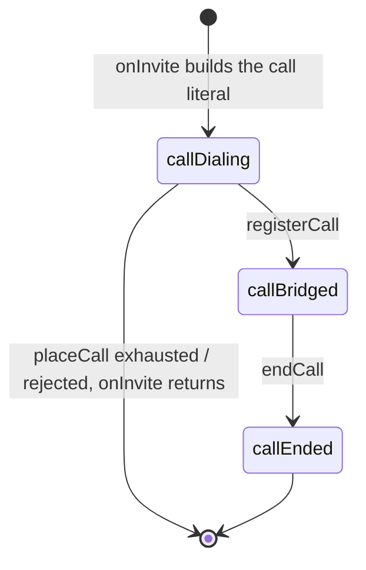

Transitions, with the function that performs each:
`callDialing` is set inline when the `call` literal is built in `onInvite`
(`b2bua.go:450`); the call exists only as that function's local variable and
is in no map, so `/api/calls` cannot list it and `KillCall` cannot find it.
`callBridged` is set **only** by `registerCall` (`calls.go:176`), under the
lock that mints the call's admin ID and inserts the call into
`calls[adminID]` and into the `legs` lists under its A-leg and B-leg
Call-IDs. `callEnded` is set **only** by `endCall` (`calls.go:198`), under the
same lock that removes exactly this call's entries.

The store is keyed by dialog, not by Call-ID. `calls` is keyed by a random
admin ID; `legs` maps a Call-ID to a list of `legRef` (call, which leg, the
leg's tags), so two live calls that share a Call-ID — a peer reusing one with
a new From-tag, or an A-leg Call-ID equal to another call's B-leg Call-ID —
coexist, and ending one never removes the other. An in-dialog request is
matched on Call-ID plus both tags (`lookupDialog`). No production branch reads `state`; the
invariant it records is enforced by map membership.

Teardown entry points once bridged, all converging on `endCall` via
`onInvite`'s `defer`:

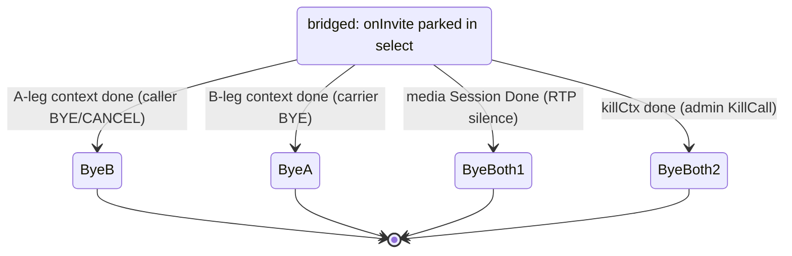

Each arm is one case of the `select` at `b2bua.go:524-536`; `byeBoth`
(`b2bua.go:544-547`) sends both BYEs. Every outbound BYE gets its own
**5 s** `byeContext`.

### 6.12 KillCall

`KillCall(id)` looks the call up in `calls` by admin ID under `callMu`,
releases the lock, and calls `c.cancel()`. The admin ID is what `/api/calls`
lists as `id`; the A-leg Call-ID is listed separately as `call_id`. An `id`
that is no admin ID is tried as an A-leg Call-ID and kills **every** live call
whose A-leg carries it, since a Call-ID alone does not name one dialog. It is idempotent because `endCall` has already
removed the entry by the time a second kill arrives. `endCall` reads
`c.cancel` under the lock and calls it outside. Both paths are exercised
concurrently under `-race` by `TestKillCallRacesNaturalEnd`.

Only a **bridged** call is killable; a call still dialling is invisible to
the admin API.

### 6.13 Session timers

RFC 4028 is negotiated per leg (`sessiontimer.go`). The SBC is the UAS on the
A-leg and the UAC on the B-leg.

| Leg | What the SBC sends | Who refreshes |
|---|---|---|
| A (caller) | 2xx: `Session-Expires` + `Require: timer` only if the INVITE said `Supported: timer` (§9); none otherwise | the refresher the caller asked for; `uac` (the caller) when it named none. A caller without timer support gets no session timer |
| B (carrier) | INVITE: `Supported: timer`, `Session-Expires: <session_expires>;refresher=uas`, `Min-SE` | whatever the carrier's 2xx says: no `Session-Expires` → no timer; `refresher=uac` → the SBC; `uas` → the carrier |

When a leg names the SBC as refresher, `startRefreshers`
(`sessiontimer.go:177-205`) runs `refreshLoop` for it, bound to the call's
kick context (so it ends when `endCall` runs). Every half interval it sends a
re-INVITE on that dialog through sipgo's dialog session (`Do`, which builds
the in-dialog headers, CSeq and route set) carrying the SBC's established SDP
for that leg and `Session-Expires: <interval>;refresher=uac`, and ACKs the
2xx. A 2xx that moves the refresher to the far end stops the loop; a 422
retries at once with the far end's `Min-SE`; a transaction timeout, **408**
or **481** ends the call (`c.cancel`, so both legs get a BYE, §10); any other
failure is retried after a quarter interval. A far end that is itself the
refresher and stops refreshing is still not timed out: the call stays up
until RTP silence trips the watchdog or a BYE arrives.

The refreshers are the only goroutines besides `onInvite` that use a trunk
call's sipgo dialog sessions. They only build and send requests through
them, which read the dialog's immutable INVITE/response and its atomic CSeq.

### 6.14 Outbound TLS per peer

sipgo v1.4.3 takes one client `tls.Config` per user agent, so trust roots
and client certificates cannot be installed per peer. `clientTLS`
(`tlscert.go`) keeps that one config and selects per peer through its
callbacks (P2-TRK-016, option (c) of the audit decision):

- `InsecureSkipVerify: true` switches off Go's single-pool check, and
  `VerifyConnection` replaces it on every handshake. It matches the
  connection to exactly one `transport: tls` peer of the current snapshot:
  - by `cs.ServerName`, which sipgo sets to the dialled host: the peer whose
    address host is that name, or a peer with a bare hostname whose cached
    SRV targets (`Resolver.srvTargets`) include it;
  - when `cs.ServerName` is empty, the dial was to an IP literal (Go leaves
    IPs out of SNI). The peer is then the IP-literal TLS peer whose IP is
    among the leaf's IP SANs.

  No match, or more than one, fails the handshake. The leaf is then verified
  against that peer's roots (its `tls_ca` alone, or the system roots when it
  has none), with the presented intermediates, for the dialled name or IP.
- `GetClientCertificate` reads the peer name from the handshake ctx
  (`cri.Context()`; sipgo hands the request ctx to `HandshakeContext`). The
  B2BUA sets it with `withTLSPeer` on the B-leg `Invite`, and registration on
  its `REGISTER`. It returns that peer's certificate, or none when the ctx
  names no peer or the peer has none.
- Material (CA pools, key pairs) is loaded once at `Run` and a bad file
  fails startup. The peer set follows reload, but a TLS peer added by reload
  that names `tls_ca` or `tls_client_cert` fails its handshakes until
  restart instead of using the system roots.

Known limits:

- Validation rejects two TLS peers that share an address host
  (`validateTLSPeerHosts`), since the port never reaches the callbacks.
  Distinct names that resolve to the same IP:port are not detected, and
  sipgo's connection pool (keyed by remote address) would reuse one peer's
  connection for the other.
- A dial whose ctx does not carry the peer (a background-ctx path, such as a
  new connection for an in-dialog request) sends no client certificate.
- A new connection to an address that is not a peer's (a Contact on a
  different host, say) matches no peer and fails.
- For an IP-literal peer the match comes from the certificate: a leaf that
  names peer A's IP and chains to A's roots is also accepted on a dial to
  peer B. That needs A's key at B's address.
- There is no per-peer SNI override.

---

## 7. SIP processing — edge plane (proxy)

The edge plane is a **stateful SIP proxy, not a B2BUA**: Call-ID, From/To
tags and CSeq pass through untouched. It does not use sipgo's dialog
sessions at all; it owns its own `dialogTable`. FreeSWITCH remains the
authoritative registrar and FreeSBC never holds a credential.

### 7.1 Planes, listeners and direction dispatch

| Side | Transports | Trust |
|---|---|---|
| Public | `udp`, `ws`, `wss` (no TCP, no SIP-over-TLS) | untrusted; full shield treatment |
| Private | `udp` only (hard-coded) | trusted; exempt from the shield |

`side` carries `plane`, `transport`, advertised IP and port, and `laddr` —
the pinned local socket address, set for UDP sides only. A WebSocket is
inbound-only, so its outbound path is the client's own pooled connection and
`laddr` stays zero. `side.via(branch)` adds an empty `rport` parameter on
**UDP only** (RFC 3581). `side.recordRoute()` always carries `lr`.

**Read filter** (`fsip.ReadFilter(fsip.MaxReadSize, accept)`): a read larger
than **24 KiB** is dropped before the parser. The cap sits below sipgo's
32 KiB read buffer (`TransportBufferReadSize`), which bounds every read, so it
can fire: an oversized datagram or WebSocket frame arrives truncated to 32 KiB
and is dropped here rather than parsed as a partial message (a cap at or above
the buffer, as the earlier 64 KiB one was, never fires). The `accept` policy
captures the private bind address **once at `Run` time**. A read is on the
private listener only when its transport is UDP **and** its local address is
that bind (`fsip.SameListener`; a wildcard bind matches any host on its port);
a WS/WSS read on the same port number is a public read. A read that is not on
the private listener is accepted unconditionally (the public plane has no source
allowlist — phones and browsers have no fixed address), and a read that *is*
on the private bind must come from an upstream IP, else it is dropped. On
accept it records the exact `addr:port` in `privateSources`.

**`privateSources`** exists because sipgo records only a message's source,
not the local socket it arrived on, and deciding the plane from source IP
alone is wrong when both planes share an address. The table holds at most
**256** entries with a **10-minute** TTL; when full it prunes and, if still
full, **refuses to insert** rather than grow.

`arrivedOnPrivate(req)` — the direction switch every handler uses — requires
all three: transport is `udp`, the source IP is in the upstream pool
(ignoring port), and the exact `addr:port` is in `privateSources`.

**`guard`** wraps every handler: a `recover()` that logs the panic, counts
it (`freesbc_sip_handler_panics_total`) and answers 500 **only when the
transaction has not already had a final response** (the handler is given a
`finalTracker` wrapping the server transaction, which records that);
`fsip.SourceAddrPort(req)` (an unparseable source is **silently dropped**
before metrics, shield and handler); `metrics.RequestIn(method, transport)`;
then, only for requests that did *not* arrive on the private plane,
`shield.Check(...)` with a silent return on `Drop`.

A source the shield has **banned** is also dropped by the edge read filter,
before parsing: sipgo answers some messages itself before any handler runs
(a stateless 400 to a malformed request, a 200 to a CANCEL matching a
transaction), so `guard` alone could not keep a ban silent. The filter
exempts FreeSWITCH exactly as `guard` does (its `privateSources` transport
address). `shield.Shield.Banned` is the read-only query it uses.

**Unanswered calls per source.** Media is anchored before FreeSWITCH has
authenticated the caller, so `inviteToUpstream` admits at most
`maxEarlyPerSource` (**64**) calls per public source IP that have media and
no answer yet (`admitEarly`); one more is refused **503** before anything is
allocated. The count is per IP so a flood spread over many source ports is
bounded too, and the slot is released when the INVITE handler returns
(answered or not).

### 7.2 Topology snapshot

`topology` is built once in `edge.New`, re-pinned once in `Run`, and never
written again; every handler reads it without a lock. It holds the public
sides keyed by transport, the private side, the upstream endpoint map with a
**sorted** name list (map iteration order must never leak into routing), the
PSTN topology, and the two advertised media addresses.

`parseEndpoint` requires a **literal IP:port** for every upstream and
gateway — a name would make routing and failover depend on a resolver at
call time, and a poisoned resolver could redirect the private leg. There is
no DNS anywhere in the edge plane.

`isSelf(uri)` compares host and port only, ignoring parameters, defaulting a
missing port to **5060**; `isSelfVia` defaults instead to
`fsip.DefaultPort(transport)`: 5060 for UDP/TCP, 5061 for TLS, and the
RFC 7118 §5 HTTP ports for WebSocket, 80 for `ws` and 443 for `wss`.

### 7.3 Method dispatch

Registered handlers: `REGISTER`, `INVITE`, `ACK`, `CANCEL`, `BYE`, `INFO`,
`OPTIONS`, and `OnNoRoute`.

| Method | Handling |
|---|---|
| REGISTER | proxied to an upstream (§7.4); from the private plane → **403 Forbidden** |
| INVITE, no To-tag | dispatched by classification (§7.5) |
| INVITE, To-tag present | `onReInvite` (§7.9) |
| ACK | stateless forward (§7.8) |
| CANCEL | only orphan CANCELs reach the handler (§7.8) |
| BYE, INFO | `onInDialog` (§7.8) |
| OPTIONS | answered locally with **200 OK** + `Allow`; never forwarded, because relaying every phone's keepalive would multiply FreeSWITCH load |
| UPDATE, PRACK, NOTIFY, MESSAGE, SUBSCRIBE, REFER, PUBLISH | `onNoRoute` → **405** + `Allow: INVITE, ACK, CANCEL, BYE, OPTIONS, INFO, REGISTER` |

Every locally generated response and every relayed response is sent to
`req.Source()` — symmetric response routing (RFC 3581), so a response reaches
a phone behind NAT.

### 7.4 REGISTER proxying and binding lifecycle

`registerTimeout = 32 s` bounds **one whole attempt series**, not one
attempt: on UDP a silent node is indistinguishable from a slow one, so N
per-node budgets would multiply the worst-case REGISTER latency by N.

Per REGISTER:

1. Reject if it arrived on the private plane (403) or the transport has no
   configured public side (488).
2. `aorOf(req)` derives the AoR from the **To** header (RFC 3261 §10.2) and
   rejects with **400** when the user or host is empty, the user part
   contains any of `` @ \t\r\n<>;,"``, the user exceeds 128 characters, the
   host contains any of `` \t\r\n<>;,"``, or the host exceeds 255 characters.
3. `requestedExpires`: the Contact `expires` parameter wins over the
   `Expires` header (§10.2.1), each read as delta-seconds
   (`fsip.DeltaSeconds`: digits only, so a negative or signed value is
   ignored; above 2**32-1 clamped, §20.19); `0` marks an un-REGISTER;
   **absent everywhere returns zero with `unregister = false`**
   (`register.go:418`), letting the response decide. If the 200 OK carries
   no expiry either, `GrantedExpires` returns that zero and `recordBinding`
   treats `granted <= 0` as a **removal** (`register.go:299`), so a
   registrar that grants no expiry leaves FreeSBC with no binding and no way
   to deliver inbound calls.
   A `Contact: *` (wildcard) is accepted only alone and with an expires of
   `0`; anything else is **400** (§10.3 step 6) and never forwarded.
4. Token: reuse the existing binding's token when one exists for this
   (AoR, Call-ID), else mint a fresh 12-byte CSPRNG token. The token must
   stay stable for the registration's whole lifetime, because FreeSWITCH
   stores the Contact and uses it as the Request-URI of every future inbound
   call.
5. Walk `upstreamOrder(user)` under the single shared budget.
   `sip.upstreams.cooldown` is read from the store **once per REGISTER**,
   before the loop (`register.go:86`), so a reload applies to the next
   registration without a restart.

Per attempt: `prepareForward(..., recordRoute=false)`; replace the Contact
with `registeredContact(user, token)` (a wildcard is forwarded as `*`, see
below); forward with `TransactionRequest`; pump responses.

| Header | Treatment on REGISTER |
|---|---|
| Request-URI | **unchanged** — the phone computed the digest over it |
| Contact (request) | replaced with `sip:<user>@<private advertised IP>:<port>;transport=udp;fsbc=<token>`; a wildcard `*` un-REGISTER is forwarded as `*`, because it names every binding of the AoR, other devices' included |
| Contact (2xx) | when the request carried a Contact: **every** Contact removed and the client's own URI restored with `expires=<granted>` — sip.js treats a Contact mismatch as a failed registration. After a wildcard un-REGISTER every Contact is removed and none restored. A REGISTER with no Contact (a binding query) has the registrar's Contact list relayed verbatim (`register.go:216-221`) |
| Via | top Via annotated with `received`/`rport`; FreeSBC's own Via prepended |
| Route | leading Route values naming FreeSBC stripped |
| Record-Route | **not added** |
| Path | never read, never written — there is no Path handling in the package |
| From/To/Call-ID/CSeq/Authorization | forwarded verbatim |

`transport=udp` is forced on the registered Contact because FreeSWITCH copies
the stored contact into the Request-URI of an inbound INVITE, and a leftover
`transport=ws` would make it try to open a WebSocket back to the SBC.
Credentials, challenges and nonces are never logged.

**Failover rule**: the next node is tried whenever the attempt produced **no
final response** (`register.go:145-162`). A node that answered only
provisionally and then died is still failed over — unlike the INVITE path,
where `responded` alone stops the series (`invite.go:326`). The cooldown
penalty, by contrast, is applied only when the attempt produced **zero**
responses. **Any** final response — accept, challenge, or rejection — is a
real judgement and ends the series. A 401/407 from a node reached after failover is expected,
because the pool members share a registration database. After the loop:
**504** if the budget expired, else **503**.

**Binding expiry always comes from the response**, never the request:
`fsip.GrantedExpires` prefers the `expires` parameter of **this binding's**
Contact — the one carrying its `fsbc` token, since the 200 lists every
binding of the AoR (§10.3 step 8) and another device's lifetime must not be
taken for this one — then the response's `Expires` header, then the
requested value. Values are delta-seconds as above, so the result is never
negative. `granted <= 0` or an un-REGISTER removes the binding; a wildcard
un-REGISTER removes **every** binding of the AoR.

`Location` holds `byToken` and `byAOR` under one `RWMutex`, with
**compile-time** caps: `defaultMaxBindings = 20000` total and
`defaultMaxPerAOR = 10`. `Put` prunes **only that AoR** (a REGISTER is the
hottest path, and sweeping the whole table would make one registration's cost
grow with the table), refreshes in place when (AoR, Call-ID) already exists —
reusing the token — and otherwise enforces the two caps, returning
`ErrTooManyBindings`. Expired bindings are invisible to `ByToken`/`ByAOR`
before any prune runs; the 30-second `Prune` ticker only reclaims memory.

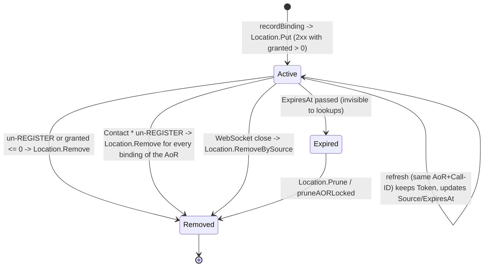

Transitions: `recordBinding` (`register.go:287-322`) performs the insert and
the removals; `Location.Put` (`location.go:97-131`) is the refresh-in-place
path; `Binding.Expired` (`location.go:48`) is the predicate that hides an
expired entry from `ByToken`/`ByAOR`; `Location.Prune` (`location.go:219`)
and `pruneAORLocked` delete expired entries; `RemoveBySource`
(`location.go:153`) is called from the WebSocket close hook.

`Binding.Source` is the **transport source of the REGISTER**, never the
Contact host: the far side of the client's NAT pinhole for UDP, and the
pooled connection key for WS/WSS. A browser's own Contact typically names a
`.invalid` host, which is exactly why it is replaced.

On WebSocket close, `watchConnections` calls `Location.RemoveBySource(ap)`
and updates the registration gauge: a WebSocket registration is reachable
only through its own connection, so keeping the binding would make FreeSBC
accept calls it cannot deliver.

### 7.5 INVITE classification

`onInvite` dispatches in this order:

1. To-tag present → `onReInvite`.
2. `isPSTNBridgeInvite` → `inviteToPSTN`: requires PSTN to be configured,
   the source IP to be an upstream, and the Request-URI host **and** port to
   equal `sip.pstn.match` (a missing port defaults to 5060). FreeSWITCH
   bridging an outbound PSTN call arrives on the **public** socket, so plane
   dispatch alone would misread it as a phone's call.
3. `arrivedOnPrivate` → `inviteToClient`.
4. Otherwise → `inviteToUpstream`.

A **public phone** dialling the match address is proxied upstream normally —
the `fromUpstream` half of the classification is load-bearing.

An offerless INVITE (empty body) is refused **488** in every direction.

### 7.6 Upstream ordering, failover, cooldown

`hashUpstreamUser(user)` is FNV-1a 64 over the **lower-cased** user part —
SIP user parts are case-insensitive, and a phone that REGISTERs as "Alice"
and calls as "alice" must reach the switch holding its binding.

`upstreamDialOrder(user, available)`:

```
pool, cooled := orderByAvailability(sortedNames, available)
idx   := hash(user) % len(pool)
order := pool[idx:] ++ pool[:idx] ++ cooled
```

So: the hash-chosen node first, the rest of the available pool in rotation,
then every cooling node at the tail. `orderByAvailability` preserves input
order and, **when every name is cooling, returns the whole set as
available** — a cooldown is a suspicion, not a verdict.

`hashUserFor(req)` picks the From user part, falling back to the To user part
and then the Call-ID. From is the caller's identity, so a user's calls land
on the same switch its REGISTER landed on.

`cooldownTable` is keyed by **name, never by address**: `Available` is a lazy
expiry check with no sweeper, `Penalize` sets `now + cooldown`, `Recover`
deletes. There is deliberately **no active probing** — no OPTIONS keepalive —
because a carrier's edge would drop or penalize unsolicited health checks.

INVITE failover to the next upstream node happens only when
`final == nil && !responded && clTx.Err() != nil`. `!responded` is an
invariant, not a heuristic: a node that answered had its answer negotiated
and its media relay started, so a second attempt would apply a second answer
and start the relay twice. A 486 is the callee's own judgement and is never
retried.

### 7.7 Dialog record

A dialog is identified the RFC 3261 §12 way: **Call-ID + the caller's tag +
the callee's tag**. `dialogTable` groups records by Call-ID
(`byCallID map[string][]*dialog`) and every lookup then matches tags:

- `lookup(callID, fromTag, toTag)` (`dialog.go:286-304`) finds a
  **confirmed** record whose tags the request names in either orientation;
  From = caller's tag and To = callee's tag means the request is from the
  caller, the reverse means it is from the callee. A request missing either
  tag names no dialog.
- `early(callID, fromTag)` (`dialog.go:271-280`) finds the **in-flight**
  record a CANCEL applies to: same Call-ID and the INVITE's From tag
  (RFC 3261 §9.1), so a CANCEL that merely guessed a live Call-ID cannot end
  someone else's call.
- `begin(callID, callerTag, callerPlane)` (`dialog.go:239-265`) refuses —
  the handler answers **482 Loop Detected** — when an **early** record with
  the same Call-ID and caller tag exists (a merged request, §8.2.2.2). A
  confirmed record with the same identifiers is left alone: the new INVITE
  opens a record beside it. An INVITE can therefore never tear down another
  call by reusing its Call-ID.

`dialog` holds the Call-ID, both tags, the plane the caller's in-dialog
requests arrive on (`callerPlane`), the state, the in-flight attempt, the
route, the media session (attached once, then only closed), the early forks,
the relayed 2xx, the set of refused 2xx tags, and **one `sdpOrigin` per leg**
(`origin [2]sdpOrigin`, indexed by plane). Each leg's id is fixed for the
session's life and its version goes up by exactly one per body that leg is
sent (RFC 3264 §8), so FreeSWITCH sees 1 → 2 across a re-INVITE rather than
jumps caused by bodies built for the other leg. **Every mutable field of the
`dialog` record is guarded by the table's mutex**; the attached
`mediaSession` guards its own `codecs` and `applied` fields with its own
mutex (`media.go`).

**Forks (early dialogs).** While the record is early, every response of the
forwarded INVITE is attributed to a fork by its To tag (`fork`,
`dialog.go:384-395`). An `earlyFork` holds that fork's own answer body, the
codecs it agreed, the media address it signalled and its own `o=` identity.
The first body a fork sends is negotiated against the **original** offer
(`negotiateFork`, `media.go`); a later body on the same fork is answered with
the same bytes again; a body on another fork is negotiated afresh. The
anchored media follows whichever fork answered last (`followFork` →
`pointMedia`), re-arming the latch when the address moves; a 2xx from a fork
re-points it to that fork. A body-less 2xx on a fork that never answered
reuses the answer the media is following (a far end whose 183 and 200 carry
different To tags); with no answer at all it cannot be anchored. There is
still **one media session per record**, so early media from two forks at
once shares one anchor.

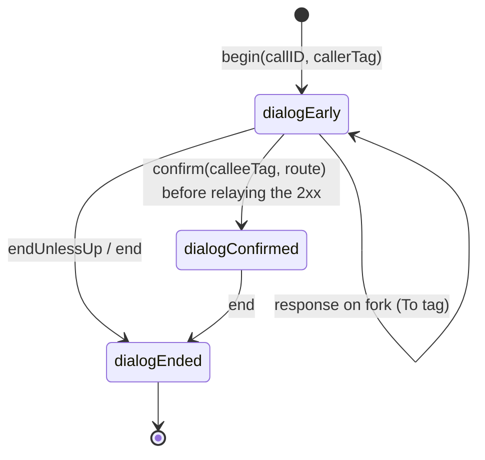

Transitions: `confirm` (`dialog.go:632-669`) runs **before the 2xx is
relayed** (`relayInviteResponse` → `commit`, `invite_leg.go:142-169,575-597`),
so the ACK the caller sends the instant it sees the 2xx always finds the
record. It records the callee's tag and the route, adopts the confirming
fork's `o=` identity for the caller's leg, drops the fork table, and refuses
when the state is not early **or no media was ever anchored**. `endUnlessUp`
(`dialog.go:673-680`) ends only a still-early dialog and is deferred by every
INVITE path; `end` (`dialog.go:690-719`) is the single exit for a BYE, the
media watchdog, shutdown and a failed INVITE. `end` is idempotent — the state
transition under the table mutex elects the one caller that does the work —
and removes exactly this record from its Call-ID's list.

`confirm` releases the lock before touching metrics, then starts **one
goroutine per call**: `<-sess.Done(); d.end()`. That goroutine's only exit is
the session's `Done` channel, so it cannot outlive the call.

**2xx retransmissions and late forks (Timer M).** The INVITE client
transaction is **not** terminated after a 2xx: sipgo keeps it in the RFC 6026
Accepted state until Timer M (64·T1) and passes every later 2xx to the
`OnRetransmission` hook `watch2xx` installs (`invite_leg.go:73-107`). A
retransmission of the confirmed dialog's own 2xx is relayed again — the same
response, never re-negotiated — so one lost 200 on the caller's leg no longer
fails the call (RFC 3261 §13.3.1.4, §16.7 step 10). A 2xx from **another**
fork, after the record is confirmed, is a second dialog with no media anchor:
FreeSBC ACKs and BYEs it once (`refuse2xx`) and only re-ACKs its
retransmissions (`reject2xx` remembers the tag). The same applies to a 2xx
FreeSBC cannot anchor and to one that races a CANCEL.

`count()` counts only confirmed dialogs; that is what `ActiveCalls()` reports
(`edge.go:171`). `freesbc_active_sip_dialogs` is a separate mechanism over the
same set: the `Metrics.dialogs` gauge moved by `DialogStarted`/`DialogEnded`
in `confirm`/`end` (`edge/metrics.go:67-68`), sampled through
`Snapshot().ActiveDialogs` (`admin/metrics.go:57,129`).

An `inviteAttempt` holds the request **as forwarded** (so a CANCEL carries
the same top-Via branch) and the **series** cancel function (never a
per-attempt one). `track` deliberately overwrites per attempt, and the stale
entry deliberately survives between two attempts so a CANCEL arriving in
that window still ends the series. `cancelSeries` removes and returns it,
so exactly one caller ever cancels (see the CANCEL paragraph in §7.8 for
`sent`/`cancelled`).

**There is no SIP-level dialog expiry timer.** The only automatic
reclamation of a confirmed dialog is the media silence watchdog, surfaced
through `sess.Done()`. When it is the media that ends the dialog (the
watchdog, or a WebRTC peer whose certificate does not match its
fingerprint), `end()` reports it and the watcher calls the table's
`onMediaEnd` — `byeBothEnds` (`indialog.go:435-440`) — which sends **each
endpoint a BYE on behalf of the other** (RFC 3261 §15): From/To and tags
from the record, the Request-URI the endpoint's own Contact, the CSeq one
above the highest the other endpoint used, out the same pinned socket
`prepareForward` would use. Otherwise both would keep a silent call and
FreeSWITCH's own later BYE would get 481. An early dialog is bounded by
`inviteTimeout = 5 minutes`.

### 7.8 Forwarding mechanics

`prepareForward(req, from, to, dest, recordRoute)` implements RFC 3261 §16.6
in order:

1. `req.Clone()` — the inbound request stays intact for the response path.
2. `annotateVia`: add `received=<host>` when the top Via's host differs from
   the real source, and fill `rport=<port>` **only when the client asked for
   it** by sending an empty `rport` parameter.
3. `stripOwnRoutes`: remove **leading** Route values naming FreeSBC, in a
   loop — after a transport change there are two of them (the
   double Record-Route pair).
4. Max-Forwards: decrement, and fail with `errMaxForwards` (→ **483 Too Many
   Hops**) at zero. When the header is absent, append `Max-Forwards: 70`.
5. When `recordRoute`: **RFC 5658 double Record-Route** — prepend the
   origin-facing value, then the destination-facing value, so the
   destination-facing one ends up on top. A UAS builds its route set from
   the request's list in order (§12.1.1); a UAC from the response's list in
   reverse (§12.1.2).
6. Prepend our own Via with a fresh branch.
7. Set transport, destination, and `Laddr` from the pinned side.

Record-Route is added on the initial INVITE in all three call directions and
**not** on REGISTER, ACK, BYE/INFO or re-INVITE.

Every outbound request uses `noBuild`, a no-op `sipgo.ClientRequestOption`:
passing *any* option suppresses sipgo's default request-building pass, which
would otherwise add its own Via/From/To/Call-ID/CSeq. A proxy must send
exactly the headers it assembled.

**Response relay** (`relayResponse`): clone the response, pop our own Via
(failing the relay if the top Via is not ours or popping would leave none),
run the caller's `adapt`, set the destination to the original request's
source, count it, and respond. A send failure is logged, not returned.
`errResponseDropped` is a shared sentinel that means "keep pumping".

**100 Trying is never forwarded** (`fsip.Forwardable`): the server
transaction generates its own, and a switch that sends 100 with a single Via
would make it unroutable.

**ACK** is forwarded **statelessly** with `WriteRequest`, because a 2xx ACK
is a separate end-to-end transaction and sipgo refuses an ACK in
`TransactionRequest`. A non-2xx ACK matching a live INVITE server
transaction is absorbed by sipgo's transaction layer. An ACK that cannot be
routed is dropped with no response.

**CANCEL.** When sipgo matches a CANCEL to a live INVITE server transaction
it answers 200 to the CANCEL, fires the `OnCancel` hook
(`invite.go:214-227`, `:465-471`, `:606-619`) **while holding the server
transaction's lock**, and only after the hook returns finalises the INVITE
server transaction with **487** toward the requester itself. The hook
therefore does no network I/O: it calls `cancelCall(d, cancelByCaller)`
(`invite_leg.go:617-628`), which **synchronously** marks the record
cancelled (`cancelSeries`, `dialog.go:528-547`) — from that instant
`confirm` refuses, so a 2xx racing the CANCEL is ACKed and BYEd, never
relayed after the 487 — takes the in-flight attempt, and hands the CANCEL
to a goroutine (`sendCancel`, `invite_leg.go:642-658`). `sendCancel` builds
the CANCEL from the **forwarded** request so it carries that branch, sends
it on a **5 s** context, and cancels the series context as soon as it is on
the wire (which is what releases the media promptly instead of waiting on
the forwarded INVITE's transaction timer).

An attempt is **tracked before its INVITE is sent** (`track`,
`dialog.go:479-487`), so no CANCEL can fall between the send and the
bookkeeping. A CANCEL that takes an attempt whose INVITE is not on the wire
yet does not send its CANCEL (it would overtake the INVITE, be answered 481,
and leave the INVITE ringing); `markSent` (`dialog.go:492-497`) tells the
sender, which CANCELs the moment the INVITE is out. `track` refuses once
the series is cancelled, so no later attempt starts.

The `onCancel` handler only ever sees an **orphan** CANCEL: it looks up the
early record by Call-ID **and From tag** (`dialogTable.early`) and answers
**200** if there was an attempt to cancel and **481 Call/Transaction Does
Not Exist** otherwise, because answering 200 would tell the sender its
request was cancelled when nothing was. RFC 3261 §16.10 would have a proxy
with no response context forward such a CANCEL statelessly; FreeSBC
deliberately does not. Every INVITE it forwards has a record here, so an
orphan CANCEL that matches none has nothing downstream to cancel, and
relaying it would let any source that knows a Call-ID inject CANCELs toward
FreeSWITCH.

Once the series context is cancelled, `pumpInvite` does not simply return: it
calls `drainCancelledInvite` for `pstnDrain` (300 ms) so the far end's 487 is
still matched by the live client transaction and ACKed by the transaction
layer (RFC 3261 §17.1.1.3, `invite_leg.go:497-535`). The same helper serves
all three call paths, not only PSTN. A 2xx that arrives after the caller
cancelled is never relayed or confirmed: it is ACKed and BYEd.

**FreeSBC's own ACK/BYE.** `ackThenBye` builds both with
`fsip.TeardownRequest` (`request.go`), which follows the dialog's route set:
the 2xx's `Record-Route` list reversed (RFC 3261 §12.1.2), cut by
`OwnRecordRoute(topo.isSelf)` at FreeSBC's own entries, since the INVITE
carried them. A loose router first means `Route` headers and the Request-URI
is the remote target; a strict router first becomes the Request-URI with the
target appended as the last `Route` (§12.2.1.1). The request is sent to the
first route when it names an IP literal, else to the 2xx's transport source
(the nearest hop): a hostname route is never resolved, keeping the edge free
of DNS. `FromListener(side.laddr)`
pins the socket it leaves by, as `forward` pins a relayed request; without
the pin an ACK toward a carrier behind a wildcard-bound public listener never
arrived (`TestTeardownLeavesByPublicListenerOnWildcardBind`).

**INVITE backstop (Timer C).** When `inviteTimeout` expires with the caller
still waiting, the pump's `ctx.Done` arm runs `abandonAttempt`
(`invite_leg.go:663-668`): it CANCELs the pending branch (RFC 3261 §16.8)
and drains for its 487, and `giveUp` (`invite.go:348-359`) then sends the
caller **408 Request Timeout** (§16.7 step 6). `giveUp` is the one place a
caller's missing final is synthesised: nothing when its own CANCEL already
got it a 487 from sipgo, **408** at the backstop, **487** when an orphan
CANCEL ended the call, and the path's own status otherwise. A path that has
already finalised the caller (a relayed final, or the pump's own 488) sends
nothing more: a transaction finalises once. The pump's 488 for an answer it
cannot anchor on a **provisional** also CANCELs that branch, which would
otherwise ring on.

**BYE / INFO** (`onInDialog`): resolve direction, forward without
Record-Route, retarget the Request-URI to the far end's own Contact, rewrite
the Contact, and relay under a **32 s** budget. The CSeq of every in-dialog request is
recorded per endpoint (`noteCSeq`). On a forwarding failure and
**only for BYE**, FreeSBC makes one stateless re-send attempt toward the far
side and then answers **200** to the requester — answering 408 would tell the
switch its hangup failed and sofia would keep the leg. A BYE ends a dialog
only when its tags name that confirmed dialog **and** the far end agreed:
a 2xx, a 481 or 408 (which end the dialog for the sender too, §12.2.1.2), or
no answer at all (`byeEndsDialog`, `indialog.go:310-315`). A BYE with tags
that match no dialog is still forwarded — the endpoint answers 481 — but
tears nothing down, and a 401/407 challenge leaves the call up.

**Direction resolution** (`directionFor`, `indialog.go:328-393`):

- A request whose Call-ID and tags name a confirmed dialog is routed by that
  record — `publicRemote` toward the client, `privateRemote` (the winning
  switch or gateway: a dialog never migrates mid-call) toward FreeSWITCH —
  **provided it arrived on the plane of the endpoint its tags say sent it**.
  A request that names the caller's tags but came in on the callee's side is
  not treated as that dialog's.
- Otherwise, from FreeSWITCH: `bindingForRequest(req)` (an in-dialog request
  from FreeSWITCH carries no binding token, so without a record this only
  helps a pre-dialog request).
- Otherwise, from a public client: hash to an upstream. **This fallback
  deliberately never 481s**; the switch answers honestly. Such a request
  carries no dialog, so nothing is torn down on its account.

`retargetInDialog` restores the far end's own Contact as the Request-URI,
undoing the topology hiding applied when the dialog was established: sofia
tolerates the SBC's URI, a strict UA does not.

**Inbound target resolution** (`resolveTarget`): the `fsbc` token from the
Request-URI (or from a Route value, where a strict-routing element may have
moved it), rejected if empty or longer than **64** characters; otherwise a
fallback by AoR over `[Request-URI host, private advertised IP]`, taking the
**first** binding. With several devices registered under one AoR and no
token, that first binding wins.

### 7.9 re-INVITE

Reached whenever an INVITE carries a To tag.

1. `directionFor` must name a confirmed dialog with a media session, else
   **481**. Forwarding the body as-is here would be the exact leak the
   function exists to prevent.
2. Empty body → **488**; an offerless re-INVITE would make FreeSBC the
   offerer, which is unsupported, and refusing leaves the existing session
   untouched.
3. Rebuild the offer from scratch against the session's **existing** anchor
   ports (`anchorFor`) with the next `o=` version of the leg it goes to;
   nothing is allocated. A re-offer **toward a browser** carries the same
   DTLS-SRTP block as its answers — `UDP/TLS/RTP/SAVPF`, the ICE-Lite
   credentials, the fingerprint and the DTLS role already in use (RFC 5763
   §5, RFC 8842 §5.3) — so it describes the stream the browser already has.
4. Forward without Record-Route; **retarget the Request-URI to the far end's
   own Contact** (`retargetInDialog`) and rewrite the Contact.
5. Relay responses; the first body-bearing response of **this transaction**
   is rebuilt as an answer, later ones repeat **that** body — never another
   re-INVITE's, so crossing re-INVITEs from both sides (glare) each keep
   their own plane's answer. A `clTx.Done()` yields **408**.
6. On the **2xx** the exchange is complete and the anchor follows it
   (`applyReInvite`, RFC 3264 §8.3.1-8.3.2): the offerer's side is pointed at
   the address its re-offer signalled and the answerer's side at its
   answer's, through `pointMedia`, which re-arms the latch only for a side
   whose address actually moved. A hold or a session-timer refresh that
   restates the same address leaves the latch alone; a side that signalled
   port 0 or `0.0.0.0` keeps the address it had. The browser side of a
   WebRTC session is never re-pointed: ICE owns it.
7. A **2xx whose answer cannot be anchored** is ACKed (RFC 3261 §13.3.1.4;
   its retransmissions are re-ACKed), the requester is answered **488**, and
   the call is ended with a BYE to both sides: the two ends now disagree
   about the session, and media would flow in a form one of them never
   agreed to.
8. The client transaction is kept until Timer M after a 2xx, and each 2xx
   retransmission is relayed again, as for the initial INVITE.

For a WebRTC leg every in-dialog body toward the browser restates exactly
the same ICE credentials, fingerprint and DTLS role — changing any of them
would look like an ICE restart and tear the media path down. A browser
re-offer that changes its own ICE credentials (an ICE restart) is not
supported.

### 7.10 PSTN side

PSTN routing is pure and stateless: `resolvePSTNRoute(routes, user)` returns
the first route whose regexp matches (a nil regexp is a catch-all); no match
means the call is **not** a PSTN call and is refused **503 without dialling
any gateway**.

Per call: the public side must be `udp` (else 503); the gateway list is
`orderByAvailability`'s **available** half against `pstnCooldown`
(`invite.go:595` discards the cooled half), so a cooling gateway is dropped
rather than tried at the tail as an upstream node would be (§7.6) — unless
every candidate is cooling, in which case the route's own order is dialled
unchanged (`topology.go:559-561`); the whole call is
bounded by `inviteTimeout` (5 min) and each attempt by
`sip.pstn.attempt_timeout` (default 32 s) enforced with a `time.Timer`, not a
derived context — the client transaction is started on the **whole-call**
context so it survives the budget and the expiry path can CANCEL it.

Per attempt, the Request-URI is re-pointed to the gateway (host and port
replaced, any `transport` parameter removed, the called number and
header-style parameters preserved) and the Contact is the public side's URI.

Response handling in `pumpPSTNAttempt`:

- A final of **408 or 5xx is held, never relayed** — the server
  transaction can finalise only once and a later gateway may still connect
  the call.
- Any other final (3xx, 401/407, a 4xx other than the held 408, or a
  **6xx**) is the far end's verdict on this call: relay it and end the
  series. A 6xx is a global failure (RFC 3261 §16.7 step 5, §21.6): no
  other gateway may be tried.
- A 2xx is the winner; the dialog is confirmed before it is relayed.
- Each fork's first body is negotiated against the **original FreeSWITCH
  offer**, not the session's live codec list, so a failed gateway's narrow
  taste does not cost the next gateway its codecs; the public latch is
  re-armed whenever the answering gateway's media address differs from the
  one the side already follows (`pointMedia`).
- Budget expiry runs `expirePSTNAttempt`: send CANCEL on its own **5 s**
  context, then drain for `pstnDrain = 300 ms`. A **provisional** arriving
  in the drain is skipped — it says nothing about how the attempt ended and
  is never a final. A 2xx arriving in the drain is torn down with
  `refuse2xx` (ACK + BYE); a 487 or a drain timeout is `failRing`; a 6xx
  stops the series and is sent to FreeSWITCH (`attemptResult.global`); any
  other final is `failReal` with its own code.

`drainCancelledInvite` exists because a final response that matches no
transaction is never ACKed (RFC 3261 §17.1.1.3), so the far end retransmits
until Timer H; keeping the transaction alive to match the final is what makes
sipgo send the ACK.

**Exhaustion precedence** (different from the trunk plane): `haveAnchor` →
**488 Not Acceptable Here**; else the last real code; else **408**; else
**503**. If the whole-call context already expired it returns silently.

### 7.11 Edge attempt outcome classification

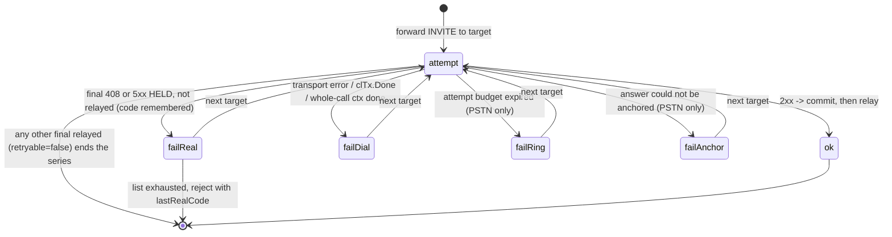

`attemptKind` and `attemptResult` are defined at `invite.go:52-79`; the
classification is produced by `pumpPSTNAttempt` (`invite_leg.go:279-391`) and
`expirePSTNAttempt` (`invite_leg.go:400-480`); the upstream path uses the
simpler `final == nil && !responded && clTx.Err() != nil` retry rule in
`inviteToUpstream`.

### 7.12 Response synthesis by path

| Path | No target answered |
|---|---|
| `inviteToUpstream` | **503 Service Unavailable**; **408** at the backstop; nothing after the caller's own CANCEL |
| `inviteToPSTN` | 488 / last real code / 408 / 503, in that order; **408** at the backstop; nothing after FreeSWITCH's CANCEL |
| `inviteToClient` | a client that never gives a final is answered for it: **408** when its INVITE timed out (Timer B) or the backstop expired, **480** when its transport failed. Before forwarding: **404** (no binding), **480** (the binding's transport has no public side, or the forward itself failed), **488** (offerless, or an answer that cannot be anchored) and **483**; **482** when the INVITE merges with one in progress |

In every path the pump's own **488** (an answer that cannot be anchored) is
the caller's one final: `pumpResult.finalised` stops any second one.

---

## 8. Media path

### 8.1 What FreeSBC does to media, precisely

| Operation | Where | Notes |
|---|---|---|
| **Relay** — bytes forwarded uninterpreted | plaintext RTP and plaintext RTCP on the plain `Session` path | the relay loop copies `buf[:n]` from one socket to the other; no RTP header parsing, no SSRC rewriting, no payload-type rewriting, no sequence handling, no jitter buffer. SRTCP is **not** relayed uninterpreted: the RTCP forward loop unprotects and re-protects with the same context as SRTP (`relay.go:67-95`), so it belongs in the *transformation* row; only its **contents** are never inspected |
| **Termination** — a protocol endpoint FreeSBC itself terminates | SRTP/SRTCP (SDES and DTLS-keyed), the DTLS handshake, the ICE-Lite agent | the far side's cryptographic association ends at FreeSBC |
| **Transformation** — re-keying and rewriting | SRTP↔RTP interworking and SRTP↔SRTP re-keying (decrypt with the peer's key, re-encrypt with ours); SDP rewriting (trunk: in-place edit; edge: construction from scratch) | proven by `TestRelaySRTPToSRTPRekeyed`: the packet delivered to B decrypts with key B and **must not** decrypt with key A |
| **Transcoding** | **none, anywhere** | there is no codec conversion in `internal/media`; payload-type numbers must survive end to end, which is why `sdp.ErrRenumbered` rejects a renumbering answer |

**Where data passes through without interpretation:**

- The RTP payload itself, in every direction, on both planes. The only
  inspection is SRTP protect/unprotect (which pion parses internally) and,
  on the WebRTC leg only, the RFC 5761 payload-type test that separates RTP
  from RTCP on the muxed socket.
- RTCP compounds. They are relayed over their own socket pair (RTP+1) — and
  over the muxed socket for WebRTC — protected/unprotected with the same
  context, **never inspected or rewritten**: no SSRC fixing, no report-block
  rewriting, and RTCP CNAME crosses in cleartext on a plaintext leg.
- RFC 4733 DTMF (`telephone-event`) is a payload the proxy carries and never
  interprets; it is in the supported codec set solely so it survives
  negotiation.
- On the trunk plane, every non-`crypto`, non-`rtcp` SDP attribute on the
  relayed media section — including `candidate`, `fingerprint`, `ice-*`,
  `setup` and `ssrc` — and the `o=` username and session-id.

### 8.2 Port pools

A `PlanePool` owns only the **bind** plane: a port range, a bind address
(the zero address meaning every interface), and a default silence timeout.
Its `PlaneParams` closure re-reads `store.Current()` on **every allocation**,
so a hot-reloaded range or bind address applies to new sessions without
disturbing established ones. The advertised address is the signalling
plane's concern and reaches SDP only through `sdp.Build.Address` (edge) or
the trunk SDP builder's media IP (`sdpOrigin.build`).

`allocatePair` rounds the low bound up to an even port, walks a cursor in
steps of 2 wrapping before the high bound, skips ports already in `inUse`,
and binds RTP and RTP+1 together; a port occupied by another process is
skipped rather than fatal. **RTP is always even and RTCP always RTP+1.**
Exhaustion returns `ErrPortsExhausted`. `allocateSingle` (WebRTC only) is the
same sweep but binds only the even port and **reserves the odd one without
binding it**, so a muxed session still consumes a pair's worth of range.

The pool mutex covers only the **reservation** (`reserveNext`): each
candidate is taken from the cursor and entered in `inUse` under the lock,
then bound with the lock released, and a failed bind drops the reservation.
Reserving before binding is what keeps "no duplicate allocation" true under
a burst of simultaneous calls; binding outside the lock means a sweep past
ports other processes hold never stalls `Stats`, `release` or another
allocation on the plane.

`Stats()` returns `(inUse, total)`, where `total` is `(hi - lo + 1) / 2`
after the even-bump, clamped to 0, and `inUse` counts only reservations
**inside the current range**. After a hot reload that moves or shrinks the
range, live calls keep their old ports until they end; those are not
counted against the new capacity, so `inUse` never exceeds `total`.

Deployment sizing: **2 ports per call per plane**. A trunk call consumes 2
pairs from the one trunk pool; an edge call consumes 1 pair from `rtp.public`
and 1 pair from `rtp.private`; a WebRTC edge call consumes 1 reserved pair
(1 bound socket) from `rtp.public` and 1 pair from `rtp.private`.

### 8.3 `media.Session` — the four-socket relay

A `Session` owns **4 UDP sockets** (2 port pairs), 4 latches (RTP and RTCP
per side), 4 relay goroutines, 1 watchdog goroutine, and one `done` channel.

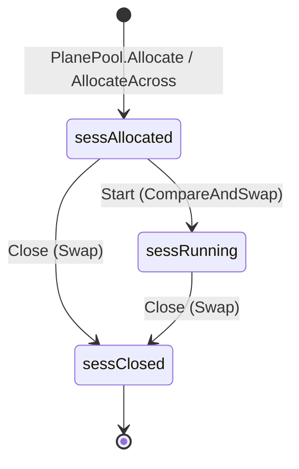

Transitions: `Start` (`relay.go:19-22`) is a single
`CompareAndSwap(sessAllocated, sessRunning)` and returns whether *this* call
started it, so the relay starts at most once whichever path wins; `Close`
(`session.go:374-385`) is a single `Swap(sessClosed)` that closes both pairs,
releases both port reservations and closes `done`, making it idempotent and
safe from any goroutine. Transitions only ever move forward.

`Start` launches, in order: RTP A→B, RTP B→A, RTCP A→B, RTCP B→A, and the
watchdog. **A session that is allocated but never started has no watchdog**,
so an INVITE abandoned before the answer holds its ports until someone calls
`Close`.

The per-packet loop, per direction and kind:

```
read from the `from` side's socket        (up to maxPacketSize = 1508 bytes)
larger than maxPacketSize? -> drop        // never forward a truncation
inLatch.accept(src)?  no -> drop
srtpIn[from] != nil   -> unprotect in place; failure -> drop
lastRx[from].Store(now)                    // T-22: only after proof
counters.recordRx(from, rtpKind, len)
srtpOut[to] != nil    -> protect in place; failure -> drop
outLatch.target() != nil -> write from the `to` side's own socket
```

Every relay loop (this one and the two `WebRTCSession` directions) reads
into one buffer of `relayBufSize` = `maxPacketSize + 1 + srtpMaxOverhead`
bytes: one byte more than the largest datagram relayed, so an oversize one
is detected and dropped rather than forwarded cut short (`ReadFromUDP`
truncates silently), and room for the SRTP overhead so both transforms run
in place. The per-packet path allocates nothing.

Packets are sent **from the `to` side's own socket**, so the far remote sees
the port it already talks to. A `nil` destination (the far side has not
latched or been seeded) means the packet is dropped.

Every relay goroutine carries `recoverRelayPanic`, which logs the panic and
stack and calls `Close` — a panic kills one session, never the process.

### 8.4 Latching

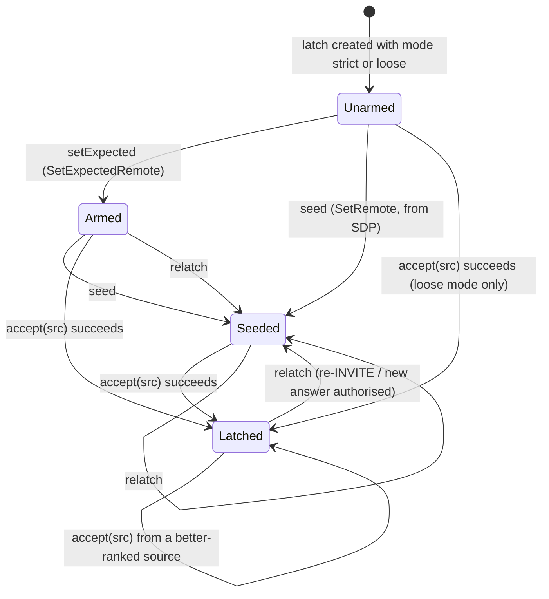

Transitions: `setExpected` (`session.go:110-114`) records the expected source
IP; `seed` (`session.go:178-194`) records the expected IP, the exact
signalled address **and** a provisional send-to destination (`dst`) from
SDP, never touching the latched `remote`; `accept` (`session.go:233-251`) is
the gate the relay calls per packet and is what sets `remote` and its `rank`;
`relatch` (`session.go:145-154`) takes the newly signalled address (IP
**and** port), sets the expected IP, clears `dst`, the signalled address,
`remote` and `rank` — unconditionally, from **any** state — and then seeds
the new address, so the side keeps
receiving media after an authorised move even if it never sends first (a
recvonly peer, an IVR waiting to hear audio). An address with no usable
port only re-arms the source check (`Armed`).

**What `seed` will send to** (`unicastMediaAddr`, `session.go:199`): the
unspecified address (RFC 3264 §8.4 hold), multicast, the IPv4 broadcast
address and link-local addresses are never installed, nor do they change
the expected source. A loopback address arms the source check but becomes
a destination only when the side's pool allows it
(`PlaneParams.AllowLoopback`): the edge sets it for a media plane whose bind
or advertised address is loopback, and the trunk for a loopback
`rtp.bind_ip` — a single-host lab or the test suites. Anywhere else a
client's SDP could point the SBC's media socket at a service on its own
host. The policy is read once per session, at allocation. `internal/sip/sdp`
enforces the same classes one step earlier: `Parse` refuses multicast,
broadcast, link-local and (unless `ParseOptions.AllowLoopback`, which the
edge derives from its advertised media addresses) loopback `c=` addresses
with `ErrNotUnicast`, and reports `c=0.0.0.0`/`::` as `Audio.Hold` with no
`Address`.

Acceptance rules in `accept`. Every source is ranked by how well
signalling vouches for it (`latchRank`, `rankOf` at `session.go:211-229`):

1. **exact**: the exact IP **and** port the side's SDP signalled;
2. **signalled**: the expected IP from another port (a NAT that rewrote the
   port), or the IP the side's SIP came from (`SetSignallingSource`, set by
   the edge on its public leg: a phone behind NAT whose SDP carries its
   private address sends RTP from the public IP its SIP came from);
3. **any**: every other source — loose mode only. In strict mode a source
   whose IP is not the expected one (compared `Unmap`ed), or any source
   before an expectation exists, is rejected outright.

A packet from the latched source is always accepted. Any other packet is
accepted only if it ranks **strictly above** the latched source (or, before
latching, above nothing), and then it re-latches. So the first acceptable
packet latches as before, an equally ranked newcomer is dropped (the
post-latch hijack rejection), and an **exact** latch is final. What this
buys (P2-EDG-001): an off-path source that sprays the loose public port
before the phone speaks wins at most an *any* latch, which the phone's first
packet from its SDP address or its SIP IP takes back.

**Delayed learning** (`LearnDelay` = 3 s, `target` at `session.go:264-274`):
when the SDP address was installed as a destination and **is** the IP the
side's SIP came from — no NAT between them, so the endpoint should be
sending from it — a below-exact latch does not become the destination until
`LearnDelay` after it latched; until then audio keeps going to the SDP
address. A packet from the exact address meanwhile latches at once. Modelled
on rtpengine's delayed endpoint learning: a symmetric endpoint never waits,
one whose port was rewritten loses at most 3 s of inbound audio, and a
packet sprayed at the port from the phone's own IP (another host behind the
same NAT) does not redirect the call's audio. When the SDP address differs
from the SIP source (the NAT case, or a gateway whose media and signalling
addresses differ), or no SIP source is known (the trunk plane), learning is
immediate.

`ParseLatchMode`: `"loose"` → loose, everything else (including `""`) →
strict.

**Symmetric RTP**: the seeded destination is overridden by the first
*accepted* packet's real source address and port; afterwards only a
better-ranked source or an explicit `relatch` from the signalling plane
moves the latch. The
local port never changes across a re-INVITE.

Plane defaults:

| Plane / leg | Mode | Set by |
|---|---|---|
| Trunk A-leg | the calling peer's `media_latch` (default `strict`) | `Allocate` config |
| Trunk B-leg | the *selected target's* `media_latch`, re-applied per attempt | `SetLatchMode(SideB, …)` in `dialTarget` |
| Edge public leg (side A) | **loose**, with the client's SIP source IP as a signalled source | `allocateRTP` (caller: the INVITE's source) and `negotiateFork` (callee: the address the INVITE was sent to) — a phone behind a hard NAT cannot be trusted to signal the source its RTP comes from |
| Edge private leg (side B) | **strict** | FreeSWITCH's signalled address is trustworthy, and strict already tolerates a NAT-rewritten port |
| WebRTC public leg | none — ICE fixed the peer and SRTP authenticates every packet | — |
| WebRTC private leg | strict | `WebRTCSessionConfig.PrivateLatch` |

The trunk plane calls `SetExpectedRemote` for side A and never `SetRemote`;
side B is seeded by `Relatch` from the answer's `c=`/`m=` in
`processAnswerSDP`, so the answering carrier hears the caller before it
sends anything. Side A is not seeded, so media toward the caller flows once
it sends. The edge plane seeds both sides from the signalled address.

### 8.5 Silence watchdog

`watchdog(timeout, &lastRx, done, Close)` ticks at `timeout/4`, floored at
**10 ms**. `lastRx` holds **one timestamp per sending side**, and the
watchdog calls `Close` when **either** is older than `timeout`: a call is
reclaimed when one end has gone silent, even while the other keeps
streaming (FreeSWITCH playing music on hold to a phone that vanished with
its BYE lost). RTP and RTCP both count, so a receive-only side that sends
RTCP receiver reports (RFC 3550; RFC 3264 §5.1 keeps RTCP flowing on hold)
stays alive. A held endpoint that sends **neither** RTP nor RTCP for
`rtp_timeout` is reclaimed; raise `rtp_timeout` if such endpoints hold for
longer. `timeout` is `listen.media.rtp_timeout`, default **5 minutes**,
taken from the pool's params at allocation (from **pool A** even when the
two sides come from different pools). A `WebRTCSession` tracks the browser
(side A) and FreeSWITCH (side B) the same way.

`lastRx` is refreshed **only after a packet is proven genuine**: latch
acceptance for a plaintext leg, and successful SRTP authentication where an
inbound context is installed. That gating is what stops a party who knows the
latched source address from keeping a dead call alive with junk.

The watchdog is the backstop for a half-dead call whose BYE was lost. On the
trunk plane it fires `sess.Done()`, which the `onInvite` select turns into
BYEs on both legs; on the edge plane it fires the per-dialog media watcher
goroutine, which calls `dialog.end()` and then sends a BYE to both
endpoints (§7.7). That watcher is launched by `confirm` (`dialog.go:659-667`),
so it exists only for a **confirmed** dialog; an early one is reclaimed by
`endUnlessUp` and the 5-minute `inviteTimeout` (which CANCELs the branch and
answers 408) instead.

### 8.6 SRTP

`SRTPContext` wraps pion's lockless `*srtp.Context` behind a mutex, because
the RTP-forward and RTCP-forward goroutines of one direction share it.
Replay protection is explicitly enabled — pion's default is none — with
windows **64** for SRTP and **128** for SRTCP, per context. It is pion's own
sliding-window detector (`replaydetector.New`, what `SRTPReplayProtection`
installs), plugged in through `SRTPReplayDetectorFactory` behind
`tokenReplayDetector`, which uses the detector's `CheckSeq`/`Accept` token
API instead of `Check`: `Check` returns a fresh closure per packet.

**No per-packet allocation.** pion is always given a header to reuse and a
destination buffer. The relays call the `…Into(dst, pkt)` variants on their
own read buffer, so protect and unprotect run in place. `protectRTP`,
`unprotectRTP` and the RTCP pair leave their input untouched and return a
slice of a per-context 16 KiB slab that is only ever appended to, so a
returned slice is never overwritten and one allocation serves about 80
packets. **A plaintext RTP packet carrying a Cryptex (RFC 9335)
header-extension profile, `0xC0DE` or `0xC2DE`, is refused by `protectRTP`**:
those profiles mean "encrypted header extension" to the receiving side, and
Cryptex is not negotiated, so the SRTP could never be unprotected.

Two suites exist: `AES_CM_128_HMAC_SHA1_80` and `AES_CM_128_HMAC_SHA1_32`.
`SDESKeyLen = 30` (a 16-byte master key concatenated with a 14-byte master
salt). `NewSDESKey()` draws from `crypto/rand`.

`SetSRTP(side, inbound, outbound)` stores two `atomic.Pointer`s: `inbound`
decrypts what is received *from* that side, `outbound` encrypts what is sent
*to* it. There is no hard-coded "side A is secure". It is safe to call after
`Start` and more than once for the same side — which is exactly what a
failover target's answer replacing an earlier target's early-media contexts
needs. A plaintext outcome always installs `(nil, nil)` so a previous
target's contexts cannot linger. On a **closed** session it is a silent no-op
(`session.go:361-367`): keys are never installed on a relay that no longer
exists.

On any protect/unprotect failure the packet is dropped with a bare
`continue`: no counter, no log, no distinction between a bad auth tag, a
replay and a malformed packet. The call stays up; the only observable effect
is that `lastRx` was not refreshed.

The DTLS-SRTP path uses the same `newContext` constructor, built from the
exported keying material rather than an SDES key value.

### 8.7 WebRTC leg (edge plane only)

The leg deliberately does **not** use `pion/webrtc.PeerConnection`. FreeSBC
owns the media session, the SDP and the leg lifecycle; pion supplies
protocol primitives only: `ice.Agent` for connectivity checks, `dtls.Conn`
for the handshake and key export, `srtp.Context` for the transforms.

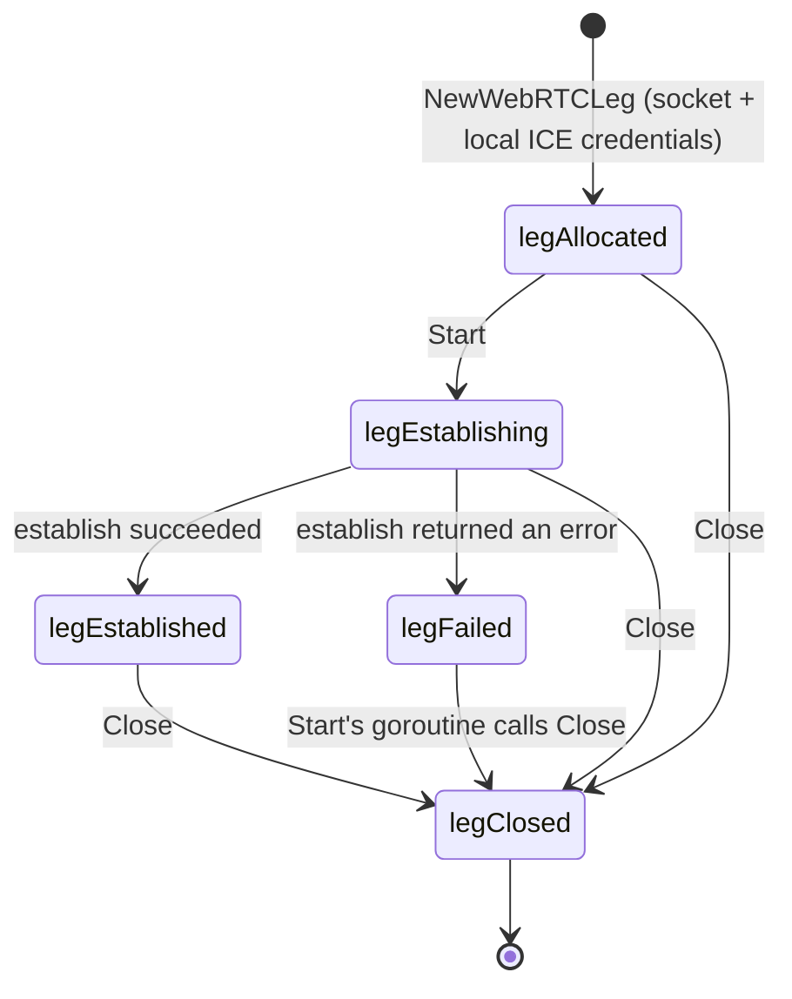

Transitions: `NewWebRTCLeg` (`webrtcleg.go:192-238`) leaves the state at the
zero value `legAllocated`; `Start` (`webrtcleg.go:273-300`) claims
`legAllocated → legEstablishing` under `mu` and spawns `establish` — a second
`Start`, or a `Start` after `Close`, is a no-op, so no second ICE agent can
be built over the same socket; that goroutine sets `legFailed` and
immediately calls `Close` on error (`webrtcleg.go:293-294`) or
`legEstablished` on success (`:297`); `Close` (`webrtcleg.go:693`) sets
`legClosed`, which `set` (`:124-126`) treats as terminal. The first error
recorded wins, and a leg closed before it was established is retroactively
stamped with `"webrtc leg closed before it was established"`.

`Close` during establishment releases everything: it cancels `establish`'s
context and snapshots the mux/agent/demux handles once, and `establish`
hands every handle it creates to the leg through `keep` (`webrtcleg.go:310`),
which refuses once the state is `legClosed` — `establish` then closes that
handle itself and returns. The DTLS connection is tied to the leg's `closed`
channel as soon as its handshake succeeds, so a keying failure after the
handshake no longer leaks it.

`establish` runs under **one deadline covering ICE and DTLS together** —
`Start(ctx, timeout)` with `timeout <= 0` meaning **30 s**:

1. `ice.NewUDPMuxDefault` over the single allocated socket.
2. `ice.NewAgentWithOptions(WithICELite(true), WithCandidateTypes([host]),
   WithNetworkTypes([UDP4, UDP6]), WithIncludeLoopback(), …)` — the
   options-based constructor (the `AgentConfig` one is deprecated in
   pion/ice v4) — a genuine ICE-lite agent, host candidates
   only, **no STUN and no TURN servers configured**. The candidate handler is
   intentionally empty: FreeSBC does not use gathered candidates in SDP; it
   advertises exactly one host candidate at the configured public media
   address. Gathering exists only to give the agent a local candidate to
   answer connectivity checks from.
3. `agent.Accept(ctx, remoteUfrag, remotePwd)` — a lite agent is always
   controlled, so `Accept` is correct regardless of which end offered.
   Connectivity checks are handled entirely inside pion; this package never
   sends binding requests and never nominates.
4. `newDemux(iceConn)` splits the single socket by RFC 7983 first byte:
   20-63 DTLS, 128-191 SRTP/SRTCP, **everything else dropped** — STUN is
   already consumed by the ICE agent, and a single hostile datagram must not
   be able to tear down a live call's media path. Buffers: 64 KiB for DTLS,
   1 MiB for SRTP; a full buffer drops the packet rather than blocking the
   read loop, which would stall the other endpoint too.
5. DTLS via `dtls.ServerWithOptions`/`ClientWithOptions` (the
   `dtls.Config` constructors are deprecated in pion/dtls v3) with the
   process identity, offering `SRTP_AES128_CM_HMAC_SHA1_80` and `_32`,
   `WithInsecureSkipVerify(true)` and, as server,
   `WithClientAuth(RequireAnyClientCert)`. The peer certificate is
   self-signed by design and there is no PKI to verify a chain against; the
   binding to the session is the `a=fingerprint` line. When the leg was
   given it (`WebRTCLegConfig.RemoteFingerprintHash`/`Value`, which the edge
   plane always sets from the offer), `WithVerifyPeerCertificate` checks the
   leaf certificate against it during the handshake, and a mismatch fails
   the handshake with `ErrFingerprintMismatch` — before any key is derived
   or any packet relayed. Because pion calls that hook only when the peer
   sent a certificate, the leaf the handshake ended with is re-matched from
   `ConnectionState` before keying as well, in either DTLS role.
6. `HandshakeContext(ctx)` is run **explicitly** under the establishment
   deadline, so a peer that opens the flow and then goes quiet cannot pin the
   port past the timeout.
7. `deriveSRTP` exports `EXTRACTOR-dtls_srtp` keying material, splits it
   into client/server key and salt, and assigns roles by
   `l.dtlsClient`. **Re-keying and ICE restart are not supported**: keys are
   set exactly once, and a browser that renegotiates has its DTLS records
   absorbed rather than applied.

**DTLS role**: `dtlsClient` is true only when the browser explicitly sent
`a=setup:passive`. `actpass`, `active` and an absent `a=setup` all make
FreeSBC the DTLS **server**, advertised as `a=setup:passive` — the
conventional pick for a gateway with a stable address (RFC 5763 §5).

**Fingerprint verification** is the only binding between the signalling
identity and the media path, and **media is gated on it**: the leg's
`verified` flag is set when the in-handshake check passed or when a later
`VerifyFingerprint` succeeds, and both relay directions of `WebRTCSession`
drop every packet (without refreshing the watchdog) while it is false. A leg
built without a signalled fingerprint therefore establishes but carries no
media until `VerifyFingerprint` succeeds. `VerifyFingerprint` requires the
leg to be ready, accepts `sha-256`, `sha-384` and `sha-512` (the set
`internal/sip/sdp` parses), hashes the peer's leaf certificate and compares
case-insensitively; a mismatch clears `verified`. The edge plane passes the
offer's fingerprint into the leg config, so a mismatch surfaces as
`WebRTCSession.Start` failing with `ErrFingerprintMismatch`; it still calls
`VerifyFingerprint` after `Start` as a re-check, and tears the session down
on either failure, logging neither fingerprint.

**ICE credentials** are 3 random bytes → 4 base64url characters (ufrag) and
18 bytes → 24 characters (pwd). They are secrets: anyone who learns the pwd
can answer connectivity checks and take over the media path, so they are
never logged at normal levels.

`WebRTCSession` joins the leg to a private port pair. Its `Start` waits for
the leg to be ready, fetches the SRTP contexts and the muxed connection, and
launches 3 relay goroutines (`publicToPrivate`, and `privateToPublic` for RTP
and RTCP) plus a watchdog. On the public side **rtcp-mux is assumed**: RTP
and RTCP are separated by the RFC 5761 payload-type range, not by socket.
`Close` closes the private pair, releases its port, and closes the leg. Both
the WebRTC relay and the demultiplexer read into `maxPacketSize` = **1508**
bytes (`mux.go:54`) — the MTU plus room for an SRTP tag on an already-full
packet — as does the plain `Session` relay (§8.3).

**rtcp-mux is not supported on the plain `Session` path.** There is no muxing
logic; a peer that muxed RTCP onto the RTP port would have its RTCP fed into
the RTP forward loop.

### 8.8 SDP construction (edge plane)

`internal/sip/sdp` is a typed, bounded parse of only the parts an SBC acts
on, built on `pion/sdp/v3` with **no string manipulation of SDP anywhere**.

Parse limits: `MaxSize = 16 KiB`, `MaxMediaDescriptions = 16`,
`MaxAttributes = 256` (session level and per media section),
`MaxCodecs = 128`. Sentinels: `ErrTooLarge`, `ErrNoAudio`, `ErrAudioDeclined`
(every audio section is at port 0; it wraps `ErrNoAudio`), `ErrNoAddress`,
`ErrNoCommonCodec`, `ErrRenumbered`.

In the audio section's format list a non-numeric token fails the body, while a
number above 127 (including one above 255) or a repeated number is skipped. An
`a=rtpmap` encoding name must be 1-64 letters, digits, `-`, `_` or `.`
(`validEncodingName`); any other name makes that codec unusable, which is what
lets `Describe` put codec names in log lines.

Parsing selects the **first `m=audio` section whose port is non-zero**, so a
declined stream followed by a live one still works. Connection addresses must
be literal IPs — **hostnames are rejected, never resolved**: the proxy must
not perform DNS on behalf of an untrusted body. Session-level attributes are
applied before media-level ones, so media wins.

Only these attributes are understood: direction (`sendrecv`/`sendonly`/
`recvonly`/`inactive`), `ice-ufrag`, `ice-pwd`, `setup`, `fingerprint`,
`rtcp` (the port only; the optional address is discarded as topology),
`rtcp-mux` (`Audio.RTCPMux`). Everything else — including `candidate`, `ssrc`, `extmap`,
`ptime`, `crypto` — is dropped. **SDES is not parsed by this package at
all**; only the trunk plane handles `a=crypto`.

ICE tokens are sanitised to alphanumerics plus `+`, `/`, `-` and `_`
(`sdp.go:557-570`) — the RFC 5245 ice-char set widened to base64url, which is
the alphabet FreeSBC's own credentials use (`webrtcleg.go:739-746`) — with the
RFC 5245 §15.4 lengths: `ice-ufrag` 4-256, `ice-pwd` 22-256. Any other byte —
CR/LF above all — or length rejects the whole token, because
the token is copied into the SDP generated for the other leg. Fingerprints
accept only `sha-256`, `sha-384` and `sha-512`, each pair two hex digits
(`isHexByte`); SHA-1 is rejected.
`Audio.WebRTC()` requires a `TLS` proto token **and** a fingerprint **and**
both ICE credentials.

Codec policy lives in the **edge plane**, not in `sdp`
(`internal/edge/codecs.go:9-42`): `supportedCodecs` is a closed set — `pcmu`,
`pcma`, `opus`, `telephone-event` — and `filterCodecs` preserves **order and
payload-type numbers**. The `sdp` package holds no codec policy of its own
(`sdp.go:8-10`); it only parses, intersects and renders. `Negotiate(offer, answer)` returns the intersection in **offer
order with offer payload numbers and answer FMTP**, fails with
`ErrNoCommonCodec` when nothing usable is shared or only `telephone-event`
is, and fails with `ErrRenumbered` when the answer puts an offered encoding
on a payload number the offer never gave that encoding — honouring that
would mean rewriting every RTP packet's PT byte. Codecs are matched on the
offered payload number first, so an offer that carries one encoding on
several numbers (RFC 3264 §6.1, e.g. opus on 111 and on 96) is not
mistaken for a renumbering.

`a=fmtp` is **never copied** from the other leg. Parse keeps only the
parameters on a per-codec allowlist (`fmtpAllow` in `fmtp.go`: opus per
RFC 7587, AMR/AMR-WB, G.729 `annexb`, iLBC `mode`, G.722.1 `bitrate`, and
the RFC 4733 event list for `telephone-event`), each checked against a
typed value, and re-renders them as `name=value;name=value`. Unknown
parameters, malformed values and codecs with no entry lose their fmtp.
`Build` runs the same filter again before it writes an `a=fmtp` line, so
free text, addresses and bare CRs from one leg cannot reach the other.

`sdp.Build` constructs bodies from scratch; **nothing is copied from the
other leg's body**. That is what makes the two structural guarantees hold:
a private FreeSWITCH address can never appear in a public body, and browser
ICE candidates can never reach FreeSWITCH.

| Line | Plain RTP leg | WebRTC leg (`DTLS: true`) |
|---|---|---|
| `o=` | `FreeSBC <id> <version> IN IP4/IP6 <Address>` | same |
| `s=` | `FreeSBC` | same |
| `c=` | the SBC's advertised address for that plane | same |
| `t=` | `0 0` | same |
| `m=audio` proto | `RTP/AVP` | `UDP/TLS/RTP/SAVPF` |
| ICE | — | `a=ice-lite`, `a=ice-ufrag`, `a=ice-pwd`, one `a=candidate:1 1 UDP <prio> <Address> <Port> typ host`, `a=end-of-candidates` |
| DTLS | — | `a=fingerprint:<hash> <value>`, `a=setup:<role>` |
| codecs | `a=rtpmap` per codec, `a=fmtp` re-rendered from the allowlist | same |
| direction | `a=<Direction>` (default `sendrecv`) | same |
| `a=rtcp-mux` | only when `RTCPMux` (`build.go:177-179`) | only when `RTCPMux`, which `setWebRTCAnswer` always sets alongside `DTLS` (`edge/media.go:575`), so always present on a browser leg. That is correct in an answer only because a browser offer without `a=rtcp-mux` is refused 488 (`requireRTCPMux`, RFC 5761 §5.1.1) |
| `a=rtcp` | **never emitted** — RTCP rides the RFC 3550 default of RTP+1 | same |
| `a=ptime` | **never emitted** — the proxy does not repacketize | same |

`MarshalDeclining(offer)` answers with one `m=` line per offered section **in
the offer's order** (RFC 3264 §6): the live audio sits at `offer.AudioIndex`
and every other section is declined at port 0 with the offer's media type and
transport. Parse keeps those two per section (`Session.Sections`) only after
normalising them: the media type must be letters only (else `audio`) and the
transport must be on a fixed list (else `RTP/AVP`). A declined section's
format is a constant per transport (`0`, `webrtc-datachannel`, `t38`, `*`),
and it has **no attributes and no connection line**, which is what keeps a
peer's keys, candidates and addresses from riding along. Offers are built
with `Marshal`, which emits the audio section alone.

The single host candidate's priority is `iceLitePriority = 126<<24 |
65535<<8 | 255`.

### 8.9 Media anchoring on the edge plane

Media is **always** anchored; there is no SDP pass-through path. A missing
body is rejected 488 rather than forwarded.

`mediaSession` holds `rtp *media.Session` **xor** `webrtc
*media.WebRTCSession`, plus the public and private port and the agreed codec
list; `rtpLeg()` returns an error rather than dereferencing nil, so a caller
whose correctness rests on "this leg is never WebRTC" states the invariant.

- **Public client → FreeSWITCH** (`buildUpstreamOffer`): parse, filter
  codecs, allocate (WebRTC if the offer is WebRTC and `webrtc.enabled`, else
  a plain pair across the two pools), attach the session to the dialog —
  from that point every failure leaves it to the dialog's own `end()` — and
  build the private body with a **fresh session identity** at
  `privateMediaIP:privatePort`.
- **Answers, per fork** (`forkAnswer` → `negotiateFork` → `followFork` →
  `pointMedia`, `media.go`): one path for all three directions. A fork's
  first body is negotiated against the **original offer** (never a previous
  fork's or gateway's agreement), the caller's body is built at the caller
  plane's anchor with the fork's own `o=` identity — adding the DTLS/ICE
  block when the caller is a browser — and the callee-facing side is pointed
  at the address the answer signalled: `SetRemote` (plus `SetRTCPRemote`
  for an explicit `a=rtcp`) and `Start` for the plain relay,
  `SetPrivateRemote` for a WebRTC session (whose relay is started by
  `WebRTCSession.Start` in the establishment goroutine instead). When that
  side already followed a **different** address (another fork, a failed
  gateway), the latch is re-armed first with `Relatch` / `RelatchPrivate`,
  because a latch armed to the old address would decline the new one's
  media as a hijack; an answer restating the same address leaves the latch
  alone. Only the callee-facing side is ever pointed by an answer: the
  caller's side keeps the address its offer seeded.
- **FreeSWITCH → public client** (`buildPublicOffer`): the mirror image of
  `buildUpstreamOffer`, with one structural limitation: the public leg
  **cannot** be WebRTC here, because a DTLS-SRTP offer requires the
  answerer's fingerprint and ICE credentials and an offer by definition has
  not seen them. FreeSBC offers plain RTP even to a WebSocket client. A
  client or carrier answer is always handled on the plain relay (`rtpLeg()`
  is checked).
- **In-dialog rebuild**: `anchorFor` returns the session's existing address
  and port — nothing allocates. Direction passes through **unreversed**,
  because FreeSBC is a relay in the middle: a caller putting the call on hold
  with `sendonly` must present as `sendonly` to the far end. Codec changes
  are conveyed.

Ports return to the pool only when `mediaSession.Close()` runs, which happens
only inside `dialog.end()`.

### 8.10 Statistics

`media.Stats` carries packets and bytes, rx and tx, per side: `Stats.A` and
`Stats.B` (`Side`, `Total`). The orientation is the plane's: on the edge, A is
the client-facing (public) leg and B the FreeSWITCH-facing (private) one; on
the trunk, A is the leg the call arrived on and B the one it was placed on. **RTCP is relayed but never counted.** There is
no drop counter, no auth-failure counter and no RTCP counter. Rx counts the
length after inbound decryption; Tx counts the bytes actually written after
outbound encryption, and **only when the `WriteToUDP` itself succeeded**
(`relay.go:97-101`), so the two differ by the SRTP overhead on a mixed session.
On a `WebRTCSession` the private-side rx is the raw plaintext length read off
the socket before `protectRTPInto` (`webrtcsession.go:279`), so the public-side tx
exceeds it by the SRTP overhead.

---

## 9. Sequence diagrams

Every diagram below reflects a flow that exists in the code and is covered by
package tests or the opt-in FreeSWITCH interop tests.

### 9.1 SIP REGISTER through the edge plane

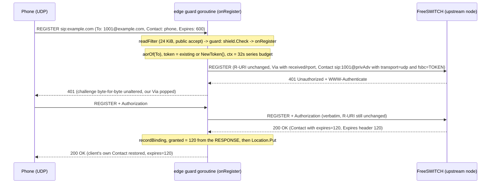

The upstream cooldown is cleared on **any** final response; the series ends
on any final. `logRegister` records the outcome without any credential.

### 9.2 WebSocket REGISTER

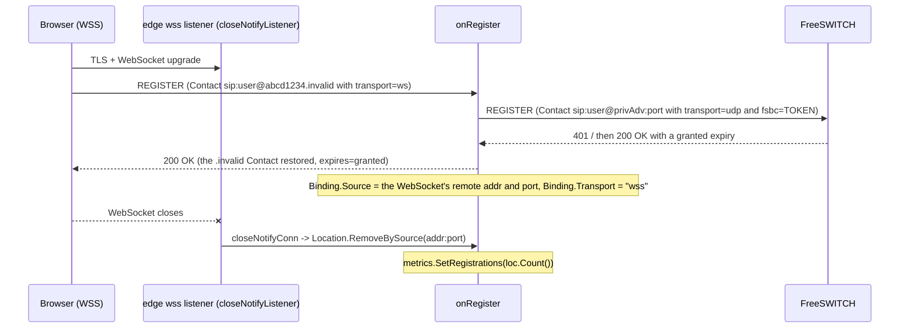

`side.laddr` is zero for ws/wss, so outbound requests toward this client ride
the client's own pooled inbound connection; no `rport` is added on a WS Via.

### 9.3 Inbound trunk call — carrier → FreeSWITCH

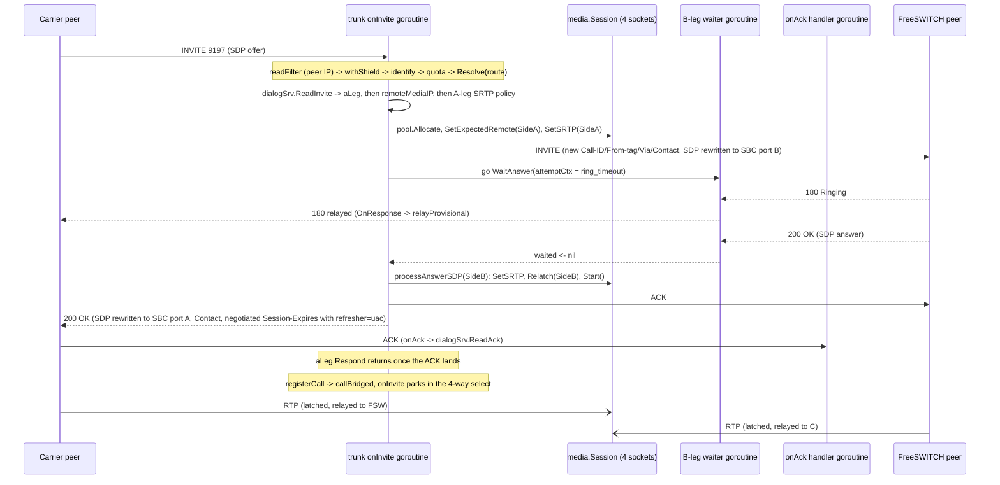

100 Trying from the carrier is never relayed; sipgo's A-leg server
transaction generates its own.

### 9.4 Outbound trunk call — FreeSWITCH → carrier, with failover

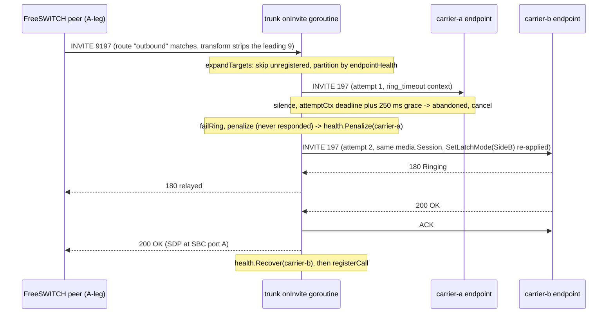

If every target fails, `placeCall` answers the A-leg with the last genuine
carrier code, else 408, else 503.

### 9.5 WebRTC browser → upstream, through the edge plane

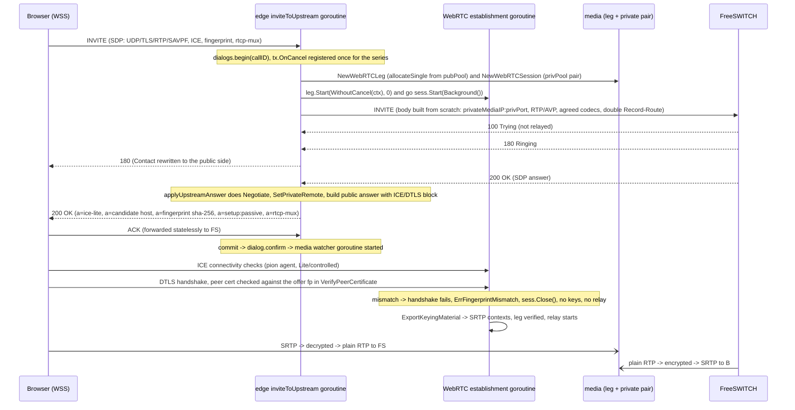

### 9.6 Inbound PSTN call → FreeSWITCH → a registered contact

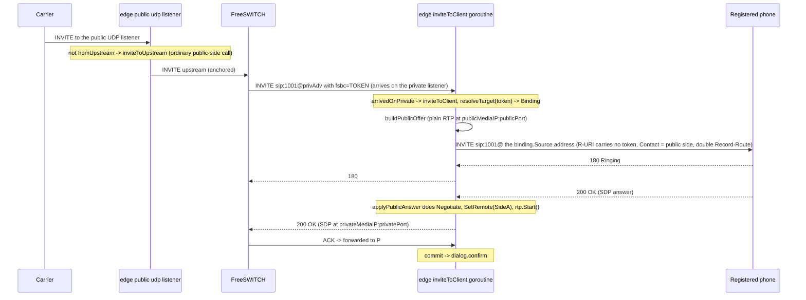

An unknown `fsbc` token yields **404 Not Found**, letting FreeSWITCH fail
over or play treatment. A binding whose transport has no configured public
side yields **480**.

### 9.7 Outbound PSTN call — FreeSWITCH bridging to a gateway

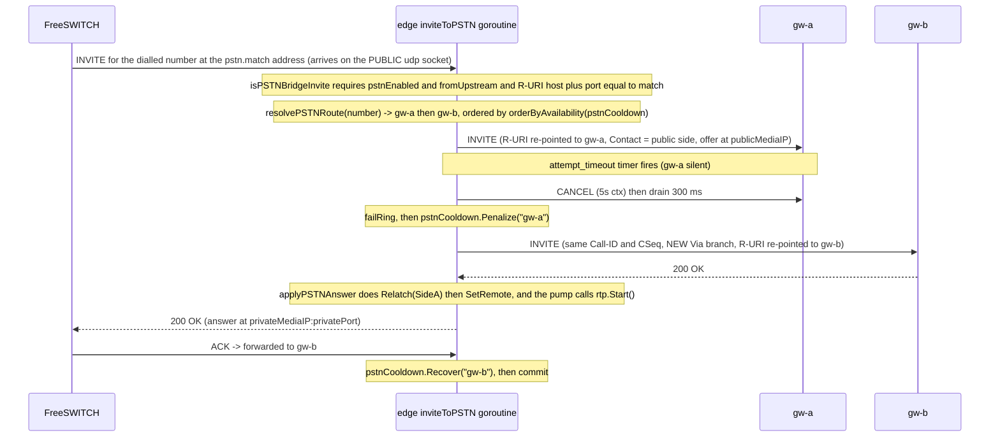

A 486 from gw-a would be relayed as-is and gw-b would never be dialled; a 503
or 500 would be held and failover would continue.

### 9.8 CANCEL before answer (edge plane)

```mermaid
sequenceDiagram
    participant P as Caller
    participant S as sipgo server transaction
    participant H as inviteToUpstream goroutine
    participant FS as FreeSWITCH

    P->>S: INVITE
    S->>H: onInvite, then d.track of an attempt holding the forwarded request and the series cancel (before sending)
    H->>FS: INVITE
    FS-->>H: 180 Ringing (relayed to P)
    P->>S: CANCEL (matching branch)
    S-->>P: 200 OK (to the CANCEL, generated by sipgo)
    S->>H: tx.OnCancel -> cancelCall(d) (under sipgo's tx lock: no I/O)
    Note over H: cancelSeries marks the call cancelled and takes the attempt; go sendCancel
    S-->>P: 487 Request Terminated (generated by sipgo once the hook returns)
    H->>FS: CANCEL (built from the FORWARDED request, same top-Via branch)
    Note over H: a.cancel() once the CANCEL is on the wire -> series ctx cancelled -> media released now
    FS-->>H: 487 Request Terminated
    Note over H: pumpInvite ctx.Done -> drainCancelledInvite (300 ms), the upstream 487 is matched and ACKed by the transaction layer, never relayed
    Note over H: endUnlessUp -> dialog.end -> media session closed, ports released
```

An orphan CANCEL (one sipgo did not match to the server transaction) is
looked up by Call-ID **and From tag**; one whose From tag does not match the
INVITE's leaves the attempt in place, sends **zero** CANCELs upstream, and is
answered **481**.

### 9.9 Normal BYE teardown (edge plane)

```mermaid
sequenceDiagram
    participant P as Phone
    participant H as onInDialog goroutine
    participant FS as FreeSWITCH

    P->>H: BYE (Route set from the double Record-Route)
    Note over H: directionFor: Call-ID + both tags name the dialog; its privateRemote wins over the hash
    H->>FS: BYE (no Record-Route, R-URI retargeted to the far Contact, 32s budget)
    FS-->>H: 200 OK
    H-->>P: 200 OK (relayed, our Via popped)
    H->>H: byeEndsDialog(200) -> d.end() (only the dialog the tags named)
    Note over H: sess.Stats() snapshotted, sess.Close(), ports released, DialogEnded/MediaEnded
```

If the forward fails, FreeSBC makes one stateless re-send attempt and answers
**200** anyway; media is still released.

### 9.10 Normal BYE teardown (trunk plane)

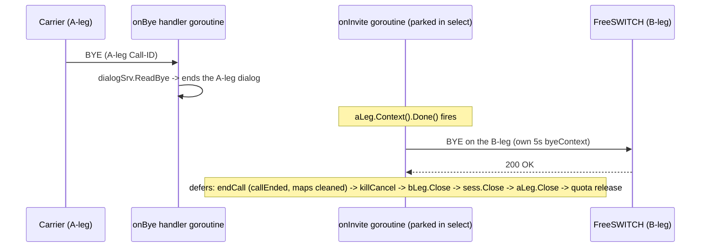

If neither dialog cache knows the Call-ID, `onBye` answers **481**.

---

## 10. State ownership

| Entity | Owner | Created where | Transitions | Invariants | Who may mutate | Cleanup trigger | Concurrency protection |
|---|---|---|---|---|---|---|---|
| **trunk call** (`*trunk.call`) | the `onInvite` goroutine that built it; published into `Server.calls` (by admin ID) and `legs` (per leg, by Call-ID + tags) | `b2bua.go:443-451` | `callDialing → callBridged → callEnded` | every field is written before `registerCall` publishes; only a bridged call is visible to `/api/calls` and `KillCall` | only its own `onInvite` goroutine; `state` only under `callMu` | `defer endCall(c)`, registered immediately after `registerCall` (`b2bua.go:513-514`), so it runs on any return **of a published call**; a call that fails in `placeCall` was never published and unwinds through the `Close`/quota-`release` defers only | `Server.callMu` for the maps and `state`; single-goroutine discipline for the rest |
| **trunk leg** (`aLeg *DialogServerSession`, `bLeg *DialogClientSession`) | same `onInvite` goroutine | `dialogSrv.ReadInvite` / `dialogCli.Invite` | sipgo-internal dialog FSM; contexts cancel on BYE/CANCEL/error | sipgo objects are **single-use**: `ReadInvite` must not be re-entered for the same dialog | `onInvite`, plus the B-leg waiter until the attempt's `relayGate` closes | `defer aLeg.Close()` / `defer bLeg.Close()` | no lock; the `relayGate` fences the waiter, and `bLeg`/`attemptCtx` are passed as goroutine arguments |
| **trunk upstream registration** | `Registrar`; one goroutine per peer | `reconcile` (`register.go:309-372`) | unregistered ⇄ registered, with backoff; terminal `unregister` on cancel | `setRegisteredGen` writes only when the generation still matches, so a superseded goroutine cannot clobber the replacement | its own goroutine; the registrar under `mu` | config publication (peer removed/changed) or `stopAll` at shutdown | `Registrar.mu` (RWMutex) over `state`, `running`, `epoch`; the old goroutine is awaited **outside** the lock |
| **endpoint health / cooldown (trunk)** | `endpointHealth` | `NewServer` | absent ⇄ `until[key]` | lazy expiry, no sweeper; skip-if-alternatives, never a hard block; keyed per `host:port/transport` | `Penalize` (dial failure), `Recover` (bridged success) | only `Recover`; entries are otherwise never removed | `endpointHealth.mu` |
| **edge binding** (`Binding`) | `Location` | `recordBinding` → `Location.Put` | active → refreshed (same token) / expired / removed | expiry always comes from the registrar's **response**; `Source` is the transport source, never the Contact host; ≤ 10 per AoR, ≤ 20000 total | handler goroutines, the WS close hook, the prune ticker | un-REGISTER, `granted <= 0`, WebSocket close, expiry + prune | `Location.mu` (RWMutex) |
| **edge dialog** (`*edge.dialog`) | `dialogTable` | `begin(callID, callerTag, callerPlane)` | `dialogEarly → dialogConfirmed → dialogEnded` (or early → ended) | matched on Call-ID + both tags; per-fork answers while early; **one media session per record**; `confirm` (before the 2xx is relayed) refuses without media; `end` removes exactly this record | any handler goroutine, via the table's methods; the Timer M hook | tag-matched BYE the far end accepted, media watchdog, `endUnlessUp`, `closeAll` | `dialogTable.mu` guards the map **and every mutable field of every dialog**; `confirm`/`end` drop the lock before metrics and `sess.Close()` |
| **edge inviteAttempt** | the dialog's `inFlight` slot | `d.track(...)` per attempt, **before** the INVITE is sent | tracked → `markSent` → overwritten by the next attempt → taken by `cancelSeries` or cleared by `untrack` | holds the request **as forwarded**, the **series** cancel, and `sent`/`cancelled`; a CANCEL finds the record by Call-ID + From tag; `cancelSeries` guarantees exactly one canceller and never lets a CANCEL overtake its INVITE | handler goroutines through `track`/`markSent`/`untrack`; the OnCancel hook and the backstop through `cancelSeries` | `defer d.untrack()` on handler return; `cancelSeries` on CANCEL or backstop | `dialogTable.mu` |
| **edge upstream / PSTN cooldown** | two `cooldownTable`s on `Server` | `edge.New` (always allocated) | absent ⇄ `until[name]` | keyed by **name**, never address; all-cooling falls back to dialling everything | handler goroutines only | `Recover` on any final (upstream) or success (PSTN); lazy expiry otherwise | `cooldownTable.mu` |
| **media Session** | the signalling plane that allocated it (trunk `call`, edge `dialog`) | `PlanePool.Allocate` / `AllocateAcross` | `sessAllocated → sessRunning → sessClosed` | forward-only; `Start` starts the relay at most once; `Close` is idempotent and safe from any goroutine; an unstarted session has **no watchdog** | `SetSRTP`, `SetRemote`, `SetExpectedRemote`, `SetLatchMode`, `Relatch` from the signalling goroutine; `Close` from anywhere | `defer sess.Close()` (trunk), `dialog.end()` (edge), the watchdog, `recoverRelayPanic` | `state atomic.Int32` (CAS/Swap), `srtpIn`/`srtpOut atomic.Pointer`, `lastRx [2]atomic.Int64` (one per sending side), per-latch `mu` |
| **port allocation** | `PlanePool.inUse` | `allocatePair` / `allocateSingle` | reserved → released | RTP even, RTCP = RTP+1; a muxed WebRTC socket still reserves the odd port; a partial `AllocateAcross` releases side A | the pool only | `Session.Close`, `WebRTCSession.Close`, `WebRTCLeg.Close`, the `AllocateAcross` failure path | `PlanePool.mu`, held only to reserve a candidate; binds run outside it |
| **SRTP context** | one direction of one leg of a session | `NewSRTPContext` (SDES) / `newSRTPContextFromKeys` (DTLS) | installed → replaced → dropped (plaintext outcome installs `nil`) | keys are never copied across legs; replay windows 64 (SRTP) / 128 (SRTCP) per context | `Session.SetSRTP`; the leg's `deriveSRTP` sets them exactly once | replaced by a later answer, or dropped with the session | `atomic.Pointer` slots + `SRTPContext.mu` serialising pion's lockless context |
| **WebRTC leg** | `WebRTCSession` (which closes it) | `NewWebRTCLeg` in `allocateWebRTC` | `legAllocated → legEstablishing → legEstablished \| legFailed → legClosed` | forward-only, `legClosed` terminal; first error wins; keys set exactly once — no re-keying, no ICE restart | `setState`/`set` only, under `mu` | `Close` from `WebRTCSession.Close`, the failure path in `Start`, or a fingerprint mismatch | `WebRTCLeg.mu` for agent/mux/demux/contexts/state; `readyOnce`; handles snapshotted under the lock and closed outside it |
| **shield ban entry** | `banList[K]`, two per `Shield`: `bans` (IP) and `socketBans` (UDP IP:port) | `ban(key, dur)` from `CheckFrom`'s scanner branch | absent → banned (extendable) → expired (lazy) → removed | hard cap **65536** per table with an overflow counter; a socket ban lasts at most 1 min | `ban`, `banned` (lazy delete), `prune` | lazy expiry on lookup, the 1-minute prune tick, or process exit | `banList.mu` |
| **rate-limit bucket** | `rateLimiter` (two per `Shield`) | first `allow` for that source | fresh (full) → drained → refilled | capacity equals rate; a fresh bucket starts full; parameters are passed per call so a reload applies immediately | `allow`, `prune` | `prune` drops a bucket once it has been idle for its own refill interval (so it is full); at **65536** buckets the least recently used is evicted; the global bucket is never pruned | `rateLimiter.mu` |
| **config snapshot** | `config.Store` | `config.Load` → `NewStore` / `Replace` | published → superseded | a published `*Config` is **never mutated**; compiled regexps and prefixes are populated before publication | only `Replace` | garbage collection once no goroutine holds a reference | `atomic.Pointer[Config]` for the snapshot; `Store.mu` only for the subscriber slice |

---

## 11. Concurrency model

### 11.1 Ownership rules that hold by discipline, not by type

- **A trunk call's non-`state` fields are written only by its own `onInvite`
  goroutine, and only before `registerCall` publishes it.** The one
  documented exception is `bSRTP`, which `dialTarget` rewrites per failover
  attempt while the call is still unpublished.
- **sipgo dialog objects have no trunk-level lock.** What protects them is
  that only the `onInvite` goroutine touches them, plus two explicit
  mitigations in `dialTarget`: the attempt's `relayGate` makes the waiter
  goroutine's relay and the main flow's abandonment mutually exclusive, so
  the waiter never responds on the A-leg once the main flow has moved on, and
  `bLeg`/`attemptCtx` are passed as goroutine **arguments** rather than
  captured, because the compiler may share the captured cell with
  `dialTarget`'s return slot.
- **The edge topology is immutable after `Run` installs the pinned
  snapshot.** The assignment precedes the creation of every goroutine that
  can read it; that ordering is the happens-before edge that lets it be read
  without a lock for the rest of the process's life.
- **`edge.Server.srv`, `client`, `shield` and `topo` are written in `Run`
  without synchronisation**, safe under the same "no handler runs before
  `ln.Serve`" argument. `trunk.Server.shield` is an `atomic.Pointer` instead,
  because integration tests read it from another goroutine while `Run`
  executes.
- **Single-use sipgo objects**: `DialogServerCache.ReadInvite` (re-entering
  it for a live dialog corrupts the To-tag — which is why the trunk in-dialog
  branch answers on the raw transaction instead), and a `ClientTransaction`,
  which is `Terminate`d after each attempt.
- **`internal/sip` and `internal/sip/sdp` contain no mutexes, atomics,
  channels, goroutines or timers.** They are pure functions over messages
  and bodies.

### 11.2 Mutexes

| Lock | Guards |
|---|---|
| `trunk.Server.callMu` | `calls`, `legs`, every `call.state` write |
| `trunk.endpointHealth.mu` | the cooldown map |
| `trunk.Resolver.mu` | the SRV cache **and** the `rand.Rand` (which is not concurrency-safe) |
| `trunk.callQuota.mu` | the per-peer map and the global counter |
| `trunk.Registrar.mu` (RWMutex) | `state`, `running`, `epoch` |
| `edge.Location.mu` (RWMutex) | `byToken`, `byAOR`, and every binding they point to |
| `edge.dialogTable.mu` | `byCallID` **and every mutable field of every dialog** |
| `edge.cooldownTable.mu` ×2 | the `until` map |
| `edge.privateSources.mu` (RWMutex) | the source map |
| `media.PlanePool.mu` | `inUse` and `cursor`; held to reserve a candidate, never across a bind |
| `media.latch.mu` (×4 per session) | mode, expected, signalled, sigSource, dst, remote, rank, learnedAt |
| `media.SRTPContext.mu` | pion's lockless `*srtp.Context` |
| `media.WebRTCLeg.mu` | agent, mux, demux, SRTP contexts, peer-cert getter, err, state |
| `shield.banList.mu`, two `rateLimiter.mu`, `Shield.rlMu`/`prlMu` | their respective tables and cached rate-limit parses |
| `admin.authLimiter.mu` | the per-source auth-failure window, including reservations |
| `admin.verifiedCreds.mu` | the verified-credential digests |
| `admin.Server.writeMu` | `PUT /api/config`'s If-Match check plus atomic write |
| `config.Store.mu` | the subscriber slice only |

### 11.3 Atomics, channels, CAS

- `media.Session.state` and `WebRTCSession.state` are `atomic.Int32`. One
  `CompareAndSwap` in `Start` makes the relay start exactly once; one `Swap`
  in `Close` makes teardown idempotent. This is the state machine, not a
  `sync.Once` per caller.
- `media.Session.srtpIn/srtpOut` are `atomic.Pointer` arrays because the
  forward loops read them per packet while `SetSRTP` may legitimately store
  again after `Start`.
- `lastRx [2]atomic.Int64` (one per sending side) is the only channel between the relay loops and the
  watchdog.
- `done` channels (`Session`, `WebRTCSession`) are closed exactly once by
  `Close` and are both the watchdog's exit signal and the signalling plane's
  teardown notification.
- `WebRTCLeg.ready` is closed once — by `Start`'s success path or by
  `Close` — and its close is the happens-before edge that makes `err`
  visible. `Err()` blocks on it unconditionally.
- `trunk.Server.tcpConns atomic.Int64` is shared across every TCP and TLS
  listener; `idleTimeoutConn.closed atomic.Bool` prevents a double
  decrement.
- `dialTarget`'s `responded atomic.Bool`, its `relayGate` mutex, and its
  buffer-1 `waited` channel.
- `config.Store.p atomic.Pointer[Config]` — `Current()` is lock-free.
- `edge.Metrics` uses a `sync.Map` of `*atomic.Uint64` for the labelled
  counters and `atomic.Int64` gauges.

Every sipgo response-pump loop in the edge plane contains the same note:
sipgo never closes the response channel, so the `!ok` arm is unreachable; the
loop sets `responses = nil` so a permanently-ready closed channel cannot
spin.

### 11.4 Blocking shape

- **The whole trunk call is a single blocking goroutine.**
  `aLeg.Respond(200, …)` blocks until the ACK arrives, and `onInvite` then
  parks in a four-way `select` for the call's entire duration. A stuck peer
  therefore holds one sipgo handler goroutine, four UDP sockets and a quota
  slot for as long as the media watchdog allows.
- **The B-leg waiter may outlive its attempt** by up to sipgo Timer_B
  (~32 s) on a fully silent target; it carries its own `recoverBWaiter` panic
  umbrella precisely because it can outlive `onInvite`.
- **Edge handlers do not block for the call's duration.** Each INVITE
  handler returns once a final response is relayed; the dialog and its media
  are then owned by the table and reclaimed by the per-dialog media watcher
  goroutine, `teardown`, or `closeAll`.

### 11.5 Panic containment

| Umbrella | Scope |
|---|---|
| `trunk.withShield` | every registered trunk handler; logs and answers 500 |
| `trunk.recoverCall` | the whole INVITE path (the inner umbrella wins, so the outer never sees INVITE panics); answers 500 if no final went out and BYEs any answered leg |
| `trunk.recoverBWaiter` | the orphan B-leg waiter goroutine |
| `edge.guard` | every registered edge handler; logs, counts, and answers 500 unless a final already went out |
| `media.recoverRelayPanic` | every relay goroutine; closes **that session only** |
| `admin.recoverMW` | every HTTP handler; logs the panic with its stack, answers 500 with no stack in the body, and re-panics `http.ErrAbortHandler` per the stdlib convention |
| `config.unmarshalStrict` | the go-yaml decoder inside `Parse`; a decoder panic becomes a parse error |
| `config.loadNoPanic` | each hot reload in `Watch`; a panic is a failed reload and the previous snapshot stays |

---

## 12. Networking and deployment topology

### 12.1 Bind vs advertised addresses

The two are independent everywhere.

**Trunk plane.** Signalling binds `listen.sip` entries (or the single
`sip.bind_ip:sip.bind_port` listener, which replaces the list). Media binds
`rtp.bind_ip` (unset = every interface) over the configured port range. An
unparseable `bind_ip` (unreachable after validation) is an error from
`fsip.ParseBindIP`, never every interface: the media pool then allocates
nothing (503). Advertised addresses are resolved **per call**
(`advertisedIP(cfg, preferred)`), in this order:

1. the `preferred` literal (`sip.advertised_ip` for signalling,
   `rtp.advertised_ip` for media),
2. `listen.media.public_ip` when it is not `"auto"`,
3. the first non-unspecified `listen.sip` host,
4. **`127.0.0.1`, with a one-time process warning.**

`listen.media.public_ip: "auto"` is accepted by validation but **never
discovered** — there is no STUN client. Because the advertised address is
re-resolved per INVITE, a hot-reloaded value takes effect on the next call —
except for the dialog caches' default Contact, which is frozen at `Run` from
`listeners[0]`. In practice every 200 OK and every B-leg INVITE appends its
own Contact, so that default surfaces only where none is appended.

**Edge plane.** Advertised addresses come from the topology snapshot:
`network.public.advertised_ip`, `network.private.advertised_ip` (overridden
for private **signalling** by `sip.private.advertised_ip`,
`proxy.go:306-311`), and the two RTP planes' advertised IPs. A wildcard bind
makes the corresponding `advertised_ip` mandatory. **Public** listeners
advertise the port they bind — there is deliberately no port-translation field
on the public side. The private side has one: `sip.private.advertised_port`
(`proxy.go:342-347`) overrides the private bind port in Via, Contact and
Record-Route (`topology.go:325`), defaulting to the bind port.

### 12.2 NAT assumptions

- **Media**: symmetric RTP with first-packet latching. The SDP address seeds
  a provisional destination so media flows immediately; the first accepted
  packet's real source address and port then fix the destination. In strict
  mode the source IP must match the signalled one but the **port may
  differ**, which is exactly the NAT port-rewrite case. The public edge leg
  is `loose` because a phone behind a hard NAT cannot be trusted to signal
  the source its RTP comes from; a source that neither SDP nor the phone's
  SIP source IP vouches for is only a fallback that the phone's own first
  packet displaces (§8.4).
- **Signalling**: the edge plane adds `received=` when the top Via's host
  differs from the real source, and fills `rport=` **only when the client
  asked for it**. All responses are sent to the request's transport source
  (RFC 3581), which is what keeps a NAT pinhole usable. `rport` is requested
  on our own Via on UDP only.
- **Bindings** record the transport source address of the REGISTER — the far
  side of the client's NAT pinhole for UDP, and the pooled connection key for
  WS/WSS.
- **No TURN and no full ICE.** The WebRTC leg is ICE-lite with a single host
  candidate, so FreeSBC must have a publicly reachable media address.

### 12.3 Firewall and port-range assumptions

- The configured RTP ranges must be reachable end to end; only range sanity
  is validated (`≥ 1024`, `min < max`, ranges pairwise disjoint where their
  binds can collide). Nothing checks reachability.
- Sizing is 2 ports per call per plane; `freesbc_media_ports_in_use` and
  `_total` expose the trunk pool's occupancy, and nothing sizes a pool for
  you.
- SIP over UDP is sent above the RFC 3261 §18.1.1 guidance: the process-wide
  `sip.UDPMTUSize` is raised to **8 KiB**, relying on IP fragmentation to
  survive the path. A realistic FreeSWITCH INVITE plus proxy headers clears
  1300 bytes, and the RFC's remedy — switch to TCP — is unavailable when both
  ends are UDP.

### 12.4 No kernel firewall integration

FreeSBC manages no kernel firewall state. The nftables backend (the
`inet freesbc` table, `shield.nftables`, and the CAP_NET_ADMIN it needed)
was removed with P2-SHD-004: it hung off the trunk shield, whose ban branch
is unreachable because the trunk read filter admits only configured peers
and peers are exempt from bans. Every ban lives in the shield's in-memory
table (§14.1). A deployment that wants kernel-level drops puts its own
firewall in front of FreeSBC.

### 12.5 TLS

| Surface | Certificate | Minimum version | Client auth |
|---|---|---|---|
| Trunk `tls://` listener | `listen.tls_cert`/`tls_key`, else a **self-signed certificate generated at startup with a CN of "FreeSBC self-signed" and no SANs at all**, plus a WARN | TLS 1.2 | `RequireAndVerifyClientCert` when `listen.tls_client_ca` is set (mTLS) |
| Trunk outbound (per peer) | **one UA-wide `tls.Config`** (sipgo v1.4.3 accepts only one) whose callbacks select per peer (§6.14): the chain is verified against the matched peer's `tls_ca` alone, or the system roots when it has none; `GetClientCertificate` presents only that peer's `tls_client_cert` | TLS 1.2 | our client certificate when the peer asks and has one configured |
| Edge `wss` listener | `sip.public.wss.cert_file`/`key_file`, else a self-signed certificate for `127.0.0.1`/`localhost` plus a WARN that browsers will refuse it | TLS 1.2 | — |
| Admin HTTPS | `admin.tls_cert`/`tls_key` | TLS 1.2 | — |
| WebRTC DTLS | `webrtc.dtls_cert_file`/`dtls_key_file`, else one per-process self-signed ECDSA P-256 certificate (CN "FreeSBC", 1-year validity) | — | `RequireAnyClientCert`, so there is always something to fingerprint |

Self-signed generation (`fsip.SelfSignedTLS`) mints a fresh ECDSA P-256 key
per call, valid from now−1h to now+365d, `ExtKeyUsage: ServerAuth` only. It
exists so that a missing certificate file degrades to a listener that binds
and logs loudly rather than taking the process down; it is **not a usable
deployment posture** — nothing will trust it, and a browser cannot click
through a certificate warning on a script-opened WebSocket. The trunk
listener's variant has **no SAN list**, so any client performing hostname or
IP verification rejects it.

**No certificate is hot-rotated.** Every TLS config is built once at startup.

### 12.6 What the code enforces vs what deployment must guarantee

| Assumption | Status |
|---|---|
| Public-facing trunk listeners are `tcp://`/`tls://`, or public UDP is fronted by an upstream ACL plus strict-mode uRPF | **Assumed.** The read filter narrows the surface, but a forged source inside `allowed_ips` is by definition a legitimate peer |
| Each peer's `allowed_ips` is narrowed to its real prefixes | **Partly enforced**: non-empty, canonicalised, no wider than IPv4 /8 or IPv6 /32. `0.0.0.0/0` is rejected; a /8 is not |
| `admin.listen` binds loopback | **Enforced**, opt out with `admin.allow_remote: true` |
| Remote admin is fronted by TLS | **Warned, not enforced** |
| The process runs non-root with CAP_NET_BIND_SERVICE | **Not enforced, no unit file shipped** |
| Config file mode 0600 | **Not enforced**; the admin write-back preserves the existing file's mode |
| A single routable media address (no TURN) | **Assumed**; the fallback is the first specific `listen.sip` host, else 127.0.0.1 + WARN |
| Advertised addresses are routable from their own side | **Enforced when the bind is a wildcard** |
| Media pools do not overlap | **Enforced** across `rtp.public`, `rtp.private` and the trunk range |
| Upstreams are UDP FreeSWITCHes at literal IPs | **Enforced** by validation (`check` and `run`) and again at topology build |
| Upstream pool members share one FreeSWITCH registration database | **Assumed.** After a failover the new node re-challenges and the phone's answer is valid there too — one extra round trip, not a broken registration. The pool is modulo-hashed, so changing the node set reshuffles users; with a shared database that is a re-registration, not an outage |
| PSTN gateways are literal IPs, UDP only, never registered and never probed | **Enforced** by validation and at topology build **/ by design**; the only traffic a gateway sees is the call it is answering |
| RTP/RTCP ranges reachable end to end | **Assumed** |
| IP fragmentation survives the path | **Assumed** |
| Edge ws/wss listeners are resource-capped | **Not enforced** — the connection cap and idle timeout exist only on the trunk plane |
| Changing `admin.listen`, any TLS certificate, or the listener set needs a restart | **Assumed**; only an `admin.listen` change is logged |

---

## 13. Observability

### 13.1 Prometheus metrics

All metrics live on a **private** registry built lazily on the first
`/metrics` scrape (`sync.Once`), containing the Go collector plus one
`collector` that samples `admin.Deps` on every scrape — no duplicated state.
`Describe` advertises all 23 descriptors regardless of which planes are
running; the whole proxy block is skipped at `Collect` time when the edge
plane is absent.

Labels are deliberately bounded sets: "a Call-ID label here would create a
permanent series per call."

| Metric | Type | Labels | Fed by |
|---|---|---|---|
| `freesbc_active_calls` | Gauge | — | trunk `ActiveCalls()` + edge `ActiveCalls()` |
| `freesbc_media_ports_in_use` | Gauge | — | the **trunk** pool's `Stats()` |
| `freesbc_media_ports_total` | Gauge | — | the **trunk** pool's `Stats()` |
| `freesbc_peer_registered` | Gauge | `peer` | trunk `IsRegistered`, only for `register: true` peers |
| `freesbc_shield_drops_total` | Counter | `reason` ∈ {`banned`, `scanner`, `rate`} | trunk shield drop counters |
| `freesbc_build_info` | Gauge (always 1) | `version` | `Deps.Version` |
| `freesbc_active_registrations` | Gauge | — | edge `Location.Count()` |
| `freesbc_active_sip_dialogs` | Gauge | — | edge confirmed dialogs |
| `freesbc_active_media_sessions` | Gauge | — | edge |
| `freesbc_active_webrtc_sessions` | Gauge | — | edge |
| `freesbc_registration_total` | Counter | — | edge `recordBinding` success |
| `freesbc_registration_failure_total` | Counter | — | edge: series exhaustion, a rejected registration, and a full binding table |
| `freesbc_sip_requests_total` | Counter | `method`, `transport` | edge `guard`, for **every** guarded request |
| `freesbc_sip_responses_total` | Counter | `class` (`1xx`…`6xx`) | edge `respond` and `relayResponse` |
| `freesbc_rtp_packets_rx_total` / `_tx_total` | Counter | — | edge, folded in at `dialog.end()` |
| `freesbc_rtp_bytes_rx_total` / `_tx_total` | Counter | — | edge, folded in at `dialog.end()` |
| `freesbc_media_port_allocation_failure_total` | Counter | — | edge `rejectMedia` on `ErrPortsExhausted` |
| `freesbc_webrtc_ice_failure_total` | Counter | — | edge, classified by `errors.Is` against `ErrICEFailed`/`ErrWebRTCNotReady` and unclassified errors |
| `freesbc_webrtc_dtls_failure_total` | Counter | — | edge, `ErrDTLSHandshake` and `ErrFingerprintMismatch` |
| `freesbc_sip_handler_panics_total` | Counter | — | edge `guard`, one per recovered handler panic |

Because the trunk read filter admits only configured peers, the trunk
shield's `Check` only ever takes the peer-rate-limit branch
(`shield.go:97-105`), so in a deployed system `freesbc_shield_drops_total`
reports only `reason="rate"`. The ban and scanner branches run on the
**edge** shield (`edge.go:564`), which `internal/app` never wires into
`admin.Deps` (`Deps.Shield` is set only when the trunk server exists), so
edge bans and drops do not reach `/metrics`. The ban gauges
(`freesbc_shield_banned_current`, `freesbc_shield_ban_adds_rejected_total`)
and the unban endpoint `DELETE /api/bans/{ip}` were removed for that reason:
wired to the trunk shield, which never bans, they could only ever report
nothing.

The **trunk plane emits no metrics of its own**; it exposes accessors
(`ActiveCalls`, `Calls`, `ShieldStats`, `IsRegistered`, `KillCall`)
which `internal/app` wires into `admin.Deps`. There is no trunk
port-exhaustion metric and no config-reload metric.

### 13.2 Log levels

| Level | Examples |
|---|---|
| `Error` | SIP handler panic (+ stack); failures to respond (OPTIONS, 481 BYE, 405, session-timer refresh); B-leg INVITE/ACK/respond failures; early-media SDP failures; B-leg waiter panic; teardown ACK/BYE failures; `"bridge call panic; call dropped"`; edge `"proxy handler panic"`; edge `"registration binding rejected"`; media relay panic; `"admin handler panic"` (+ stack) |
| `Warn` | `"TLS listener using self-signed certificate"`; the one-shot `"no advertised address configured"` fallback; `"SDES key negotiated over non-TLS signaling transport"` (once per secure leg); `"register failed"`; edge upstream/PSTN failover warnings; `"webrtc leg failed"`; the fingerprint-mismatch teardown; `"config written via admin API"`; the plaintext-admin startup warning; `shield banned scanner` |
| `Info` | `"sip server listening"`, `"edge proxy listening"`, `"freesbc started"`, `"shutting down"`, `"media plane ready"`, `"config reloaded"`; `"registered"` with granted and refresh interval; `"rejected invite"` with code/reason/source; `"declined Require: 100rel"`; `"rejected low Session-Expires"`; `"b-leg not answered"`; edge `"proxying INVITE upstream"` / `"proxying INVITE to client"` / `"dialing pstn gateway"`; `"registration accepted"` / `"removed"` / `"rejected"`; `"webrtc media established"`; `"call ended"` with media stats |
| `Debug` | dialog ACK/BYE bookkeeping; `"method not implemented"`; `"skipping unregistered target"`; `"b-leg auth challenge unsatisfied"`; `"tcp connection limit reached"`; `"un-register failed"`; `"registration challenged"`; dropped unroutable responses; `"in-dialog request without a dialog record; hashing upstream"`; shield rate-limit drops |

sipgo's transport, transaction and server layers log through the same logger
with `caller=sipgo`. Credentials, digest nonces, ICE passwords and DTLS
fingerprints are never logged.

The default process log level is `Info` and there is no flag to change it.

### 13.3 Admin HTTP API

All routes are on one `http.ServeMux` behind `recoverMW`, which also sets
`Cache-Control: no-store` on **every** response except `/healthz`.

| Pattern | Methods | Auth | Response |
|---|---|---|---|
| `/healthz` | any | **none** | `{"status":"ok"}` |
| `/metrics` | any | Basic | Prometheus text |
| `/api/status` | any | Basic | `{"version","uptime_seconds","active_calls","ports":{"in_use","total"},"listeners":[…]}` |
| `/api/calls` | any | Basic | array of `{"id" (admin call ID),"call_id" (A-leg Call-ID),"from","to","started" (RFC 3339),"duration_seconds"}`; always an array |
| `DELETE /api/calls/{id}` | DELETE | Basic | `id` is the admin call ID, or an A-leg Call-ID (kills every call carrying it); **204** killed / **404** `no such active call` |
| `/api/peers` | any | Basic | array of `{Name,Address,Transport,SRTP,Register,Registered}` — Go field names, no JSON tags |
| `/api/config` | GET, PUT (else 405 + `Allow: GET, PUT`) | Basic | GET: the **redacted** view; PUT: write-back |
| `/api/config/raw` | GET (else 405 + `Allow: GET`) | Basic | the on-disk file **verbatim and unredacted**, `application/x-yaml`, with an `ETag` = quoted SHA-256 hex |
| `/` | any | Basic | the embedded single-file WebUI (catch-all; the explicit patterns win) |

`GET /api/config` is a **whitelist** (`redact.go:18-35`): `peers` (address,
transport, srtp, register, and, only when the peer has an `auth:` block,
`auth: {username}` plus `password: "***"` when a password is actually set —
`peers.<n>.auth.realm` is never exposed at all), `admin` (`listen`,
`auth: {username}` plus `password_hash: "***"` only when the hash is
non-empty), and `routes` as-is.
Everything else — listeners, shield, sip, rtp, network, webrtc, timers — is
**absent**, not redacted. `GET /api/config/raw` is deliberately unredacted
because it is the round-trip source for the editor; redaction would break the
write-back.

`PUT /api/config`, in order: read at most **1 MiB** + 1 (413 above that);
`config.Parse(body)` on a throwaway config (400 on failure, with the
validation text, in which expanded `${ENV}` values are redacted — §5); then,
under `Server.writeMu`, the optional `If-Match` check (re-read the file,
**409** on a mismatch) and `writeFileAtomic`. The check and the write are
one critical section, so of several writers holding the same ETag exactly
one succeeds and the rest get 409 (audit P2-ADM-004); a PUT without
`If-Match` is last-writer-wins. `writeFileAtomic` first resolves the path
with `filepath.EvalSymlinks`, so a symlinked config is written at its target
and the link survives (a dangling link is refused), then: `CreateTemp` in
the **target's directory**, write, `Sync`, `Close`, `Chmod` (0600, or the
existing file's mode when it exists), `Rename`, and an `fsync` of the
directory so the rename is durable (audit P2-ADM-005). A failed directory
sync is logged as a warning; the new file is already in place. Every other
failure path removes the temp file and leaves the original untouched. The
submitted bytes are written **verbatim**, which is why comments and `${ENV}`
references survive; there is no AST patching. A 200 carries the new body's
ETag.

The write-back does **not** call `Store.Replace`. Reload happens only because
`config.Watch` sees the rename in the parent directory, debounces 200 ms, and
re-`Load`s.

### 13.4 Authentication and its limiter

`requireAuth` runs per request:

1. A request with **no (parseable) Basic `Authorization` header** gets
   `WWW-Authenticate: Basic realm="freesbc"` and **401 — without running
   bcrypt and without counting a failure**: it guesses nothing, and a
   browser's first request to the dashboard always looks like this.
2. Credentials come from `store.Current().Admin.Auth` per request, falling
   back to the construction-time credentials when the reloaded config has no
   `admin:` section.
3. If the credentials match a **previously verified** entry
   (`verifiedCreds`), the request is served with no bcrypt and no limiter
   check. Entries are HMAC-SHA256 digests (per-process random key) over the
   configured username and hash plus the presented username and password,
   so a reload that changes either invalidates them all at once; at most
   **16** are kept, each for **1 h** after its last use. This is what keeps
   an operator or the Prometheus scrape working when a shared source
   address (loopback, a reverse proxy) is locked out by someone else's
   failures, and it saves a KDF per scrape. Only an exact header that
   already passed bcrypt matches, so it gives a guesser nothing.
4. `remoteIP(r)` from `RemoteAddr` — **`X-Forwarded-For` is never
   consulted** — then `limiter.reserve`: under the limiter's lock, if the
   source is over budget → **429** `too many failed attempts` with no
   credential check; otherwise one failure is counted **in advance**. The
   check and the count are one critical section, so concurrent requests can
   never take more than the remaining budget (audit P2-ADM-002).
5. `subtle.ConstantTimeCompare` on the username **and**
   `bcrypt.CompareHashAndPassword` on the password are **both** evaluated
   before deciding. On failure the reserved count stays and the answer is a
   generic 401; on success the reservation is refunded and the credentials
   are remembered (step 3).

Limiter constants: **10** failures per **1 minute** per source, tracking at
most **4096** sources. A source is an IPv4 address (IPv4-mapped addresses
are unmapped) or an IPv6 **/64**, so one host cannot mint fresh budgets from
its own prefix. Expired windows are swept when a new window starts; when the
table is still full, the entry with the **fewest failures** (oldest on a tie)
is evicted, so a flood of fresh sources cannot reset an exhausted
attacker's budget (audit P2-ADM-003). A client whose credentials were never
verified still gets 429 while its source is over budget.

`http.Server` timeouts: `ReadHeaderTimeout` 5 s, `ReadTimeout` 30 s,
`WriteTimeout` 30 s, `IdleTimeout` 30 s. Shutdown gets a 5 s drain.

### 13.5 WebUI

One `//go:embed`ed `index.html`, served behind the same Basic auth as
everything else. Two tabs: a **Dashboard** polling `/api/status`,
`/api/calls` and `/api/peers` every 5 s (a 401 shows a persistent "session
expired" banner), and a **Config** editor that loads `/api/config/raw`,
keeps its ETag, and PUTs to `/api/config` with `If-Match`.

Because the call table, kick and shield accessors are **trunk-only**,
a proxy-only deployment shows an empty call list, a no-op kick, zeroed
shield drop counters, and the trunk pool's (unused, defaulted)
port capacity. This gap is recorded in `internal/app/app.go:146-150`.

---

## 14. Security model

### 14.1 Implemented protections

**Pre-parse read filters.** Both planes install a transport-layer filter that
runs before the SIP parser, the transaction layer, the connection pool and
any log. The trunk's filter accepts only bytes whose source IP matches a
configured peer's `allowed_ips` (no size cap). The edge's filter enforces a
**24 KiB** size cap on every read (`fsip.MaxReadSize`, below sipgo's 32 KiB
read buffer so it can fire); for reads arriving on the private bind it
requires an upstream source IP, and for public reads it drops a source the
edge shield has banned — its IP, or on UDP its exact socket
(`Shield.BannedFrom`) — so a ban stays silent even for what sipgo would
answer before any handler. Neither filter ever returns an error,
because sipgo treats a filter error as fatal to the whole read loop.

**Peer allowlist (trunk).** Identification is the transport source IP and
nothing else, matched against canonicalised prefixes that validation requires
to be non-empty and no wider than IPv4 /8 or IPv6 /32.

**TCP/TLS connection limits (trunk).** A shared cap of 1024 concurrent
connections across all stream listeners and a 120 s idle read deadline per
connection. A connection from a non-peer is closed at accept and never
counted, so non-peers cannot exhaust the cap (P2-TRK-001).

**Shield.** Every request that is not from the edge's private plane runs
through `Check` (trunk) or `CheckFrom` (edge, which also knows the source
port):

1. On the **trunk** shield only, a **configured peer** skips the ban table
   and the scanner check entirely but is still subject to the looser
   `shield.peer_rate_limit` (default `200/s per_ip`). The edge shield
   (`NewNoKernel`) exempts nobody: a source inside a trunk peer's
   `allowed_ips` is an ordinary public client there (P2-SHD-005).
2. A banned source is dropped.
3. `shield.rate_limit` (default `20/s per_ip`) — a token bucket whose
   capacity equals the rate, per source: an IPv4 address (4in6 unmapped)
   or an IPv6 /64. The buckets are an LRU capped at 65536 (P2-SHD-002).
4. A **scanner User-Agent** is dropped — but only after the rate limiter
   has had its say, because the User-Agent is a client-controlled "ban me"
   signal that must not be allowed to skip the limiter. What else happens
   depends on the transport (P2-SHD-001):
   - **tcp, tls, ws, wss**: the source IP is banned for
     `shield.auto_ban.duration`. A handshake proved the source address.
   - **udp**: only the exact source socket (IP:port) is banned, in a
     separate table, for at most **1 minute** (`socketBanMax`). One forged
     datagram therefore cannot lock out a victim's IP, and a forged flood
     that fills the socket table cannot stop real scanners' IPs from being
     banned.
   - **unknown transport, or `Check` without a port**: drop only.

Signatures are 11 exact substrings (`friendly-scanner`, `sipvicious`,
`sipcli`, `sip-scan`, `sundayddr`, `vaxsipuseragent`, `sipsak`, `iwar`,
`sivus`, `smap`, `pplsip`), matched case-insensitively — deliberately
specific, with no bare "scanner" substring that could match a legitimate
product. **Scanner heuristics are User-Agent only.**

**Bans.** A scanner ban lasts `shield.auto_ban.duration` (default 1 h) and
lives only in the shield's in-memory table, which is capped at **65536**
entries with an overflow counter. A re-ban extends an existing ban to the
later of the two expiries and never shortens it (P2-SHD-008). Ban keys are
unmapped IPs, and every lookup unmaps its argument, so `::ffff:192.0.2.1`
is seen as `192.0.2.1` (P2-SHD-009). On
the edge a ban also closes the banned source's tcp/tls/ws/wss connection:
`guard` closes the one the banning request came on, and the read filter
closes any other on its next read (`closeStream`, P2-SHD-006). An idle
connection opened before the ban stays open until it next sends. There is no failure-count auto-ban and no
kernel enforcement: both were removed with P2-SHD-004 (the counter was fed
only by the trunk's unidentified-source handler, which the pre-parse read
filter makes unreachable, `readfilter.go:24-45`). The ban and scanner
branches of `Check` are therefore reachable only through the **edge**
shield, whose bans are not exported to `/metrics`, and no API lifts a ban.

**Every denial is a silent drop.** A scanner never gets confirmation that the
SBC exists. That is why `onNoRoute` is overridden at all: known peers get
405, unknown sources get silence.

**Message and body limits.** Edge reads are capped at 24 KiB; edge SDP is
capped at 16 KiB with at most 16 media sections, 256 attributes per level and
128 payload types; REGISTER AoR user parts are capped at 128 characters and
hosts at 255, with a character allowlist that excludes CR/LF; `fsbc` tokens
are capped at 64 characters; ICE tokens are sanitised to the ice-char set.

**Admin.** One bcrypt Basic-Auth realm over the WebUI, `/metrics` and every
`/api/*` route, with `/healthz` the only unauthenticated route. bcrypt cost
≥ 10 is enforced at config load. A missing `Authorization` header is refused
before any bcrypt work and not counted as a failure. Failure limiting is
10/minute per IPv4 address or IPv6 /64, reserved before bcrypt so
concurrency cannot exceed it; credentials already verified keep working
while their source is locked out (§13.4). A non-loopback
`admin.listen` is a **hard validation error** unless `admin.allow_remote:
true`, and binding remote without TLS logs a prominent startup warning.
`Cache-Control: no-store` on every response but `/healthz`.

**Transport security.** TLS 1.2 minimum on every TLS surface; optional mTLS
on the trunk listener via `listen.tls_client_ca`; outbound trunk TLS trusts
and identifies per peer, never across peers: each peer is anchored by its
own `tls_ca` (or the system roots) and receives only its own client
certificate, and a handshake that matches no peer, or several, fails (§6.14);
digest **realm pinning** on
both outbound INVITEs and outbound REGISTERs, which aborts before any
`Authorization` header is ever sent unless the challenge names the pinned
realm under both RFC parsing and sipgo's own digest parser (§6.9).

**Media.** SRTP/SRTCP replay protection is explicitly enabled (windows
64/128) — a replayed or tampered packet fails unprotect and is dropped, and
the call stays up. Latching is fail-closed in strict mode until the
signalling plane arms it; after acceptance only a source signalling vouches
for better (the exact SDP address, then the SDP or SIP source IP) or an
authorised `Relatch` moves a latch, so a first-packet intruder on a loose leg
is displaced by the endpoint's first packet (§8.4). The RTP-silence watchdog refreshes its liveness
timestamp **only after** a packet is proven genuine. The WebRTC leg verifies
the peer certificate against the signalled `a=fingerprint` **inside the DTLS
handshake** (`VerifyPeerCertificate`), so a mismatched peer never reaches
`legEstablished`, gets no SRTP keys and has no media relayed; the relay
additionally refuses to carry media for any leg whose fingerprint has not
been verified. The session is torn down on mismatch, logging neither
fingerprint. The RFC 7983
demultiplexer drops everything that is not DTLS or SRTP, so a single hostile
datagram cannot tear down a live media path. Keys are never copied across
legs.

**Topology hiding.** On the edge plane it is structural: every SDP body is
constructed, never derived, so FreeSWITCH is never given a public endpoint's
address and a public client is never given FreeSWITCH's. Declined sections
are emitted with no attributes and no connection line. On the trunk plane the
B2BUA mints its own Call-ID, From-tag, Via and Contact per leg, strips every
inbound `a=crypto`, and clears all attributes on declined sections.

**Credential handling.** The edge plane proxies REGISTER and its digest
challenge verbatim and never holds a credential; `logRegister` never logs an
Authorization header, a nonce or a password. `${ENV}` references in the
config are expanded only in memory and never written back. Parse errors
cannot echo a secret because expansion runs after the unmarshal, and
validation errors are redacted back to the `${ENV}` text (§5), so neither
`freesbc check` nor the admin `PUT /api/config` response can be used to
read an environment variable.

### 14.2 Deployment assumptions (not enforced by the code)

- **Peer identity is source IP, with no SIP challenge.** Over UDP a forged
  source inside `allowed_ips` inherits that peer's trust in full: outbound
  routing (toll fraud) and exemption from the ban and scanner planes. The
  supported internet-facing postures are therefore to expose only `tcp://`
  and `tls://` listeners, **or** to put an upstream ACL plus strict-mode
  uRPF (RFC 3704) in front of public UDP. The code enforces neither.
- **Two peers behind one NAT address are indistinguishable**, and the
  lexicographically first peer name wins the tie.
- **The private plane is trusted.** FreeSWITCH is exempt from the shield
  entirely, and requests arriving on the private listener are not rate
  limited. That plane must not be reachable from anywhere else.
- **FreeSWITCH is trusted** for all call logic, the registration database,
  and the preservation of the `fsbc=` Contact parameter into inbound
  Request-URIs. The opt-in interop test exists precisely to assert that
  sofia does preserve it.
- **`GET /api/config/raw` exposes every SIP credential in plaintext to an
  authenticated caller**, deliberately. The mitigation is `${ENV}`
  references, authentication, and a private bind (or admin TLS).
- **The config file is the single source of truth**: a local user who can
  write it controls the SBC. Its permissions are not checked, and the admin
  write-back inherits the existing file's mode.
- The media plane has **no application-layer rate limiting**; its security is
  latch semantics plus SRTP authentication.
- The edge plane's ws/wss listeners have **no connection cap and no idle
  timeout**.
- There is **no operator unban**: a ban lapses only on expiry
  (`auto_ban.duration`, or 1 min for a UDP socket ban) or with a restart.
  Edge-shield bans and drops are not visible in `/metrics`.
- Strict-mode latch arming compares the **source IP only**; there is no SSRC
  or payload-type validation.
- There is **no DNS trust hardening**: no DNSSEC, no pinning.

---

## 15. Failure handling, cleanup and state convergence

### 15.1 Cleanup triggers per entity

| Entity | Cleanup trigger(s) | Bound |
|---|---|---|
| Trunk call + both legs + media session + quota slot | any `onInvite` return: caller BYE/CANCEL, carrier BYE, media silence, `KillCall`, or a failed setup | the call's own duration; the backstop is `rtp_timeout` (default 5 min) |
| Trunk B-leg waiter goroutine | `WaitAnswer` returns | sipgo Timer_B, ~32 s |
| Trunk media ports | `defer sess.Close()`, or the watchdog's own `Close` | as above |
| Trunk registration | peer removed/changed by reload, or shutdown | un-REGISTER bounded at ~2 s per attempt |
| Endpoint cooldown | `Recover` on a bridged success; otherwise entries expire logically but are never deleted | `peer_cooldown` (default 30 s) |
| SRV cache entry | expires logically; never deleted | `srv_cache_ttl`, or `min(ttl, 10 s)` for a negative result |
| Edge dialog + media session + ports | a tag-matched BYE the far end accepted, media watchdog (then BYE to both ends), `endUnlessUp` on a failed INVITE, `closeAll` at shutdown | early dialogs bounded by `inviteTimeout` (5 min, then CANCEL + 408); confirmed ones by `rtp_timeout` |
| Edge in-flight attempt | `untrack` on handler return, or `cancelSeries` on CANCEL / backstop | the series context |
| Edge binding | un-REGISTER, `granted <= 0`, WebSocket close, expiry + the 30 s prune ticker | the registrar's granted lifetime |
| Edge upstream/PSTN cooldown | `Recover`, or lazy expiry | the configured cooldown (default 30 s) |
| WebRTC leg | `WebRTCSession.Close`, establishment failure, fingerprint mismatch | the establishment deadline (30 s default) |
| Shield ban | lazy expiry on lookup, the 1-minute prune tick, process exit | `auto_ban.duration` (default 1 h); a UDP socket ban at most 1 min |
| Rate-limit bucket | prune of buckets idle for their own refill interval; LRU eviction at 65536 buckets | the bucket's interval (1 s for `N/s`, 1 h for `N/h`) |
| `privateSources` entry | 10-minute TTL, pruned on insert pressure | — |

### 15.2 Timeouts, in one place

| Timeout | Value | Scope |
|---|---|---|
| `ring_timeout` | 60 s (config) | one trunk dial attempt |
| grace after the ring deadline | 250 ms | abandoning a trunk attempt |
| `byeContext` | 5 s | every trunk teardown BYE and `ackThenBye` ACK |
| trunk session refresh | every ½ interval (¼ after a rejected refresh) | a leg whose session timer names the SBC as refresher |
| trunk refresh re-INVITE | 64·T1 (32 s) | one refresh the SBC sends |
| trunk refresh 200 retransmission | T1 doubling to T2, for up to 64·T1 | a locally answered refresh, until its ACK |
| forked-2xx watch | 64·T1 after the attempt settles | ACK+BYE of losing forks |
| un-REGISTER | 2 s | per attempt, on its own root context |
| registrar backoff | 5 s → ×2 → 60 s | failed registration retry |
| registrar refresh | 0.9 × granted, floored at 10 s | successful registration |
| SRV lookup | 3 s | one DNS query |
| negative SRV cache | `min(srv_cache_ttl, 10 s)` | failed/empty lookup |
| trunk TCP idle | 120 s | per stream connection read |
| `registerTimeout` | 32 s | one whole edge REGISTER series |
| `inviteTimeout` | 5 min | one whole edge call (all three paths and re-INVITE) |
| `sip.pstn.attempt_timeout` | 32 s (config) | one PSTN gateway attempt |
| `pstnDrain` | 300 ms | post-CANCEL drain window |
| edge CANCEL / `ackThenBye` BYE | 5 s each | one transaction |
| edge in-dialog (BYE/INFO) | 32 s | `forwardAndRelay` |
| `listen.media.rtp_timeout` | 5 min (config) | media silence, both planes |
| WebRTC establishment | 30 s | ICE **and** DTLS together |
| config reload debounce | 200 ms | fsnotify coalescing |
| admin read-header / read / write / idle | 5 / 30 / 30 / 30 s | HTTP |
| admin shutdown drain | 5 s | in-flight HTTP requests |

### 15.3 Component fatal errors

A fatal error from the trunk server, the edge server or the admin server
cancels the errgroup context; every other member then suppresses its own
error, so `app.Run` returns exactly the first error and the process exits 1.
The config watcher is **never** fatal — it logs and returns nil, which means
a dead fsnotify watcher silently disables reload for the rest of the process
and there is no metric or API signal for it.

A panic in a SIP handler, in the trunk B-leg waiter, in a media relay
goroutine or in an admin HTTP handler is contained by the umbrellas in §11.5;
the process survives. A media relay panic kills exactly one session.

### 15.4 Specific convergence cases

**Media silence.** The watchdog closes the session, which closes `Done`. On
the trunk plane `onInvite`'s select sends BYEs on both legs and unwinds its
defers; on the edge plane the per-dialog watcher calls `dialog.end()`, which
closes the media session, releases both port pairs, folds the stats into the
process counters and logs `"call ended"`, and then sends a BYE to each
endpoint on behalf of the other.

**Transaction timeouts.** A trunk attempt that never answers ends at
`ring_timeout` + 250 ms and fails over; a fully silent target's abandoned
CANCEL is bounded by sipgo Timer_B. An edge PSTN attempt ends at its budget
and is explicitly CANCELled and drained. An edge in-dialog request that never
answers ends at 32 s, and for BYE that failure is converted into a **200** to
the requester plus one stateless re-send.

**`KillCall` vs a natural end.** Both go through `callMu`. `KillCall` looks
the call up under the lock, releases it, and cancels; `endCall` removes the
entry under the lock and cancels outside it. Cancelling an already-cancelled
context is a no-op, and a second `KillCall` finds nothing and returns false.
A call that is still dialling is invisible to `KillCall`.

**Call-ID collision.** On the trunk plane, calls are stored by admin ID and
indexed per leg by dialog (Call-ID plus both tags), so calls sharing a Call-ID
coexist, and an initial INVITE that repeats a Call-ID, From-tag and CSeq still
being handled gets **482**. On the edge plane, `dialogTable.begin`
unconditionally `end()`s any existing record for the Call-ID — tearing down
that call's media — with no check on source, From tag or plane.

**Expired bindings.** An expired `Binding` is invisible to `ByToken` and
`ByAOR` immediately (the predicate is checked on lookup), so an inbound call
to it 404s before any prune runs; the 30-second ticker only reclaims memory.
A binding table that is full fails the `Put` while the registration still
succeeded upstream, so the client believes it is registered and refreshes
normally while inbound calls 404.

**Cooldown recovery.** Trunk endpoints recover on a bridged success; edge
upstream nodes recover on **any** final response and PSTN gateways on a
successful answer. Otherwise a cooldown simply expires. Because cooldown is
skip-if-alternatives, a fully cooled pool is dialled in its normal order
rather than refused.

**A `register: true` peer that is not registered** is silently removed from
failover (`expandTargets` skips it with a Debug log). Validation forbids
`register: true` without `auth`, so a parsed config cannot produce a
permanently unroutable peer through that path.

**Reload with a bad config.** `Load` fails, the error is logged as
`"config reload failed, keeping previous config"`, and the previous snapshot
stays published. In-flight calls are unaffected in any case, because the
trunk B2BUA takes a per-call snapshot at INVITE time and both media pools
re-read parameters only at allocation.

**Media port exhaustion.** The trunk plane answers **503** (with no metric);
the edge plane answers **503** and increments
`freesbc_media_port_allocation_failure_total`.

**An answered call that cannot be anchored.** The edge plane completes the
SIP dialog and immediately tears it down with `ackThenBye`, then answers the
near side 488 (or continues PSTN failover with `failAnchor`). The trunk plane
answers 502 and then `ackThenBye`s the carrier.

---

## 16. Non-goals and unsupported behaviour

Stated because the code establishes them, not as future work.

**Media**

- **No transcoding.** No codec conversion, no repacketization, no `a=ptime`
  emission, no payload-type rewriting. An answer that renumbers a codec is
  rejected rather than bridged.
- **No video.** The SDP subsystem is audio-only; every non-audio section is
  declined at port 0.
- **No TURN, no full ICE.** ICE-lite with exactly one host candidate;
  `webrtc.ice_mode` accepts only `"lite"`.
- **No DTLS re-keying and no ICE restart.** Keys are derived once per leg; a
  renegotiating browser has its DTLS records absorbed, not applied.
- **No rtcp-mux on the plain relay path.** Only the WebRTC leg muxes.
- **No inbound call to a WebRTC client.** `buildPublicOffer` always offers
  plain RTP, because a DTLS-SRTP *offer* would need the answerer's
  fingerprint and ICE credentials, which an offerer has not seen. A browser
  rejects that offer, so FreeSWITCH-originated calls reach SIP/UDP phones,
  not WebRTC clients.
- **No RTCP accounting.** RTCP is relayed but never counted, inspected or
  rewritten; there are no drop or authentication-failure counters.
- **One media session per call** on the edge plane. Early dialogs from a
  forking far end each get their own answer, and the media follows the fork
  that answered last and then the one that sent the 2xx; a 2xx from a
  second fork after that is ACKed and BYEd rather than relayed.

**Signalling**

- **No 100rel/PRACK.** The trunk plane answers `Require: 100rel` with **420
  Bad Extension** + `Unsupported: 100rel` and never advertises it; there is no
  PRACK handler on either plane. A carrier that merely *offers* 100rel works;
  one that *mandates* it does not complete.
- **No UPDATE** on either plane; the edge plane does not advertise it in
  `Allow`.
- **No session-expiry enforcement.** The trunk plane refreshes a leg whose
  session timer names the SBC as refresher, and answers refresh re-INVITEs
  on legs where the far end refreshes (§6.13), but **no timer fires on
  expiry**: a far end that stops refreshing keeps the call up until RTP
  silence trips the watchdog or a BYE arrives. The edge plane never reads or
  inserts `Session-Expires` at all.
- **No mid-call media re-INVITE on the trunk plane.** Anything that is not a
  session-timer refresh is answered **501**; per RFC 3261 §14.1 a failed
  re-INVITE does not terminate the dialog, so the call continues with its
  existing media. An in-dialog request whose Call-ID matches no live leg also
  gets 501 rather than 481.
- **No inbound digest challenge.** FreeSBC answers challenges; it never
  issues one. An inbound REGISTER on the trunk plane gets 405.
- **No registrar of its own.** The edge plane proxies registrations; the
  authoritative registrar is FreeSWITCH.
- **No SUBSCRIBE/NOTIFY, MESSAGE, REFER or PUBLISH.** All get 405, so MWI
  and BLF do not reach phones through the edge proxy.
- **No active peer qualification.** There is no outbound OPTIONS keepalive on
  either plane; health is entirely passive.
- **No ws/wss on the trunk plane**, and no TCP or SIP-over-TLS on the edge
  plane. Edge upstreams, PSTN gateways and the private side are UDP only.
- **No DNS on the edge plane.** Upstream and gateway addresses must be
  literal `IP:port`. SRV/A resolution exists only on the trunk plane.
- **No Via-based loop detection** (RFC 3261 §16.3) on the edge plane; the
  only loop protection is Max-Forwards plus `stripOwnRoutes`.
- **No `Path` header handling** anywhere.
- **No stray-response counter.** Neither plane installs an
  `UnhandledResponseHandler`.

**Process and operations**

- **No SIGHUP.** Reload is fsnotify-only.
- **No certificate hot rotation** for any TLS surface, and no listener
  rebinding on reload.
- **No hot reload of the `admin:` section's existence** or of
  `admin.listen`.
- **No persistence and no clustering.** A restart drops every call, dialog,
  binding and ban.
- **No `listen.media.public_ip: auto` discovery.** `"auto"` validates but
  performs no STUN; the address falls back through the chain in §12.1.
- **No CDR.**
- **No reload-failure metric and no trunk port-exhaustion metric.**
- **Proxy-only admin gaps**: `/api/calls`, `DELETE /api/calls/{id}`,
  `freesbc_shield_drops_total` and the media-port gauges are
  all wired to the trunk plane only.
- **No IPv6 coverage.** Address handling is `netip`-based and family-agnostic
  throughout, and IPv4-mapped addresses are `Unmap`ed at every transport
  boundary, but there are no IPv6 tests on either plane.
- **No CI configuration and no docker-compose** in the repository; the
  `test/interop/` SIPp assets and the opt-in Go interop tests are run by hand.

---

## 17. Package ownership map

| Package | Owns | Must not own |
|---|---|---|
| `cmd/freesbc` | argv, subcommands, signal wiring, exit codes, the process logger | anything about SIP, media or config semantics |
| `internal/app` | construction order, the errgroup, the `admin.Deps` wiring, the both-planes-off error | protocol logic; it never touches a SIP message or an SDP body |
| `internal/config` | the schema, custom scalar types, `${ENV}` expansion, defaults, every validation rule, the atomic snapshot store, the fsnotify watcher | any knowledge of how a plane uses a value; it imports nothing from this module |
| `internal/sip` | reusable SIP primitives only: safe header accessors, transport-source parsing with `Unmap`, default ports, branch/token generation, `BuildCancel`/`TeardownRequest`, the read-filter wrapper, self-signed TLS generation | policy, workflow, or state. Its doc calls it "a transcription of RFC 3261/3264 with no policy of its own" |
| `internal/sip/sdp` | the bounded typed parse, codec intersection, and body construction from scratch | copying anything from another leg's body; SDES (`a=crypto` is not parsed here); DNS |
| `internal/media` | port pools, latching, the payload-agnostic relay, SRTP contexts and transforms, the silence watchdog, the ICE-lite/DTLS-SRTP browser leg, packet/byte counters | SIP, SDP, or any protocol above UDP. Its doc: "It knows nothing about SIP" |
| `internal/shield` | the in-memory ban table, per-IP token buckets, scanner signatures | kernel firewall state (there is no nftables backend); being a hard dependency of anything |
| `internal/trunk` | B2BUA call and leg state, peer identification, routing and number transformation, failover and endpoint cooldown, outbound registration, DNS/SRV resolution, per-leg SDES policy and SDP rewriting, the trunk listener limits | proxy dialogs, registrations, bindings, upstream routing; any edge concept |
| `internal/edge` | proxy dialogs keyed by Call-ID and both tags, the registration binding table, upstream and PSTN routing with cooldown, plane classification, RFC 3261 §16 forwarding mechanics, media anchoring and SDP construction | B2BUA call state; carrier peers; DNS; any trunk concept |
| `internal/admin` | HTTP routing, Basic auth and its limiter, the Prometheus registry and collector, the redacted config view, the raw config round-trip, the embedded WebUI | reading plane state directly — everything arrives through `admin.Deps` closures built in `internal/app` |
