# FreeSBC Design

This document describes FreeSBC as it is implemented in this repository
(module `github.com/freesbc/freesbc`, Go 1.27.2). It describes code that
exists. It contains no roadmap, no tutorial, and no generic protocol
background; where a behaviour is unusual or fragile it is stated as the
current behaviour without a recommendation. Every configuration key, default
and validation rule is in `docs/config.md`.

---

## 1. What FreeSBC is

FreeSBC is a single-process, single-binary edge session border controller. It
has no database, no external media process, no kernel module and no
clustering layer. All runtime state (dialogs, registrations, carrier
registration tokens, bans, media sessions, port reservations) lives in memory
and is lost on restart.

It is a **stateful SIP proxy**, not a B2BUA, implemented in one package
(`internal/edge`). It sits between three kinds of far end and one switch:

| Far end | Reaches FreeSBC on | Notes |
|---|---|---|
| Registered clients: SIP/UDP, SIP/TCP and SIP/TLS phones, WS/WSS (WebRTC) browsers | the public sockets (`edge.listen`, bound on `public.bind`) | REGISTER is proxied to the switch; a public INVITE is admitted only from a live registration |
| Carriers | the public socket of their transport (UDP, or TCP/TLS: `edge.listen`, or a connection FreeSBC opens to them) | named in `edge.carriers` (directory resolved by `carrierdns.go`) or listed in `edge.carrier_sources`; the switch holds the carrier accounts and uses FreeSBC as its outbound proxy |
| The switch (FreeSWITCH or Asterisk) | the fixed private socket `private.ip:5060` | UDP only; the switch is addressed by literal `IP:port` (`edge.switch`), never by name |

If the config has no `edge` section that validates, `config.Parse` fails
before anything starts; there is no mode in which the process runs without the
edge (`internal/config/validate.go`).

### 1.1 Scope and boundaries

**The scope rule.** FreeSBC does only what is necessary to make one switch on
a private LAN safely reachable from the public internet. Anything the switch
(FreeSWITCH or Asterisk) already does well, FreeSBC does not do. A feature is
in scope only if it passes one of these:

1. Only the edge can see or do it: the public wire before rewrite, TLS/WSS/WebRTC termination, NAT and latching, topology hiding, media anchoring, public-side admission, or FreeSBC's own state (sockets, ports, bindings, bans, reloads).
2. The switch cannot do it well from behind the edge.

Everything else stays on the switch; FreeSBC's contribution is a documented
switch-side example, not a feature. Per-carrier concurrency and CPS limits,
maximum call duration, toll-fraud protection, CDR, call events, RTCP
reporting, config history and a config write API are all on the far side of
this line (README, "Not in scope"). The boundaries below follow from it.

**Toward public endpoints.** FreeSBC terminates SIP over UDP, TCP, TLS, WS and WSS, and
terminates the media path: RTP, SRTP-over-DTLS, and ICE-Lite. A public
endpoint never learns the switch's address, because every SDP body the edge
emits is *constructed* by `internal/sip/sdp.Build` and is never derived from
the other leg's body.

**Toward the switch (private side).** UDP only, on one fixed socket. The
switch is the authoritative registrar and owns all call logic: dial plans,
forking, media treatment, carrier accounts, line selection and failover.
FreeSBC proxies REGISTER verbatim (including the digest challenge and
response) and never holds a credential.

**Toward carriers.** The switch sends carrier requests to the private socket
with a carrier host in the Request-URI; FreeSBC proxies them to the carrier
on the public side, hiding every private address (§6). Carrier requests
toward the switch go to `edge.switch_carrier_port`, never to the client port.

**Toward media endpoints.** FreeSBC anchors every stream on its own UDP port
pair (or, for a browser leg, one ICE-muxed socket). It never bridges media
end-to-end.

### 1.2 What FreeSBC owns vs delegates

| Owned by FreeSBC | Delegated |
|---|---|
| Plane classification, admission, switch selection, cooldown, RFC 3261 §16 forwarding, proxy dialog state | SIP transaction state machines, retransmission, Timer B/F/J: `emiago/sipgo` v1.4.3 |
| Carrier directory, carrier registration tokens, topology hiding toward carriers | DNS: the Go resolver |
| Port allocation, latching, relay loops, watchdog | SRTP transforms: `pion/srtp/v3`; DTLS handshake and key export: `pion/dtls/v3`; ICE connectivity checks: `pion/ice/v4` |
| SDP codec intersection and body construction | SDP syntax: `pion/sdp/v3` |
| In-memory ban table, rate limiting, scanner signatures | (there is no kernel-level ban enforcement) |
| Config schema, validation, atomic hot-swap | YAML parsing: `goccy/go-yaml`; file-change notification: `fsnotify` |
| Admin HTTP API, WebUI, metric collection | Metric exposition: `prometheus/client_golang` |
| | **All call logic**: the switch decides what a call does; FreeSBC decides only where a message goes and how media is anchored |

### 1.3 Explicit structural properties

- **No transcoding anywhere.** RTP payloads cross the relay byte-for-byte.
  Codec negotiation preserves the offerer's payload-type numbers; an answer
  that renumbers a codec is rejected (`sdp.ErrRenumbered`) rather than
  rewritten.
- **No persistence.** A restart drops every in-flight call, dialog, binding
  and carrier registration token.
- **No clustering.** The switch pool's hash is local; the shared state it
  depends on (the switches' registration store) lives outside FreeSBC.

---

## 2. Architecture and dependency direction

Verified by extracting the non-test imports of every package under
`internal/` and `cmd/`:

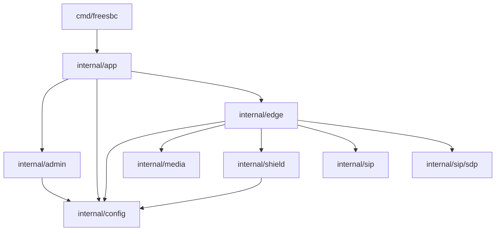
```mermaid
graph TD
    cmd["cmd/freesbc"] --> app["internal/app"]
    app --> admin["internal/admin"]
    app --> config["internal/config"]
    app --> edge["internal/edge"]
    admin --> config
    edge --> config
    edge --> media["internal/media"]
    edge --> shield["internal/shield"]
    edge --> sip["internal/sip"]
    edge --> sdp["internal/sip/sdp"]
    shield --> config
```

`internal/config`, `internal/media`, `internal/sip` and `internal/sip/sdp`
import nothing from this module. `internal/sip` does not import the rest of
the module either (its package doc, `internal/sip/doc.go:1-12`): it holds
protocol primitives with no policy.

Consequences that hold by construction:

- `media` knows nothing about SIP. It is handed addresses, ports, latch modes
  and SRTP keys; it never parses a SIP message or an SDP body.
- `admin` reads the edge only through the `admin.Deps` closures that `app`
  builds (`internal/app/app.go:109-159`); it imports `config` alone.
- `config` is read-only after publication.

One deliberate process-wide side effect: `edge.New` calls
`raiseUDPSendLimit()` (`internal/edge/edge.go:204`, defined at `:179`), a
`sync.Once` raise of **sipgo's** `sip.UDPMTUSize` to 8192, applied only when
it is currently lower. sipgo has no per-user-agent override; the doc comment
at `edge.go:157-178` explains why the 1300-byte default is unusable.

---

## 3. Runtime model

### 3.1 Long-lived objects

Created once, alive for the process lifetime:

| Object | Package | Created at | Notes |
|---|---|---|---|
| `config.Store` | config | `app.Run` (`app.go:54`) | `atomic.Pointer[Config]` + subscriber list (no subscribers today) |
| `edge.Server` | edge | `edge.New` (`app.go:58`) | binds nothing until `Run`; keeps its startup snapshot as `boot` |
| `edge.topology` | edge | `edge.New` (`edge.go:199`) | immutable snapshot, built once from `boot` and the private socket |
| `edge.pubPool` / `privPool` | edge, media | `newMediaPools` (`edge.go:226`, `mediapool.go:19`) | two `media.PlanePool`s over the one `rtp` range, bound to `public.bind` and the private IP; separate port namespaces |
| `edge.carrierDirectory` | edge | `edge.New` (`edge.go:211`) | carrier name to addresses, plus the carrier source set; refreshed by a goroutine started in `Run` (`carrierdns.go`) |
| `edge.carrierRegTable` | edge | `edge.New` (`edge.go:213`) | carrier registration token to binding (`carrierreg.go`) |
| `edge.Location` | edge | `edge.New` (`edge.go:214`) | client registration binding table |
| `edge.dialogTable` | edge | `edge.New` (`edge.go:227`) | grouped by Call-ID, matched on Call-ID + both tags |
| `edge.subTable` | edge | `edge.New` (`edge.go:235`) | SUBSCRIBE dialog records matched on Call-ID + both tags, capped per binding and in all (`subscribe.go`, §7.8a); its removal hook is registered on `Location` (`edge.go:238`) |
| `edge.cooldownTable` | edge | `edge.New` (`edge.go:216`) | `upstreamCooldown`, the passive switch-node penalty (`cooldown.go`) |
| `edge.arrivalMarker` | edge | `edge.New` (`edge.go:200`) | per-process 128-bit secret behind the arrival header that marks a read on the trusted private socket (§7.1) |
| `edge.enumLimiter`, `warnOnce` | edge | `edge.New` (`edge.go:220-221`) | REGISTER enumeration limiter and admission-drop log limiter (`admission.go`) |
| `media.DTLSIdentity` | media | `edge.New` (`edge.go:229-234`) when `edge.listen.ws` or `wss` is set | one self-signed identity per process (`media.ProcessDTLSIdentity`), shared by every WebRTC leg |
| `shield.Shield` | shield | `edge.Server.Run` (`edge.go:449`) | one instance; bans in process memory only; carrier sources are limited by `shield.carrier_rate_limit` and exempt from the scanner ban |
| `admin.Server` | admin | `app.go:91` | only when an `admin:` section exists at startup |

### 3.2 Per-unit-of-work objects

| Object | Scope | Owner |
|---|---|---|
| `edge.dialog` | one INVITE dialog: Call-ID + caller tag, plus the callee tag once confirmed (several may share a Call-ID; early forks are `earlyFork` entries on it) | `dialogTable`, under `dialogTable.mu` |
| `edge.inviteAttempt` | one forwarded INVITE in a failover series | the dialog's `inFlight` slot |
| `edge.Binding` | one (AoR, Call-ID) client registration | `Location`, under `Location.mu` |
| `edge.carrierBinding` | one carrier registration token | `carrierRegTable`, until the carrier-granted expiry |
| `edge.mediaSession` | one dialog | attached once via `dialog.attach`, only ever closed |
| `media.Session` | one dialog on plain RTP | 2 port pairs = 4 UDP sockets |
| `media.WebRTCLeg` + `media.WebRTCSession` | one browser leg | 1 muxed public socket + 1 private pair |
| `media.SRTPContext` | one direction of one leg | `atomic.Pointer` slots on the session |
| port reservation (`PlanePool.inUse`) | one RTP even port | released by `Session.Close` / `WebRTCLeg.Close` |
| shield ban entry, rate-limit bucket | one source (a UDP socket ban: one IP:port; an IP ban: one IP; a rate-limit bucket: an IPv4 address or an IPv6 /64) | the `Shield` |
| `*config.Config` snapshot | one publication | immutable once stored |

### 3.3 Goroutine inventory

**Process-level (errgroup members, `app.go:68-99`)**

1. `config.Watch`: always; never fatal (`app.Run`'s wrapper logs whatever
   `Watch` returns and returns nil itself, `app.go:70-76`).
2. `edge.Server.Run`: always; its error is fatal (`app.go:81-87`).
3. `admin.Server.Run`: if `admin:` exists at startup; fatal. Its HTTP serve
   goroutine is the only one it starts (`admin/server.go:263`).

`cmd/freesbc`'s `withSignals` adds one more, which releases signal capture
after the first SIGINT/SIGTERM (`cmd/freesbc/main.go:94-97`).

**Edge**

| Goroutine | Started | Exits |
|---|---|---|
| per listener: closer (`<-listenCtx.Done(); ln.Close()`) and `ln.Serve` | `Run` (`edge.go:467-477`) | `listenCtx` cancel / serve error |
| registration and carrier-token prune ticker (30 s): `Location.Prune`, `carrierRegTable.prune`, then `publishCarrierRegistrations` | `Run` (`edge.go:530-552`) | `listenCtx` cancel |
| carrier directory refresh (`carrierDirectory.Run`) | `Run` (`edge.go:529-532`) | `listenCtx` cancel |
| per confirmed dialog: media watcher (`<-sess.Done()`, then end the dialog) | `dialog.confirm` (`dialog.go:1082`) | session `Done` closed |
| WebRTC establishment | `startWebRTC` (`media.go:327`) | `WebRTCSession.Start` returns |
| `ackThenBye` (a 2xx FreeSBC will not relay) / `ack2xx` (its retransmission) | `refuse2xx` (`invite_leg.go:123-128`); `ack2xx` also from the re-INVITE relay (`indialog.go:110`) | its 5 s BYE context / after one write |
| `sendCancel` (CANCEL toward a forwarded INVITE branch) | the INVITE paths (`invite.go:449,488`, `invite_leg.go:450,489`, `carrier.go:274`) | its 5 s CANCEL context |
| `sendMiddleBye` (media ended a confirmed dialog; one per end) | `byeBothEnds` (`indialog.go:895-899`) | its 5 s BYE context |
| per request: sipgo handler goroutine | sipgo | handler return (after the final response; `dialogTable` owns the dialog from then on) |
| shield prune loop | `shield.New` (`shield.go:73`) | `Shield.Close` |

**Media**

Per plain `media.Session`: 4 forward loops (RTP A→B, RTP B→A, RTCP A→B,
RTCP B→A; `relay.go:26-29`) plus 1 watchdog (`relay.go:30`) = **5
goroutines**. Per `WebRTCSession`: `publicToPrivate`, two `privateToPublic`
(RTP and RTCP) and a watchdog (`webrtcsession.go:190-193`), plus the leg's
`demux.readLoop` (`mux.go:74`), its `establish` goroutine (`webrtcleg.go:403`,
gone once the handshake ends) and a `<-closed` DTLS closer
(`webrtcleg.go:564`): up to **7**, excluding pion's internal goroutines.

---

## 4. Process lifecycle

### 4.1 Entry point

`cmd/freesbc/main.go` accepts exactly five subcommands (`check`, `run` and `init` take `-c`; `init` adds its own flags):

| Invocation | Behaviour | Exit |
|---|---|---|
| no args | usage to stderr | 2 |
| `-h` / `--help` / `help` | usage to stdout | 0 |
| `check [-c path]` | `app.Check` → `config.Load`; prints `"<path>: config OK"`. It parses and validates only: it opens no certificate or key file, assigns no address and binds no socket, so a missing cert file, an address that is not local, or a port another process holds is found by `run` alone. Everything validation can decide from the file (literal switch addresses, socket collisions between the admin listener and WS/WSS) `check` rejects exactly as `run` would | 0 / 1 |
| `run [-c path]` | `app.Run` under `signal.NotifyContext(SIGINT, SIGTERM)` (`withSignals`) | 0 / 1 |
| `init [-c path] [--switch …]` | `app.Init` (`internal/app/init.go`): detects `private.ip` (UDP connect toward the switch), `public.bind` (UDP connect toward the default route) and `public.ip` (echo service, then instance metadata; announced on stderr and skippable), prompts only when stdin is a terminal, validates the bytes with `config.Parse` and creates the file `O_EXCL`, mode 0600; refuses an existing file and `private.ip == public.bind` | 0 / 1 |
| `version` | prints `freesbc <version> <go version> <os>/<arch>` (for example `freesbc v1.2.3 go1.27.2 linux/amd64`) to stdout; handled before flag parsing | 0 |
| `version` with any argument or flag (`freesbc version -c x`) | `unexpected argument` plus usage to stderr | 2 |
| `hash-password` | prints the bcrypt hash (cost `config.MinBcryptCost`) of a password to stdout, for `admin.password_hash`. On a terminal it prompts twice on stderr without echo and the entries must match; otherwise it reads one line of stdin (a trailing `\n` or `\r\n` is stripped, nothing else). An empty password, a mismatch or a password over bcrypt's 72 bytes is an error on stderr. It takes no `-c` and never the password as an argument: any argument but `-h`/`--help` is a usage error | 0 / 1 / 2 |
| `check`/`run`/`init` with an unrecognised flag | Go's own flag usage to stderr (`flag.ContinueOnError`, mapped to exit 2 in `run`; `-h` exits 0), so `app.Run` is never reached | 2 |
| `check`/`run`/`init` with a positional argument (`freesbc run other.yaml`) | `unexpected argument "other.yaml" (the config file is given with -c)` plus usage to stderr (audit P2-APP-007) | 2 |
| anything else | usage to stderr | 2 |

`-c` defaults to `freesbc.yaml`. A positional argument is a usage error
rather than silently ignored, because the only thing an operator means by one
is a config path, and running `./freesbc.yaml` instead could serve the wrong
config. `main` is a thin `os.Exit(run(os.Args[1:]))`, so the argument
handling is unit-tested. The logger is a `slog.TextHandler` on stderr at the
default level; there is no log-level flag. `version` is a link-time variable
(`-X main.version=…`), default `"dev"`.

**There is no SIGHUP handler anywhere in the repository.** Reload is
fsnotify-driven exclusively.

### 4.2 Startup order (`app.Run`)

1. `config.Load(path)`: read file, `config.Parse`. Failure returns
   `load config: %w` and the process exits 1. Nothing has bound.
2. `config.NewStore(cfg)` (`app.go:54`).
3. `edge.New(store, log, testHookEdgeOptions...)` (`app.go:58`). Keeps
   `store.Current()` as its startup snapshot (`boot`), builds the topology
   from it, raises the process-wide UDP MTU, builds the carrier directory,
   the carrier registration table, `Location`, `Metrics`, the cooldown table,
   the dialog table and the two media pools, and the DTLS identity when
   WebRTC is on. **Binds nothing.** Failure → `edge: %w` before any goroutine
   starts. `testHookEdgeOptions` is empty in production; tests use it to pass
   `edge.WithPrivateAddr`, which replaces the fixed `private.ip:5060`.
4. Log `"media planes ready"` with the `rtp` range, `public.bind` and
   `private.ip` (`app.go:62`).
5. `errgroup.WithContext(ctx)` (`app.go:68`).
6. Start the errgroup members for the config watcher and the edge
   (`app.go:70-87`).
7. If `admin:` is present in the loaded `cfg`, build `admin.Deps`
   (`adminDeps`), call `admin.New(cfg.Admin, cfg.TLS, …)` and start the admin
   member (`app.go:89-99`).
8. Log `"freesbc started"`, block on `<-gctx.Done()`, log `"shutting down"`,
   return `g.Wait()` (`app.go:101-105`).

Every decision above reads the `cfg` step 1 loaded, never `store.Current()`:
the watcher is already running by step 7, and a reload landing then must not
give one startup two configurations (audit P2-APP-004).

The first non-nil error from a fatal goroutine cancels `gctx`; the other
goroutines see `gctx.Err() != nil` and suppress their own errors, so
`g.Wait()` returns exactly the first error. A clean cancel returns nil from
every member, so `Run` returns nil and the process exits 0.

### 4.3 Listener binding

The edge's listener set (`edge.go:315-330`, `:400`) is fixed by the startup
snapshot:

| Socket | Address | Present when |
|---|---|---|
| `udp` | `public.bind:edge.listen.udp` | `edge.listen.udp` set |
| `tcp` | `public.bind:edge.listen.tcp` (a TCP socket; may share its number with `udp`) | `edge.listen.tcp` set |
| `tls` | `public.bind:edge.listen.tls`, certificate from the top-level `tls` | `edge.listen.tls` set |
| `ws` | `public.bind:edge.listen.ws` | `edge.listen.ws` set |
| `wss` | `public.bind:edge.listen.wss`, certificate from the top-level `tls` | `edge.listen.wss` set |
| `udp-private` | `private.ip:5060` (`config.PrivateSIPPort`; not configurable) | always |

There are no wildcard binds: validation rejects `0.0.0.0` and `::` for
`public.ip`, `public.bind` and `private.ip`. Public and private are separate
sockets on separate addresses, so they have separate port namespaces.

`Run` first checks that `public.bind` and `private.ip` are assigned to a local
interface (`checkLocalAddr`, `edge.go:484`); `check`
cannot do that. It then binds **every socket synchronously before serving
any of them** (`edge.go:449-463`); on any failure every already-opened
listener is closed and `Run` returns. It then starts one serving goroutine
per socket and waits (`awaitUDPServing`, `edge.go:591`, bounded by 5 s,
`udpServingTimeout`) until every UDP listener is in sipgo's connection pool:
sipgo pools a UDP listener only inside `ServeUDP`, on that goroutine, and a
request pinned to the listener's address before then (every forward, §7.8)
misses the pool, so sipgo binds a second socket on the same address and fails
with "address already in use", a 503 to the first callers after a restart.
Stream listeners (tcp, tls, ws, wss) need no wait, since nothing is sent pinned to them. A serve
error or the timeout during that wait makes `Run` return it. Only then does
the unexported `ready` channel close (`edge.go:527`), so `ready` means every
socket can both receive and send. Nothing in production waits on it; it is
the happens-before edge the test harness uses.

The edge installs a transport read filter on the sipgo user agent
(`edge.go:394`, `readFilter` at `:863`) before any socket exists; §14 covers
what it enforces.

The edge deliberately bypasses sipgo's `ListenAndServe*` helpers and calls
`tl.ServeUDP` / `ServeTCP` / `ServeTLS` / `ln.Serve` directly, because in
sipgo v1.4.3 those wrappers close an internal listener through an
unsynchronised variable, which the race detector flags on every graceful
shutdown.

The topology is built once in `New`, from the configured addresses, and is
never rewritten after binding (there is no wildcard bind whose real local
address could differ from the configured one), so it is read lock-free for
the process's life.

### 4.4 Reload

Reload is driven only by `config.Watch` (`internal/config/reload.go`, `Watch` and `linkTracker`):

- `fsnotify` watches **the parent directory**, not the file, so atomic-rename
  edits that replace the file are seen.
- Events are filtered by `Op & (Write|Create|Rename) != 0` (`Chmod` and
  `Remove` are ignored) and by `linkTracker.affects`: an event on the config
  path itself, or on the file it resolves to, reloads; any other entry in the
  directory reloads only if `filepath.EvalSymlinks(path)` now resolves
  somewhere new. That catches a Kubernetes ConfigMap update, which renames a
  new `..data` link into place and never touches the visible file, and any
  other symlink swap on the way (audit P2-CFG-011). When the path resolves
  into another directory, that directory is watched too, so an in-place edit
  of the target reloads.
- **Debounce: 200 ms** (`reloadDebounce`), implemented as a `time.AfterFunc`
  that does a non-blocking send into a buffer-1 `fire` channel.
- On fire: `loadNoPanic(abs)`, which is `Load` behind a last-resort
  `recover()`. On failure, log
  `"config reload failed, keeping previous config"` and continue: the
  running config is untouched and the process never dies from a bad reload.
  `Parse` itself never panics: a go-yaml decoder panic is turned into a parse
  error (audit P3-CORE-001). On success, `store.Replace(cfg)` and log
  `"config reloaded"`.
- Event-loop errors are logged, never fatal, and the loop always returns nil.
  `Watch` itself can still fail before the loop starts: `filepath.Abs`,
  `fsnotify.NewWatcher`, `w.Add` of the config's directory. Failing to watch
  a symlink target's other directory is only a warning. `app.Run`'s wrapper
  goroutine logs that error and returns nil anyway (`app.go:70-76`), so a
  watcher that never started silently disables reload for the process's life.

`Store.Replace` stores the new pointer atomically, then does a non-blocking
send into every subscriber channel (coalescing). `Store.Current()` is
lock-free and never nil. Snapshots are immutable by contract: a `*Config`
handed to a `Store` is never mutated, and the compiled fields
(`Edge.switches`, `Edge.carrierNets`, `Edge.carriers`) are populated during
`validate`, before publication. Nothing in the process calls
`Store.Subscribe` today.

There is **no reload-failure metric**.

#### What is hot vs restart-only

Every top-level section is restart-only except `shield`. The table is
`restartOnly` in `internal/config/restart.go`; keep the two in step.

| Hot (re-read per use) | Restart-only (`config.RestartOnlyChanges` key) |
|---|---|
| `shield.max_sessions`, `shield.invite_rate_limit`: `beginDialog` reads `store.Current()` once per out-of-dialog INVITE (`invite.go:240`); the effective session limit is `max_sessions` clamped to the boot `rtp` pairs (`sessionLimit`, `invite.go:204`) | |
| `shield.rate_limit`, `shield.carrier_rate_limit`, `shield.ban`: the shield reads `store.Current()` on every check (`shield.go:123`), re-parsing a rate-limit string only when it changes (`shield.go:228`) | `public` (`ip`, `bind`) |
| | `private` (`ip`) |
| | `rtp` (the media pools read the range from `boot`, `mediapool.go:19`) |
| | `tls` (certificates are loaded at bind: TLS and WSS in `openListener`; the admin in `admin.Server.Run`) |
| | `edge.switch` |
| | `edge.switch_carrier_port` |
| | `edge.listen` |
| | `edge.carriers` (including each carrier's `srtp`) |
| | `edge.srtp` |
| | `edge.allow_insecure_sdes` |
| | `edge.carrier_sources` |
| | `admin` (`listen`, `password_hash`, `allow_remote`, `allowed_hosts`, `pprof`, and whether the section exists) |

Which plane code runs is not a setting: the edge always runs, and the admin
server runs when an `admin:` section existed at startup.

A reload that changes anything in the right-hand column is still published:
its hot settings apply at once. `config.Watch` logs
`"config reload changes restart-only settings; ..."` with the list of changed
keys (`config.RestartOnlyChanges`, `internal/config/restart.go`, audit
P2-CFG-007), diffed against the snapshot current when the watcher started.
The edge never acts on the new values: it keeps the snapshot it was built
from (`edge.Server.boot`) and reads every restart-only setting from it, never
from the store; the admin server likewise holds its startup `AdminConfig` and
`TLSConfig` (`admin.New`, `admin/server.go:203`).

`Watch` also records its last outcome on the store for the life of the process
(`config.ReloadStatus`, read through `Store.ReloadStatus()`, which returns a
copy; only `Watch` writes it): the time of the last published reload, the
sorted `RestartOnlyChanges` list after it (empty once the file is back to the
boot values), and the last failed reload's error and time. A failure leaves
the list as it was, because the snapshot did not change; the next success
clears the error. Nothing is persisted. `app` hands `Store.ReloadStatus` to
the admin server as `Deps.Reload`; it surfaces as the `reload` object of
`GET /api/status`, two web UI banners and the gauges
`freesbc_config_restart_required` and `freesbc_config_reload_failed`.

### 4.5 Shutdown

A graceful restart first enters drain mode (§7.1, `POST /api/drain`), waits
until `active_calls` reaches 0 (or a timeout of the operator's choosing) and
only then stops the process; drain is not a shutdown step and nothing exits
the process on its own.

SIGINT/SIGTERM cancels the root context; `app.Run` unblocks at
`<-gctx.Done()` and calls `g.Wait()`. `cmd/freesbc` (`withSignals`) stops
capturing signals the moment the first one arrives, so a **second**
SIGINT/SIGTERM gets Go's default action and ends the process even when the
graceful shutdown hangs (audit P2-APP-008). There is no single deadline at
the app level; each component bounds its own steps as below.

**Edge** (`edge.go:574-577`): `s.dialogs.close()` → `listenCancel()` → each
listener's closer closes its socket → `wg.Wait()` (which also waits for the
prune ticker and the carrier directory goroutine) → `s.dialogs.closeAll()`,
which ends every dialog and therefore closes every media session. Closing the
dialog table first is what keeps an INVITE handler that is still in flight
(sipgo runs handlers on their own goroutines, which `Run` does not wait for)
from allocating media after shutdown began or leaking it (audit P2-EDG-027):
`begin` refuses a new dialog (the INVITE is answered 503), the allocation
paths check `dialog.open()` first, and `attach` closes a session it can no
longer hand to a live dialog. There is no BYE-on-shutdown on this plane;
calls are dropped, and the phones and the switch find out from their own
session timers or media timeouts. `defer sh.Close()` on the shield (and the
sipgo client and user agent) fires after all of this.

**Admin**: on `ctx.Done()`, `srv.Shutdown` under a fresh **5 s** timeout
(`admin/server.go:288-290`). In-flight HTTP requests are drained up to that
budget.

**Shield.Close**: cancel the prune loop and wait for it. Bans are in memory
only, so none survive the process.

Exit codes: 0 on a clean shutdown, 1 on any fatal component error or a bad
config at startup, 2 on a usage error.

---

## 5. Configuration

`docs/config.md` documents every key, default, validation rule and reload
class. This section is the mechanism.

`config.Parse` (`internal/config/loader.go:34-46`) runs four steps in order:

1. `unmarshalStrict`: `yaml.UnmarshalWithOptions(data, &c, yaml.Strict())`;
   **unknown keys are errors**, formatted with line numbers via
   `yaml.FormatError`. A panic inside go-yaml is recovered and reported as a
   parse error.
2. `expandEnv`: `${VAR}` is expanded in every string field of the decoded
   struct. It runs after unmarshal, so parse errors never echo a secret, and
   expanded values are never written back to disk. It records what it
   substituted (`envRedaction`) so `validate` can keep expanded values out of
   its error messages.
3. `withDefaults` (`schema.go`): `public.bind`, `rtp`, `shield.*`.
4. `validate` (`validate.go`): collects every problem and returns them
   joined, one per line. It does no locality check and opens no file;
   `edge.Run` checks that the bind addresses are local, and certificate files
   are opened at bind.

`config.Store` (`store.go`) publishes immutable `*Config` snapshots through an
atomic pointer. Code reads `store.Current()` at the point of use, once per
unit of work. `config.Watch` is the only caller of `Store.Replace`; the
admin API never writes the file: the operator edits it and the watcher
reloads it (§4.4). The edge reads restart-only values from its `boot` snapshot and the
shield reads its hot values per check. Custom scalar types (`Duration`,
`PortRange`, `RateLimit`) are in `internal/config/types.go`.

## 6. SIP processing — carrier path

The carrier path is the edge plane's third kind of far end, next to registered clients and the switch. It carries SIP between the switch (FreeSWITCH or Asterisk, on the private LAN) and carriers (on the public internet), in both directions. FreeSBC is a stateful proxy on this path too, not a B2BUA: Call-ID, tags and CSeq pass through, the Request-URI is never rewritten on the way to a carrier, and FreeSBC holds no carrier credential. What differs from the client path is topology hiding (§6.5): nothing sent toward a carrier names a private address.

Carrier traffic uses the fixed private socket `private.ip:5060` toward the switch and, toward the carrier, the transport of its `edge.carriers` entry: UDP (the public UDP listener, `edge.listen.udp`, required by a `udp` carrier), TCP or TLS. For a `tcp` or `tls` carrier FreeSBC dials the connection itself (§6.10); the matching `edge.listen.tcp|tls` is needed only for the carrier's own inbound connections (`validateCarriers`, `internal/config/validate.go`).

Code lives in `internal/edge`: `carrier.go` (classification, `inviteToCarrier`, `optionsToCarrier`), `carrierdns.go` (directory), `carrierreg.go` (registration table and `registerToCarrier`), `carrierconn.go` (outbound tcp/tls connections), `hide.go` (topology hiding), plus the carrier branches in `invite.go`, `indialog.go`, `admission.go`, `arrival.go` and `forward.go`.

### 6.1 Classification of switch-originated requests

A request that arrives on the private socket without a To tag is classified by its Request-URI alone, never by registration state (`classifySwitchRequest`, `internal/edge/carrier.go:91`). In order:

1. The Request-URI, or the topmost Route that does not name FreeSBC (`firstForeignRoute`, `carrier.go:113`), carries an `fsbc` URI parameter: `targetClient`. Whether the token is live is the client path's business (an unknown token is a 404 there).
2. The Request-URI host[:port] equals an `edge.carriers` entry: `targetCarrier`, with the carrier's name. The match key is `carrierKey` (`carrier.go:42`): host lower-cased without a trailing dot, literal IPs in canonical form, port defaulting to 5060. The map is built once from the boot config (`carrierURIsOf`, `carrier.go:54`).
3. The Request-URI names one of FreeSBC's own signaling addresses (`topology.isSelf`, `internal/edge/topology.go:224`): `targetSelf`.
4. Anything else: `targetNotFound`. FreeSBC is never an open relay for the switch.

Routes naming FreeSBC itself are skipped (loose routing): `stripOwnRoutes` (`forward.go:139`) removes every leading Route that matches `isSelf` before a request is forwarded. There is no registration-based fallback (no AoR lookup).

What each handler does with the result:

| Method | `targetClient` | `targetCarrier` | `targetSelf` | `targetNotFound` |
|---|---|---|---|---|
| INVITE | `inviteToClient` | `inviteToCarrier` (`carrier.go:185`) | 404 | 404 (`invitePrivate`, `carrier.go:167`) |
| REGISTER | 404 | `registerToCarrier` (`carrierreg.go:190`) | 404 | 404 (`onRegister`, `register.go:29-41`) |
| OPTIONS | 200 locally | `optionsToCarrier` (`carrier.go:292`) | 200 locally | 404 (`onOptions`, `edge.go:976`) |
| SUBSCRIBE | `subscribeToClient` (`subscribe.go:438`); a token naming no binding → 404 | 405 | 404 | 404 |
| BYE, INFO, NOTIFY, MESSAGE | `directionFor` by token (no binding → **481**; a MESSAGE → **404**, `indialog.go:488-493`) | 405 | 404 | 404 (`onInDialog`, `indialog.go:450-463`) |
| REFER | 481 (no To-tag) | 481 | 481 | 481 (`indialog.go:465-470`) |
| any other method (PUBLISH) | 405 (`onNoRoute`, `edge.go:998`) | 405 | 405 | 405 |

An OPTIONS with a To tag is answered locally without classification (`edge.go:976-991`). A switch request that has a To tag takes the in-dialog path (§6.7), where the dialog record, not the Request-URI, decides the direction.

### 6.2 Inbound path: carrier to switch

An out-of-dialog INVITE that arrives on a public listener goes through admission (`admitPublicInvite`, `internal/edge/admission.go:81`), in this order:

1. Its exact transport and IP:port is a live client registration (`Location.HasSource`): `srcClient`. A registration wins over a carrier source, so a client behind a carrier's address is never sent down the carrier path.
2. Its source is a carrier source on the right transport: `srcCarrier`, with the carrier's name. A resolved `edge.carriers` address counts only when the request arrived over that carrier's own transport (`carrierFor(src, network)`), so a tls carrier's IP over UDP is not admitted; an `edge.carrier_sources` entry matches by IP on any public transport.
3. Otherwise `srcDrop`: silent drop, counted as `freesbc_edge_admission_drops_total{reason="invite_not_admitted"}` (`internal/edge/invite.go:51-68`).

The carrier source set for the shield (`carrierSnapshot.isSource`, IP only, so a carrier is rate-limited by `carrier_rate_limit` and never banned on any transport), `internal/edge/carrierdns.go:61`) is `edge.carrier_sources` plus the host prefix of every literal-IP carrier plus every resolved address of the DNS-name carriers (§6.4). `carrierFor` (`carrierdns.go:76`) names the carrier: an exact IP:port match against a resolved address wins; otherwise the first entry (sorted by name) with that IP; otherwise a source inside `carrier_sources` that matches no entry is named `unknown`.

`inviteToUpstream` (`invite.go:272`) serves both clients and carriers; a non-empty carrier name selects the carrier behaviour:

- Destination: the chosen node's carrier address, `<node IP>:<edge.switch_carrier_port>` (default: the node's own `edge.switch` port), never the client port (`endpoint.carrierAddr`, `topology.go:117`; the port is set in `buildTopology`, `topology.go:148-156`, and `invite.go:391-394`). Client traffic never goes to the carrier port, so the switch may run an unauthenticated profile there.
- Node choice (`invite.go:358-379`): when the Request-URI carries a carrier-registration token that names a live binding (§6.8), the call goes to that node only, with the Request-URI replaced by the switch's original Contact (`out.Recipient = pinned.contact`, `invite.go:403-405`), so the switch can identify the call by its registration line (Asterisk `line=yes`, FreeSWITCH `${sip_gateway}`). There is no failover in that case. With no token, or an unknown or expired one (logged at WARN), the node is chosen by the hash-user pool over the lower-cased Request-URI user, i.e. the DID (`carrierHashUser`, `carrier.go:126`; Request-URI user, else To user, else Call-ID), with the same cooldown-ordered retry as the client path, and the Request-URI is left unchanged.
- FreeSBC appends `X-FreeSBC-Carrier: <name>` after `prepareForward` (`invite.go:400-402`); `unknown` for a carrier-source address that matches no entry. The same stamp is added to ACK and in-dialog requests from a carrier (`stampCarrier`, `carrier.go:152`), which also counts them in the metric.
- The Contact toward the switch is FreeSBC's private address, the Record-Route is the usual RFC 5658 double pair, and the SDP is built from scratch with a private anchor port (the standard upstream offer, `buildUpstreamOffer`). Responses go back through `respToCarrier` (§6.5).
- Carriers are exempt from the per-source early-call cap `maxEarlyPerSource` (`invite.go:35`, `invite.go:280-291`). `shield.carrier_rate_limit` bounds them instead, and the shield never scanner-bans a carrier source (`internal/shield/shield.go:145-146`). The predicate is the live directory snapshot (`edge.go:449`).
- A request from a carrier source that matches no dialog record and is not an INVITE (an ACK or BYE for a call whose record is gone) takes the in-dialog fallback: hashed by the DID to a node's carrier address, with the same Request-URI restoration and stamp (`directionFor`, `indialog.go:837-844`; `restoreCarrierRURI`, `hide.go:314`). `carrierFallback` (`carrier.go:140`) is the test: a carrier source that is not an exact live registration address.

A public OPTIONS, including a carrier's keepalive, is answered locally and never reaches the switch (`onOptions`, `edge.go:976`).

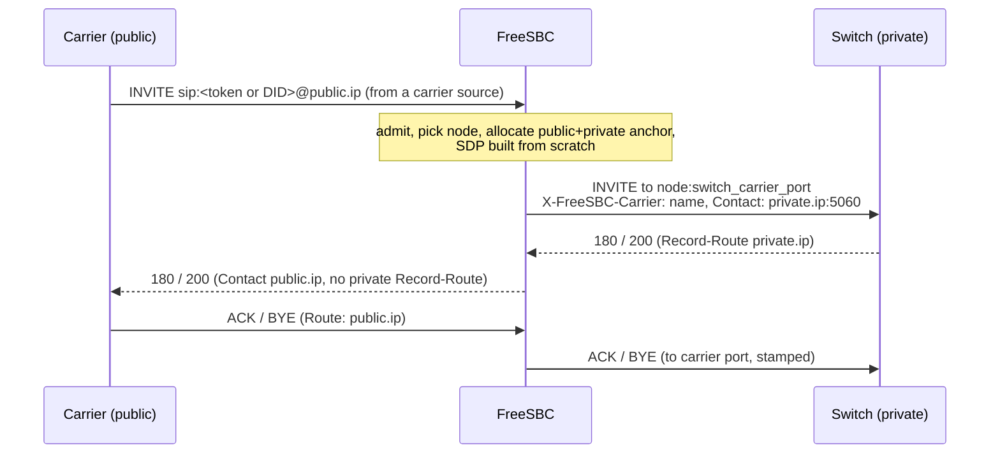
```mermaid
sequenceDiagram
    participant C as Carrier (public)
    participant F as FreeSBC
    participant S as Switch (private)
    C->>F: INVITE sip:<token or DID>@public.ip (from a carrier source)
    Note over F: admit, pick node, allocate public+private anchor,<br/>SDP built from scratch
    F->>S: INVITE to node:switch_carrier_port<br/>X-FreeSBC-Carrier: name, Contact: private.ip:5060
    S-->>F: 180 / 200 (Record-Route private.ip)
    F-->>C: 180 / 200 (Contact public.ip, no private Record-Route)
    C->>F: ACK / BYE (Route: public.ip)
    F->>S: ACK / BYE (to carrier port, stamped)
```

### 6.3 X-FreeSBC-* headers

Every header whose name starts with `x-freesbc-` (any case) is internal. Only FreeSBC adds them, and only on the private side:

- On arrival (`arrivalMarker.take`, `internal/edge/arrival.go:160`) every occurrence is stripped from a request before a handler sees it, public or private. The request is cloned when it carries one, because sipgo's own goroutines still read the original. The only one believed is the `X-FreeSBC-Arrival` marker that the read filter inserts on the trusted socket (`arrival.go:156-165`); it is the first occurrence compared in constant time, and it also is stripped.
- On every forwarded request (`prepareForward`, `forward.go:51`) and every relayed response (`relayResponseHide`, `forward.go:229`) `stripInternalHeaders` runs again, so a switch that echoes one cannot pass it to a public peer. What FreeSBC adds for the switch (`X-FreeSBC-Carrier`, defined `carrier.go:30`) is added after that.

### 6.4 Carrier directory

`edge.carriers` is both the allowlist of destinations the switch may use and the source of the carrier source set. `carrierDirectory` (`internal/edge/carrierdns.go:116`) resolves it:

- A literal-IP entry is static: one address, the entry's port.
- A DNS-name entry without a port resolves through SRV ordered by priority and RFC 2782 weight (`orderSRV`, `carrierdns.go:334`), then A/AAAA per target (the SRV name is `_sip._udp`, `_sip._tcp` or `_sips._tcp` for a udp, tcp or tls carrier, `srvName`); with no SRV record it falls back to A/AAAA on the carrier's default port, 5060 (5061 for tls; `Carrier.DialPort`). An entry with an explicit port skips SRV and resolves A/AAAA only (RFC 3263 §4.2; `resolve`, `carrierdns.go:258`).
- Resolution runs on the public side only; the switch is never asked and the private leg does no DNS.
- A good answer is cached `carrierDNSTTL` = 300 s; a failed or empty one `carrierDNSNegTTL` = 10 s; one query is bounded by `carrierLookupTimeout` = 3 s (`carrierdns.go:40-51`). A failed refresh keeps the last good set (`refresh`, `carrierdns.go:238`), logged at WARN once per failure run. A failure at startup is not fatal: the carrier is unresolved, its INVITEs are dropped by admission and requests for it get 503, until a lookup succeeds.
- `Run` (started from `edge.Run`, `edge.go:557`) refreshes once at start and then every 5 s checks which entries have expired (`carrierdns.go:242`). Each refresh publishes an immutable `carrierSnapshot` through an atomic pointer, so admission and the shield read it without locking.
- A request to a carrier goes to the first resolved address only (`carrierDest`, `carrierreg.go:149`). There is no failover across SRV targets or addresses inside FreeSBC; line selection and failover belong to the switch. The order of a resolved set is re-drawn at each refresh (weighted-random within a priority), so the first address can change every 300 s for a name with several equal-priority targets.

### 6.5 Outbound path: switch to carrier

The switch uses FreeSBC as its outbound proxy and addresses the carrier in the Request-URI. After classification (§6.1) the request is forwarded to the carrier's first resolved address from the public UDP socket.

**INVITE** (`inviteToCarrier`, `carrier.go:185`): a single attempt, shaped like `inviteToClient`.
- No resolved address, or no public UDP side: 503. An offer with no SDP body: 488 (FreeSBC would otherwise be the offerer toward the carrier).
- `beginDialog(planePrivate)`, `d.setCarrier(name)`: the dialog records the carrier (`dialog.go:681-692`).
- Media is anchored on both legs. `buildPublicOffer(d, body, false)` builds the offer for the carrier on a public anchor port; the switch is answered from a private anchor port. Both SDPs are FreeSBC's own (`internal/sip/sdp.Build`). The carrier leg is always the plain RTP relay (`calleeCarrier`, `invite_leg.go:30-32`; `media.go:493-501`).
- The Request-URI is the switch's, unchanged. The Contact is FreeSBC's public address with the From user (`carrier.go:234-240`).
- Failure to send is 503; a transaction timeout is 408. A CANCEL from the switch cancels the carrier INVITE like any proxied call.

**REGISTER** (`registerToCarrier`, `carrierreg.go:190`): see §6.8. The Request-URI, Authorization and Call-ID are untouched; the digest the switch computed covers them. `401`/`407` challenges and the retried REGISTER pass through untouched (`carrierreg.go:236-239`): the switch holds the account and FreeSBC holds no credential.

**OPTIONS** (`optionsToCarrier`, `carrier.go:292`): proxied to the carrier with hiding, the answer relayed back; 503 when unresolved, 504 on timeout (32 s).

Every other out-of-dialog method gets 405 (table in §6.1). The send address of every forwarded request is the carrier's resolved address and the sending socket is the public UDP listener.

### 6.6 Topology hiding

On a client call FreeSBC keeps every Via below its own and adds the double Record-Route, because both sides are its own to show (§7.8). On a carrier leg that would leak the switch, so `hide.go` applies a separate set of rules. A request toward a carrier is built by `prepareForwardHidden` (`hide.go:82`): `prepareForward` first, then `hideToCarrier` (`hide.go:164`).

**Request toward a carrier** (out-of-dialog REGISTER, INVITE, OPTIONS, and every in-dialog request of a carrier dialog that leaves on the public side):

| Header | Rule |
|---|---|
| Via | Every Via the switch added is removed; the only one is FreeSBC's public Via (`hide.go:165-168`). |
| Record-Route | All removed; only FreeSBC's public entry is added, and only when the request opens a dialog (`recordRoute` true: INVITE, `hide.go:169-172`). |
| Route | FreeSBC's own entries were stripped by `prepareForward`. On an out-of-dialog request every remaining Route is removed, since switch-preloaded routes may be private. On an in-dialog request the remaining Routes are the route set learned from the carrier's own Record-Routes and are kept (`hide.go:173-175`). |
| Contact | FreeSBC's public address when present (`hide.go:177-180`); the INVITE's is built in `inviteToCarrier`; REGISTER carries the rewritten binding (§6.8). |
| From, To | The URI host is rewritten to `public.ip` (port dropped) when it is `private.ip` or the IP of an `edge.switch` node (`maskIdentity`, `hide.go:126-158`; `isSwitchHost`, `hide.go:100`). User, parameters and tags are kept. A carrier domain or any other host is left alone. |
| P-Asserted-Identity, P-Preferred-Identity, Remote-Party-ID, Diversion, Call-Info, Alert-Info | The same host rewrite, applied to every `sip:`/`sips:` URI in the value by regexp (`hide.go:94-96`, `hide.go:133-157`). |
| X-FreeSBC-* | Removed (§6.3). |
| Call-ID | Untouched: the switch's Call-ID reaches the carrier. |
| Body | Rebuilt from scratch; no body carries a foreign address. |

Max-Forwards is decremented as on any proxied request; a zero Max-Forwards is 483.

**Response to the switch** (`respToSwitch`, `hideResponse`, `hide.go:186-202`): FreeSBC's public Via is popped (an empty Via list is allowed here, `popOwnVia`, `forward.go:173`); then the switch's original Vias are restored so its transaction matches; From and To addresses are restored to the originals (tags stay as answered), undoing the identity masking. The Contact is FreeSBC's private address (`invite_leg.go:161`). For an INVITE's 1xx/2xx, FreeSBC's private Record-Route is inserted right after the public one the carrier echoed, or at the end of the list if the carrier dropped it (`addPrivateRecordRoute`, `hide.go:229`; call site `invite_leg.go:162-164`). The switch, as UAC, reverses the list, so its route set starts at `private.ip:5060` and its in-dialog requests reach the private socket.

**Carrier-originated request that goes to the switch** keeps the normal double Record-Route toward the switch (it is a private-side message; nothing is hidden from the switch). **The response to the carrier** (`respToCarrier`, `hide.go:203-220`) has any Record-Route naming the private socket removed and its Contact, if present, replaced by the public address, so no private address leaves in a response either.

`carrierLeg` (`hide.go:286`) selects the mode per request: a request whose dialog (or, with no record, whose source) is a carrier's, going to the public side, gets hiding and `respToSwitch`; coming from the public side, `respToCarrier`; every client request gets none.

### 6.7 In-dialog requests on a carrier dialog

A dialog is matched on Call-ID plus both tags (§7.7). `dialog.carrier` is set for both directions (`inviteToCarrier`, `inviteToUpstream`). ACK, CANCEL, BYE, re-INVITE, PRACK, UPDATE, INFO and NOTIFY in a carrier dialog take the same hiding rules because they leave through `prepareForwardFor` (`hide.go:74`) and `relayResponseHide`: `onAck` (`indialog.go:313`), `onInDialog` (`indialog.go:445`), `onReInvite` (`indialog.go:66-74`). The Request-URI of a forwarded in-dialog request is the far end's own Contact (`retargetInDialog`, `indialog.go:868`). The metric `freesbc_edge_carrier_requests_total` counts requests toward the carrier (`noteOutbound`, `hide.go:305`) and toward the switch (`stampCarrier`).

The media-ended BYE FreeSBC sends on its own behalf (`sendMiddleBye`, `indialog.go:905`) masks the From and To hosts the same way when its target is a carrier (`indialog.go:931-935`).

Carrier-originated in-dialog requests are forwarded to the switch as the carrier sent them. They carry the masked public host in From/To (the carrier echoes what it was given), so the switch sees `public.ip` in those headers instead of its own address. Responses restore the original form only on requests the switch originated (`respToSwitch`).

### 6.8 Carrier registration token

The switch REGISTERs its gateway at a carrier through FreeSBC (`registerToCarrier`, `carrierreg.go:190`). The carrier must later send inbound calls to a Contact that reaches FreeSBC, and FreeSBC must know which switch node registered it and what the switch's own Contact was.

- The switch node is the `edge.switch` entry whose IP equals the request's source, preferring an equal port, else the first by name (`switchNodeFor`, `carrierreg.go:160`).
- The Contact toward the carrier becomes `sip:<user>@public.ip:<port>;fsbc=<token>` (plus `;transport=tcp|tls` for those carriers; the port is the carrier transport's listener port, else its default, `carrierSide`) (`carrierContactURI`, `carrierreg.go:179`). Its header parameters (`expires`, `q`) are kept; only the address changes. A wildcard `Contact: *` with `Expires: 0` goes upstream as is; a wildcard that is not a lone un-REGISTER is 400.
- The token is `base32(sha256(node || "\n" || contact))` truncated to 26 characters, lower-cased (`carrierToken`, `carrierreg.go:140`). It is deterministic, so a FreeSBC restart does not strand the Contact the carrier holds: the switch's next refresh recreates the same token. It is an identifier, not a secret: anyone who can guess a node name and a Contact can compute it, so in principle it can be brute-forced to learn the switch's Contact; the carrier path admits only carrier sources.
- On a `2xx` the binding `token → {carrier, node, original Contact, expiry}` is stored for the expiry the carrier granted (`GrantedExpires`, `internal/sip/register.go:52`, matched on this token's Contact). A `200` to `Expires: 0`, or a granted expiry of 0, removes it; a wildcard un-REGISTER removes every binding of that node at that carrier (`removeNode`). Challenges and failures change nothing. The response's Contact is restored to the switch's original with the granted expiry (`restoreContact`, `register.go:377`).
- The table (`carrierRegTable`, `carrierreg.go:44`) is in memory and is separate from the client `Location`: a client token is random and names a public client, a carrier token is derived and names a switch registration, and neither lookup resolves the other's token. Expired bindings are not found by `lookup` and are reclaimed by a 30 s ticker (`edge.go:505-522`, `prune`, `carrierreg.go:92`).
- On a carrier request (`carrierRURI`, `carrierreg.go:280`) a token that names a live binding on a node still in `edge.switch` selects that node and restores the Contact (§6.2). Because the table is memory only, a request that arrives after a restart and before the switch's next REGISTER refresh finds no binding and is treated as addressed to the DID.

```mermaid
sequenceDiagram
    participant S as Switch
    participant F as FreeSBC
    participant C as Carrier
    S->>F: REGISTER sip:carrier (Contact: sip:gw@switch)
    F->>C: REGISTER (public Via, Contact: sip:gw@public.ip;fsbc=T)
    C-->>F: 401 (challenge)
    F-->>S: 401 (untouched, Vias restored)
    S->>F: REGISTER + Authorization
    F->>C: REGISTER + Authorization
    C-->>F: 200 (Contact fsbc=T; expires=3600)
    Note over F: store T -> {carrier, node, sip:gw@switch, now+3600}
    F-->>S: 200 (Contact: sip:gw@switch)
```

### 6.10 Stream transports to and from carriers

A `tcp` or `tls` carrier is a destination FreeSBC resolved from `edge.carriers`, so it is the one stream peer FreeSBC dials (a client's flow is never dialed, §7). Every request to a carrier passes `requireFlow` (`forward.go`): when sipgo's pool holds no connection to the destination and the destination is a resolved address of a carrier of that transport (`carrierTarget`), `carrierConns.ensure` (`carrierconn.go`) opens one.

sipgo v1.4.3 dials a stream destination itself, but with one process-wide `tls.Config` and the destination host it was given (the IP, here), so it cannot carry a per-carrier server name, root set or client certificate. FreeSBC therefore dials, handshakes and verifies the connection (`carrierTLSConfig`: `MinVersion` TLS 1.2, `ServerName` the configured host, `RootCAs` from `ca_file` when set, else the system roots, `Certificates` from `client_cert`/`client_key`; no skip-verify), wraps it in the `streamConn` every accepted connection gets (§7: write deadline, message framer and read deadlines, per-IP and global caps, metrics) and hands it to sipgo through a `dialListener` served beside the public listeners (`Run` appends `carrierConns.listeners()`). sipgo's own `Serve` loop then pools it under the carrier's address and reads it, so responses reach the transaction layer and the carrier's requests on it reach the ordinary handlers. The sipgo user agent's own TLS config trusts nothing (`edge.go`), so a dial sipgo makes itself in a race with a closing connection fails closed. A lost connection leaves the pool through sipgo's read loop and the next request dials again; dials to one address are serialised. Shutdown closes the pool (`UserAgent.Close`) and the unread `dialListener` queue. Certificates are loaded in `edge.New`, so a bad `ca_file` or client pair fails startup.

The leg's `side` is the carrier transport's public side (`carrierSide`): the listener's, or, for a tcp/tls carrier with no listener, a synthetic side at the default port marked `outbound`, whose Via carries `;alias` (RFC 5923). Via, Record-Route and Contact therefore name `TLS`/`;transport=tls`, and the usual double Record-Route covers the udp switch leg.

Inbound admission (§6.2) uses the transport the request arrived on (`req.Transport()`), which is the carrier's for both an accepted connection and one FreeSBC dialed. A carrier source is exempt from the stream idle timeout (`streamBusy`) and shares the per-IP cap of 256. Limits: a TLS 1.3 server that rejects FreeSBC's client certificate after the client handshake has completed is noticed only when the connection fails, so the call times out (408) rather than being refused at once; a request from FreeSBC to a carrier call whose carrier connected to a listener and has since disconnected has no address to dial and fails.

### 6.9 Observability and admin

- Metrics: `freesbc_edge_carrier_requests_total{carrier,direction,method}` (`direction` is `inbound` for carrier to switch, `outbound` for switch to carrier; `internal/edge/metrics.go:155`, `internal/admin/metrics.go:111`) and `freesbc_edge_carrier_registrations{carrier}`, the live registration count per configured carrier with zeros included (`SetCarrierRegistrations`, `edge/metrics.go:165`; `publishCarrierRegistrations`, `carrierreg.go:126`). Admission drops count in `freesbc_edge_admission_drops_total`.
- The admin status JSON carries the same two values as `carrier_requests_total` and `carrier_registrations` (`internal/admin/server.go:167-171`). The carriers' resolution state and the switch's carrier registrations are listed by `GET /api/carriers` and `GET /api/carrier-registrations` (§13.3).
- The call list names the ends of a carrier call as `carrier:<name>` and `switch:<ip:port>` (`dialogTable.calls`, `dialog.go:557-563`).
- The redacted config view shows `edge.carriers` (`internal/admin/redact.go:19`).

## 7. SIP processing — edge plane (proxy)

The edge plane is a **stateful SIP proxy, not a B2BUA**: Call-ID, From/To
tags and CSeq pass through untouched. It does not use sipgo's dialog
sessions at all; it owns its own `dialogTable`. The switch (FreeSWITCH, or Asterisk)
remains the authoritative registrar and FreeSBC never holds a credential.
Besides registered clients and the switch there is a third kind of far end,
a carrier (§6).

### 7.1 Planes, listeners and direction dispatch

| Side | Transports | Trust |
|---|---|---|
| Public | `udp`, `tcp`, `tls`, `ws`, `wss`, each on `public.bind` and the port set by `edge.listen` | untrusted; full shield treatment |
| Private | `udp` only, the one fixed socket `private.ip:5060` (`config.PrivateSIPPort`) | trusted; exempt from the shield |

`side` carries `plane`, `transport`, advertised IP and port, and `laddr` —
the pinned local socket address, set for UDP sides only
(`internal/edge/topology.go:45`). A tcp, tls, ws or wss client is
inbound-only, so its outbound path is the client's own pooled connection and
`laddr` stays zero. FreeSBC never dials a client: `requireFlow`
(`forward.go`) fails a request toward a stream client whose connection is not
in sipgo's pool, because sipgo would otherwise dial the destination (RFC 5626
§5.3: a NAT'd client has no dialable address). `side.uri()` and
`side.recordRoute()` carry `;transport=tcp|tls|ws|wss`, and `side.via()`
names the transport (`SIP/2.0/TLS`), so a leg's Via, Record-Route and Contact
describe the transport it uses; the double Record-Route covers a transport
change between legs. The Request-URI toward a TLS client is `sip:` with
`;transport=tls`, not `sips:`, since `sips:` would require TLS on the
switch leg as well.
`side.via(branch)` adds an empty `rport` parameter on **UDP only** (RFC
3581). `side.recordRoute()` always carries `lr`.

**Read filter** (`fsip.ReadFilter(fsip.MaxReadSize, accept)`, wrapped by
`Server.readFilter`, `internal/edge/edge.go:799`): a UDP datagram or
WebSocket frame larger than **24 KiB** is dropped before the parser. The cap
does not apply to a tcp or tls read (`fsip.IsByteStream`): there a read is an
arbitrary chunk of the byte stream, so a message may arrive split over several
reads or several to one, and dropping a chunk would desynchronise sipgo's
stream parser. The stream connection bounds the message instead (§7.1a). The cap sits below sipgo's 32 KiB
read buffer (`TransportBufferReadSize`), which bounds every read, so it can
fire: an oversized datagram or WebSocket frame arrives truncated to 32 KiB
and is dropped here rather than parsed as a partial message
(`internal/sip/readfilter.go:5-20`). The edge has two kinds of socket, told
apart by the **local** address of the read (`fsip.SameListener` against the
private socket; a TCP, TLS or WS/WSS read on the same port number is a
public read, which is what lets `edge.listen.tcp` sit on 5060 beside the
private UDP socket):

- The **private socket** (`private.ip:5060`, UDP): trusted. Only a switch
  IP (`topology.fromUpstream`, any `edge.switch` node's IP) may speak on it;
  any other source is dropped. On Linux the socket also carries a BPF
  ingress filter (`privateSocketFilter`, `privatefilter_linux.go`): only a
  datagram that arrived on the interface owning `private.ip`, or on
  loopback, is queued. Linux's weak host model would otherwise deliver a
  datagram addressed to the private IP and sent into the public NIC here,
  with a spoofed switch source (issue #90). The filter is a no-op off Linux
  and reads `skb->dev->ifindex`, so VRF, asymmetric routing, tunnels and a
  runtime interface change are dropped (docs/edge.md).
- Every **public listener** (UDP, TCP, TLS, WS, WSS): accepted unless the source is
  banned (`shield.Shield.BannedFrom(addr:port, transport)`, the read-only,
  non-counting query that also matches a UDP per-socket ban; a banned stream
  source has its connection closed on that read) or its rate-limit bucket is
  empty (`shield.Shield.AllowRate`, one token per datagram or WS/WSS frame; a
  tcp/tls connection is charged per message it starts, §7.1a, see below). The public plane has no
  source allowlist — phones, browsers and carriers have no single fixed
  address, and the filter cannot tell a request from a response. There is
  **no switch exemption**: the switch does not use a public listener, so a
  public read from its address is a public read.

Who may push an out-of-dialog INVITE or a REGISTER into the switch is
decided after parsing, per request type: INVITE admission (§7.5) and the
REGISTER enumeration limit (§7.4), both in `edge/admission.go`.

**Arrival marker** (`edge/arrival.go`). sipgo hands a handler only a
message's *source*, never the local socket it arrived on; only the read
filter sees the socket, and a filter may replace the bytes. So when the
filter accepts a UDP **request** on the private socket (the first non-CR/LF
line does not start with `SIP/`; responses, keep-alives and empty reads are
left alone) it returns a **new** byte slice — sipgo's read buffer is never
written to — with one header line inserted directly after the request line,
using the line terminator that request line uses:

    X-FreeSBC-Arrival: <32 hex chars of a per-process secret>;private

The secret is 128 bits from `crypto/rand`, drawn once in `edge.New`. Public
reads are never stamped. The marker is one of the `X-FreeSBC-*`
headers only FreeSBC adds (`internalHeaderPrefix`, `arrival.go:113`);
the carrier path adds `X-FreeSBC-Carrier` (§6).

`guard` reads and strips the marker **first**, for every request on every
transport, before shield, metrics or handler (`arrivalMarker.take`, `internal/edge/arrival.go:160`). Every
`X-FreeSBC-*` header — the marker itself and any forged one, whatever its
case — is removed (sipgo's `RemoveHeader` is exact-name, so the headers are
found by lower-cased name first). The arrival is trusted only when the first occurrence equals the
`private` value exactly (`crypto/subtle.ConstantTimeCompare`);
anything else — no header, a wrong secret, a client forging the header on a
public listener — is **public**, and is still stripped, so the header can
never be forwarded or echoed. A request that carries the header is *cloned*
and stripped on the copy: the original is shared with sipgo's server
transaction, whose `100 Trying` timer reads its headers from another
goroutine, so editing it in place is a data race. The handler receives
`inbound{src, arr}` (`arr` is `arrPublic` or `arrPrivate`) as its
third argument, so no handler re-derives the plane.

Trust is therefore keyed on the **local socket alone**. There is no table
of "known switch source addresses": a datagram that reaches a public
listener from the switch's own address and port — spoofed or not — is a
public datagram and gets no exemption (issue #10, audit P2-EDG-003 and
P2-EDG-021). `topology.fromUpstream` (source IP in the switch pool) is
only the source-IP gate the filter applies on the private socket; it
decides nothing on its own. The marker's secret is the trust anchor: it
lives in process memory, is never logged or sent, and a leaked secret would
let a public sender claim the private socket.

The private direction switch every handler uses is `inbound.private()`
(`arr == arrPrivate`, `edge.go:961`): the request reached the private
socket.

**`guard`** (`edge.go:878`) wraps every handler: it first reads and strips the arrival
marker (above); a `recover()` that logs the panic, counts
it (`freesbc_sip_handler_panics_total`) and answers 500 **only when the
transaction has not already had a final response** (the handler is given a
`finalTracker` wrapping the server transaction, which records that);
`fsip.SourceAddrPort(req)` (an unparseable source is **silently dropped**
before shield, metrics and handler); then, only for requests that did *not*
arrive on the private socket (`arr == arrPublic`),
`shield.CheckScanner(...)` (the ban re-check and the scanner verdict; the rate token was already charged by the read filter) with a silent return on `Drop` (when the source is banned, its TCP/TLS/WS/WSS connection is also
closed, `closeStream`); then `metrics.RequestIn(method, transport)`, so a request the shield
dropped is not counted. `RequestIn` folds the method into the methods sipgo
names (INVITE … PUBLISH) and the transport into UDP/TCP/TLS/WS/WSS, each with
one `OTHER` bucket, into a fixed counter table (`edge/metrics.go`): a client
cannot add a label value by inventing a method (P2-EDG-002).

A source the shield has **banned** is also dropped by the edge read filter,
before parsing: sipgo answers some messages itself before any handler runs
(a stateless 400 to a malformed request, a 200 to a CANCEL matching a
transaction), so `guard` alone could not keep a ban silent. The filter
applies the ban to every public read and exempts nothing on it; the private
socket is never shield-checked, in the filter or in `guard`. It asks
`shield.Shield.BannedFrom(addr:port, transport)`, and a banned stream source
has its connection closed on that read, so a ban also ends connections opened
before it.

The same filter charges the **rate limit**, before parsing:
`shield.Shield.AllowRate(ip)` takes one token from the source's bucket
(`shield.carrier_rate_limit` for a carrier source, else `shield.rate_limit`)
for every public read, and an empty bucket drops the read silently and counts
it as `freesbc_shield_drops_total{reason="rate"}`. sipgo calls the filter once
per UDP datagram and once per WS/WSS frame (`Read` returns one frame per call,
`transport_ws.go`), so a read costs the same as a message. A tcp or tls read
is a chunk, and an empty bucket cannot drop one without desynchronising the
stream, so those are charged by the connection instead (§7.1a). The charge sits
here, not in `guard`, so a malformed flood cannot reach the parser for free
(issue #133); `guard` charges nothing, so a parsable request costs exactly one
token end to end. A response read (a carrier's or a client's reply) and a
keepalive CRLF are reads too and cost a token.

**Unparsable messages.** sipgo logs a parse failure at Error with the whole
message as `data`, so every logger handed to sipgo is wrapped in
`sipgoHandler` (`internal/edge/sipgolog.go`). A record whose message is
`failed to parse` is rewritten: `data` is replaced by its length, the parser's
error text is replaced by a reason class (`incomplete`, `too_large`,
`malformed`), because sipgo builds it from the rejected bytes, the record goes
to Debug, `freesbc_sip_parse_failures_total{transport}` is incremented, and one
Warn per minute (global, because sipgo's record does not carry the source
address) reports the latest failure and how many were folded in. The transport
label comes from the `caller=Transport<UDP>` attribute sipgo's per-transport
logger adds. The wrapper also refuses to forward any `data` attribute added
through `With`. Matching on the message is a sipgo v1.4.3 workaround
(`TestSipgoParseFailureLogContract` fails if the string changes).

**Drain mode.** `Server.SetDraining` (`edge.go:310`) flips a `drainState`
(`drain.go:19`: an atomic flag read lock-free on every INVITE, plus a mutex
that guards the `since` time) and the gauge `freesbc_edge_draining`
(`Metrics.SetDraining`). `beginDialog` checks it first (`invite.go:243`),
before `dialogTable.begin`, the rate token and any media: while draining, every
new out-of-dialog INVITE is answered **503** with `Retry-After: 30`
(`drainRetryAfter`, `invite.go:156`) through `rejectBusy` and counted as
`freesbc_edge_invite_rejects_total{reason="draining"}` (`rejectDraining`). That
covers all four entry paths because they all go through `beginDialog`
(`dialogTable.begin` has no other caller), and the switch is **not** exempt: a
switch-originated INVITE (a call to a client, a call out through a carrier, a
transfer leg) is refused like a public one. A public INVITE that admission
(§7.5) drops silently is still dropped silently, since admission runs first.
Nothing else changes: re-INVITE and every other in-dialog request, BYE,
CANCEL, ACK, PRACK/UPDATE, REGISTER, OPTIONS, SUBSCRIBE/NOTIFY/MESSAGE/REFER
and RTP are handled as usual, so existing calls and bindings live on and end
normally. The state is runtime only (never in config, not persisted, a
restart starts not draining) and there is no automatic exit when the calls
reach zero: the operator polls `GET /api/drain` (§13.3) and restarts. The edge
logs each actual change at Info (`edge drain entered` / `edge drain left`).

**Global call admission control.** `beginDialog` (`invite.go:240`) is the one
place every out-of-dialog INVITE passes after its cheap validation and before
any media is allocated: `inviteToUpstream` (client and carrier to switch,
`invite.go`), `inviteToClient` (switch to client) and `inviteToCarrier`
(switch to carrier, `carrier.go`). `onReInvite` never reaches it. It reads one
`store.Current()` snapshot. The session cap is checked and taken inside
`dialogTable.begin` (`dialog.go:380`): under `t.mu` it compares `t.sessions`
with the limit and increments in the same critical section that appends the
record, and `dialog.end` decrements in its single state transition
(`dialog.go:1144`), so every teardown path (BYE, CANCEL, failure, watchdog,
backstops, shutdown) releases the slot. A full table answers **503** with
`Retry-After: 5` (`rejectBusy`, `invite.go:187`; `rejectSessionCap`). Then, if
`shield.invite_rate_limit` is set, `shield.Limiter.Allow` (a global token
bucket with burst `n`, parameters passed per call so a reload applies at once,
`internal/shield/ratelimit.go:129`) is charged once; when it refuses, the
just-opened early dialog is ended before the response (no media was attached,
and an early dialog is never counted as a call ended) and the peer gets
**503** with `Retry-After: max(1, ceil(interval/n))` (`rejectInviteRate`). A
retransmission reaches the existing server transaction, not the handler, so it
is charged once. The check applies to admitted peers only: an unknown public
source was already dropped silently by admission (§7.5). The reject is logged
at WARN at most once per 10 s per reason (`capWarner`), else DEBUG. The count
is the gauge `freesbc_edge_sessions` (`Metrics.SetSessions`, updated with the
table counter) and the "edge proxy listening" line carries the effective
`max_sessions` and `invite_rate_limit`.

**Unanswered calls per source.** Media is anchored before the switch has
authenticated the caller, so `inviteToUpstream` admits at most
`maxEarlyPerSource` (**64**, `invite.go:35`) calls per public source IP that
have media and no answer yet (`admitEarly`, `invite.go:519`); one more is
refused **503** before anything is allocated. Carrier sources are exempt
(`shield.carrier_rate_limit` bounds them instead). The count is per IP so a flood spread over many source ports is
bounded too, and the slot is released when the INVITE handler returns
(answered or not).

### 7.1a Stream connections

`internal/edge/stream.go`. sipgo's tcp, tls, ws and wss transports accept
every connection and read it for ever: no cap, no deadline, and for ws/wss the
TLS handshake and the HTTP upgrade run inline in the serial accept loop, where
one stalled client blocks every later one. The edge therefore hands sipgo its
own listener (`streamListener`) and bounds every stream transport the same way.

- **Accept.** A goroutine accepts raw connections and prepares each on its own
  goroutine; only a ready connection reaches sipgo's `Accept`. Preparation
  refuses (silently, by closing; counted in
  `freesbc_edge_stream_refused_total{reason}`) a banned source (`banned`), a
  connection over `streamMaxConnsPerIP` (256, an IPv6 source by its /64,
  `ip_cap`) or `streamMaxConns` (10000, `global_cap`), and a source out of
  rate tokens (`rate`: a connection costs the source one `shield.rate_limit`
  or `carrier_rate_limit` token, so a flood of connections or TLS handshakes
  meets the same budget as a flood of requests). It then completes the TLS
  handshake (tls, wss) and, for ws/wss, receives the whole HTTP upgrade
  request, each within `streamHandshakeTimeout` (10 s); a failure is
  `closed{handshake}`.
- **Carrier connections.** A connection FreeSBC dials to a tcp/tls carrier and
  one accepted from a carrier source (a resolved carrier address or
  `edge.carrier_sources`) is counted against `streamMaxCarrierConns` (1024),
  not `streamMaxConns`, so public junk filling the 10000 cannot block a
  switch-to-carrier call or a carrier's own connection. Both are still bounded
  per source IP by `streamMaxConnsPerIP`. A failed `Accept` that is not a
  shutdown is logged at Error and retried with a pause growing from 5 ms to
  1 s, so the listener cannot die while the process runs.
- **Message bounds.** `streamConn.Read` feeds the bytes to a framer that only
  follows message boundaries: for SIP (`sipFramer`) the header block up to the
  empty line and `Content-Length` (or `l:`) bytes of body, with CRLFs between
  messages as RFC 5626 keep-alives; for WebSocket (`wsFramer`) the upgrade
  request and then the frame lengths. A message over `fsip.MaxReadSize`
  (24 KiB; a header block with no end, a larger `Content-Length`, a frame
  payload over it) closes the connection (`closed{oversize}`), as do a
  `Content-Length` that is not a number or two that disagree (`malformed`).
  Each message that starts costs a rate token, as does each keep-alive read;
  an empty bucket closes the connection (`closed{rate}`) rather than dropping
  a chunk. On ws/wss the read filter charges one token per message read, but
  sipgo reads every frame of a fragmented message, and answers control frames,
  inside one read; so `wsFramer` also charges one token per continuation frame
  and per control frame (ping, pong, close), which rate-limits a fragment
  flood and a ping flood. The framer never parses SIP: sipgo's parser still
  parses.
- **Deadlines.** The read deadline is set before each read. While a message is
  arriving it is `streamMessageTimeout` (15 s) from the message's first byte,
  not reset by later bytes, so a client trickling a header cannot hold the
  connection (`closed{slow}`). The 15 s restarts whenever a new message begins, so
  pipelined traffic whose reads never end on a boundary is not one slow
  message. Between messages it is `streamIdleTimeout`
  (60 s); when it expires the connection is closed (`closed{idle}`) unless it
  is in use (`streamBusy`): a live registration binding made over it
  (`Location.HasSource`), a dialog routed to it (`dialogTable.usesRemote`), or
  a carrier source. An in-use connection is re-armed and lives as long as the
  binding or dialog, so a phone refreshing its registration every few minutes
  keeps its connection and a registered flow is never reaped for being quiet.
  Keep-alive bytes (CRLF, WebSocket control frames) do not defer that:
  `streamConn` records when the last SIP message (WebSocket data frame)
  started and closes a connection that is not in use once none has started
  within the idle timeout, whatever else arrives. Every write has a
  `streamWriteTimeout` (10 s) deadline, so a client that
  stops reading cannot pin a transaction goroutine. A policy close returns
  `io.EOF` to sipgo, which logs it at Debug.
- **Close.** `streamConn.Close` runs once: it frees the connection's slot and
  calls `Location.RemoveBySourceOn(transport, remote)`, which drops the
  bindings made over it, and not a UDP binding with the same IP:port (and their subscriptions, through the `Location` removal hook). A
  REGISTER over a new connection from the same device (same AoR and Call-ID)
  re-indexes the existing binding under the new source, so the old
  connection closing afterwards removes nothing.
- **Keep-alive.** sipgo answers a double CRLF with a single CRLF on tcp and tls
  (`transport_tcp.go`, after the read filter) and ignores a single CRLF. The
  framer sees these as keep-alives, not messages, and a CRLF-only read is
  never a parse failure.
- **Metrics.** `freesbc_edge_stream_connections{transport}` (gauge),
  `freesbc_edge_stream_refused_total{reason}` and
  `freesbc_edge_stream_closed_total{reason}`; every label is always exported.

Known sipgo behaviour: the pool also keys an accepted connection by the
listener's own address, and a policy close followed by sipgo's own close logs
sipgo's `TCP ref went negative` at Warn (harmless, as for UDP).

### 7.2 Topology snapshot

`topology` is built once in `edge.New` (`buildTopology`,
`internal/edge/topology.go`) and never written again; every handler reads it
without a lock. It holds the public sides keyed by transport (one per
non-zero `edge.listen` port, advertising `public.ip`), the private side
(`private.ip:5060`), the switch endpoint map with a **sorted** name list
(map iteration order must never leak into routing), and the two advertised
media addresses (`public.ip` and `private.ip`). Each endpoint records the
node's signalling address and its carrier port (`edge.switch_carrier_port`,
else the node's own port); nodes are named by their literal `IP:port`.

Switch nodes are **literal IP:port**, checked by `config` validation
(`internal/config/validate.go`): a name would make routing and failover
depend on a resolver at call time, and a poisoned resolver could redirect the
private leg. The only DNS in the edge plane is the carrier directory on the
public side (§6); a switch is never resolved.

`isSelf(uri)` compares host and port only, ignoring parameters, defaulting a
missing port to **5060** (`topology.go:224`); `isSelfVia` defaults instead to
`fsip.DefaultPort(transport)`: 5060 for UDP/TCP, 5061 for TLS, and the
RFC 7118 §5 HTTP ports for WebSocket, 80 for `ws` and 443 for `wss`.
`firstForeignRoute` (`carrier.go:113`) is the topmost Route that is not
`isSelf`.

### 7.3 Method dispatch

Registered handlers: `REGISTER`, `INVITE`, `ACK`, `CANCEL`, `BYE`, `INFO`,
`NOTIFY`, `SUBSCRIBE`, `REFER`, `MESSAGE`, `PRACK`, `UPDATE`, `OPTIONS`, and
`OnNoRoute` (`edge.go:466-475`).

| Method | Handling |
|---|---|
| REGISTER | from a public source: proxied to a switch node (§7.4). From the private socket: a carrier registration if the Request-URI names a carrier (§6), else **404** |
| INVITE with `Require: 100rel` | no special case: `Require` passes unchanged and the call is classified like any INVITE (§7.5) |
| INVITE, no To-tag | dispatched by arrival and classification (§7.5) |
| INVITE, To-tag present | `onReInvite` (§7.9) |
| ACK | stateless forward (§7.8) |
| CANCEL | only orphan CANCELs reach the handler (§7.8) |
| PRACK, UPDATE | `onPrackUpdate` (`prack.go:30`): **481** with no To-tag or no dialog the tags name (early forks included); a PRACK with SDP that answers no owed offer → **488**; otherwise `onInDialog` (§7.8, §7.9a) |
| BYE, INFO, NOTIFY | `onInDialog` (§7.8); NOTIFY whatever its `Event`, matched against the subscription table first (§7.8a). A NOTIFY with no To-tag from a public client → **481**; so is a public NOTIFY, REFER or MESSAGE that names no dialog or subscription (never hashed upstream, `indialog.go:504`). An out-of-dialog one from the switch is classified like an out-of-dialog INVITE (§7.5): a client token goes on, a carrier destination → **405**, anything else → **404**. A NOTIFY with a To-tag from the switch that `directionFor` cannot route is forwarded by Call-ID alone to that dialog's client, tags unchecked (`relaxedNotifyDirection`, §7.8); **481** only when no dialog with a public route has the Call-ID |
| OPTIONS | answered locally with **200 OK** + `Allow`; never forwarded to the switch, because relaying every phone's keepalive would multiply its load. From the private socket an out-of-dialog OPTIONS is classified first: a carrier destination is proxied to the carrier (§6), an unknown destination → **404**; FreeSBC itself or a client token → 200 |
| SUBSCRIBE | `onSubscribe` (`subscribe.go:379`, §7.8a) |
| REFER | `onInDialog`: **481** with no To-tag or no dialog, **603** on a carrier dialog (never forwarded), else forwarded unchanged (§7.8a) |
| MESSAGE | `onMessage` (`message.go:33`, §7.8a) |
| PUBLISH, anything else | `onNoRoute` → **405** + `Allow: INVITE, ACK, CANCEL, BYE, PRACK, UPDATE, OPTIONS, INFO, NOTIFY, SUBSCRIBE, REFER, MESSAGE, REGISTER` |

Every locally generated response and every relayed response is sent to
`req.Source()` — symmetric response routing (RFC 3581), so a response reaches
a phone behind NAT.

**Advertised extensions** (`sanitizeExtensions`, `internal/edge/extensions.go:37`). Every
request `prepareForward` builds and every response `relayResponse` relays
has its `Allow` cut down to the methods above that the proxy carries
(`allowedMethods`, `edge.go:1010`); the header is rewritten only when
something is dropped, and one left empty is removed. `Supported`,
`Require`, `RSeq` and `RAck` pass unchanged: reliable provisional responses
(RFC 3262) and UPDATE (RFC 3311) are end to end, and Call-ID, tags and CSeq,
by which a PRACK or UPDATE is matched, pass through anyway. FreeSBC never
makes a provisional reliable itself; its own 100 Trying stays unreliable.
A PRACK or UPDATE without a body is forwarded like any in-dialog request; one
with SDP is an offer or answer and is rebuilt like an INVITE body, because
the edge builds every SDP body itself (§8.8; §7.9a).

### 7.4 REGISTER proxying and binding lifecycle

`registerTimeout = 32 s` bounds **one whole attempt series**, not one
attempt: on UDP a silent node is indistinguishable from a slow one, so N
per-node budgets would multiply the worst-case REGISTER latency by N.

Per REGISTER:

1. A REGISTER from the private socket never reaches this path (see the
   table in §7.3). Then, if the source is
   over the **enumeration limit**, drop it silently: no response, and
   nothing is forwarded (`enumLimiter.blocked`, `internal/edge/register.go:43`). The
   limiter (`internal/edge/admission.go:171-262`) counts, per source key (an IPv4
   address; an IPv6 /64, as the shield's rate limiter keys it), the
   **distinct AoRs** whose REGISTER the switch answered with a final **403
   or 404** (`countsAsEnumeration`), in a fixed window of **10 minutes**
   (`enumWindow`) opened by the first such rejection. A 401/407 challenge or
   any other code does not count. At **10** distinct AoRs (`enumMaxAORs`)
   the source's REGISTERs are dropped until the window ends. The rejection is
   recorded in `pumpRegister` when the final is relayed
   (`internal/edge/register.go:247`). The table is an LRU of at most **4096** sources
   (`enumMaxSources`), each holding at most 10 AoR strings; a new source past
   the cap evicts the least recently rejected one, so a flood of sources
   never stops tracking. The thresholds are constants, not config. Then
   reject if the transport has no configured public side (488).
2. `aorOf(req)` derives the AoR from the **To** header (RFC 3261 §10.2) and
   rejects with **400** when the user or host is empty, the user part
   contains any of `` @ \t\r\n<>;,"``, the user exceeds 128 characters, the
   host contains any of `` \t\r\n<>;,"``, or the host exceeds 255 characters.
3. `requestedExpires`: the Contact `expires` parameter wins over the
   `Expires` header (§10.2.1), each read as delta-seconds
   (`fsip.DeltaSeconds`: digits only, so a negative or signed value is
   ignored; above 2**32-1 clamped, §20.19); `0` marks an un-REGISTER;
   **absent everywhere returns zero with `unregister = false`**
   (`internal/edge/register.go:436`), letting the response decide. If the 200 OK carries
   no expiry either, `GrantedExpires` returns that zero and `recordBinding`
   treats `granted <= 0` as a **removal** (`internal/edge/register.go:317`), so a
   registrar that grants no expiry leaves FreeSBC with no binding and no way
   to deliver inbound calls.
   A `Contact: *` (wildcard) is accepted only alone and with an expires of
   `0`; anything else is **400** (§10.3 step 6) and never forwarded.
4. Token: reuse the existing binding's token when one exists for this
   (AoR, Call-ID), else mint a fresh 12-byte CSPRNG token. The token must
   stay stable for the registration's whole lifetime, because the switch
   stores the Contact and uses it as the Request-URI of every future inbound
   call.
5. Walk `upstreamOrder(user)` (`register.go:104`) under the single shared
   budget. A node that answered nothing is penalized for the constant
   `switchCooldown` (30 s, `edge.go:134`), so the phone's next REGISTER skips
   it.

Per attempt: `prepareForward(..., recordRoute=false)`; replace the Contact
with `registeredContact(user, token)` (a wildcard is forwarded as `*`, see
below); forward with `TransactionRequest`; pump responses.

| Header | Treatment on REGISTER |
|---|---|
| Request-URI | **unchanged** — the phone computed the digest over it |
| Contact (request) | replaced with `sip:<user>@private.ip:5060;transport=udp;fsbc=<token>` (`registeredContact`, `register.go:356`); a wildcard `*` un-REGISTER is forwarded as `*`, because it names every binding of the AoR, other devices' included |
| Contact (2xx) | when the request carried a Contact: **every** Contact removed and the client's own URI restored with `expires=<granted>` — sip.js treats a Contact mismatch as a failed registration. After a wildcard un-REGISTER every Contact is removed and none restored. A REGISTER with no Contact (a binding query) has the registrar's Contact list relayed verbatim (`internal/edge/register.go:228-235`) |
| Via | top Via annotated with `received`/`rport`; FreeSBC's own Via prepended |
| Route | leading Route values naming FreeSBC stripped |
| Record-Route | **not added** |
| Path | never read, never written — there is no Path handling in the package |
| From/To/Call-ID/CSeq/Authorization | forwarded verbatim |

`transport=udp` is forced on the registered Contact because the switch copies
the stored contact into the Request-URI of an inbound INVITE, and a leftover
`transport=ws` would make it try to open a WebSocket back to the SBC.
Credentials, challenges and nonces are never logged.

**Failover rule**: the next node is tried whenever the attempt produced **no
final response** (`internal/edge/register.go:158-181`). A node that answered only
provisionally and then died is still failed over — unlike the INVITE path,
where `responded` alone stops the series (`invite.go:480`). The cooldown
penalty, by contrast, is applied only when the attempt produced **zero**
responses. **Any** final response — accept, challenge, or rejection — is a
real judgement and ends the series. A 401/407 from a node reached after failover is expected,
because the pool members share a registration store. After the loop:
**504** if the budget expired, else **503**.

**Binding expiry always comes from the response**, never the request:
`fsip.GrantedExpires` prefers the `expires` parameter of **this binding's**
Contact — the one carrying its `fsbc` token, since the 200 lists every
binding of the AoR (§10.3 step 8) and another device's lifetime must not be
taken for this one — then the response's `Expires` header, then the
requested value. Values are delta-seconds as above, so the result is never
negative. `granted <= 0` or an un-REGISTER removes the binding; a wildcard
un-REGISTER removes **every** binding of the AoR.

`Location` holds `byToken` and `byAOR` under one `RWMutex`, with
**compile-time** caps: `defaultMaxBindings = 20000` total and
`defaultMaxPerAOR = 10`. `Put` prunes **only that AoR** (a REGISTER is the
hottest path, and sweeping the whole table would make one registration's cost
grow with the table), refreshes in place when (AoR, Call-ID) already exists —
reusing the token — and otherwise enforces the two caps, returning
`ErrTooManyBindings`. Expired bindings are invisible to `ByToken`/`ByAOR`
before any prune runs; the 30-second `Prune` ticker only reclaims memory.

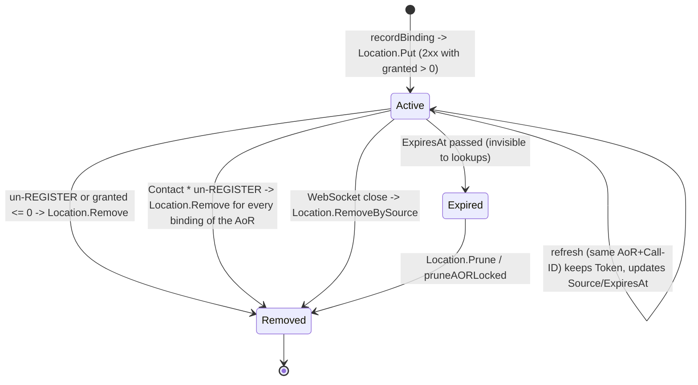
```mermaid
stateDiagram-v2
    [*] --> Active: recordBinding -> Location.Put (2xx with granted > 0)
    Active --> Active: refresh (same AoR+Call-ID) keeps Token, updates Source/ExpiresAt
    Active --> Removed: un-REGISTER or granted <= 0 -> Location.Remove
    Active --> Removed: Contact * un-REGISTER -> Location.Remove for every binding of the AoR
    Active --> Removed: WebSocket close -> Location.RemoveBySource
    Active --> Expired: ExpiresAt passed (invisible to lookups)
    Expired --> Removed: Location.Prune / pruneAORLocked
    Removed --> [*]
```

Transitions: `recordBinding` (`internal/edge/register.go:305-342`) performs the insert and
the removals; `Location.Put` (`location.go:107-148`) is the refresh-in-place
path; `Binding.Expired` (`location.go:48`) is the predicate that hides an
expired entry from `ByToken`/`ByAOR`; `Location.Prune` (`location.go:274`)
and `pruneAORLocked` delete expired entries; `RemoveBySource`
(`location.go:168`) is called from the WebSocket close hook.

`Location` keeps three indexes over one set of bindings: `byToken`, `byAOR`
and `bySource` (keyed by `Binding.Source`). Every insertion goes through
`Put` and every removal through `deleteLocked`, which maintain all three; a
refresh from a new source re-indexes the binding under it. `bySource` serves
`RemoveBySource` (no full scan) and `HasSource(transport, src)`
(`location.go:188`), the INVITE admission lookup (§7.5), which ignores
expired bindings exactly as `ByToken` does. There is no eviction: a full
table refuses a new binding (`ErrTooManyBindings`).

`Binding.Source` is the **transport source of the REGISTER**, never the
Contact host: the far side of the client's NAT pinhole for UDP, and the
pooled connection key for TCP/TLS/WS/WSS. A browser's own Contact typically
names a `.invalid` host, which is exactly why it is replaced; a TCP or TLS
phone's Contact is likewise never dialed.

On the close of a stream connection, `streamConn.Close` calls
`Location.RemoveBySource(ap)` and updates the registration gauge: a stream
registration is reachable only through its own connection (RFC 5626 flow
semantics), so keeping the binding would make FreeSBC accept calls it cannot
deliver.

### 7.5 INVITE classification

`onInvite` (`internal/edge/invite.go:47`) dispatches on the **arrival**
`guard` passed in (§7.1), then on the request:

1. **Admission** (`admitPublicInvite`, `internal/edge/admission.go:81`),
   for an INVITE with no To-tag that did not arrive on the private socket
   — that is, a public out-of-dialog INVITE. It runs first, before
   anything that could answer a scanner. The source is, in order:
   - exactly the transport, IP and port of a live registration binding
     (`Location.HasSource`, an O(1) lookup in the `bySource` index that
     ignores expired bindings) → a **client** call. A WebSocket client's
     INVITE arrives on the connection that registered, whose remote address
     is what its binding records. A registration wins over a carrier
     source, so a client behind a carrier's address is never sent down the
     carrier path;
   - inside a carrier source (resolved `edge.carriers` addresses plus
     `edge.carrier_sources`, held by the carrier directory, §6) → a
     **carrier** call, with the carrier's name;
   - anything else → dropped **silently** (`dropSilently`): the handler
     returns without responding, and sipgo's `Server.handleRequest` then
     calls `TerminateGracefully`, which for a transaction with no final
     response is `Terminate` — it stops `Timer_1xx` (the 200 ms automatic
     "100 Trying"), removes the transaction and sends nothing, so there is
     no response for Timer G to retransmit. A retransmitted INVITE opens a
     fresh transaction and is dropped the same way.

   The switch is not a clause here: it speaks only on the private socket,
   so a public INVITE from its address is judged like any other. The check
   keys on the transport source only, never on From or any identity header.
2. To-tag present → `onReInvite` (§7.9).
3. Arrival on the **private socket** → `invitePrivate`
   (`internal/edge/carrier.go:167`), which classifies by Request-URI alone
   (`classifySwitchRequest`, `carrier.go:91`; details in §6):
   1. the Request-URI, or the topmost remaining Route, carries an `fsbc`
      token → `inviteToClient` (`invite.go:552`): the binding is found by
      the token (`resolveTarget`; there is no address-of-record fallback,
      and an unknown or expired token is **404**);
   2. the Request-URI host[:port] equals an `edge.carriers` entry →
      `inviteToCarrier` (§6);
   3. anything else → **404**. FreeSBC is never an open relay for the
      switch.
4. Otherwise a public INVITE that passed admission → `inviteToUpstream`
   (`invite.go:272`), for a client call or a carrier call alike. A client
   call goes to the node its From user hashes to, at the node's client port
   (`edge.switch`). A carrier call goes to a node chosen by the Request-URI
   user (or pinned by a carrier registration token) at the node's carrier
   port, stamped `X-FreeSBC-Carrier` (§6).

Every path opens its record with `beginDialog` (`invite.go:240`), which
answers **503** while draining (§7.1), **482** for a merged request and **503**
once shutdown has begun (the dialog table is closed).

An offerless INVITE (empty body) is forwarded as it is in every direction;
the offer is the callee's first SDP (§7.9a).

### 7.6 Upstream ordering, failover, cooldown

`hashUpstreamUser(user)` (`internal/edge/topology.go:311`) is FNV-1a 64 over the **lower-cased** user part —
SIP user parts are case-insensitive, and a phone that REGISTERs as "Alice"
and calls as "alice" must reach the switch holding its binding.

`upstreamDialOrder(user, available)`:

```
pool, cooled := orderByAvailability(sortedNames, available)
idx   := hash(user) % len(pool)
order := pool[idx:] ++ pool[:idx] ++ cooled
```

So: the hash-chosen node first, the rest of the available pool in rotation,
then every cooling node at the tail (`upstreamDialOrder`,
`internal/edge/topology.go:337`). `orderByAvailability`
(`topology.go:367`) preserves input
order and, **when every name is cooling, returns the whole set as
available** — a cooldown is a suspicion, not a verdict.

`hashUserFor(req)` (`invite.go:535`) picks the From user part, falling back
to the To user part and then the Call-ID. From is the caller's identity, so
a user's calls land on the same switch its REGISTER landed on (`aorOf`
hashes the same user). A carrier's call hashes the lower-cased Request-URI
user instead, the DID (`carrierHashUser`, `carrier.go:126`).

`cooldownTable` (`internal/edge/cooldown.go`) is keyed by **name, never by
address** (the node's `IP:port`): `Available` is a lazy
expiry check with no sweeper, `Penalize` sets `now + switchCooldown` (30 s), `Recover`
deletes. There is deliberately **no active probing** — no OPTIONS keepalive —
because a carrier's edge would drop or penalize unsolicited health checks.

INVITE failover to the next upstream node happens when the INVITE could not
be sent at all (`TransactionRequest` failed: the node is penalized and the
next one tried), or when the pump returned
`final == nil && !finalised && !responded && clTx.Err() != nil`
(`invite.go:480-486`). `!responded` is an
invariant, not a heuristic: a node that answered had its answer negotiated
and its media relay started, so a second attempt would apply a second answer
and start the relay twice. A 486 is the callee's own judgement and is never
retried.

### 7.7 Dialog record

A dialog is identified the RFC 3261 §12 way: **Call-ID + the caller's tag +
the callee's tag**. `dialogTable` groups records by Call-ID
(`byCallID map[string][]*dialog`) and every lookup but one then matches
tags:

- `lookup(callID, fromTag, toTag)` (`dialog.go:442`) finds a
  **confirmed** record whose tags the request names in either orientation;
  From = caller's tag and To = callee's tag means the request is from the
  caller, the reverse means it is from the callee. A request missing either
  tag names no dialog.
- `early(callID, fromTag)` (`dialog.go:427`) finds the **in-flight**
  record a CANCEL applies to: same Call-ID and the INVITE's From tag
  (RFC 3261 §9.1), so a CANCEL that merely guessed a live Call-ID cannot end
  someone else's call.
- `begin(req, callerPlane, limit)` (`dialog.go:380`) returns a `beginResult`
  and takes the session slot (`t.sessions`, see §7.1) in the same critical
  section that appends the record; it refuses —
  the handler answers **482 Loop Detected** — when an **early** record with
  the same Call-ID and caller tag exists (a merged request, §8.2.2.2), and
  refuses every INVITE once shutdown has closed the table (`beginDialog`,
  `invite.go:240`, then answers **503**), and with `beginFull` once
  `shield.max_sessions` records hold a slot (503 + `Retry-After`, §7.1). A confirmed record with the same
  identifiers is left alone: the new INVITE opens a record beside it. An
  INVITE can therefore never tear down another call by reusing its Call-ID.
- `newestRoutedByCallID(callID)` (`dialog.go:503`) is the one lookup
  that ignores tags. It returns the most recently created record carrying
  the Call-ID whose route has a `publicRemote` (records are appended in
  creation order, so it walks `byCallID` from the end). Only `confirm`
  writes a route, so an early record never qualifies and the choice is in
  effect the newest confirmed dialog. Its only caller is the relaxed NOTIFY
  routing of §7.8 (issue #84).

`dialog` (`dialog.go:213`) holds the Call-ID, both tags, the plane the
caller's in-dialog requests arrive on (`callerPlane`), the state, the
in-flight attempt, the route (`dialogRoute`: the two endpoints' transport
source addresses and their own Contact URIs, `dialog.go:138`), the media
session (attached once, then only closed), the `cancelled`/`callerGone`
flags, the caller's From and To URIs and the highest CSeq each endpoint has
used (what a BYE FreeSBC originates is built from), the early forks, the
relayed 2xx, the set of refused 2xx tags, the offer-slot state below, and
**one `sdpOrigin` per leg**
(`origin [2]sdpOrigin`, indexed by plane). Each leg's id is fixed for the
session's life and its version goes up by exactly one per body that leg is
sent (RFC 3264 §8), so an endpoint sees 1 → 2 across a re-INVITE rather than
jumps caused by bodies built for the other leg. A call that involves a
carrier also records the carrier's name (`carrier`, set once right after the
record is created by `setCarrier`, `dialog.go:682`): it is what routes the
dialog's later requests through the carrier rules of §6 (`carrierLeg`,
`hide.go:286`) and what the admin call list shows (`calls`,
`dialog.go:544`: `carrier:<name>` and `switch:<ip:port>` as the two ends of a
carrier call). **Every mutable field of the `dialog` record is guarded by the
table's mutex**; the attached `mediaSession` guards its own `codecs` and
`applied` fields with its own mutex (`media.go`).

**Offer state.** Three fields keep two offers from ever being in flight in
one dialog (all under the table mutex). `updateOffers` and `reInviteOffers`
(`dialog.go:289`) count the UPDATE and re-INVITE offers FreeSBC has forwarded
and not yet seen answered; `beginUpdateOffer` (`dialog.go:725`) refuses
(**491**, §7.9a) when either is non-zero, and `beginReInviteOffer`
(`dialog.go:744`) when an UPDATE offer is pending. `owed` (`dialog.go:296`) is
the `owedAnswer` (`offerless.go:40`) of a delayed-offer exchange: the callee's
parsed offer, who offered and who answers, the early fork it rode on (nil for
an offer in a 2xx), the INVITE CSeq its ACK must carry, the `release` of the
re-INVITE's offer slot and the backstop `timer`. At most one is outstanding,
and while it is both `beginUpdateOffer` and `beginReInviteOffer` refuse.
`end` stops the timer.

**Forks (early dialogs).** While the record is early, every response of the
forwarded INVITE is attributed to a fork by its To tag (`fork`,
`dialog.go:816`). An `earlyFork` (`dialog.go:182`) holds that fork's own
answer body, the codecs it agreed, the media address it signalled, its
own `o=` identity and **its route** (`route`, `routed`; `setForkRoute`,
`dialog.go:832`, written when the first response with a To tag is relayed,
before it goes out). The fork route is what lets a PRACK or UPDATE in an
**early** dialog be matched and routed: `lookupEarly` (`dialog.go:467`)
matches the caller's tag plus a routed fork tag, `routeFor` (`dialog.go:669`)
gives `retargetInDialog` the fork's contacts, and `directionFor` consults it
for those two methods only. A re-INVITE, BYE, INFO or NOTIFY still needs a
confirmed record. An UPDATE answered in an early dialog updates the fork
(`noteForkUpdate`, `dialog.go:799`: the last body the caller saw, the
callee's media address and codecs, and the media follows this fork), so the
later 18x and the 2xx restate that body; `originFor` (`dialog.go:783`) gives
bodies toward the caller the fork's `o=` identity. The first body a fork sends is negotiated against the
**original** offer (`negotiateFork`, `media.go:474`); a later body on the
same fork is answered with the same bytes again; a body on another fork is
negotiated afresh. The anchored media follows whichever fork answered last
(`followFork` → `pointMedia`, `media.go:549,572`), re-arming the latch when
the address moves; a 2xx from a fork re-points it to that fork. A body-less
2xx on a fork that never answered reuses the answer the media is following
(a far end whose 183 and 200 carry different To tags); with no answer at all
it cannot be anchored. There is still **one media session per record**, so
early media from two forks at once shares one anchor.

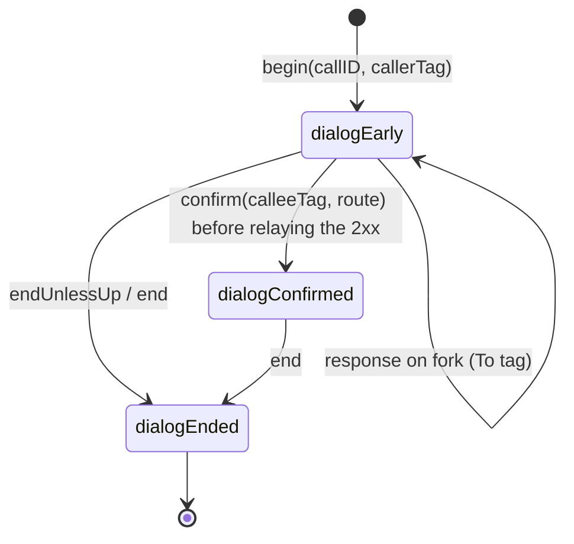
```mermaid
stateDiagram-v2
    [*] --> dialogEarly: begin(callID, callerTag)
    dialogEarly --> dialogEarly: response on fork (To tag)
    dialogEarly --> dialogConfirmed: confirm(calleeTag, route) before relaying the 2xx
    dialogEarly --> dialogEnded: endUnlessUp / end
    dialogConfirmed --> dialogEnded: end
    dialogEnded --> [*]
```

Transitions: `confirm` (`dialog.go:1082`) runs **before the 2xx is
relayed** (`relayInviteResponse` → `commit`, `invite_leg.go:153,385`), so
the ACK the caller sends the instant it sees the 2xx always finds the
record. It records the callee's tag and the route, adopts the confirming
fork's `o=` identity for the caller's leg, drops the fork table, and refuses
when the state is not early, **no media was ever anchored**, or the call has
been cancelled. `endUnlessUp` (`dialog.go:1125`) ends only a still-early
dialog and is deferred by every INVITE path; `end(reason)` (`dialog.go:1144`)
is the single exit for a BYE, the media watchdog, shutdown and a failed
INVITE. `end` is idempotent — the state transition under the table mutex
elects the one caller that does the work, and so the one whose `endReason` is
recorded — and removes exactly this record from its Call-ID's list.

`confirm` releases the lock before touching metrics, then starts **one
goroutine per call**: `<-sess.Done()`, then `d.end(reason)` with the reason
the session reports (`endReasonOf` over `Session.Cause()`, below), and
`onMediaEnd` when that `end` was the one that ended the dialog (see below). That goroutine's
only exit is the session's `Done` channel, so it cannot outlive the call.

**2xx retransmissions and late forks (Timer M).** The INVITE client
transaction is **not** terminated after a 2xx: sipgo keeps it in the RFC 6026
Accepted state until Timer M (64·T1) and passes every later 2xx to the
`OnRetransmission` hook `watch2xx` installs (`invite_leg.go:84-97`). A
retransmission of the confirmed dialog's own 2xx is relayed again — the same
response, never re-negotiated — so one lost 200 on the caller's leg does not
fail the call (RFC 3261 §13.3.1.4, §16.7 step 10). A 2xx from **another**
fork, after the record is confirmed, is a second dialog with no media anchor:
FreeSBC ACKs and BYEs it once (`refuse2xx`, `invite_leg.go:123`) and only
re-ACKs its retransmissions (`reject2xx` remembers the tag). The same
applies to a 2xx FreeSBC cannot anchor and to one that races a CANCEL.

`count()` counts only confirmed dialogs; that is what `ActiveCalls()` reports
(`edge.go:271`). `freesbc_active_sip_dialogs` is a separate mechanism over
the same set: the `Metrics.dialogs` gauge moved by `DialogStarted`/
`DialogEnded` in `confirm`/`end` (`edge/metrics.go:185-186`), sampled
through `Snapshot().ActiveDialogs` (`admin/metrics.go:180`).

An `inviteAttempt` (`dialog.go:117`) holds the request **as forwarded** (so a
CANCEL carries the same top-Via branch) and the **series** cancel function
(never a per-attempt one). `track` deliberately overwrites per attempt, and
the stale entry deliberately survives between two attempts so a CANCEL
arriving in that window still ends the series. `cancelSeries` removes and
returns it, so exactly one caller ever cancels (see the CANCEL paragraph in
§7.8 for `sent`/`cancelled`).

**There is no SIP-level dialog expiry timer.** The only automatic
reclamation of a confirmed dialog is the media silence watchdog, surfaced
through `sess.Done()`. When it is the media that ends the dialog (the
watchdog, or a WebRTC peer whose certificate does not match its
fingerprint), `end()` reports it and the watcher calls the table's
`onMediaEnd` — `byeBothEnds` (`indialog.go:895`, wired at `edge.go:228`) —
which sends **each endpoint a BYE on behalf of the other** (RFC 3261 §15):
From/To and tags from the record, the Request-URI the endpoint's own
Contact, the CSeq one above the highest the other endpoint used, out the
same pinned socket `prepareForward` would use. A BYE toward a carrier masks
the switch's address in From/To the way §6 describes (`sendMiddleBye`,
`indialog.go:905`). Otherwise both would keep a silent call and the switch's
own later BYE would get 481. An early dialog is bounded by
`inviteTimeout = 5 * time.Minute` (`invite.go:24`).

**Why a call ended.** `end(reason)` takes an `endReason` (`dialog.go:45`), a
closed set that is both the `reason` log value and the label of
`freesbc_edge_calls_ended_total` (every label exported from the start, zero
included):

| Reason | Who calls `end` |
|---|---|
| `bye_caller`, `bye_callee` | the BYE path in `onInDialog` (`indialog.go`), for any final `byeEndsDialog` accepts; the side is the BYE's plane against `dialog.callerPlane` |
| `bye_unanswered` | the same path when `forwardAndRelay` failed: the far side never answered the relayed BYE, the requester got a 200 and FreeSBC re-sent the BYE statelessly |
| `rtp_silence` | the media watcher, the session closed by its silence watchdog (`media.CloseSilence`) |
| `dtls_failure` | the media watcher, a browser leg that failed to establish or whose peer could not be verified (`media.CloseLegFailed`: ICE, DTLS or fingerprint) |
| `media_fault` | the media watcher, any other close the dialog did not ask for (a relay goroutine panicked, `media.CloseFault`) |
| `reinvite_refused` | `onReInvite`, a re-INVITE 2xx whose answer cannot be anchored |
| `answer_timeout` | `owedExpired` (`offerless.go`), the 32 s backstop for an answer owed to a delayed offer (§7.9a) |
| `answer_unusable` | the answer to a delayed offer in an ACK or PRACK, or the 2xx answer to an UPDATE, cannot be anchored |
| `shutdown` | `closeAll` |

`internal/media` reports why a session closed without knowing about SIP:
`Session.Cause()` and `WebRTCSession.Cause()` return a `media.CloseCause`
(`CloseRequested`, `CloseSilence`, `CloseLegFailed`, `CloseFault`) that the
winning close stores before `Done` fires, so a later `Close` cannot rewrite
it. `WebRTCSession.Fail` is the close the edge uses when it rejects a leg's
peer itself. `end` logs `"call ended"` at Info for a confirmed dialog only,
with `sip_call_id`, `reason`, `duration` (since `confirmedAt`), `webrtc`,
`carrier` and the media `stats`, and counts the reason; an early dialog that
`endUnlessUp` ends is neither logged nor counted. `byeBothEnds` logs the same
`reason` ("ending the call; sending BYE to both ends").

**Why an INVITE was refused.** A final response the edge itself sends to an
out-of-dialog INVITE goes through `rejectInvite` (`invite.go:148`), which
counts an `inviteReject` (`invite.go:86`) in
`freesbc_edge_invite_rejects_total{reason}` before answering. The set is
fixed and every label is exported from the start:

| Reason | Response | Where |
|---|---|---|
| `early_cap` | 503 | `maxEarlyPerSource` reached for a client source (§7.5) |
| `draining` | 503 + `Retry-After: 30` | `beginDialog`: drain mode is on (§7.1); sent by `rejectBusy`, before a slot, a rate token or a port is taken |
| `shutting_down` | 503 | `beginDialog` once the table is closed; `rejectMedia` for `errShuttingDown` |
| `loop_detected` | 482 | `beginDialog`, the INVITE merges with a call in progress |
| `no_public_side` | 488, 480, 503 | no listener for the INVITE's transport, or for the client's or carrier's leg |
| `webrtc_disabled` | 488 | a call to a ws/wss client with no DTLS identity |
| `no_target` | 404, 503 | a switch INVITE naming no client token or carrier, a client with no binding, a carrier with no resolved address |
| `too_many_hops` | 483 | Max-Forwards exhausted |
| `media_failed` | 488 | no common codec, a renumbered answer, an unparsable or unanchorable body (`rejectInviteMedia`, `invite_leg.go` for an answer that cannot be anchored) |
| `port_exhausted` | 503 | `media.ErrPortsExhausted` |
| `upstream_failed` | 503 | `giveUp`: every switch or carrier attempt failed |
| `timeout` | 408 | `giveUp`: the INVITE's own budget ran out |
| `session_cap` | 503 + `Retry-After: 5` | `beginDialog`: `shield.max_sessions` calls already hold a slot (§7.1); sent by `rejectBusy`, which counts like `rejectInvite` |
| `invite_rate` | 503 + `Retry-After` | `beginDialog`: `shield.invite_rate_limit` exhausted (§7.1) |

Only the handler's own refusal counts. A silent admission drop stays in
`freesbc_edge_admission_drops_total`; a response relayed from the far side is
not the edge's; a re-INVITE refusal (`rejectMedia` from `onReInvite`) is not
an INVITE reject; the 487 a caller's own CANCEL earns is sipgo's. A
retransmitted INVITE is matched to the existing server transaction by sipgo
and never reaches the handler again, so each INVITE is counted once. PRACK/100rel
and delayed offers pass end to end (§7.9a), so there is no 420 or offerless
488 to count.

### 7.8 Forwarding mechanics

`prepareForward(req, from, to, dest, recordRoute)` (`forward.go:41`)
implements RFC 3261 §16.6 in order:

1. `req.Clone()` — the inbound request stays intact for the response path.
2. `annotateVia` (`forward.go:112`): add `received=<host>` when the top Via's
   host differs from the real source, and fill `rport=<port>` **only when the
   client asked for it** by sending an empty `rport` parameter.
3. `stripOwnRoutes` (`forward.go:139`): remove **leading** Route values
   naming FreeSBC, in a loop — after a transport change there are two of
   them (the double Record-Route pair); then `sanitizeExtensions` trims
   `Allow` and `Supported` (§7.3) and `stripInternalHeaders` removes any
   `X-FreeSBC-*` header (§6). Whatever FreeSBC itself stamps for the switch
   is added after `prepareForward` returns.
4. Max-Forwards: fail with `errMaxForwards` (→ **483 Too Many Hops**) when
   the request **arrived** with 0 (RFC 3261 §16.3 step 3); otherwise replace
   the header with a fresh one holding the value minus one, so a request
   that arrives with 1 leaves with 0. It is replaced, not decremented in
   place, because sipgo's `Clone` shares the header pointer with the
   original and every failover attempt re-forwards that original. When the
   header is absent, append `Max-Forwards: 70`.
5. When `recordRoute`: **RFC 5658 double Record-Route** — prepend the
   origin-facing value, then the destination-facing value, so the
   destination-facing one ends up on top. A UAS builds its route set from
   the request's list in order (§12.1.1); a UAC from the response's list in
   reverse (§12.1.2).
6. Prepend our own Via with a fresh branch.
7. Set transport, destination, and `Laddr` from the pinned side.

Record-Route is added on the initial INVITE in every call direction
(public → switch, switch → client, switch → carrier) and **not** on
REGISTER, ACK, BYE/INFO/NOTIFY or re-INVITE.

**Carrier legs.** A request that goes to a carrier takes the same steps and
then `hideToCarrier` (`prepareForwardHidden`, `hide.go:82`): the switch's Vias,
Record-Routes, foreign Routes, private identity hosts and `X-FreeSBC-*`
headers do not leave. `prepareForwardFor` (`hide.go:74`) picks between the
two, `carrierLeg` (`hide.go:286`) decides per request from the dialog's
carrier, and the matching response rewrite is `respHide` (`hide.go:64`). The
rules are in §6; they apply to every in-dialog request of a carrier call
(ACK, BYE, re-INVITE, PRACK, UPDATE, INFO, NOTIFY) because those handlers all go through
`prepareForwardFor` / `relayResponseHide`.

Every outbound request uses `noBuild` (`forward.go:156`), a no-op
`sipgo.ClientRequestOption`: passing *any* option suppresses sipgo's default
request-building pass, which would otherwise add its own
Via/From/To/Call-ID/CSeq. A proxy must send exactly the headers it
assembled.

**Response relay** (`relayResponse` → `relayResponseHide`,
`forward.go:211,219`): clone the response, pop our own Via (failing the relay
if the top Via is not ours or popping would leave none; a response to the
switch on a carrier leg may be left with none, because its own Vias are put
back, `popOwnVia`, `forward.go:173`), run `sanitizeExtensions`, strip
`X-FreeSBC-*`, apply the carrier-leg rewrite for the mode, run the caller's
`adapt`, set the destination to the original request's source, count it, and
respond. A send failure is logged, not returned. `errResponseDropped` is a
shared sentinel that means "keep pumping". `forwardAndRelay`
(`forward.go:256`) is the whole loop for a non-INVITE request: send it,
pump every response back, return the final one.

**100 Trying is never forwarded** (`fsip.Forwardable`, `sip/request.go:19`):
the server transaction generates its own, and a switch that sends 100 with a
single Via would make it unroutable.

**ACK** is forwarded **statelessly** with `WriteRequest` (`onAck`,
`indialog.go:313`), because a 2xx ACK is a separate end-to-end transaction
and sipgo refuses an ACK in `TransactionRequest`. A non-2xx ACK matching a
live INVITE server transaction is absorbed by sipgo's transaction layer. An
ACK that cannot be routed is dropped with no response. An ACK body is only
ever the answer to an owed offer (§7.9a): `takeOwed` matches the answerer's
plane and the INVITE's CSeq, and the body is rebuilt for the far end and kept
(`lastAck`, `dialog.go:301`) so a retransmitted ACK for the same CSeq, sent
when the first never reached the callee, is restated with the same body and
the media is not touched again (it is cleared when the next offer exchange
starts); any other ACK body is dropped. `ackMu` makes a duplicate ACK that
arrives at once wait for the first. An ACK cannot be refused, so an owed answer
that is missing or unusable is forwarded without a body and the call is ended
with a BYE to both sides.

**CANCEL.** When sipgo matches a CANCEL to a live INVITE server transaction
it writes 200 to the CANCEL, then feeds it to the INVITE server
transaction's state machine, whose cancel action fires the `OnCancel` hook
(registered at `invite.go:340`, `:529` and `carrier.go:254`) **while holding
the transaction's FSM lock**; only after the hook returns does the FSM send
the **487** toward the requester itself (sipgo v1.4.3
`sip/transaction_layer.go` `handleRequest`,
`sip/transaction_server_tx_fsm.go` `actCancel`). The hook therefore does no
network I/O: it calls `cancelCall(d, cancelByCaller)` (`invite_leg.go:441`),
which **synchronously** marks the record cancelled (`cancelSeries`,
`dialog.go:977`) — from that instant `confirm` refuses, so a 2xx racing the
CANCEL is ACKed and BYEd, never relayed after the 487 — takes the in-flight
attempt, and hands the CANCEL to a goroutine (`sendCancel`,
`invite_leg.go:466`). `sendCancel` builds the CANCEL from the **forwarded**
request so it carries that branch, sends it on a **5 s** context, and
cancels the series context as soon as it is on the wire (which is what
releases the media promptly instead of waiting on the forwarded INVITE's
transaction timer).

An attempt is **tracked before its INVITE is sent** (`track`,
`dialog.go:928`), so no CANCEL can fall between the send and the
bookkeeping. A CANCEL that takes an attempt whose INVITE is not on the wire
yet does not send its CANCEL (it would overtake the INVITE, be answered 481,
and leave the INVITE ringing); `markSent` (`dialog.go:941`) tells the
sender, which CANCELs the moment the INVITE is out. `track` refuses once
the series is cancelled, so no later attempt starts.

The `onCancel` handler (`indialog.go:381`) only ever sees an **orphan**
CANCEL: it looks up the early record by Call-ID **and From tag**
(`dialogTable.early`) and answers **200** if there was an attempt to cancel
and **481 Call/Transaction Does Not Exist** otherwise, because answering 200
would tell the sender its request was cancelled when nothing was. RFC 3261
§16.10 would have a proxy with no response context forward such a CANCEL
statelessly; FreeSBC deliberately does not. Every INVITE it forwards has a
record here, so an orphan CANCEL that matches none has nothing downstream to
cancel, and relaying it would let any source that knows a Call-ID inject
CANCELs toward the switch.

Once the series context is cancelled, `pumpInvite` does not simply return: it
calls `abandonAttempt` (`invite_leg.go:487`), which CANCELs the branch if no
CANCEL was sent yet and then runs `drainCancelledInvite`
(`invite_leg.go:314`) for `cancelDrain` (300 ms) so the far end's 487 is
still matched by the live client transaction and ACKed by the transaction
layer (RFC 3261 §17.1.1.3). The same helper serves all three INVITE paths
(to the switch, to a client, to a carrier). A 2xx that arrives after the
caller cancelled is never relayed or confirmed: it is ACKed and BYEd.

**FreeSBC's own ACK/BYE.** `ackThenBye` (`invite_leg.go:358`) builds both with
`fsip.TeardownRequest` (`sip/request.go:85`), which follows the dialog's
route set: the 2xx's `Record-Route` list reversed (RFC 3261 §12.1.2), cut by
`OwnRecordRoute(topo.isSelf)` at FreeSBC's own entries, since the INVITE
carried them. A loose router first means `Route` headers and the
Request-URI is the remote target; a strict router first becomes the
Request-URI with the target appended as the last `Route` (§12.2.1.1). The
request is sent to the first route when it names an IP literal, else to the
2xx's transport source (the nearest hop): a hostname route is never
resolved, keeping the edge free of DNS on dialog traffic. `FromListener(side.laddr)`
pins the socket it leaves by, as `forward` pins a relayed request
(`teardownOpts`, `invite_leg.go:392`).

**INVITE backstop (Timer C).** When `inviteTimeout` expires with the caller
still waiting, the pump's `ctx.Done` arm runs `abandonAttempt`
(`invite_leg.go:279`): it CANCELs the pending branch (RFC 3261 §16.8)
and drains for its 487, and `giveUp` (`invite.go:502`) then sends the caller
**408 Request Timeout** (§16.7 step 6). `giveUp` synthesises a caller's
missing final on every INVITE path: nothing when its own CANCEL already got
it a 487 from sipgo, **408** at the backstop, **487** when an orphan CANCEL
ended the call, and the path's own status otherwise. A path that has already
finalised the caller (a relayed final, or the pump's own 488) sends nothing
more: a transaction finalises once. The pump's 488 for an answer it cannot
anchor on a **provisional** also CANCELs that branch, which would otherwise
ring on.

**BYE / INFO / NOTIFY / REFER / MESSAGE / PRACK / UPDATE** (`onInDialog`, `indialog.go:445`): resolve
direction, forward without Record-Route, retarget the Request-URI to the far
end's own Contact, rewrite the Contact, and relay under a **32 s** budget
(`indialog.go:638`). The CSeq of every in-dialog request is recorded per
endpoint (`noteCSeq`, `dialog.go:1015`). On a forwarding failure and
**only for BYE**, FreeSBC makes one stateless re-send attempt toward the far
side and then answers **200** to the requester — answering 408 would tell the
switch its hangup failed and sofia would keep the leg. A BYE ends a dialog
only when its tags name that confirmed dialog **and** the far end agreed:
a 2xx, a 481 or 408 (which end the dialog for the sender too, §12.2.1.2), or
no answer at all (`byeEndsDialog`, `indialog.go:749`). A BYE with tags
that match no dialog is still forwarded — the endpoint answers 481 — but
tears nothing down, and a 401/407 challenge leaves the call up.

An out-of-dialog request (no To tag) from the switch is classified first,
by Request-URI alone (`classifySwitchRequest`, `carrier.go:91`; §6): an
`fsbc` token goes on to `directionFor`; a request addressed to a carrier is
answered **405** here (REGISTER, INVITE and OPTIONS have their own
handlers); anything else is **404**.

NOTIFY takes the generic path whatever its `Event`: the proxy does not
interpret BroadSoft `talk`/`hold` (or `conference`, `refer`); the endpoint
does. FreeSWITCH's in-dialog NOTIFY on an **early** dialog (`Event: talk`
answering a ringing phone) matches no confirmed dialog and is routed by the
`fsbc=` token its Request-URI still carries, like the INVITE. Out-of-dialog
NOTIFY (no To-tag) is decided per plane: from the switch it is forwarded
when the token names a binding FreeSBC holds (MWI, `Event: message-summary`)
and answered **481** otherwise (no target; RFC 6665 §4.1.3); from a public
source it is answered **481** before direction resolution, since a NOTIFY
needs a subscription or a dialog (`indialog.go:446`). A NOTIFY with a To-tag
is first matched against `subTable` and, on a match, forwarded along that
subscription (`indialog.go:478`, §7.8a); only one that matches no
subscription falls through to the dialog rules below.

A NOTIFY from the switch that **has** a To-tag but that `directionFor`
cannot route — its tags name no dialog and its Request-URI carries no
binding token — gets one relaxed lookup before it is refused
(`onInDialog`, `indialog.go:484-486`; `relaxedNotifyDirection`,
`indialog.go:723`; issue #84). FreeSWITCH's `uuid_phone_event` NOTIFY
(`Event: talk` resuming a held call) copies its To header verbatim from
the `sip_full_to` channel variable (mod_sofia's
`SWITCH_MESSAGE_INDICATE_PHONE_EVENT`), so its To-tag can be another leg's
— the captured resume NOTIFY had To identical to From — and the client
accepts it when registered directly to FreeSWITCH. The rule: a NOTIFY that
arrived on the private socket (`inbound.private()`) and whose Call-ID names
a dialog FreeSBC holds is forwarded to that dialog's public side
(`publicRemote`, retargeted to its `publicContact`) and is **never refused
because of its tags**; neither the To-tag nor the From-tag is checked.
When several records share the Call-ID, the most recently created one with
a usable public route wins (`newestRoutedByCallID`, §7.7) — in practice the
newest confirmed dialog, since an early record has no route. It is answered
**481** only when no record carries the Call-ID or none has a public side
to send to. The To header is forwarded verbatim, never rewritten to the
dialog's tag: FreeSBC does not fabricate dialog state. The first relaxed
routing on a dialog is logged at **WARN** (Call-ID, From-tag, stray To-tag,
the dialog's two tags) and every later one at **Debug**, since FreeSWITCH
retries about once a second (`noteRelaxedNotify`, `dialog.go:706`); the WARN
going quiet is the signal that the switch stopped sending the stray tag.
There is no metric: the edge counters are per method and transport, and
none fits a routing decision. The relaxation is NOTIFY-only and
private-plane-only: BYE, INFO and ACK with a stray tag, and every NOTIFY
from a public source, keep exact tag matching (a public one takes the public
fallback below), and the no-To-tag rule above is unchanged.

**Direction resolution** (`directionFor`, `indialog.go:768`):

- A request whose Call-ID and tags name a confirmed dialog is routed by that
  record — `publicRemote` toward the client or carrier, `privateRemote` (the
  winning switch node: a dialog never migrates mid-call) toward the switch —
  **provided it arrived on the plane of the endpoint its tags say sent it**.
  A request that names the caller's tags but came in on the callee's side is
  not treated as that dialog's.
- Otherwise, from the switch: `bindingForRequest(req)` (`invite.go:688`; an
  in-dialog request on a confirmed dialog from the switch carries no binding
  token, so without a record this only helps a pre-dialog request, an
  early-dialog NOTIFY sent to the stored contact, or an out-of-dialog
  NOTIFY); no binding → **481**, except for a NOTIFY with a To-tag, which
  `onInDialog` then routes by Call-ID alone (`relaxedNotifyDirection`,
  above). `directionFor` itself is unchanged by that rule.
- Otherwise, from a public source with no dialog on record: if the source
  is a carrier source that owns no live registration (`carrierFallback`,
  `carrier.go:140`), the request is hashed by the Request-URI user (the DID,
  as its INVITE was) to a switch node and sent to that node's **carrier**
  port (`carrierAddr`); `stampCarrier` (`carrier.go:152`) names the carrier
  and `restoreCarrierRURI` (`hide.go:314`) puts back the Contact the node
  registered when the Request-URI carries a registration token (§6).
  Otherwise it is a client's request and is hashed by `hashUserFor` to a
  switch node's client port. **This fallback deliberately never 481s**; the
  switch answers honestly. Such a request carries no dialog, so nothing is
  torn down on its account.

`retargetInDialog` (`indialog.go:868`) restores the far end's own Contact as
the Request-URI, undoing the topology hiding applied when the dialog was
established: sofia tolerates the SBC's URI, a strict UA does not.

**Inbound target resolution** (`resolveTarget`, `invite.go:681`, via
`bindingForRequest`): the `fsbc` token from the Request-URI, or from the
topmost foreign Route value where a strict-routing element may have moved
it, rejected if empty or longer than **64** characters (`tokenOf`,
`invite.go:704`) and looked up in the location table. There is no
address-of-record fallback: an unknown or expired token finds nothing, and
the INVITE is answered **404**.

### 7.8a SUBSCRIBE, REFER and MESSAGE

**SUBSCRIBE** (RFC 6665, `onSubscribe`, `subscribe.go:379`) creates a dialog of
its own, separate from any INVITE dialog: the SUBSCRIBE and the notifier's
NOTIFYs share a Call-ID and a pair of tags, and the NOTIFYs arrive on the
plane the SUBSCRIBE did not. FreeSBC stays on that path with the same double
Record-Route as a call and keeps one record per subscription in `subTable`
(`subscribe.go:96`), so a NOTIFY is routed only when it matches a subscription
FreeSBC carried.

- A public out-of-dialog SUBSCRIBE is admitted by `admitPublicOutOfDialog`
  (`admission.go:120`): the transport source is the exact address of a live
  registration (`Location.SourceBinding`, `location.go:214`, which also names
  the binding the subscription is charged to; the binding whose user equals
  the From user wins, else the first live one). A carrier source gets **405**;
  anyone else is dropped silently and counted as
  `freesbc_edge_admission_drops_total{reason="subscribe_not_admitted"}`.
  Admission keys on the transport source alone, as for an INVITE (§7.5).
- No `Event` header → **489**. The request goes to the switch node chosen by
  the hash-user pool over the From user (`selectUpstream(hashUserFor(req))`)
  with `prepareForward` (Via, double Record-Route) and FreeSBC's private
  Contact.
- A SUBSCRIBE from the switch with no To-tag (`subscribeToClient`,
  `subscribe.go:438`) is classified by Request-URI (§6.1): a client token is
  delivered to that client with the Request-URI restored to the client's own
  (`clientRequestURI`) and FreeSBC's public Contact; a token naming no binding
  → **404**, a carrier destination → **405**.
- With a To-tag the SUBSCRIBE is a refresh or an unsubscribe and must match a
  record (`lookup`); otherwise **481**. `lookup` also checks that the request
  suits the end that sent it: a NOTIFY from the subscriber's side or a
  SUBSCRIBE from the notifier's side carries the subscription's tags the wrong
  way round, matches nothing and is **481** (`subscribe.go:189`).
- The binding is read at admission and the record made later
  (`beginSubscription`, `subscribe.go:498`), so it is checked again after the
  insert. If the binding left the table in between (`dropTokens` ran before the
  record existed), the record is ended and the requester told **480
  Temporarily Unavailable** (public subscriber) or **404** (switch, whose token
  names nobody).
- Response SDP is stripped and a Contact in the response is rewritten to name
  FreeSBC. The 2xx confirms the record **before** it is relayed
  (`relaySubscribe`, `subscribe.go:537`), so the subscriber never sees a 2xx for
  a subscription whose NOTIFYs would not route. If a 2xx cannot confirm the
  record (it already ended, or the 2xx has no To-tag) it is still relayed and
  a Debug line "SUBSCRIBE 2xx did not confirm the record" gives the reason
  (`subscribe.go:552-562`). The request budget is 32 s (`subscribe.go:567`,
  `:650`).

**Record and matching.** A `subscription` holds the Call-ID, the SUBSCRIBE's
From tag (`subTag`), the notifier's tag (`notTag`, the 2xx To-tag, empty while
pending), the `Event`, the registration token it is charged to, the plane the
SUBSCRIBE came from, the same two-sided `dialogRoute` a call keeps, a deadline
and a state (pending, active). `subTable.lookup` (`subscribe.go:189`) matches by
Call-ID and both tags and accepts a request only from the plane of the end its
tags name: the subscriber's SUBSCRIBE refresh on the subscriber's plane, the
notifier's NOTIFY on the other. A NOTIFY that names the subscriber's tag can
match a record still **pending** (it may beat the relayed 2xx), which teaches
it the notifier's tag and Contact. `forwardInSubscription`
(`subscribe.go:590`) forwards the match to the other end's stored address with
the Request-URI restored to the Contact that end gave and no Record-Route.
The destination follows a NAT remap: for a public-subscriber record
`publicRemote` is updated from the source of each in-subscription request
from the public side (`notePublicRemote`, `subscribe.go:222`,
`subscribe.go:593-598`); for a switch-initiated record, where the client only
answers, the binding is resolved by token at send time and its current source
used, with the stored remote as the fallback (`subscribe.go:599-609`).
Bodies are untouched (`message-summary`, `dialog`, sipfrag).

**Lifetime.** A record is created pending with a deadline of
`2 * subExpiryMargin` (64 s). The relayed 2xx makes it active with a deadline
of the granted `Expires` plus `subExpiryMargin` (32 s); `Expires` is the 2xx's,
else the request's, else `subDefaultExpires` (1 h) (`subExpires`). A 2xx
with `Expires: 0` therefore leaves the record 32 s so the notifier's final
NOTIFY still routes. A 2xx to a refresh resets the deadline. A NOTIFY answered
2xx follows its `Subscription-State`: `terminated` ends the record,
`expires=` moves the deadline. The record ends on a **481** to either request,
on any non-2xx final to the initial SUBSCRIBE, on `prune` (the 30 s ticker,
`edge.go:559`), on `closeAll` at shutdown (`edge.go:526`, `edge.go:597`), and when its
registration binding is removed: `Location` collects the tokens of every
binding it deletes (un-REGISTER, `RemoveBySource` for a closed WS/WSS
connection, expiry in `Prune`, the per-AoR sweep in `Put`) and hands them to
`subTable.dropTokens` through `SetOnRemove` (`location.go:281`) **after** it
releases its own lock, so `Location.mu` is never held when `subTable.mu` is
taken (§11.2).

**Bounds.** `begin` (`subscribe.go:129`) enforces both caps atomically with
the insert: `maxSubsPerBinding` (32) records per registration binding and
`maxSubscriptions` (`defaultMaxBindings`, 20000) in all. Over either, or
during shutdown, the SUBSCRIBE is answered **503** with `Retry-After: 30`
(`subCapRetryAfter`) before anything is forwarded (`beginSubscription`,
`subscribe.go:498`). The reject is logged at WARN ("subscription table full;
refusing SUBSCRIBE", "too many subscriptions on one registration; refusing
SUBSCRIBE") at most once per `subCapWarnEvery` (30 s) per cap, at Debug
otherwise; it is not an admission drop, since the peer was admitted. The
gauge `freesbc_edge_subscriptions` follows the record count (§13.1).

**REFER** (RFC 3515) is in-dialog only and is forwarded unchanged by
`onInDialog`, so `Refer-To`, `Referred-By` and `Replaces` reach the other end
as written and the transfer target's call is that endpoint's own INVITE,
admitted like any other (§7.5). The sipfrag NOTIFYs of a transfer ride the
call's dialog and are routed by it. A REFER with no To-tag is **481**
(`indialog.go:465`); with no matching dialog it is **481** from either plane
(`indialog.go:504`); on a carrier dialog it is **603** with an Info log
("REFER on a carrier dialog declined") and is never forwarded, since its
`Refer-To` would name an address behind the topology hiding
(`indialog.go:511`). A Contact in a 2xx to a REFER is rewritten to name
FreeSBC (`indialog.go:587-597`).

**Unmatched public requests.** For BYE and INFO the generic fallback of
`directionFor` hashes a public in-dialog request that names no dialog to the
switch, which answers 481 itself (§7.8). That would let a REFER, MESSAGE or
NOTIFY with a made-up To-tag past admission, so these three are answered
**481** at the edge instead (`indialog.go:504`).

**MESSAGE** (RFC 3428, `onMessage`, `message.go:33`) is proxied with its body
untouched. In-dialog MESSAGE and any MESSAGE from the switch take
`onInDialog`: a switch MESSAGE with no To-tag is classified by Request-URI like
any switch request (client token delivered, carrier destination **405**,
other **404**; a token naming no binding also **404**, `indialog.go:488-493`). A public out-of-dialog
MESSAGE passes `admitPublicOutOfDialog` (a carrier source gets **405**; an
unregistered source is dropped silently and counted as
`message_not_admitted`), then goes to the hash-user switch node under the
32 s budget (`message.go:67`). A body or `Content-Length` over
`maxMessageBody` (1300 bytes, `message.go:17`) is **413**; the check follows
admission, so an unregistered source still gets silence. A Contact is
rewritten only when the sender supplied one. A Contact in a response (a 3xx)
is rewritten to FreeSBC's side, out of dialog (`message.go:71`) and in dialog
(`indialog.go:587-597`, shared with REFER).

The cap sees the declared length. A `Content-Length` longer than the body
makes the message unparsable and sipgo drops it silently (no response, nothing
forwarded); a shorter one truncates the body to the declared length before
the 413 test (`tooLargeMessage`, `message.go:89`). `TestMessageLyingContentLength`
covers both over UDP and WS.

### 7.9 re-INVITE

On an SDES leg (§8.9) the same offer/answer rules apply to `a=crypto`: the
same line keeps the keys, a new key re-keys in place, FreeSBC repeats its own
key in its offers, and an offer that would drop SRTP is 488 with the keys left
as they were. The same holds for UPDATE, PRACK and delayed offers (§7.9a).

Reached whenever an INVITE carries a To tag (`onReInvite`, `indialog.go:28`).

1. `directionFor` must name a confirmed dialog with a media session, else
   **481**. Forwarding the body as-is here would be the exact leak the
   function exists to prevent.
2. `beginReInviteOffer` claims the dialog's offer slot; with an UPDATE offer
   or an owed answer pending it is **491** (§7.9a). An empty body is an
   offerless re-INVITE: it is forwarded as it is and the exchange continues
   as §7.9a describes; steps 3 and 5-6 below are for a re-INVITE with SDP.
3. Rebuild the offer from scratch against the session's **existing** anchor
   ports (`anchorFor`, `media.go:717`) with the next `o=` version of the leg
   it goes to (`rebuildInDialogOffer`, `media.go:778`); nothing is allocated.
   A re-offer **toward a browser** carries the same DTLS-SRTP block as its
   answers — `UDP/TLS/RTP/SAVPF`, the ICE-Lite credentials, the fingerprint
   and the DTLS role already in use (RFC 5763 §5, RFC 8842 §5.3) — so it
   describes the stream the browser already has. This holds whichever side
   made the initial offer: on a call the switch placed to a browser
   (`buildPublicOffer`, `media.go:620`) the initial offer said
   `a=setup:actpass`, and from the browser's answer on the leg's `DTLSSetup`
   is the negotiated role (`passive` when the browser answered `active`,
   `active` when it answered `passive`), so every later body — re-offer or
   answer — carries that role, never `actpass` again (RFC 8842 §5.5).
   A re-offer that cannot be rebuilt (no relayable codec, or a browser
   re-offer without `a=rtcp-mux`) is refused through `rejectMedia`
   (`invite.go:731`, **488**).
4. Forward without Record-Route (hidden toward a carrier,
   `prepareForwardFor`); **retarget the Request-URI to the far end's own
   Contact** (`retargetInDialog`) and rewrite the Contact. A forward that
   cannot be sent is answered **503**.
5. Relay responses; the first body-bearing response of **this transaction**
   is rebuilt as an answer (`rebuildInDialogAnswer`, `media.go:828`), later
   ones repeat **that** body — never another re-INVITE's, so crossing
   re-INVITEs from both sides (glare) each keep their own plane's answer. A
   `clTx.Done()` yields **408**.
6. On the **2xx** the exchange is complete and the anchor follows it
   (`applyReInvite`, `indialog.go:287`, RFC 3264 §8.3.1-8.3.2): the offerer's
   side is pointed at the address its re-offer signalled and the answerer's
   side at its answer's, through `pointMedia`, which re-arms the latch only
   for a side whose address actually moved. A hold or a session-timer
   refresh that restates the same address leaves the latch alone; a side
   that signalled port 0 or `0.0.0.0` keeps the address it had. The browser
   side of a WebRTC session is never re-pointed: ICE owns it.
7. A **2xx whose answer cannot be anchored** is ACKed (RFC 3261 §13.3.1.4;
   its retransmissions are re-ACKed), the requester is answered **488**, and
   the call is ended with a BYE to both sides: the two ends now disagree
   about the session, and media would flow in a form one of them never
   agreed to.
8. The client transaction is kept until Timer M after a 2xx, and each 2xx
   retransmission is relayed again, as for the initial INVITE.

For a WebRTC leg every in-dialog body toward the browser restates exactly
the same ICE credentials, fingerprint and DTLS role — changing any of them
would look like an ICE restart and tear the media path down. A browser
re-offer that changes its own ICE credentials (an ICE restart) is not
supported.

### 7.9a PRACK, UPDATE and delayed offers

**PRACK and body-less UPDATE.** `onPrackUpdate` (`prack.go:30`) checks that
the tags name a dialog FreeSBC holds, in the early state too (`directionFor`
→ `lookupEarly`, §7.7), else **481**; there is no hashing fallback. The
request then goes through `onInDialog` (§7.8): `prepareForwardFor` (hidden
toward a carrier), `retargetInDialog` from the fork's route while early,
and the response relayed through the hiding path. RAck, RSeq and CSeq are not
rewritten. A response body FreeSBC did not rebuild never crosses: the
PRACK or UPDATE response wrapper in `onInDialog` removes any body from a
response to a PRACK or UPDATE (so SDP on the 200 to a body-less UPDATE or
a PRACK, or on a refusal of an UPDATE with SDP, is dropped), and SDP in a
response to INFO, NOTIFY or BYE; the 2xx answer of an UPDATE with SDP is the
only body that passes, rebuilt. A carrier OPTIONS answer's SDP is removed the
same way. A PRACK carries no Contact, so none is added; an UPDATE's 2xx
Contact is rewritten to FreeSBC's address on the requester's side (RFC 3311
§5.2). A reliable 18x itself needs no handling: `relayInviteResponse` already
rebuilds its SDP (`forkAnswer`), `Require` and `RSeq` pass, and a retransmission
on the same fork restates the stored body without touching the media.

**UPDATE with SDP** (`beginUpdate`, `update.go:42`; `onInDialog`). An
offer, run on the re-INVITE helpers rather than a second engine:
`beginUpdateOffer` claims the offer slot (**491**, not forwarded, when another
UPDATE or re-INVITE offer or an owed answer is pending), `rebuildInDialogOffer`
builds the outgoing body on the anchor ports the session already holds
(nothing is allocated; `o=` from `originFor`, so an early dialog toward the
caller uses the fork's identity), and the 2xx is rebuilt with
`rebuildInDialogAnswer` and applied with `applyReInvite` (`updateExchange.answered`,
`update.go:65`) once it is built. A non-2xx answer (488, 491, ...) changes
nothing; an offer that cannot be rebuilt is refused through `rejectMedia`
(**488**), and a renumbered or unusable answer is refused **488** to the
requester and ends the call (a confirmed dialog: BYE to both ends; an early
one: the INVITE is cancelled), as for a re-INVITE. In an early dialog the
exchange works on the call's session and the fork the tags name, and
`noteForkUpdate` (`dialog.go:799`) makes the later 18x and 2xx restate its
answer. A 2xx without a body is relayed as it is.

**Delayed offers** (`offerless.go`). An INVITE or re-INVITE without SDP is
forwarded as it is (Content-Type removed). The offer is the callee's first SDP
in a reliable 18x or the 2xx; FreeSBC relays it as its own offer and the
caller's answer, in the ACK or the PRACK, as its own answer. Nothing is
pointed or latched before the answer is applied, and no SDP crosses.

- *Initial INVITE.* `inviteLeg.offerless` holds the builder chosen at the
  INVITE (`buildPublicOffer` when the callee is the switch,
  `buildUpstreamOffer` when it is a client or carrier). `offerlessFork`
  (`offerless.go:261`), called from `forkAnswer` for the first fork body,
  allocates and attaches the session, stores the built offer as the fork's
  answer (so a retransmitted 18x or the 2xx restates it, with no
  re-allocation and no `followFork` while the answer is owed), adopts the
  dialog's `o=` identity for the fork and records `d.owed`. A second fork
  that offers once the session exists is refused (`errOfferTwice`: ACK and
  BYE of the 2xx). An SDP in an **unreliable** 18x is not an offer the caller
  can answer (RFC 3261 §13.2.1 wants it in a reliable message), so the body is
  removed from the relayed 18x and nothing else happens.
- *Answer in the ACK.* `onAck` (`indialog.go:313`) takes the owed answer for
  the sender's plane and the INVITE's CSeq (`takeOwed`) and runs
  `answerFromACK`: `prepareOwed` (`rebuildInDialogAnswer` against the offer
  FreeSBC relayed, plus the browser-answer check) then `applyOwed`
  (`startOfferedWebRTC` for a browser, `applyReInvite`). The ACK's body is
  replaced by the rebuilt answer. If the body is missing, unparsable, has
  no common codec or renumbers a payload type, the ACK is forwarded without a
  body and the dialog ends with a BYE to both sides (`byeBothEnds`).
- *Answer in the PRACK* (offer in a reliable 18x). A PRACK with SDP is
  accepted when `owedForPrack` finds an owed answer on the fork its tags name
  from the answering plane (`onPrackUpdate`), else **488** and it is never
  forwarded; an offer in a PRACK is not supported (use UPDATE). The body is
  prepared before forwarding and applied when the callee's 2xx to the PRACK
  arrives (`onInDialog`), after which `owed` is cleared. A PRACK without a
  body is forwarded whatever is owed.
- *Re-INVITE.* `onReInvite` forwards the body-less request and rebuilds the
  2xx's offer toward the requester (`rebuildInDialogOffer`; nothing is
  allocated), sets `d.owed` before the 2xx goes out and keeps the offer slot
  (`keepSlot`) until the ACK, whose answer is handled as above. 2xx
  retransmissions repeat the same offer body.
- *Backstop.* `armOwedTimer` (`offerless.go:159`) starts after a 2xx is
  relayed with an answer owed: if no ACK has supplied it after `ackTimeout`
  (32 s, RFC 3261 Timer H; `edge.go:257`), `owedExpired` drops it and ends the
  call with a BYE to both sides, so a lost ACK cannot leave a half-negotiated
  session or a stuck offer slot.

### 7.10 Carrier legs

The classification of switch requests, the inbound and outbound carrier call
paths, the carrier directory, topology hiding and registration tokens are
described in §6. What belongs to the dialog and forwarding machinery:

- A carrier call uses the same `dialog` record, `inviteLeg` and
  `pumpInvite` as a client call. `calleeKind` (`invite_leg.go:23`) says
  who answers: `calleeUpstream` (the switch answers a public caller),
  `calleeClient` (a registered client answers the switch) and
  `calleeCarrier` (a carrier answers the switch). `calleePlane()`
  (`invite_leg.go:37`) maps it to the media side each fork's answer
  points: private for the switch, public for a client or a carrier. A
  carrier leg is the plain RTP relay, never the WebRTC block.
- **Carrier → switch** is `inviteToUpstream` with a carrier name
  (`invite.go:272`): the dialog begins on the **public** plane and
  `setCarrier` is called, the leg's response mode is `respToCarrier`, and
  the destination is the node's carrier port. A call to a registration's
  Contact is pinned to the registering node alone (`order = [node]`) with
  that Contact as the Request-URI. The early-call cap does not apply
  (`maxEarlyPerSource`, `invite.go:35`); `shield.carrier_rate_limit` bounds
  carriers instead.
- **Switch → carrier** is `inviteToCarrier` (`carrier.go:185`): the dialog
  begins on the **private** plane, `buildPublicOffer(d, body, false)` builds
  the carrier-facing offer, the INVITE is forwarded with
  `prepareForwardHidden` to the carrier's first resolved address (one
  attempt: line selection and failover are the switch's), `commit` records
  `calleeRemote` = that address, transport `udp`, and the leg's response mode
  is `respToSwitch`. An offerless INVITE is forwarded body-less and the
  carrier's first SDP is built into the switch-facing offer (§7.9a); a carrier with no
  resolved address, or no public UDP side, is **503**.
- A carrier's responses to an INVITE going to the switch's side take the
  `relayInviteResponse` path (`invite_leg.go:153`): for `respToSwitch` and a
  1xx/2xx, `addPrivateRecordRoute` (`hide.go:229`) puts FreeSBC's private
  Record-Route in the list the switch will use.
- A dialog's carrier name drives every later message of the dialog:
  `carrierLeg` picks hide/response modes for ACK, BYE, re-INVITE, PRACK, UPDATE, INFO and
  NOTIFY (`indialog.go`), and the carrier request counter
  (`CarrierRequest`, direction `inbound` or `outbound`) is incremented per
  request (`noteOutbound`, `hide.go:305`; `stampCarrier`, `carrier.go:152`).

### 7.11 Edge attempt outcome classification

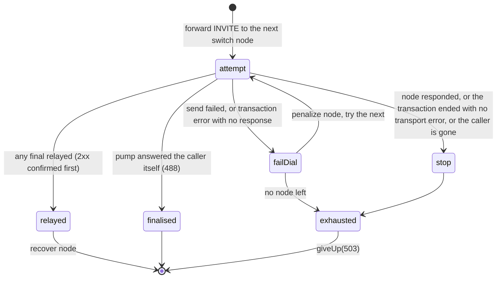
```mermaid
stateDiagram-v2
    [*] --> attempt: forward INVITE to the next switch node
    attempt --> relayed: any final relayed (2xx confirmed first)
    attempt --> finalised: pump answered the caller itself (488)
    attempt --> stop: node responded, or the transaction ended with no transport error, or the caller is gone
    attempt --> failDial: send failed, or transaction error with no response
    failDial --> attempt: penalize node, try the next
    failDial --> exhausted: no node left
    relayed --> [*]: recover node
    finalised --> [*]
    stop --> exhausted
    exhausted --> [*]: giveUp(503)
```

The classification lives in the loop of `inviteToUpstream`
(`invite.go:380-494`) over `pumpInvite`'s `pumpResult`
(`invite_leg.go:207`):

- **Any final response ends the series.** The pump has already relayed it
  (a 2xx confirmed first); a 486 is the callee's own judgement and is never
  retried on another switch node. The node's cooldown is cleared
  (`Recover`).
- **`finalised`**: the pump answered the caller itself with its **488** (an
  answer it cannot anchor); nothing more is sent.
- **Retry only when the node produced nothing at all and the attempt failed
  at the transport level.** `!responded` is an invariant, not a heuristic: a
  node that answered had its answer negotiated and its media relay started,
  so a second attempt would apply a second answer. A transaction that ended
  without a transport error (the shared budget, a node that went quiet
  after answering) is not something another node fixes either.
  A failed node is penalized for `switchCooldown` (30 s, `edge.go:134`) and
  the next in hash order is tried (§7.6).
- A **carrier → switch call pinned to a registration** has exactly one node
  in its order, so a failure is the end of the series.
- Client (`inviteToClient`) and carrier (`inviteToCarrier`) calls have a
  single target and no loop: the pump's result decides between nothing,
  a `giveUp` with the path's status (below), or the pump's own 488.

### 7.12 Response synthesis by path

| Path | No target answered |
|---|---|
| `inviteToUpstream` (public caller or carrier → switch) | **503 Service Unavailable**; **408** at the backstop; nothing after the caller's own CANCEL; **487** after an orphan CANCEL |
| `inviteToClient` (switch → client) | a client that never gives a final is answered for it: **408** when its INVITE timed out (Timer B) or the backstop expired, **480** when its transport failed. Before forwarding: **404** (no binding for the token), **480** (the binding's transport has no public side, or the forward itself failed), **488** (a ws/wss client when no `edge.listen.ws`/`wss` is set, logged as "rejecting call to WebSocket client"; or an answer that cannot be anchored, including a browser answer to a DTLS-SRTP offer that is not a WebRTC body with `a=rtcp-mux`) and **483**; **482** when the INVITE merges with one in progress |
| `inviteToCarrier` (switch → carrier) | a carrier that never gives a final is answered for it: **408** when its INVITE timed out (Timer B) or the backstop expired, **503** otherwise. Before forwarding: **503** (no resolved carrier address, or no public UDP side), **488** (an answer that cannot be anchored), **483**; **482** when the INVITE merges with one in progress; nothing after the switch's CANCEL; **487** after an orphan CANCEL |

On every path the pump's own **488** (an answer that cannot be anchored) is
the caller's one final: `pumpResult.finalised` stops any second one. Every
path answers **503** once shutdown has begun (the dialog table refuses new
records and media, `errShuttingDown`), and a switch request that names
neither a client token nor a carrier is **404** (§6).

---

## 8. Media path

### 8.1 What FreeSBC does to media, precisely

| Operation | Where | Notes |
|---|---|---|
| **Relay** — bytes forwarded uninterpreted | plaintext RTP and plaintext RTCP on the plain `Session` path (phones, carriers and the switch) | the relay loop copies `buf[:n]` from one socket to the other; no RTP header parsing, no SSRC rewriting, no payload-type rewriting, no sequence handling, no jitter buffer (`relay.go:40-76`) |
| **Termination** — a protocol endpoint FreeSBC itself terminates | the DTLS handshake, SRTP/SRTCP and the ICE-Lite agent of a browser leg | the browser's cryptographic association ends at FreeSBC; SDES-SRTP legs (§8.6) are the only other SRTP |
| **Transformation** — re-keying and rewriting | SRTP↔RTP interworking on a browser call (decrypt what the browser sends, encrypt what the switch sends; `webrtcsession.go:209-298`); SDP construction — every body on every leg is built from scratch with `sdp.Build` (§8.8) | the SRTP contexts exist only on a browser leg and an SDES leg (§8.6); SRTCP is unprotected and re-protected like SRTP, only its **contents** are never inspected |
| **Transcoding** | **none, anywhere** | there is no codec conversion in `internal/media`; payload-type numbers must survive end to end, which is why `sdp.ErrRenumbered` rejects a renumbering answer |

**Where data passes through without interpretation:**

- The RTP payload itself, in every direction. The only inspection is SRTP
  protect/unprotect on a browser leg (which pion parses internally) and, on
  that leg only, the RFC 5761 payload-type test that separates RTP from RTCP
  on the muxed socket (`isRTCP`, `stats.go:93`).
- RTCP compounds. They are relayed over their own socket pair (RTP+1) — and
  over the muxed socket for a browser — **never inspected or rewritten**: no
  SSRC fixing, no report-block rewriting, and RTCP CNAME crosses in cleartext
  on a plain leg.
- RFC 4733 DTMF (`telephone-event`) is a payload the proxy carries and never
  interprets; it is in the supported codec set solely so it survives
  negotiation.
- No SDP line crosses legs. The edge reads the audio section's codecs,
  address, port, direction and the browser's ICE/DTLS attributes, and builds
  the other leg's body from those values (§8.8): the peer's `o=` identity,
  `candidate`, `ssrc`, session attributes and any address it did not
  signal for media are never copied.

### 8.2 Port pools

A `PlanePool` owns one **bind** plane: a port range, a bind address, a
silence timeout and the `AllowLoopback` destination policy (§8.4)
(`PlaneParams`, `portpool.go:41`). The edge runs two (`newMediaPools`,
`edge/mediapool.go:20`): **public**, bound to `public.bind`, and
**private**, bound to `private.ip`. Both draw from the one `rtp` range; each
bind IP is its own port namespace, so the pools never hand out the same
socket and each holds `(max-min+1)/2` pairs. Public-side sockets (phones,
browsers, carriers) come from the public pool, switch-side sockets from the
private pool; neither leg can ever be told to send media to the other plane's
address.

`Session` and `WebRTCSession` read each pool's `PlaneParams` **once per
allocation**: `AllocateAcross` reads each pool once (`session.go:355`),
`NewWebRTCSession` reads the private pool once (`webrtcsession.go:80`), and the
pair is bound from that one value (`allocatePairWith`). The range and bind
address come from the startup snapshot, because the address SDP advertises is
part of the topology built at startup, so `rtp` is restart-only; only the
timeout is read live, through `Server.mediaTimeout` (`edge.go:239`), for every
new session. The advertised address is the signalling plane's concern and
reaches SDP only through `sdp.Build.Address`.

**No allocation after shutdown began.** `buildUpstreamOffer` and
`buildPublicOffer` check `dialog.open()` before allocating, and
`dialog.attach` (`dialog.go:629`) closes a session it can no longer hand to a
live dialog (the table closed, or the dialog already ended) and returns
`errShuttingDown`, so nothing allocated during shutdown outlives it.

`sweep` (`portpool.go:131`, behind `allocatePairWith` and `allocateSingle`)
rounds the low bound up to an even port, walks a cursor in steps of 2 wrapping
before the high bound, skips ports already in `inUse`, and binds RTP and
RTP+1 together; a port occupied by another process is skipped rather than
fatal. **RTP is always even and RTCP always RTP+1.** Exhaustion returns
`ErrPortsExhausted`. `allocateSingle` (WebRTC only) is the same sweep but binds
only the even port and **reserves the odd one without binding it**, so a muxed
session still consumes a pair's worth of range.

The pool mutex covers only the **reservation** (`reserveNext`,
`portpool.go:156`): each candidate is taken from the cursor and entered in
`inUse` under the lock, then bound with the lock released, and a failed bind
drops the reservation. Reserving before binding is what keeps "no duplicate
allocation" true under a burst of simultaneous calls; binding outside the lock
means a sweep past ports other processes hold never stalls `Stats`, `release`
or another allocation on the plane.

`Stats()` returns `(inUse, total)` (`portpool.go:176`), where `total` is
`(hi - lo + 1) / 2` after the even-bump, clamped to 0.

Deployment sizing: **one pair per call per plane**. A plain call (phone or
carrier) consumes 1 pair from the public pool and 1 from the private pool; a
browser call consumes 1 reserved pair (1 bound socket) from the public pool and
1 pair from the private pool. The `rtp` range therefore bounds concurrent calls
at `(max-min+1)/2` per plane.

### 8.3 `media.Session` — the four-socket relay

A `Session` is the plain RTP path used for phones, carriers and the switch. It owns **4 UDP sockets** (2 port pairs: side A from the public pool, side B from the private pool), 4 latches (RTP and RTCP
per side), 4 relay goroutines, 1 watchdog goroutine, and one `done` channel.

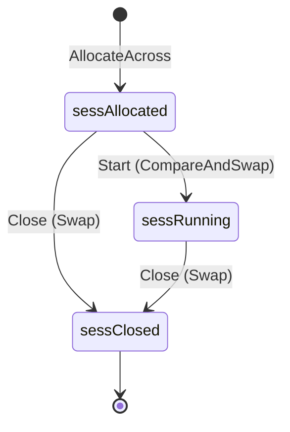
```mermaid
stateDiagram-v2
    [*] --> sessAllocated: AllocateAcross
    sessAllocated --> sessRunning: Start (CompareAndSwap)
    sessAllocated --> sessClosed: Close (Swap)
    sessRunning --> sessClosed: Close (Swap)
    sessClosed --> [*]
```

Transitions: `Start` (`relay.go:19-32`) is a single
`CompareAndSwap(sessAllocated, sessRunning)` and returns whether *this* call
started it, so the relay starts at most once whichever path wins; `Close`
(`session.go:462-478`) is a single `Swap(sessClosed)` that closes both pairs,
releases both port reservations and closes `done`, making it idempotent and
safe from any goroutine. Transitions only ever move forward.

`Start` launches, in order: RTP A→B, RTP B→A, RTCP A→B, RTCP B→A, and the
watchdog. **A session that is allocated but never started has no watchdog**,
so an INVITE abandoned before the answer holds its ports until someone calls
`Close`.

The per-packet loop, per direction and kind:

```
read from the `from` side's socket        (up to maxPacketSize = 1508 bytes)
larger than maxPacketSize? -> drop        // never forward a truncation
inLatch.accept(src)?  no -> drop
srtpIn[from] != nil   -> unprotect in place; failure -> drop
lastRx[from].Store(now)                    // T-22: only after proof
counters.recordRx(from, rtpKind, len)
srtpOut[to] != nil    -> protect in place; failure -> drop
outLatch.target() != nil -> write from the `to` side's own socket
```

Every relay loop (this one and the `WebRTCSession` directions) reads
into one buffer of `relayBufSize` = `maxPacketSize + 1 + srtpMaxOverhead`
bytes (`relay.go:81`): one byte more than the largest datagram relayed, so an
oversize one is detected and dropped rather than forwarded cut short
(`ReadFromUDP` truncates silently), and room for the SRTP overhead so the
browser leg's transforms run in place. The per-packet path allocates nothing.

Packets are sent **from the `to` side's own socket**, so the far remote sees
the port it already talks to. A `nil` destination (the far side has not
latched or been seeded) means the packet is dropped.

Every relay goroutine carries `recoverRelayPanic`, which logs the panic and
stack and calls `Close` — a panic kills one session, never the process.

### 8.4 Latching

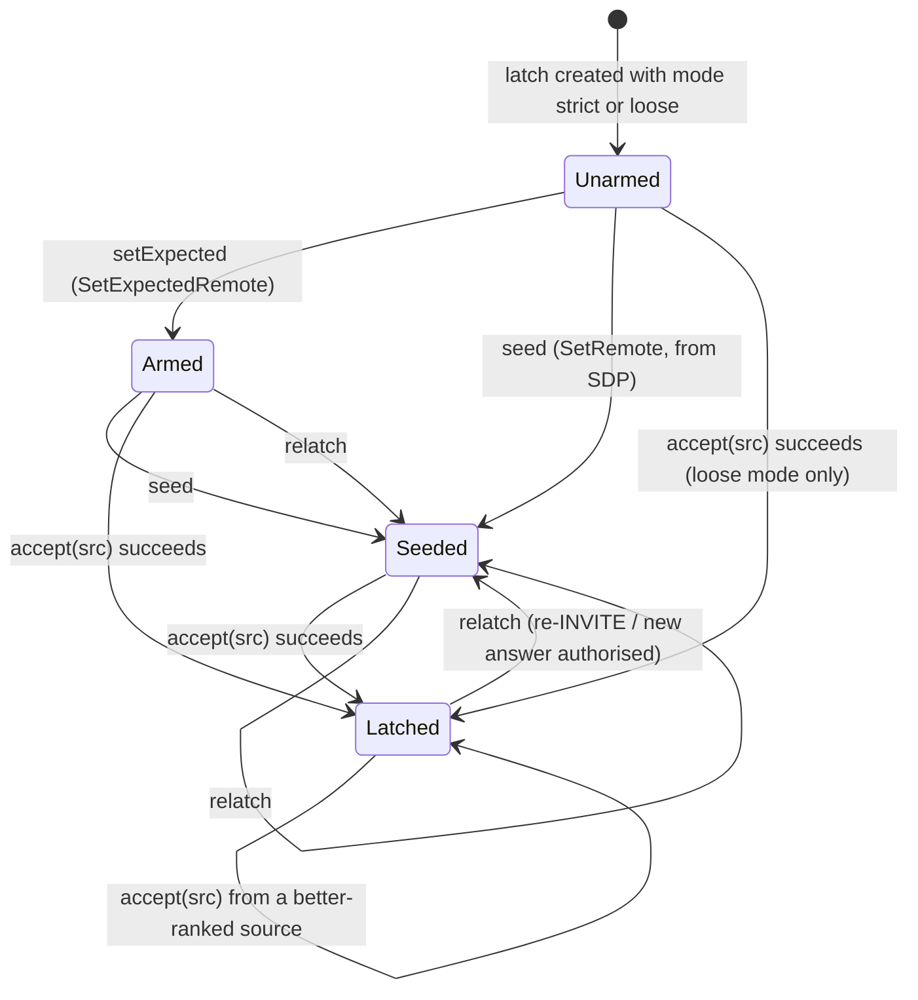
```mermaid
stateDiagram-v2
    [*] --> Unarmed: latch created with mode strict or loose
    Unarmed --> Armed: setExpected (SetExpectedRemote)
    Unarmed --> Seeded: seed (SetRemote, from SDP)
    Armed --> Seeded: seed
    Seeded --> Latched: accept(src) succeeds
    Armed --> Latched: accept(src) succeeds
    Unarmed --> Latched: accept(src) succeeds (loose mode only)
    Latched --> Latched: accept(src) from a better-ranked source
    Latched --> Seeded: relatch (re-INVITE / new answer authorised)
    Seeded --> Seeded: relatch
    Armed --> Seeded: relatch
```

Transitions: `setExpected` (`session.go:110-114`) records the expected source
IP; `seed` (`session.go:178-194`) records the expected IP, the exact
signalled address **and** a provisional send-to destination (`dst`) from
SDP, never touching the latched `remote`; `accept` (`session.go:233-251`) is
the gate the relay calls per packet and is what sets `remote` and its `rank`;
`relatch` (`session.go:145-154`) takes the newly signalled address (IP
**and** port), sets the expected IP, clears `dst`, the signalled address,
`remote` and `rank` — unconditionally, from **any** state — and then seeds
the new address, so the side keeps
receiving media after an authorised move even if it never sends first (a
recvonly peer, an IVR waiting to hear audio). An address with no usable
port only re-arms the source check (`Armed`).

**What `seed` will send to** (`unicastMediaAddr`, `session.go:199`): the
unspecified address (RFC 3264 §8.4 hold), multicast, the IPv4 broadcast
address and link-local addresses are never installed, nor do they change
the expected source. A loopback address arms the source check but becomes
a destination only when the side's pool allows it
(`PlaneParams.AllowLoopback`): the edge sets it for a media plane whose bind
or advertised address is loopback (`edge/mediapool.go:31`) — a single-host
lab or the test suites. Anywhere else a
client's SDP could point the SBC's media socket at a service on its own
host. The policy is read once per session, at allocation. `internal/sip/sdp`
enforces the same classes one step earlier: `Parse` refuses multicast,
broadcast, link-local and (unless `ParseOptions.AllowLoopback`, which the
edge derives from its media addresses, `edge/media.go:269`) loopback `c=` addresses
with `ErrNotUnicast`, and reports `c=0.0.0.0`/`::` as `Audio.Hold` with no
`Address`.

Acceptance rules in `accept`. Every source is ranked by how well
signalling vouches for it (`latchRank`, `rankOf` at `session.go:211-229`):

1. **exact**: the exact IP **and** port the side's SDP signalled;
2. **signalled**: the expected IP from another port (a NAT that rewrote the
   port), or the IP the side's SIP came from (`SetSignallingSource`, set by
   the edge on its public leg: a phone behind NAT whose SDP carries its
   private address sends RTP from the public IP its SIP came from);
3. **any**: every other source — loose mode only. In strict mode a source
   whose IP is not the expected one (compared `Unmap`ed), or any source
   before an expectation exists, is rejected outright.

A packet from the latched source is always accepted. Any other packet is
accepted only if it ranks **strictly above** the latched source (or, before
latching, above nothing), and then it re-latches. So the first acceptable
packet latches as before, an equally ranked newcomer is dropped (the
post-latch hijack rejection), and an **exact** latch is final. What this
buys (P2-EDG-001): an off-path source that sprays the loose public port
before the phone speaks wins at most an *any* latch, which the phone's first
packet from its SDP address or its SIP IP takes back.

**Delayed learning** (`LearnDelay` = 3 s, `target` at `session.go:264-274`):
when the SDP address was installed as a destination and **is** the IP the
side's SIP came from — no NAT between them, so the endpoint should be
sending from it — a below-exact latch does not become the destination until
`LearnDelay` after it latched; until then audio keeps going to the SDP
address. A packet from the exact address meanwhile latches at once. Modelled
on rtpengine's delayed endpoint learning: a symmetric endpoint never waits,
one whose port was rewritten loses at most 3 s of inbound audio, and a
packet sprayed at the port from the phone's own IP (another host behind the
same NAT) does not redirect the call's audio. When the SDP address differs
from the SIP source (the NAT case, or a carrier whose media and signalling
addresses differ), or no SIP source is known (the private leg never has one), learning is
immediate.

**Symmetric RTP**: the seeded destination is overridden by the first
*accepted* packet's real source address and port; afterwards only a
better-ranked source or an explicit `relatch` from the signalling plane
moves the latch. The
local port never changes across a re-INVITE.

Plane defaults:

| Plane / leg | Mode | Set by |
|---|---|---|
| Public leg (side A): phone, or a carrier in either direction | **loose**, with the far end's SIP source IP as a signalled source | `allocateRTP` (`edge/media.go:229`; a caller's leg, source = the INVITE's source address, which for an inbound carrier call is the carrier's) and `buildPublicOffer` (`:620`; a callee's leg), whose answer `negotiateFork` ranks by the address the INVITE was sent to (`media.go:537-542`; for an outbound carrier call, the carrier's resolved address). A phone behind a hard NAT cannot be trusted to signal the source its RTP comes from |
| Private leg (side B): the switch | **strict** | the switch's signalled address is trustworthy, and strict already tolerates a NAT-rewritten port |
| WebRTC public leg | none: ICE fixed the peer and SRTP authenticates every packet | |
| WebRTC private leg | strict | `WebRTCSessionConfig.PrivateLatch` (`edge/media.go:299`, `:375`) |

The edge seeds both sides from the signalled address: side A from a client's
or carrier's offer (`allocateRTP`), side B from the switch's offer
(`buildPublicOffer`), and the answering side from its answer (`pointMedia`, §8.9).
### 8.5 Silence watchdog

`watchdog(timeout, &lastRx, done, Close)` ticks at `timeout/4`, floored at
**10 ms** (`relay.go:91`). `lastRx` holds **one timestamp per sending side**, and the
watchdog calls `Close` when **either** is older than `timeout`: a call is
reclaimed when one end has gone silent, even while the other keeps
streaming (the switch playing music on hold to a phone that vanished with
its BYE lost). RTP and RTCP both count, so a receive-only side that sends
RTCP receiver reports (RFC 3550; RFC 3264 §5.1 keeps RTCP flowing on hold)
stays alive. A held endpoint that sends **neither** RTP nor RTCP for the
timeout is reclaimed.

`timeout` is the constant `rtpSilenceTimeout`, **5 minutes** (`edge.go:130`),
read through `Server.mediaTimeout` when the pool's params are read at
allocation (from **pool A** even though the two sides come from different
pools). A `WebRTCSession` tracks the browser (side A) and the switch (side B)
the same way, with its default timeout taken from the private pool's params
(`webrtcsession.go:85-88`). Only tests shorten it (`setRTPTimeout`,
`edge.go:243`).

`lastRx` is refreshed **only after a packet is proven genuine**: latch
acceptance for a plain leg, and successful SRTP authentication on a browser
leg. That gating is what stops a party who knows the latched source address
from keeping a dead call alive with junk.

The watchdog is the backstop for a half-dead call whose BYE was lost. It
fires the per-dialog media watcher goroutine, which calls
`dialog.end(endRTPSilence)` (the session records `media.CloseSilence` before
`Done` fires, and `Cause()` reports it) and then sends a BYE to both
endpoints (`byeBothEnds`, wired at `edge.go:228`; §7.7). The call is counted
in `freesbc_edge_calls_ended_total{reason="rtp_silence"}` and its `"call
ended"` line carries `reason=rtp_silence`. That watcher is launched by `confirm` (`dialog.go:1082-1121`), so it
exists only for a **confirmed** dialog; an early one is reclaimed by
`endUnlessUp` and the 5-minute `inviteTimeout` (`invite.go:24`, which
CANCELs the branch and answers 408) instead.

### 8.6 SRTP

SRTP exists on two kinds of public leg. A browser leg is keyed by DTLS
(RFC 5764). A plain-`Session` leg can instead be an **SDES leg** (RFC 4568),
keyed by `a=crypto` lines in the SDP when `edge.srtp` or the carrier's `srtp`
allows it (§7.9, §8.9); with the policy `off` the plain `Session` carries RTP
and RTCP in the clear and the `a=crypto` lines are ignored. The switch side is
always plain.

An SDES leg keeps the ordinary UDP port pair and latch. `media.Session.SetSDESRemote`
sets the key the peer protects with (the relay unprotects what arrives from
that side) and `SetSDESLocal` the key FreeSBC protects with; the same key
again is a no-op and a new key replaces the context in place. As soon as
either key is set the side is an SDES side and a direction without its key
drops (counted in the leg stats), so it fails closed. There is no rtcp-mux:
RTCP stays on RTP+1, and a packet that fails authentication neither latches the
leg nor counts as activity for the silence watchdog (§8.5). The media package
never parses SDP.

`SRTPContext` wraps pion's lockless `*srtp.Context` behind a mutex, because
the RTP and RTCP goroutines of one direction share it. Replay protection is
explicitly enabled — pion's default is none — with windows **64** for SRTP
and **128** for SRTCP, per context (`newContext`, `srtp.go:94`). It is
pion's own sliding-window detector (`replaydetector.New`, what
`SRTPReplayProtection` installs), plugged in through
`SRTPReplayDetectorFactory` behind `tokenReplayDetector`, which uses the
detector's `CheckSeq`/`Accept` token API instead of `Check`: `Check` returns
a fresh closure per packet.

**No per-packet allocation.** pion is always given a header to reuse and a
destination buffer. The relays call the `…Into(dst, pkt)` variants on their
own read buffer, so protect and unprotect run in place. `protectRTP`,
`unprotectRTP` and the RTCP pair leave their input untouched and return a
slice of a per-context 16 KiB slab that is only ever appended to, so a
returned slice is never overwritten and one allocation serves about 80
packets. **A plaintext RTP packet carrying a Cryptex (RFC 9335)
header-extension profile, `0xC0DE` or `0xC2DE`, is refused by `protectRTP`
and `protectRTPInto`** (`hasCryptexProfile`, `srtp.go:78`): those profiles
mean "encrypted header extension" to the receiving side, and Cryptex is not
negotiated, so the SRTP could never be unprotected.

Two profiles are offered in the DTLS handshake: `SRTP_AES128_CM_HMAC_SHA1_80`
and `_32`. The contexts are built from the exported keying material by
`newSRTPContextFromKeys` (`srtp.go:254`), which checks key and salt lengths
against the negotiated profile.

On any protect/unprotect failure the packet is dropped with a bare
`continue`: no counter, no log, no distinction between a bad auth tag, a
replay and a malformed packet. The call stays up; the only observable effect
is that `lastRx` was not refreshed.

### 8.7 WebRTC leg (browsers only)

The leg deliberately does **not** use `pion/webrtc.PeerConnection`. FreeSBC
owns the media session, the SDP and the leg lifecycle; pion supplies
protocol primitives only: `ice.Agent` for connectivity checks, `dtls.Conn`
for the handshake and key export, `srtp.Context` for the transforms.

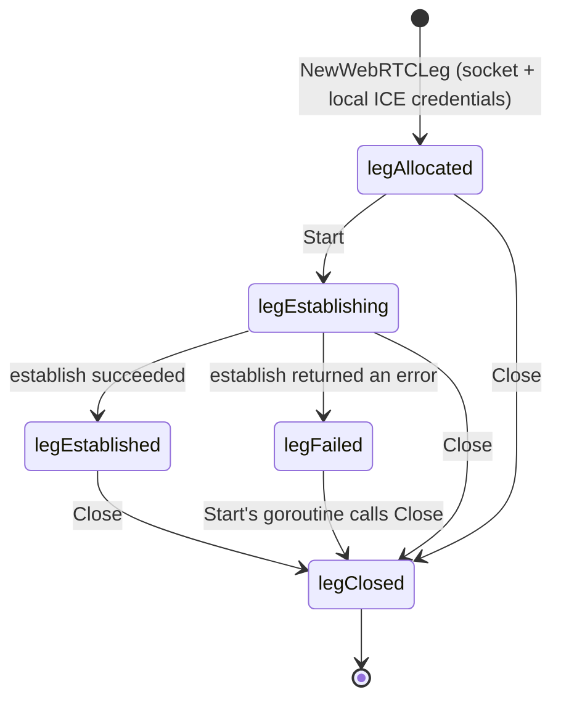
```mermaid
stateDiagram-v2
    [*] --> legAllocated: NewWebRTCLeg (socket + local ICE credentials)
    legAllocated --> legEstablishing: Start
    legEstablishing --> legEstablished: establish succeeded
    legEstablishing --> legFailed: establish returned an error
    legFailed --> legClosed: Start's goroutine calls Close
    legAllocated --> legClosed: Close
    legEstablishing --> legClosed: Close
    legEstablished --> legClosed: Close
    legClosed --> [*]
```

Transitions: `NewWebRTCLeg` (`webrtcleg.go:212`) leaves the state at the
zero value `legAllocated`; `Start` (`webrtcleg.go:384`) claims
`legAllocated → legEstablishing` under `mu` and spawns `establish` — a second
`Start`, or a `Start` after `Close`, is a no-op, so no second ICE agent can
be built over the same socket; that goroutine sets `legFailed` and
immediately calls `Close` on error (`webrtcleg.go:411-412`) or
`legEstablished` on success (`:414`); `Close` (`webrtcleg.go:810`) sets
`legClosed`, which `set` (`:137-140`) treats as terminal. The first error
recorded wins, and a leg closed before it was established is retroactively
stamped with `"webrtc leg closed before it was established"`.

`Close` during establishment releases everything: it cancels `establish`'s
context and snapshots the mux/agent/demux handles once, and `establish`
hands every handle it creates to the leg through `keep` (`webrtcleg.go:427`),
which refuses once the state is `legClosed` — `establish` then closes that
handle itself and returns. The DTLS connection is tied to the leg's `closed`
channel as soon as its handshake succeeds, so a keying failure after the
handshake no longer leaks it.

`establish` runs under **one deadline covering ICE and DTLS together** —
`Start(ctx, timeout)` with `timeout <= 0` meaning **30 s**:

1. `ice.NewUDPMuxDefault` over the single allocated socket.
2. `ice.NewAgentWithOptions(WithICELite(true), WithCandidateTypes([host]),
   WithNetworkTypes([UDP4, UDP6]), WithIncludeLoopback(), …)` — the
   options-based constructor (the `AgentConfig` one is deprecated in
   pion/ice v4) — a genuine ICE-lite agent, host candidates
   only, **no STUN and no TURN servers configured**. The candidate handler is
   intentionally empty: FreeSBC does not use gathered candidates in SDP; it
   advertises exactly one host candidate at `public.ip`. Gathering exists only to give the agent a local candidate to
   answer connectivity checks from.
3. `agent.Accept(ctx, remoteUfrag, remotePwd)` — a lite agent is always
   controlled, so `Accept` is correct regardless of which end offered.
   Connectivity checks are handled entirely inside pion; this package never
   sends binding requests and never nominates.
4. `newDemux(iceConn)` splits the single socket by RFC 7983 first byte:
   20-63 DTLS, 128-191 SRTP/SRTCP, **everything else dropped** — STUN is
   already consumed by the ICE agent, and a single hostile datagram must not
   be able to tear down a live call's media path. Buffers: 64 KiB for DTLS,
   1 MiB for SRTP; a full buffer drops the packet rather than blocking the
   read loop, which would stall the other endpoint too.
5. DTLS via `dtls.ServerWithOptions`/`ClientWithOptions` (the
   `dtls.Config` constructors are deprecated in pion/dtls v3) with the
   process identity, offering `SRTP_AES128_CM_HMAC_SHA1_80` and `_32`,
   `WithInsecureSkipVerify(true)` and, as server,
   `WithClientAuth(RequireAnyClientCert)`. The peer certificate is
   self-signed by design and there is no PKI to verify a chain against; the
   binding to the session is the `a=fingerprint` line. When the leg was
   given it (`WebRTCLegConfig.RemoteFingerprintHash`/`Value`, which the edge
   always sets from the offer), `WithVerifyPeerCertificate` checks the
   leaf certificate against it during the handshake, and a mismatch fails
   the handshake with `ErrFingerprintMismatch` — before any key is derived
   or any packet relayed. Because pion calls that hook only when the peer
   sent a certificate, the leaf the handshake ended with is re-matched from
   `ConnectionState` before keying as well, in either DTLS role.
6. `HandshakeContext(ctx)` is run **explicitly** under the establishment
   deadline, so a peer that opens the flow and then goes quiet cannot pin the
   port past the timeout.
7. `deriveSRTP` exports `EXTRACTOR-dtls_srtp` keying material, splits it
   into client/server key and salt, and assigns roles by
   `l.dtlsClient`. **Re-keying and ICE restart are not supported**: keys are
   set exactly once, and a browser that renegotiates has its DTLS records
   absorbed rather than applied.

**DTLS identity.** One self-signed ECDSA P-256 certificate per process
(`media.ProcessDTLSIdentity`, `dtlscert.go:44`), generated on first use and
shared by every session. `edge.New` builds it only when `edge.listen.ws` or
`wss` is set (`edge.go:229-234`); there is no certificate file. WebRTC binds
the certificate to a call through the `a=fingerprint` line, not through the
certificate being unique or trusted.

**DTLS role**: `dtlsClient` is true only when the browser explicitly sent
`a=setup:passive`. `actpass`, `active` and an absent `a=setup` all make
FreeSBC the DTLS **server**, advertised as `a=setup:passive` — the
conventional pick for a gateway with a stable address (RFC 5763 §5).

**Offerer leg** (a call FreeSWITCH places to a browser, §8.9): built with
`WebRTCLegConfig.Offerer`, it has its socket and local ICE credentials but
no remote half, and `DTLSSetup` reports `actpass` for the offer. The
browser's answer supplies the remote ICE credentials, fingerprint and role
through `SetRemote` (`webrtcleg.go:320`) — `active` or an absent
`a=setup` makes FreeSBC the DTLS server, `passive` the client, and
`actpass`/`holdconn` are refused as roles an answer may not take; a
restated identical remote is a no-op and a different one
`ErrRemoteMismatch`. `SetRemote` is accepted only in `legAllocated`, under
`mu`, which is also the happens-before edge to `establish`'s reads.
`Start` on an offerer leg whose remote was never supplied fails it at once
with `ErrICEFailed` and closes it, rather than running ICE against empty
credentials until the deadline. From `SetRemote` on, `DTLSSetup` reports
the negotiated role, and the rest of the lifecycle is the same as for a
browser-originated leg.

**Fingerprint verification** is the only binding between the signalling
identity and the media path, and **media is gated on it**: the leg's
`verified` flag is set when the in-handshake check passed or when a later
`VerifyFingerprint` succeeds, and both relay directions of `WebRTCSession`
drop every packet (without refreshing the watchdog) while it is false. A leg
built without a signalled fingerprint therefore establishes but carries no
media until `VerifyFingerprint` succeeds. `VerifyFingerprint` requires the
leg to be ready, accepts `sha-256`, `sha-384` and `sha-512` (the set
`internal/sip/sdp` parses), hashes the peer's leaf certificate and compares
case-insensitively; a mismatch clears `verified`. The edge passes the
offer's fingerprint into the leg config, so a mismatch surfaces as
`WebRTCSession.Start` failing with `ErrFingerprintMismatch`; it still calls
`VerifyFingerprint` after `Start` as a re-check, and tears the session down
on either failure, logging neither fingerprint.

**ICE credentials** are 3 random bytes → 4 base64url characters (ufrag) and
18 bytes → 24 characters (pwd). They are secrets: anyone who learns the pwd
can answer connectivity checks and take over the media path, so they are
never logged at normal levels.

`WebRTCSession` joins the leg to a private port pair from the private pool
(`NewWebRTCSession`, `webrtcsession.go:79`). Its `Start` (`webrtcsession.go:150`) waits for
the leg to be ready, fetches the SRTP contexts and the muxed connection, and
launches 3 relay goroutines (`publicToPrivate`, and `privateToPublic` for RTP
and RTCP) plus a watchdog. On the public side **rtcp-mux is assumed**: RTP
and RTCP are separated by the RFC 5761 payload-type range, not by socket.
`Close` closes the private pair, releases its port, and closes the leg. The
demultiplexer reads into a `maxPacketSize` = **1508**-byte buffer
(`mux.go:54`) — the MTU plus room for an SRTP tag on an already-full
packet — and the WebRTC relay loops read at most that much into a
`relayBufSize` buffer, as the plain `Session` relay does (§8.3); the
private-side loops drop an oversize datagram the same way.

**rtcp-mux is not supported on the plain `Session` path** (phones and
carriers). There is no muxing
logic; a peer that muxed RTCP onto the RTP port would have its RTCP fed into
the RTP forward loop.

### 8.8 SDP construction

`internal/sip/sdp` is a typed, bounded parse of only the parts an SBC acts
on, built on `pion/sdp/v3` with **no string manipulation of SDP anywhere**.

Parse limits: `MaxSize = 16 KiB`, `MaxMediaDescriptions = 16`,
`MaxAttributes = 256` (session level and per media section),
`MaxCodecs = 128`. Sentinels: `ErrTooLarge`, `ErrNoAudio`, `ErrAudioDeclined`
(every audio section is at port 0; it wraps `ErrNoAudio`), `ErrNoAddress`,
`ErrNoCommonCodec`, `ErrRenumbered`.

In the audio section's format list a non-numeric token fails the body, while a
number above 127 (including one above 255) or a repeated number is skipped. An
`a=rtpmap` encoding name must be 1-64 letters, digits, `-`, `_` or `.`
(`validEncodingName`); any other name makes that codec unusable, which is what
lets `Describe` put codec names in log lines.

Parsing selects the **first `m=audio` section whose port is non-zero**, so a
declined stream followed by a live one still works. Connection addresses must
be literal IPs — **hostnames are rejected, never resolved**: the proxy must
not perform DNS on behalf of an untrusted body. Session-level attributes are
applied before media-level ones, so media wins.

Only these attributes are understood: direction (`sendrecv`/`sendonly`/
`recvonly`/`inactive`), `ice-ufrag`, `ice-pwd`, `setup`, `fingerprint`,
`rtcp` (the port only; the optional address is discarded as topology),
`rtcp-mux` (`Audio.RTCPMux`). Everything else — including `candidate`, `ssrc`, `extmap`,
`ptime` — is dropped. `a=crypto` is parsed into `Audio.Crypto` and built from
`Build.Crypto` (`internal/sip/sdp/crypto.go`); an audio section with crypto lines
is `RTP/SAVP` and one without is `RTP/AVP`. `sdp.RedactCrypto` rewrites
`inline:<key>` to `inline:[redacted]`.

ICE tokens are sanitised to alphanumerics plus `+`, `/`, `-` and `_`
(`sanitizeICEToken`, `internal/sip/sdp/sdp.go:557-570`) — the RFC 5245 ice-char set widened to base64url, which is
the alphabet FreeSBC's own credentials use (`webrtcleg.go:856-863`) — with the
RFC 5245 §15.4 lengths: `ice-ufrag` 4-256, `ice-pwd` 22-256. Any other byte —
CR/LF above all — or length rejects the whole token, because
the token is copied into the SDP generated for the other leg. Fingerprints
accept only `sha-256`, `sha-384` and `sha-512`, each pair two hex digits
(`isHexByte`); SHA-1 is rejected.
`Audio.WebRTC()` requires a `TLS` proto token **and** a fingerprint **and**
both ICE credentials.

Codec policy lives in the **edge**, not in `sdp`
(`internal/edge/codecs.go:9-42`): `supportedCodecs` is a closed set — `pcmu`,
`pcma`, `opus`, `telephone-event` — and `filterCodecs` preserves **order and
payload-type numbers**. The `sdp` package holds no codec policy of its own
(`internal/sip/sdp/sdp.go:8-10`); it only parses, intersects and renders. `Negotiate(offer, answer)` returns the intersection in **offer
order with offer payload numbers and answer FMTP**, fails with
`ErrNoCommonCodec` when nothing usable is shared or only `telephone-event`
is, and fails with `ErrRenumbered` when the answer puts an offered encoding
on a payload number the offer never gave that encoding — honouring that
would mean rewriting every RTP packet's PT byte. Codecs are matched on the
offered payload number first, so an offer that carries one encoding on
several numbers (RFC 3264 §6.1, e.g. opus on 111 and on 96) is not
mistaken for a renumbering.

`a=fmtp` is **never copied** from the other leg. Parse keeps only the
parameters on a per-codec allowlist (`fmtpAllow` in `fmtp.go`: opus per
RFC 7587, AMR/AMR-WB, G.729 `annexb`, iLBC `mode`, G.722.1 `bitrate`, and
the RFC 4733 event list for `telephone-event`), each checked against a
typed value, and re-renders them as `name=value;name=value`. Unknown
parameters, malformed values and codecs with no entry lose their fmtp.
`Build` runs the same filter again before it writes an `a=fmtp` line, so
free text, addresses and bare CRs from one leg cannot reach the other.

`sdp.Build` constructs bodies from scratch; **nothing is copied from the
other leg's body**. That is what makes the two structural guarantees hold:
a private FreeSWITCH address can never appear in a public body, and browser
ICE candidates can never reach FreeSWITCH.

| Line | Plain RTP leg | WebRTC leg (`DTLS: true`) |
|---|---|---|
| `o=` | `FreeSBC <id> <version> IN IP4/IP6 <Address>` | same |
| `s=` | `FreeSBC` | same |
| `c=` | the SBC's advertised address for that plane | same |
| `t=` | `0 0` | same |
| `m=audio` proto | `RTP/AVP` | `UDP/TLS/RTP/SAVPF` |
| ICE | — | `a=ice-lite`, `a=ice-ufrag`, `a=ice-pwd`, one `a=candidate:1 1 UDP <prio> <Address> <Port> typ host`, `a=end-of-candidates` |
| DTLS | — | `a=fingerprint:<hash> <value>`, `a=setup:<role>` (the leg's `DTLSSetup`: `actpass` in FreeSBC's initial offer to a browser, otherwise `active`/`passive`) |
| codecs | `a=rtpmap` per codec, `a=fmtp` re-rendered from the allowlist | same |
| direction | `a=<Direction>` (default `sendrecv`) | same |
| `a=rtcp-mux` | only when `RTCPMux` (`build.go:178-180`) | only when `RTCPMux`, which `setWebRTCBlock` always sets alongside `DTLS` (`edge/media.go:753`), so always present on a browser leg. That is correct in an answer only because a browser offer without `a=rtcp-mux` is refused 488 (`requireRTCPMux`, RFC 5761 §5.1.1), and in FreeSBC's own offer to a browser because a browser answer without it is refused 488 (`checkOfferedWebRTC`) |
| `a=rtcp` | **never emitted** — RTCP rides the RFC 3550 default of RTP+1 | same |
| `a=ptime` | **never emitted** — the proxy does not repacketize | same |

`MarshalDeclining(offer)` answers with one `m=` line per offered section **in
the offer's order** (RFC 3264 §6): the live audio sits at `offer.AudioIndex`
and every other section is declined at port 0 with the offer's media type and
transport. Parse keeps those two per section (`Session.Sections`) only after
normalising them: the media type must be letters only (else `audio`) and the
transport must be on a fixed list (else `RTP/AVP`). A declined section's
format is a constant per transport (`0`, `webrtc-datachannel`, `5000`, `t38`,
`*`; `placeholderFormat`),
and it has **no attributes and no connection line**, which is what keeps a
peer's keys, candidates and addresses from riding along. Offers are built
with `Marshal`, which emits the audio section alone.

The single host candidate's priority is `iceLitePriority = 126<<24 |
65535<<8 | 255`.

### 8.9 Media anchoring

**SDES state.** On a plain-RTP session whose public leg has an SRTP policy,
`mediaSession.sdes` (`*sdesLeg`, `internal/edge/sdes.go`) holds the policy,
the lines FreeSBC offers, and the negotiated local and peer keys; it is nil
when the policy is `off`. The policy comes from `legSRTPPolicy`: `edge.srtp`
for a client with the registration transport as the secure test (TLS or WSS),
the carrier's `srtp` with `transport: tls` for a carrier, both overridden by
`edge.allow_insecure_sdes`; `required` on an insecure leg becomes
`srtpImpossible`, which refuses every offer and answer. A body from the public
side is parsed into an `sdesPlan` (`planAnswer` for an offer, `checkAnswer`
for an answer) that is applied by `commit` only when the exchange takes
effect: for the initial call in `negotiateFork` (plan) and `followFork`
(commit), for a re-INVITE, UPDATE, PRACK or delayed-offer answer in
`rebuildInDialogAnswer`. A re-offer is validated in `rebuildInDialogOffer`
before it is forwarded, so a refusal leaves the keys in force. An SDES refusal
(`errSDES`) is mapped to 488.

Media is **always** anchored; there is no SDP pass-through path. A missing
body is rejected 488 rather than forwarded. Every call, whichever far end it
has (registered client, browser, carrier or switch), has the same shape: one
public-plane leg anchored at `public.ip` and one private-plane leg anchored at
`private.ip`.

`mediaSession` (`edge/media.go:27`) holds `rtp *media.Session` **xor**
`webrtc *media.WebRTCSession`, plus the public and private port and the agreed
codec list; `rtpLeg()` (`:117`) returns an error rather than dereferencing nil,
so a caller whose correctness rests on "this leg is never WebRTC" states the
invariant.

- **Public far end → switch** (`buildUpstreamOffer`, `media.go:172`): parse,
  filter codecs, allocate (WebRTC if the offer is WebRTC and the edge serves
  ws/wss, else a plain pair across the two pools, `allocateRTP` `:229`),
  attach the session to the dialog — from that point every failure leaves it
  to the dialog's own `end()` — and build the private body with a **fresh
  session identity** at `private.ip:privatePort`. A registered client's call
  and a carrier's inbound call (§6) share this function; for a carrier,
  `src` is the carrier's source address.
- **Answers, per fork** (`forkAnswer` `:440` → `negotiateFork` `:474` →
  `followFork` `:549` → `pointMedia` `:572`): one path for every
  direction. A fork's first body is negotiated against the **original offer**
  (never a previous fork's or carrier's agreement), the caller's body is built at
  the caller plane's anchor with the fork's own `o=` identity — adding the
  DTLS/ICE block when the caller is a browser — and the callee-facing side is
  pointed at the address the answer signalled: `SetRemote` (plus
  `SetRTCPRemote` for an explicit `a=rtcp`) and `Start` for the plain relay,
  `SetPrivateRemote` for a WebRTC session (whose relay is started by
  `WebRTCSession.Start` in the establishment goroutine instead). When that
  side already followed a **different** address (another fork, a failed
  target), the latch is re-armed first with `Relatch` / `RelatchPrivate`,
  because a latch armed to the old address would decline the new one's media
  as a hijack; an answer restating the same address leaves the latch alone.
  Only the callee-facing side is ever pointed by an answer: the caller's side
  keeps the address its offer seeded. A client leg that was not offered
  WebRTC, and a carrier leg, must be the plain relay (`rtpLeg()` is checked,
  `media.go:498-501`).
- **Switch → public far end** (`buildPublicOffer`, `media.go:620`): the mirror
  image of `buildUpstreamOffer`, branching on the target.
  - A **carrier** (`inviteToCarrier`, `carrier.go:217`, `toBrowser` false) and a
    **UDP phone** get the plain RTP↔RTP relay and an `RTP/AVP` offer, built
    from scratch from the switch's offer: nothing of the switch's `o=`, `c=`
    or ports reaches the carrier (§6). The carrier's answer is handled on the
    plain relay with `calleeCarrier` (`invite_leg.go:32`), and the public leg
    is ranked by the carrier address the INVITE went to.
  - A client registered over **ws or wss** (`isBrowserTransport`, `:710`; one
    branch for both) is a browser: it gets an offerer `WebRTCLeg` on the
    public pool plus a private RTP pair (`allocateOfferedWebRTC`, `:365`), the
    private side seeded from the switch's offer, and a DTLS-SRTP offer built by
    `setWebRTCBlock` (`:750`) — `UDP/TLS/RTP/SAVPF`, `a=ice-lite`, one host
    candidate at `public.ip`, FreeSBC's fingerprint, `a=rtcp-mux`,
    `a=setup:actpass`. Nothing starts until the browser answers:
    `negotiateFork` requires a WebRTC answer with `a=rtcp-mux` and an
    answerer's role (`checkOfferedWebRTC`, `:394`, else 488), and
    `startOfferedWebRTC` (`:412`) hands its credentials, fingerprint and role
    to the leg (`SetRemote`) and starts it through `startWebRTC` (`:327`) —
    the same establishment goroutine, 30 s deadline, fingerprint re-check and
    `webrtc media established` log as a browser-originated call. WebRTC is on
    only when `edge.listen.ws` or `wss` is set (`config.WebRTC`); a call to a
    ws/wss client without it cannot get a DTLS-SRTP offer, so `inviteToClient`
    answers **488** before allocating anything, with a warning log
    (`invite.go:575`).
- **In-dialog rebuild**: `anchorFor` (`:717`) returns the session's existing
  address and port — nothing allocates. Direction passes through
  **unreversed**, because FreeSBC is a relay in the middle: a caller putting
  the call on hold with `sendonly` must present as `sendonly` to the far end.
  Codec changes are conveyed. The same function builds the body of an UPDATE
  with SDP (`update.go`).
- **Delayed offer** (§7.9a): when the INVITE had no SDP, the two offer
  builders above run on the callee's first SDP (the roles swap: a switch
  callee goes through `buildPublicOffer`, a client or carrier callee through
  `buildUpstreamOffer`), and the caller's answer, in the ACK or PRACK, goes
  through `rebuildInDialogAnswer`. The relay is started only when that answer
  is applied.

Ports return to the pool only when `mediaSession.Close()` runs, which happens
only inside `dialog.end()`.

### 8.10 Statistics

`media.Stats` carries packets and bytes, rx and tx, per side: `Stats.A` and
`Stats.B` (`Side`, `Total`). On every call A is the public leg (client,
browser or carrier) and B the private one (the switch). **RTCP is relayed but
never counted.** There is no drop counter, no auth-failure counter and no RTCP
counter. Rx counts the length after inbound decryption; Tx counts the bytes
actually written after outbound encryption, and **only when the `WriteToUDP`
itself succeeded** (`relay.go:70-71`), so on a browser call the public-side tx
exceeds the private-side rx by the SRTP overhead. On a `WebRTCSession` the
private-side rx is the raw plaintext length read off the socket before
`protectRTPInto` (`webrtcsession.go:282`).

---

## 9. Sequence diagrams

Every diagram below reflects a flow that exists in the code and is covered by
package tests or the opt-in FreeSWITCH interop tests. "Switch" is the
FreeSWITCH or Asterisk node behind the private socket; the carrier path is
specified in §6.

### 9.1 SIP REGISTER through the edge plane

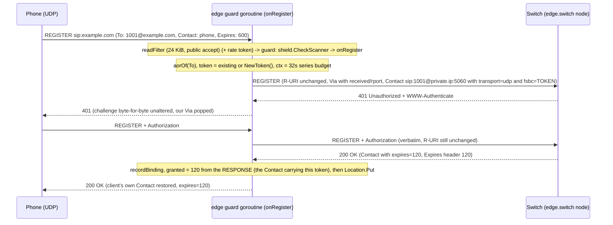
```mermaid
sequenceDiagram
    participant P as Phone (UDP)
    participant G as edge guard goroutine (onRegister)
    participant FS as Switch (edge.switch node)

    P->>G: REGISTER sip:example.com (To: 1001@example.com, Contact: phone, Expires: 600)
    Note over G: readFilter (24 KiB, public accept) (+ rate token) -> guard: shield.CheckScanner -> onRegister
    Note over G: aorOf(To), token = existing or NewToken(), ctx = 32s series budget
    G->>FS: REGISTER (R-URI unchanged, Via with received/rport, Contact sip:1001@private.ip:5060 with transport=udp and fsbc=TOKEN)
    FS-->>G: 401 Unauthorized + WWW-Authenticate
    G-->>P: 401 (challenge byte-for-byte unaltered, our Via popped)
    P->>G: REGISTER + Authorization
    G->>FS: REGISTER + Authorization (verbatim, R-URI still unchanged)
    FS-->>G: 200 OK (Contact with expires=120, Expires header 120)
    Note over G: recordBinding, granted = 120 from the RESPONSE (the Contact carrying this token), then Location.Put
    G-->>P: 200 OK (client's own Contact restored, expires=120)
```

The switch cooldown is cleared on **any** final response; the series ends on
any final. `logRegister` records the outcome without any credential.

### 9.2 WebSocket REGISTER (and TCP/TLS)

The same sequence holds for a SIP/TCP or SIP/TLS phone, with `Binding.Transport`
`tcp` or `tls` and no upgrade step.

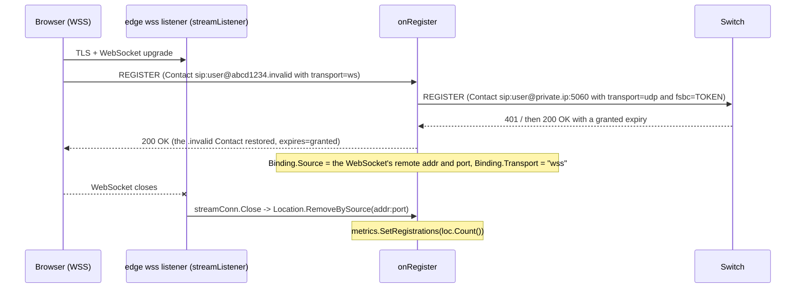
```mermaid
sequenceDiagram
    participant B as Browser (WSS)
    participant L as edge wss listener (streamListener)
    participant G as onRegister
    participant FS as Switch

    B->>L: TLS + WebSocket upgrade
    B->>G: REGISTER (Contact sip:user@abcd1234.invalid with transport=ws)
    G->>FS: REGISTER (Contact sip:user@private.ip:5060 with transport=udp and fsbc=TOKEN)
    FS-->>G: 401 / then 200 OK with a granted expiry
    G-->>B: 200 OK (the .invalid Contact restored, expires=granted)
    Note over G: Binding.Source = the WebSocket's remote addr and port, Binding.Transport = "wss"
    B--xL: WebSocket closes
    L->>G: streamConn.Close -> Location.RemoveBySource(addr:port)
    Note over G: metrics.SetRegistrations(loc.Count())
```

`side.laddr` is zero for tcp/tls/ws/wss, so outbound requests toward this client ride
the client's own pooled inbound connection; no `rport` is added on a WS Via.

### 9.3 WebRTC browser → switch, through the edge plane

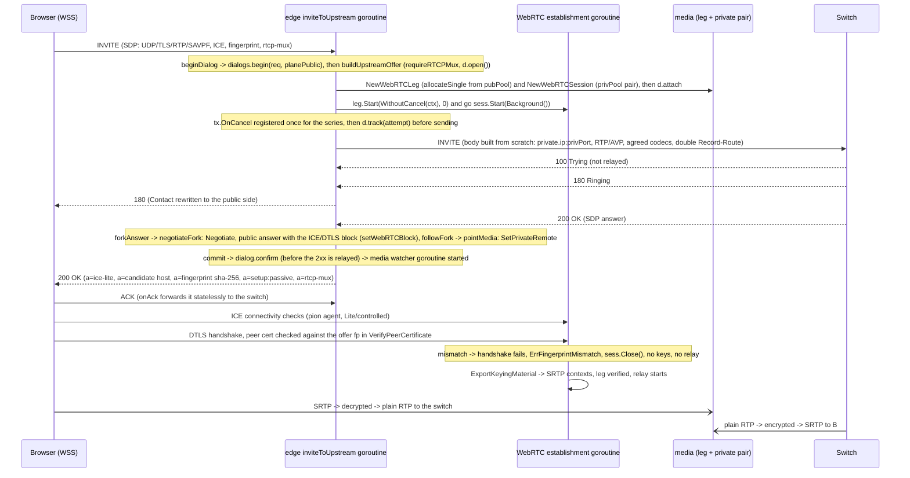
```mermaid
sequenceDiagram
    participant B as Browser (WSS)
    participant H as edge inviteToUpstream goroutine
    participant E as WebRTC establishment goroutine
    participant M as media (leg + private pair)
    participant FS as Switch

    B->>H: INVITE (SDP: UDP/TLS/RTP/SAVPF, ICE, fingerprint, rtcp-mux)
    Note over H: beginDialog -> dialogs.begin(req, planePublic), then buildUpstreamOffer (requireRTCPMux, d.open())
    H->>M: NewWebRTCLeg (allocateSingle from pubPool) and NewWebRTCSession (privPool pair), then d.attach
    H->>E: leg.Start(WithoutCancel(ctx), 0) and go sess.Start(Background())
    Note over H: tx.OnCancel registered once for the series, then d.track(attempt) before sending
    H->>FS: INVITE (body built from scratch: private.ip:privPort, RTP/AVP, agreed codecs, double Record-Route)
    FS-->>H: 100 Trying (not relayed)
    FS-->>H: 180 Ringing
    H-->>B: 180 (Contact rewritten to the public side)
    FS-->>H: 200 OK (SDP answer)
    Note over H: forkAnswer -> negotiateFork: Negotiate, public answer with the ICE/DTLS block (setWebRTCBlock), followFork -> pointMedia: SetPrivateRemote
    Note over H: commit -> dialog.confirm (before the 2xx is relayed) -> media watcher goroutine started
    H-->>B: 200 OK (a=ice-lite, a=candidate host, a=fingerprint sha-256, a=setup:passive, a=rtcp-mux)
    B->>H: ACK (onAck forwards it statelessly to the switch)
    B->>E: ICE connectivity checks (pion agent, Lite/controlled)
    B->>E: DTLS handshake, peer cert checked against the offer fp in VerifyPeerCertificate
    Note over E: mismatch -> handshake fails, ErrFingerprintMismatch, sess.Close(), no keys, no relay
    E->>E: ExportKeyingMaterial -> SRTP contexts, leg verified, relay starts
    B-)M: SRTP -> decrypted -> plain RTP to the switch
    FS-)M: plain RTP -> encrypted -> SRTP to B
```

### 9.4 Switch → registered client

```mermaid
sequenceDiagram
    participant FS as Switch
    participant Hc as edge inviteToClient goroutine
    participant P as Registered phone

    FS->>Hc: INVITE sip:1001@private.ip:5060;fsbc=TOKEN (private socket)
    Note over Hc: arrival = private -> invitePrivate -> classifySwitchRequest = client; resolveTarget(token) -> Binding
    Hc->>Hc: buildPublicOffer (plain RTP at public.ip:publicPort for a UDP phone; a DTLS-SRTP offer, a=setup:actpass, for a ws/wss browser)
    Hc->>P: INVITE sip:1001@ the binding.Source address (R-URI carries no token, Contact = public side, double Record-Route)
    P-->>Hc: 180 Ringing
    Hc-->>FS: 180
    P-->>Hc: 200 OK (SDP answer)
    Note over Hc: forkAnswer -> negotiateFork: Negotiate, SetSignallingSource(SideA), then pointMedia: SetRemote(SideA), rtp.Start()
    Note over Hc: commit -> dialog.confirm (before the 2xx is relayed)
    Hc-->>FS: 200 OK (SDP at private.ip:privatePort)
    FS->>Hc: ACK -> forwarded to P
```

An unknown or expired `fsbc` token yields **404 Not Found**, letting the
switch fail over or play treatment; there is no address-of-record fallback. A
binding whose transport has no public listener yields **480**.

### 9.5 Inbound carrier call → switch

```mermaid
sequenceDiagram
    participant C as Carrier
    participant G as edge guard goroutine (onInvite)
    participant H as inviteToUpstream goroutine
    participant FS as Switch (carrier port)

    C->>G: INVITE sip:DID@public.ip (public UDP listener)
    Note over G: readFilter (carrier_rate_limit token) -> guard strips any X-FreeSBC-* header -> admitPublicInvite
    Note over G: no live registration at this transport+IP:port, carrierFor(src) = "carrier-a" -> srcCarrier (else silent drop)
    G->>H: inviteToUpstream(req, tx, src, "carrier-a")
    Note over H: carrier calls skip admitEarly; beginDialog(planePublic), d.setCarrier, buildUpstreamOffer
    Note over H: carrierRURI: fsbc token of a carrier registration -> that node only, R-URI = the switch's original Contact; no token -> hash(lower-cased R-URI user)
    H->>FS: INVITE to node IP:switch_carrier_port (carrier's Vias kept, double Record-Route, Contact = private.ip:5060, SDP at private.ip:privPort, X-FreeSBC-Carrier: carrier-a)
    FS-->>H: 180 / 200 OK (SDP answer)
    Note over H: respToCarrier: our private Record-Route and any private Contact removed from the response going to the carrier
    H-->>C: 200 OK (SDP at public.ip:pubPort)
    C->>G: ACK (matched by dialog record, stampCarrier adds the header again, sent to the carrier port)
```

Client calls take the same function with `carrier == ""`: they go to the
switch's client port (`edge.switch`), are bounded by `maxEarlyPerSource` and
carry no `X-FreeSBC-Carrier` header.

### 9.6 Switch → carrier call

```mermaid
sequenceDiagram
    participant FS as Switch
    participant H as edge inviteToCarrier goroutine
    participant C as Carrier (first resolved address)

    FS->>H: INVITE sip:DID@sip.carrier-a.com (outbound proxy: R-URI host[:port] = an edge.carriers entry; Route to private.ip:5060 stripped)
    Note over H: invitePrivate -> classifySwitchRequest = carrier; carrierDest -> first resolved addr (none: 503); offerless INVITE is forwarded body-less
    Note over H: beginDialog(planePrivate), setCarrier, buildPublicOffer(d, body, false)
    H->>C: INVITE (R-URI unchanged; one Via, public; Record-Route = public only; foreign Route removed; From/To/PAI/Diversion hosts of the switch masked to public.ip; Contact = public.ip:port; SDP at public.ip:pubPort)
    C-->>H: 401/407 or 180/200
    Note over H: respToSwitch: our Via popped, the switch's original Vias, From and To restored; 1xx/2xx get our private Record-Route inserted after the public one
    H-->>FS: 180 / 200 OK (SDP at private.ip:privPort)
    FS->>H: ACK (Route set starts at private.ip:5060) -> hidden, forwarded to the carrier
```

A `401`/`407` goes back to the switch untouched; the retried INVITE with its
Authorization is a new request on the same path. There is one attempt: line
selection and failover are the switch's.

### 9.7 Carrier REGISTER with token rewrite and restore

```mermaid
sequenceDiagram
    participant FS as Switch node
    participant R as registerToCarrier
    participant C as Carrier
    participant T as carrierRegTable

    FS->>R: REGISTER sip:sip.carrier-a.com (Contact: sip:gw@10.77.0.10:5080)
    Note over R: classify = carrier; node = switchNodeFor(source); token = carrierToken(node, Contact)
    R->>C: REGISTER (R-URI, Authorization, Call-ID untouched; Via hidden; Contact sip:gw@public.ip:5060;fsbc=TOKEN)
    C-->>R: 401 (relayed untouched), then 200 OK (granted expiry on the Contact carrying TOKEN)
    R->>T: put {token, carrier, node, original Contact, expires = granted}
    R-->>FS: 200 OK (original Contact restored, expires = granted)
    C->>R: INVITE sip:gw@public.ip:5060;fsbc=TOKEN (later; see 9.5)
    Note over R: lookup(token) -> node and original Contact; delivered to that node's carrier port with R-URI = original Contact
```

A `200` to `Expires: 0`, or a granted lifetime of zero, removes the binding; a
wildcard un-REGISTER removes every binding of that switch node at that carrier.
The table is pruned every 30 s.

### 9.8 CANCEL before answer

```mermaid
sequenceDiagram
    participant P as Caller
    participant S as sipgo server transaction
    participant H as inviteToUpstream goroutine
    participant FS as Switch

    P->>S: INVITE
    S->>H: onInvite, then d.track of an attempt holding the forwarded request and the series cancel (before sending)
    H->>FS: INVITE
    FS-->>H: 180 Ringing (relayed to P)
    P->>S: CANCEL (matching branch)
    S-->>P: 200 OK (to the CANCEL, generated by sipgo)
    S->>H: tx.OnCancel -> cancelCall(d, cancelByCaller) (under sipgo's tx lock: no I/O)
    Note over H: cancelSeries marks the call cancelled and takes the attempt; go sendCancel
    S-->>P: 487 Request Terminated (generated by sipgo once the hook returns)
    H->>FS: CANCEL (built from the FORWARDED request, same top-Via branch)
    Note over H: a.cancel() once the CANCEL is on the wire -> series ctx cancelled -> the pump stops now, not at the INVITE's Timer B
    FS-->>H: 487 Request Terminated
    Note over H: pumpInvite ctx.Done -> abandonAttempt -> drainCancelledInvite (cancelDrain, 300 ms), the upstream 487 is matched and ACKed by the transaction layer, never relayed
    Note over H: endUnlessUp -> dialog.end -> media session closed, ports released
```

An orphan CANCEL (one sipgo did not match to the server transaction) is
looked up by Call-ID **and From tag**; one whose From tag does not match the
INVITE's leaves the attempt in place, sends **zero** CANCELs upstream, and is
answered **481**.

### 9.9 Normal BYE teardown

```mermaid
sequenceDiagram
    participant P as Phone
    participant H as onInDialog goroutine
    participant FS as Switch

    P->>H: BYE (Route set from the double Record-Route)
    Note over H: directionFor: Call-ID + both tags name the dialog; its privateRemote wins over the hash
    H->>FS: BYE (no Record-Route, R-URI retargeted to the far Contact, 32s budget)
    FS-->>H: 200 OK
    H-->>P: 200 OK (relayed, our Via popped)
    H->>H: byeEndsDialog(200) -> d.end() (only the dialog the tags named)
    Note over H: sess.Stats() snapshotted, sess.Close(), ports released, DialogEnded/MediaEnded
```

On a carrier dialog the same flow applies with the hiding of §6 (the BYE
toward the carrier is hidden, `stampCarrier` marks the one toward the switch).
If the forward fails, FreeSBC makes one stateless re-send attempt and answers
**200** anyway; media is still released.


---

## 10. State ownership

| Entity | Owner | Created where | Transitions | Invariants | Who may mutate | Cleanup trigger | Concurrency protection |
|---|---|---|---|---|---|---|---|
| **edge binding** (`Binding`) | `Location` (`edge/location.go:58`) | `recordBinding` → `Location.Put` (`register.go:305`) | active → refreshed (same token) / expired / removed | expiry always comes from the registrar's **response**; `Source` is the transport source, never the Contact host; ≤ 10 per AoR, ≤ 20000 total (`location.go:78-81`) | handler goroutines, the WS close hook, the prune ticker | un-REGISTER, `granted <= 0`, WebSocket close, expiry + the 30 s prune ticker (`edge.go:504-522`) | `Location.mu` (RWMutex) |
| **carrier registration** (`carrierBinding`) | `carrierRegTable` (`carrierreg.go:44`) | `registerToCarrier` on a 2xx with a granted lifetime (`carrierreg.go:190`) | live → refreshed (same deterministic token) / expired / removed | keyed by token = `carrierToken(node, Contact)`; holds the registering `edge.switch` node name and the switch's original Contact; separate from `Location`, so a client token never resolves a carrier token or the reverse; a lookup treats an expired entry as absent | `registerToCarrier`, the prune ticker | granted lifetime elapsed (30 s prune), a `200` to `Expires: 0`, a wildcard un-REGISTER (`removeNode`); lost on restart, rebuilt by the switch's next refresh under the same token | `carrierRegTable.mu` |
| **carrier directory** (`carrierSnapshot`) | `carrierDirectory` (`carrierdns.go:116`) | `newCarrierDirectory` in `edge.New`; refreshed by `Run`'s goroutine | resolved set replaced whole on each refresh; a failed refresh keeps the last good set | name → addresses (SRV or A/AAAA, `carrierDNSTTL` 300 s, failed lookup retried after 10 s, 3 s per query: `carrierdns.go:40-47`) plus the carrier source prefixes; read lock-free by every request | the refresh goroutine only | process exit | `atomic.Pointer[carrierSnapshot]` for readers; `carrierDirectory.mu` guards its cache; `refresh` takes it only to read and to record an outcome (`apply`), never across a lookup, and only the refresh goroutine runs lookups, so `rand.Rand` is unshared |
| **edge dialog** (`*edge.dialog`) | `dialogTable` (`dialog.go:322`) | `begin(req, callerPlane, limit)` (`dialog.go:380`); a second early record with the same Call-ID and caller tag is refused (482, `invite.go:239`) | `dialogEarly → dialogConfirmed → dialogEnded` (or early → ended) (`dialog.go:20-36`) | matched on Call-ID + both tags; per-fork answers while early; **one media session per record**; `confirm` (before the 2xx is relayed) refuses without media; `end` removes exactly this record; a carrier dialog also records the carrier name (`setCarrier`, `dialog.go:682`) and its far-end address on the node's carrier port | any handler goroutine, via the table's methods; the Timer M hook | tag-matched BYE the far end did not refuse, media watchdog, `endUnlessUp`, `closeAll` | `dialogTable.mu` guards the map, the `closed` flag **and every mutable field of every dialog**; `confirm`/`end` drop the lock before metrics and `sess.Close()` |
| **edge inviteAttempt** | the dialog's `inFlight` slot | `d.track(...)` per attempt, **before** the INVITE is sent | tracked → `markSent` → overwritten by the next attempt → taken by `cancelSeries` or cleared by `untrack` | holds the request **as forwarded**, the **series** cancel, and `sent`/`cancelled`; a CANCEL finds the record by Call-ID + From tag; `cancelSeries` guarantees exactly one canceller and never lets a CANCEL overtake its INVITE | handler goroutines through `track`/`markSent`/`untrack`; the OnCancel hook and the backstop through `cancelSeries` | `defer d.untrack()` on handler return; `cancelSeries` on CANCEL or backstop | `dialogTable.mu` |
| **switch cooldown** | one `cooldownTable` on `Server` (`cooldown.go:20`) | `edge.New` | absent ⇄ `until[name]` | keyed by the node's `IP:port` name, never by anything a client supplies; all-cooling falls back to dialling everything; `switchCooldown` = 30 s (`edge.go:134`) | handler goroutines only | `Recover` on any final response; lazy expiry otherwise | `cooldownTable.mu` |
| **media Session** | the dialog that allocated it | `media.AllocateAcross(pubPool, privPool, …)` (`media/session.go:355`) | `sessAllocated → sessRunning → sessClosed` (`session.go:336`) | forward-only; `Start` starts the relay at most once; `Close` is idempotent and safe from any goroutine; an unstarted session has **no watchdog** | `SetRemote`, `SetExpectedRemote`, `SetSignallingSource`, `Relatch` from the signalling goroutine; `Close` from anywhere | `dialog.end()`, the watchdog, `recoverRelayPanic` | `state atomic.Int32` (CAS/Swap), `lastRx [2]atomic.Int64` (one per sending side), per-latch `mu` |
| **port allocation** | `PlanePool.inUse` (`media/portpool.go:73`) | `allocatePair` / `allocateSingle` | reserved → released | RTP even, RTCP = RTP+1; a muxed WebRTC socket still reserves the odd port; a partial `AllocateAcross` releases side A; the public and private pools share the `rtp` range but bind different IPs, so they never collide | the pool only | `Session.Close`, `WebRTCSession.Close`, `WebRTCLeg.Close`, the `AllocateAcross` failure path | `PlanePool.mu`, held only to reserve a candidate; binds run outside it |
| **SRTP context** | one direction of one browser leg | `newSRTPContextFromKeys` after the DTLS handshake (`media/srtp.go:254`, `webrtcleg.go:607`) | installed once → dropped with the leg | keys come only from DTLS-SRTP key export and are never copied across legs; replay windows 64 (SRTP) / 128 (SRTCP) per context | the leg's `deriveSRTP`, exactly once | dropped with the leg | `SRTPContext.mu` serialising pion's lockless context; the leg holds the pair under `WebRTCLeg.mu` |
| **WebRTC leg** | `WebRTCSession` (which closes it) | `NewWebRTCLeg` in `allocateWebRTC` or (offerer leg) `allocateOfferedWebRTC` (`edge/media.go:279`, `:365`) | `legAllocated → legEstablishing → legEstablished \| legFailed → legClosed` | forward-only, `legClosed` terminal; first error wins; keys set exactly once — no re-keying, no ICE restart | `setState`/`set` only, under `mu` | `Close` from `WebRTCSession.Close`, the failure path in `Start`, or a fingerprint mismatch | `WebRTCLeg.mu` for agent/mux/demux/contexts/state; `readyOnce`; handles snapshotted under the lock and closed outside it |
| **shield ban entry** | `banList[K]`, two per `Shield`: `bans` (IP) and `socketBans` (UDP IP:port) (`shield/shield.go:25-32`) | `ban(key, dur)` from `CheckScanner`'s scanner branch | absent → banned (extendable) → expired (lazy) → removed | hard cap **65536** per table (`banCap`) with an overflow counter; a socket ban lasts at most 1 min (`socketBanMax`); carrier sources are never scanner-banned | `ban`, `banned` (lazy delete), `prune` | lazy expiry on lookup, the 1-minute prune tick, or process exit | `banList.mu` |
| **rate-limit bucket** | the one `rateLimiter` per `Shield` | first `allow` for that source | fresh (full) → drained → refilled | capacity equals rate; a fresh bucket starts full; parameters (`rate_limit` for ordinary sources, `carrier_rate_limit` for carrier sources) are passed per call so a reload applies immediately | `allow`, `prune` | `prune` drops a bucket once it has been idle for its own refill interval (so it is full); at **65536** buckets (`bucketCap`) the least recently used is evicted; the global bucket is never pruned | `rateLimiter.mu` |
| **config snapshot** | `config.Store` (`config/store.go`) | `config.Load` → `NewStore` / `Replace` | published → superseded | a published `*Config` is **never mutated**; the compiled switch list, carrier list and source prefixes are populated by `validate` before publication | only `Replace` | garbage collection once no goroutine holds a reference | `atomic.Pointer[Config]` for the snapshot; `Store.mu` only for the subscriber slice |

---

## 11. Concurrency model

### 11.1 Ownership rules that hold by discipline, not by type

- **The edge topology is immutable after `New` builds it.** `buildTopology`
  (`edge/topology.go:148`) runs in `edge.New`, before any goroutine that can
  read it exists; that ordering is the happens-before edge that lets it be
  read without a lock for the rest of the process's life. The carrier name
  map (`Server.carrierURIs`) is built the same way.
- **`edge.Server.srv` and `client` are written in `Run` without
  synchronisation**, safe under the "no handler runs before `ln.Serve`"
  argument; the tests use the `ready` channel (`edge.go:108`) as the
  happens-before edge. `Server.shield` is assigned in `Run` under
  `shieldMu`, because the admin API reads it (`ShieldStats`) from another
  goroutine.
- **Edge handlers return after the final response.** The dialog and its media
  then belong to `dialogTable`, not to a goroutine.
- **Single-use sipgo objects**: a `ClientTransaction` is `Terminate`d after
  each attempt.
- **`internal/sip` and `internal/sip/sdp` contain no mutexes, atomics,
  channels, goroutines or timers.** They are pure functions over messages
  and bodies.

### 11.2 Mutexes

| Lock | Guards |
|---|---|
| `edge.Location.mu` (RWMutex) | `byToken`, `byAOR`, `bySource`, and every binding they point to |
| `edge.carrierRegTable.mu` | `byToken`, the carrier registrations |
| `edge.carrierDirectory.mu` | the resolver cache and its `rand.Rand`, serialising refreshes |
| `edge.dialogTable.mu` | `byCallID`, `sessions` (the session-slot count behind `shield.max_sessions`) **and every mutable field of every dialog** |
| `edge.subTable.mu` | `byCallID`, `byToken`, the count, and every field of every subscription record. A leaf lock: only the atomic gauge is touched under it. `Location` runs its removal hook after releasing `Location.mu`, so `Location.mu` is never held when this lock is taken |
| `edge.subCapWarner.mu` | the last WARN time per subscription-cap scope |
| `edge.capWarner.mu` | the last WARN time per session-cap / invite-rate reject reason (`invite.go`) |
| `shield.Limiter` (`rateLimiter.mu`) | the global new-INVITE token bucket |
| `edge.cooldownTable.mu` | the `until` map |
| `edge.Server.earlyMu` | `early`, the per-source count of unanswered INVITEs holding media (`admitEarly`) |
| `edge.Server.shieldMu` (RWMutex) | the assignment of `shield` in `Run` against `ShieldStats` |
| `edge.mediaSession.mu` | the negotiated codecs and the media address each side was last pointed at |
| `edge.warnOnce.mu`, `edge.enumLimiter.mu` | the admission-drop WARN set and the REGISTER enumeration LRU (`admission.go`) |
| `edge.Metrics.carrierRegsMu` | the per-carrier registration gauge map |
| `media.PlanePool.mu` | `inUse` and `cursor`; held to reserve a candidate, never across a bind |
| `media.latch.mu` (×4 per session) | mode, expected, signalled, sigSource, dst, remote, rank, learnedAt |
| `media.SRTPContext.mu` | pion's lockless `*srtp.Context` and the output slab |
| `media.WebRTCLeg.mu` | agent, mux, demux, SRTP contexts, peer-cert getter, err, state |
| `shield.banList.mu` ×2, `shield.rateLimiter.mu`, `Shield.rlMu` | the IP and UDP-socket ban tables, the limiter's buckets and global bucket, and the cached rate-limit parses |
| `admin.authLimiter.mu` | the per-source auth-failure window, including reservations |
| `admin.verifiedCreds.mu` | the verified-credential digests |
| `config.Store.mu` | the subscriber slice only |

### 11.3 Atomics, channels, CAS

- `media.Session.state` and `WebRTCSession.state` are `atomic.Int32`. One
  `CompareAndSwap` in `Start` makes the relay start exactly once; one `Swap`
  in `Close` makes teardown idempotent. This is the state machine, not a
  `sync.Once` per caller.
- `lastRx [2]atomic.Int64` (one per sending side) is the only channel between
  the relay loops and the watchdog.
- `done` channels (`Session`, `WebRTCSession`) are closed exactly once by
  `Close` and are both the watchdog's exit signal and the signalling plane's
  teardown notification.
- `WebRTCLeg.ready` is closed once — by `Start`'s success path or by
  `Close` — and its close is the happens-before edge that makes `err`
  visible. `Err()` blocks on it unconditionally.
- `WebRTCLeg.verified atomic.Bool`: set only once the peer certificate
  matched the signalled fingerprint; the relay refuses media for a leg
  without it.
- `edge.carrierDirectory.snap atomic.Pointer[carrierSnapshot]`: the resolved
  carrier set and source prefixes, replaced whole by the refresh goroutine and
  read lock-free by the read path and every handler.
- `edge.Server.rtpTimeout` and `inviteBackstop` are `atomic.Int64`: constants
  in production (5 minutes), shortened only by tests through unexported
  setters.
- `config.Store.p atomic.Pointer[Config]` — `Current()` is lock-free.
- `edge.Metrics` counts requests in a fixed array of `atomic.Uint64`
  (known method × known transport, each with an `OTHER` slot), responses and
  carrier requests in `sync.Map`s of `*atomic.Uint64` (keyed by status class,
  and by carrier/direction/method), and keeps its gauges in `atomic.Int64`.
- `shield.Shield` drop counters are `atomic.Int64`; `banList.overflow` is an
  `atomic.Int64`.
- Long-lived goroutines in the edge plane: the registration/carrier-table prune
  ticker (30 s) and the carrier directory refresh loop (both in `Run`, exiting
  on `listenCtx`), one media watcher per confirmed dialog (exits on the
  session's `Done`), and the shield's 1-minute prune loop.

Every sipgo response-pump loop in the edge plane contains the same note:
sipgo never closes the response channel, so the `!ok` arm is unreachable; the
loop sets `responses = nil` so a permanently-ready closed channel cannot
spin.

### 11.4 Blocking shape

- **Edge handlers do not block for the call's duration.** Each INVITE
  handler returns once a final response is relayed; the dialog and its media
  are then owned by the table and reclaimed through `dialog.end()` — by a
  tag-matched BYE, by the per-dialog media watcher goroutine, or by
  `closeAll` at shutdown. This holds for carrier calls and client calls alike.
- **A pre-answer INVITE handler holds one goroutine, a dialog record and a
  media session** until a final response, a CANCEL or the 5-minute backstop
  (`inviteTimeout`, `invite.go:24`).
- **Carrier DNS never blocks a request.** Lookups run in the refresh
  goroutine under a 3 s per-query timeout; handlers read the published
  snapshot.

### 11.5 Panic containment

| Umbrella | Scope |
|---|---|
| `edge.guard` (`edge.go:878`) | every registered edge handler; logs, counts, and answers 500 unless a final already went out |
| `media.recoverRelayPanic` (`media/relay.go:115`) | every relay goroutine; closes **that session only** |
| `admin.recoverMW` (`admin/server.go:626`) | every HTTP handler; logs the panic with its stack, answers 500 with no stack in the body, and re-panics `http.ErrAbortHandler` per the stdlib convention |
| `config.unmarshalStrict` (`config/loader.go:54`) | the go-yaml decoder inside `Parse`; a decoder panic becomes a parse error |
| `config.loadNoPanic` (`config/reload.go:158`) | each hot reload in `Watch`; a panic is a failed reload and the previous snapshot stays |

---

## 12. Networking and deployment topology

### 12.1 Bind vs advertised addresses

The topology is two addresses, each written once (`docs/config.md`).

- **Public side.** Every public socket binds `public.bind` (default
  `public.ip`; it differs only behind 1:1 NAT, where `public.ip` is not a
  local address). Listeners are `udp`, `tcp`, `tls`, `ws` and `wss` on the ports of
  `edge.listen` (`edge.go:315-326`). Everything advertised to phones,
  browsers and carriers (Via, Contact, Record-Route, SDP `c=`) names
  `public.ip` and the port the listener bound: there is deliberately no
  port-translation field.
- **Private side.** One fixed UDP socket, `private.ip:5060`
  (`config.PrivateSIPPort`), is both the bind and the advertised address.
  Via, Contact and Record-Route toward the switch name it
  (`topology.go:148-205`). Private media binds `private.ip` and advertises it.
- **Startup checks.** `run` fails if `public.bind` or `private.ip` is not
  assigned to a local interface (`checkLocalAddr`, `edge.go:329-354`), because
  a bind to anything else fails late and an address that is not ours would be
  advertised to peers that can never reach it. `check` opens and binds nothing.
- **Media.** Two `PlanePool`s share the one `rtp` range: public bound to
  `public.bind`, private bound to `private.ip` (`mediapool.go:20-37`). Each
  bind IP has its own port namespace, so they never hand out the same
  socket. Addresses and range come from the startup snapshot, so `rtp`,
  `public` and `private` are restart-only.
- **Carriers.** `edge.carriers` names are resolved on the public side only
  (§6). The switch is reached by literal IP only; the edge does no DNS on the
  private side.

### 12.2 NAT assumptions

- **Media**: symmetric RTP with first-packet latching. The SDP address seeds
  a provisional destination so media flows immediately; the first accepted
  packet's real source address and port then fix the destination. In strict
  mode the source IP must match the signalled one but the **port may
  differ**, which is exactly the NAT port-rewrite case. The public edge leg
  is `loose` because a phone behind a hard NAT cannot be trusted to signal
  the source its RTP comes from; a source that neither SDP nor the phone's
  SIP source IP vouches for is only a fallback that the phone's own first
  packet displaces (§8.4).
- **Signalling**: the edge plane adds `received=` when the top Via's host
  differs from the real source, and fills `rport=` **only when the client
  asked for it**. All responses are sent to the request's transport source
  (RFC 3581), which is what keeps a NAT pinhole usable. `rport` is requested
  on our own Via on UDP only.
- **Bindings** record the transport source address of the REGISTER — the far
  side of the client's NAT pinhole for UDP, and the pooled connection key for
  WS/WSS.
- **Carriers** are assumed to be on the public internet and not behind a NAT
  that rewrites their source: inbound carrier requests are recognised by
  source address (§6). A carrier-registration Contact names `public.ip` and
  the public UDP port, which must be reachable from the carrier.
- **No TURN and no full ICE.** The WebRTC leg is ICE-lite with a single host
  candidate, so FreeSBC must have a publicly reachable media address
  (`public.ip`).

### 12.3 Firewall and port-range assumptions

- Open on the public address: the `edge.listen` ports (UDP for `udp`, TCP for
  `ws`/`wss`) and the `rtp` range. Nothing checks reachability; validation
  checks only range sanity (`≥ 1024`, `min < max`, at least one RTP/RTCP
  pair).
- Open on the private LAN: `private.ip:5060` toward the switch, the `rtp`
  range on `private.ip`, and from FreeSBC to each node's `edge.switch` port
  and its carrier port (`edge.switch_carrier_port`, default the node's
  `edge.switch` port).
- Sizing is one RTP/RTCP pair (2 ports) per call leg: an edge call takes one
  pair from the public pool and one from the private pool.
  `freesbc_media_ports_in_use` and `_total` count **pairs**, summed over the
  two pools, and nothing sizes a pool for you.
- SIP over UDP is sent above the RFC 3261 §18.1.1 guidance: the process-wide
  `sip.UDPMTUSize` is raised to **8 KiB** (`raiseUDPSendLimit`,
  `edge.go:179`), relying on IP fragmentation to survive the path. A
  realistic switch INVITE plus proxy headers clears 1300 bytes, and the RFC's
  remedy — switch to TCP — is unavailable when both ends are UDP.

### 12.4 No kernel firewall integration

FreeSBC manages no kernel firewall state. Every ban lives in the shield's
in-memory table (§14.1). A deployment that wants kernel-level drops puts its
own firewall in front of FreeSBC.

### 12.5 TLS

| Surface | Certificate | Minimum version | Client auth |
|---|---|---|---|
| Edge `tls` and `wss` listeners | top-level `tls.cert`/`tls.key`, loaded when the listener binds (`openListener`); `check` requires `tls` whenever `edge.listen.tls` or `edge.listen.wss` is set | TLS 1.2 | — |
| Admin HTTPS | the same `tls` identity, served only when `admin.allow_remote` is set (`admin/server.go:243-277`); a loopback admin serves plain HTTP | TLS 1.2 | — |
| WebRTC DTLS | one per-process self-signed ECDSA P-256 certificate (CN "FreeSBC", 1-year validity, `media/dtlscert.go:36-87`), created when `edge.listen.ws` or `wss` is set | — | `RequireAnyClientCert` (`webrtcleg.go:539`), so there is always something to fingerprint |

The DTLS certificate is never verified as a chain: the browser's identity
is its `a=fingerprint`, checked inside the handshake (§8.7). A missing or
unreadable `tls` file is a startup error of `run`, not a fallback to a
self-signed certificate.

**No certificate is hot-rotated.** Every TLS config is built once at startup.

### 12.6 What the code enforces vs what deployment must guarantee

| Assumption | Status |
|---|---|
| `public.ip` is the address phones, browsers and carriers reach; `public.bind` and `private.ip` are local addresses | **Enforced at `run`** (`checkLocalAddr`); validation requires specific IPs (no wildcard) and `private.ip` ≠ `public.bind` |
| Only the switch speaks on the private socket | **Enforced by the read filter**: the private UDP socket admits only `edge.switch` node IPs and stamps the arrival marker; a datagram from any other source is dropped before parsing (`edge.go:747-771`). A LAN host that is itself a node address is trusted |
| The private LAN between FreeSBC and the switch is trusted | **Assumed.** SIP to the switch is plain UDP and carries per-call Via/Contact data |
| Every inbound carrier's signalling IPs are an `edge.carriers` address (literal IP or resolved DNS name) or listed in `edge.carrier_sources` | **Assumed.** An INVITE from any other unregistered public source is dropped silently (§7.5); `edge.carrier_sources` has a width cap (no wider than IPv4 /8 or IPv6 /32) |
| A carrier name's DNS answer is honest | **Assumed.** The resolved addresses become carrier sources and send targets; there is no DNSSEC |
| A public phone or browser calls from the transport address it registered from | **Assumed** (true for a phone that keeps its NAT pinhole with its own REGISTER refreshes, and for sip.js, which keeps one WebSocket). A client whose source changed since its last REGISTER is refused silently until it re-registers |
| The switch never identifies or trusts a request by FreeSBC's IP on its client port | **Not enforceable by FreeSBC.** Client calls also arrive from `private.ip`; trusting that address on the client port lets them skip digest authentication. Identify carriers by `X-FreeSBC-Carrier`, the registration line or the DID |
| Only the carrier port may skip authentication, and only for `private.ip` | **Assumed.** FreeSBC delivers only requests admitted from a carrier source to `edge.switch_carrier_port`, never client traffic; the switch or a host firewall must stop any other LAN host from reaching that port |
| The switch addresses each carrier exactly as the `edge.carriers` entry reads, through FreeSBC as outbound proxy | **Enforced for requests that reach the private socket**: a request whose Request-URI is neither a live client token nor an `edge.carriers` entry gets 404, so FreeSBC is not an open relay |
| `admin.listen` binds loopback | **Enforced**, opt out with `admin.allow_remote: true` (which requires `tls`) |
| The process runs non-root with CAP_NET_BIND_SERVICE if a listen port is below 1024 | **Shipped, not enforced**: the linux release tarball carries `packaging/freesbc.service` (`User=freesbc`, `AmbientCapabilities=CAP_NET_BIND_SERVICE`, hardening); a hand-run process is unrestricted |
| Config file mode 0600 | **Not enforced**; FreeSBC only reads the file. The README service setup uses `root:freesbc` mode 0640, so the service cannot rewrite its own config |
| A single routable media address (no TURN) | **Assumed** |
| Public and private media pools do not collide | **Enforced by construction**: different bind IPs |
| Switch nodes are UDP at literal IPs | **Enforced** by validation (`check` and `run`) and at topology build |
| Switch pool members share one registration database, and a carrier registration and its calls stay on the registering node | **Assumed** for client registrations: after a failover the new node re-challenges and the phone's answer is valid there too (one extra round trip), and the pool is hashed, so changing the node set reshuffles users. **Enforced** for carrier registrations: a request with a live token goes to the registering node only |
| RTP/RTCP ranges reachable end to end | **Assumed** |
| IP fragmentation survives the path | **Assumed** |
| Edge stream listeners (tcp, tls, ws, wss) are resource-capped | **Enforced** by constants: connection caps per source and in all, handshake, message and idle timeouts (§7.1a). The process file-descriptor limit is **assumed** to exceed the 10000-connection cap plus the RTP ports |
| Changing a restart-only setting needs a restart | **Warned**: a reload that changes any restart-only key is still published, with a warning listing the keys (`config.RestartOnlyChanges`); the running planes keep their startup values |

---

## 13. Observability

### 13.1 Prometheus metrics

All metrics live on a **private** registry built lazily on the first
`/metrics` scrape (`sync.Once`, `internal/admin/metrics.go:245`), containing the Go
collector, the process collector (`collectors.NewProcessCollector`; the
`process_*` series other than `process_start_time_seconds` exist on Linux only)
plus one `collector` that samples `admin.Deps` on every scrape — no
duplicated state. `Describe` advertises all 38 descriptors of the freesbc collector; the whole edge
block is skipped at `Collect` time when `Deps.Proxy` is nil (it is never nil in
a running process).

Labels are deliberately bounded sets: "a Call-ID label here would create a
permanent series per call."

| Metric | Type | Labels | Fed by |
|---|---|---|---|
| `freesbc_active_calls` | Gauge | — | edge `ActiveCalls()`: confirmed dialogs |
| `freesbc_media_ports_in_use` | Gauge | — | RTP/RTCP pairs in use, the public and private pools' `Stats()` summed (`Server.PortStats`, `edge.go:279`) |
| `freesbc_media_ports_total` | Gauge | — | the same pools, summed capacity in pairs |
| `freesbc_shield_drops_total` | Counter | `reason` ∈ {`banned`, `scanner`, `rate`} | the edge shield's drop counters (`Server.ShieldStats`, `edge.go:287`) |
| `freesbc_build_info` | Gauge (always 1) | `version` | `Deps.Version` |
| `freesbc_admin_health_status` | Gauge | — | overall health from `/api/health` (§13.6): 0 ok, 1 degraded, 2 critical; evaluating it on a scrape also feeds the history; absent when admin is not running |
| `freesbc_active_registrations` | Gauge | — | edge `Location.Count()`, stored on every binding change and prune |
| `freesbc_admin_auth_failures_total` | Counter | `reason` ∈ {`bad_credentials`, `rate_limited`} | admin `requireAuth` (§13.5): a credential that did not verify, a request answered 429 by the limiter; every reason is always exported |
| `freesbc_edge_subscriptions` | Gauge | — | edge `subTable.total`: SUBSCRIBE dialog records, pending or active (`Metrics.SetSubscriptions`, `metrics.go:155`; read through `Metrics.Snapshot().ActiveSubscriptions`, `metrics.go:274`, `:331`, which `internal/app/app.go:185` copies into `admin.ProxyStats`; the collector is `internal/admin/metrics.go:63`, `:138`); also `active_subscriptions` in the admin status JSON |
| `freesbc_active_sip_dialogs` | Gauge | — | edge dialogs started and not yet ended |
| `freesbc_edge_sessions` | Gauge | — | edge `dialogTable.sessions`: calls holding a session slot, ringing or up; the number `shield.max_sessions` caps (`Metrics.SetSessions`) |
| `freesbc_tls_cert_expiry_timestamp_seconds` | Gauge | `path` (the `tls.cert` file) | not-after of the loaded top-level `tls` leaf, Unix seconds; absent when no listener loaded it (`collector.Collect`, `Server.tlsRecord`) |
| `freesbc_config_restart_required` | Gauge | — | restart-only keys changed on disk and not applied until restart (`len(Deps.Reload().RestartRequired)`, §4.4); exported only when `Deps.Reload` is wired |
| `freesbc_config_reload_failed` | Gauge | — | 1 while the last config reload failed and the previous config is still active, else 0 (`Deps.Reload().LastError`) |
| `freesbc_edge_draining` | Gauge | — | 1 while the edge is in drain mode, else 0 (`Metrics.SetDraining`, read through `Snapshot().Draining`; `admin.ProxyStats.Draining`) |
| `freesbc_active_media_sessions` | Gauge | — | edge |
| `freesbc_active_webrtc_sessions` | Gauge | — | edge |
| `freesbc_registration_total` | Counter | — | edge `recordBinding` success |
| `freesbc_registration_failure_total` | Counter | — | edge: series exhaustion, a rejected registration, and a full binding table |
| `freesbc_sip_requests_total` | Counter | `method` (one of the 14 methods sipgo names, else `OTHER`), `transport` (`UDP`/`TCP`/`TLS`/`WS`/`WSS`, else `OTHER`) | edge `guard`, for every request the shield admits (`edge.go:878`) |
| `freesbc_sip_responses_total` | Counter | `class` (`1xx`…`6xx`) | every response the edge sends or relays |
| `freesbc_rtp_packets_rx_total` / `_tx_total` | Counter | — | edge: finished sessions folded in at `dialog.end()` (`dialog.go:1197`, `Metrics.MediaEnded`) plus every live session's own atomic counters sampled at scrape time (`Metrics.rtpTotals`). `Metrics.mediaMu` makes "leave the live set, fold the final counters into the finished total" one step against a scrape, so a session is never counted twice and the series never goes backwards; no per-packet cost |
| `freesbc_rtp_bytes_rx_total` / `_tx_total` | Counter | — | the same as the packets series |
| `freesbc_media_port_allocation_failure_total` | Counter | — | edge `rejectMedia` on `ErrPortsExhausted` (`invite.go:731`) |
| `freesbc_webrtc_ice_failure_total` | Counter | — | edge `WebRTCFailure`: every leg failure that is not a DTLS one (`ErrICEFailed`, `ErrWebRTCNotReady`, a leg closed before it established) |
| `freesbc_webrtc_dtls_failure_total` | Counter | — | edge, `ErrDTLSHandshake` and `ErrFingerprintMismatch` |
| `freesbc_sip_handler_panics_total` | Counter | — | edge `guard`, one per recovered handler panic |
| `freesbc_sip_parse_failures_total` | Counter | `transport` ∈ {`UDP`, `TCP`, `TLS`, `WS`, `WSS`, `OTHER`} | edge `sipgoHandler` (`sipgolog.go`), one per read sipgo's parser rejected; every transport is always exported |
| `freesbc_edge_stream_connections` | Gauge | `transport` ∈ {`tcp`, `tls`, `ws`, `wss`} | open public stream connections, moved by `streamConn` open and close (§7.1a); every transport is always exported |
| `freesbc_edge_stream_refused_total` | Counter | `reason` ∈ {`global_cap`, `ip_cap`, `banned`, `rate`} | connections refused at accept (§7.1a); every reason is always exported |
| `freesbc_edge_stream_closed_total` | Counter | `reason` ∈ {`idle`, `slow`, `oversize`, `malformed`, `handshake`, `rate`} | connections closed by stream policy (§7.1a); every reason is always exported |
| `freesbc_edge_admission_drops_total` | Counter | `reason` ∈ {`invite_not_admitted`, `register_enumeration`, `subscribe_not_admitted`, `message_not_admitted`} | edge `dropSilently` (`admission.go:141`): a public out-of-dialog INVITE refused by admission (§7.5), a REGISTER from a source over the enumeration limit (§7.4), an out-of-dialog SUBSCRIBE or MESSAGE from a source without a live registration (§7.8a); every reason is always exported |
| `freesbc_edge_calls_ended_total` | Counter | `reason` ∈ {`bye_caller`, `bye_callee`, `bye_unanswered`, `rtp_silence`, `dtls_failure`, `reinvite_refused`, `answer_timeout`, `answer_unusable`, `media_fault`, `shutdown`} | edge `dialog.end` (`dialog.go:1144`), one per confirmed call that ended, by the reason of the `end` that won (§7.7); every reason is always exported |
| `freesbc_edge_invite_rejects_total` | Counter | `reason` ∈ {`early_cap`, `shutting_down`, `loop_detected`, `no_public_side`, `webrtc_disabled`, `no_target`, `too_many_hops`, `media_failed`, `port_exhausted`, `upstream_failed`, `timeout`, `session_cap`, `invite_rate`, `draining`} | edge `rejectInvite` / `rejectBusy` (`invite.go:148`, `invite.go:187`), one per final response the edge itself sends to an out-of-dialog INVITE (§7.7); every reason is always exported |
| `freesbc_edge_carrier_requests_total` | Counter | `carrier` (an `edge.carriers` name or `unknown`), `direction` ∈ {`inbound` (carrier to switch), `outbound` (switch to carrier)}, `method` (folded like `sip_requests_total`) | edge `Metrics.CarrierRequest` (§6) |
| `freesbc_edge_carrier_registrations` | Gauge | `carrier` | live carrier registrations per `edge.carriers` name, republished from the carrier registration table on every change and every prune tick (`carrierreg.go:126`) |

`freesbc_shield_drops_total` reports the edge shield, the only shield there is
(`edge.go` `Run` creates it). Its `banned` and `scanner` branches are
reachable there. Current ban counts and ban-table overflow are kept in
`shield.Stats` but not exported as metrics, and there is no unban API.

The Go runtime collector (`collectors.NewGoCollector`) and the process collector (`collectors.NewProcessCollector`: `process_cpu_seconds_total`, `process_resident_memory_bytes`, `process_open_fds` and the like, Linux only apart from `process_start_time_seconds`) are registered too.

With `admin.pprof: true` the admin listener also serves `net/http/pprof` under `/debug/pprof/` (`handlePprof`, `admin/server.go:675`), routed behind the same `requireAuth` as every other route; with it off that path answers 404. A CPU profile or trace lifts the 30 s write deadline for its own response. pprof exposes goroutine stacks and heap contents, so keep the listener private.
There is no config-reload metric and no carrier DNS metric.

### 13.2 Log levels

| Level | Examples |
|---|---|
| `Error` | `"proxy handler panic"` (+ stack); `"registration binding rejected"`; `"rejecting call: media ports exhausted"`; media relay panic (`"media relay panic; killing session"`); `"admin handler panic"` (+ stack); `"config watcher error"`, `"config reload failed, keeping previous config"`; `"config watcher exited"`, `"edge proxy exited"`, `"admin server exited"` |
| `Warn` | `"config reload changes restart-only settings; …"`; `"config written via admin API"`; `shield banned scanner`; `"public request dropped by admission; …"` (the first drop per source IP and reason, remembered in a FIFO set capped at 4096, `maxWarnedSources`, `admission.go:116`); `"REGISTER enumeration limit reached; …"`; `"rejecting call: too many unanswered calls from one source"`; `"upstream INVITE unanswered; entering cooldown"` / `"upstream REGISTER unanswered; entering cooldown"`; `"forward INVITE upstream"` / `"forward INVITE to client"` / `"forward INVITE to carrier"` / `"forward carrier REGISTER"` failures; `"carrier has no resolved address"`; `"carrier DNS lookup failed; keeping the last good addresses"`; `"carrier request names an unknown or expired registration token; …"`; `"webrtc leg failed"`; the fingerprint-mismatch teardown; `"rejecting call to WebSocket client: …"` (a WebSocket client with no ws/wss listener cannot be offered DTLS-SRTP) |
| `Info` | `"edge proxy listening"`, `"media planes ready"`, `"freesbc started"`, `"shutting down"`, `"admin server listening"`, `"config reloaded"`; `"proxying INVITE upstream"` / `"proxying INVITE to client"` / `"proxying INVITE to carrier"`; `"carrier registration"` with the granted expiry; `"carrier resolved"`; `"registration accepted"` / `"removed"` / `"rejected"`; `"webrtc media established"`; `"rejecting call: media not negotiable"`; `"ending the call; sending BYE to both ends"` with the `reason`; `"call ended"` with `reason`, `duration`, `webrtc`, `carrier` and media stats |
| `Debug` | dialog ACK/BYE bookkeeping; shield rate-limit drops and scanner-datagram drops; edge `"public request dropped by admission"` after the first per source; `"in-dialog request without a dialog record; hashing upstream"` and its carrier variant; `"pruned expired registration bindings"` / `"pruned expired carrier registrations"`; `"carrier DNS lookup still failing"`; `"forward carrier OPTIONS"`; dropped unroutable responses |

sipgo's transport, transaction and server layers log through the same logger
with `caller=sipgo`. Credentials, digest nonces, ICE passwords and DTLS
fingerprints are never logged. That includes a message the parser rejects:
sipgo's own `failed to parse` record (which carries the raw bytes) is rewritten
by `sipgoHandler` to a Debug line with the length and a reason class, plus at
most one Warn per minute (`sip parse failures: …`, §7.1).

The default process log level is `Info` and there is no flag to change it.

### 13.3 Admin HTTP API

All routes are on one `http.ServeMux` (`server.go:202-217`) behind `recoverMW`
(`server.go:596`) and `guardMW` (`guard.go`). `recoverMW` sets
`X-Content-Type-Options: nosniff`, `X-Frame-Options: DENY` and
`Referrer-Policy: no-referrer` on **every** response, error responses
included, and `Cache-Control: no-store` on every response except `/healthz`;
the `Content-Security-Policy` is UI-only (`handleUI`). `guardMW` runs the
Host and Origin checks (§14, Admin) before any auth work, on every route but
`/healthz`.

| Pattern | Methods | Auth | Response |
|---|---|---|---|
| `/healthz` | any | **none** | `{"status":"ok"}` |
| `/metrics` | any | Basic | Prometheus text |
| `/api/status` | any | Basic | `{"version","uptime_seconds","active_calls","ports":{"in_use","total"},"listeners":[…]}`; `listeners` are the sockets the edge bound, from its startup snapshot (`Deps.Listeners`): `udp://`, `tcp://`, `tls://`, `ws://`, `wss://` on `public.bind`, then `udp://<private.ip>:5060 (private)`. It also carries `"reload":{"last_ok","restart_required","last_error","last_error_at"}` (`Deps.Reload`, §4.4): the times are RFC 3339 UTC and null until they apply (`last_ok` before the first reload; `last_error` and `last_error_at` while the last reload has not failed), `restart_required` is always an array |
| `/api/calls` | any | Basic | array of `{"id","call_id","from","to","started" (RFC 3339),"duration_seconds"}`; always an array. Confirmed edge dialogs only, the set `active_calls` counts: `id` is `edge:<Call-ID>;<caller tag>`; `from`/`to` are `edge:public` / `edge:private` for a client call, and `carrier:<name>` / `switch:<ip:port>` for a carrier call, caller first (`dialogTable.calls`, `dialog.go:544`) |
| `/api/tls` | GET (else 405 + `Allow: GET`) | Basic | `{"loaded": false}` when no listener loaded the top-level `tls` pair; else `{"loaded": true, "subject" (CN), "sans", "issuer", "not_before", "not_after" (RFC 3339 UTC), "key_type", "key_size", "key_curve", "fingerprint_sha256", "cert_file", "key_file", "loaded_at", "listeners" (`tls`/`wss` from the edge, `admin`), "days_to_expiry" (whole days, truncated toward zero, negative once expired, 0 within a day), "expired", "expiring_soon" (under 30 days, not expired), "disk_differs", "disk_error"}` (`handleTLS`, `tlscert.go`). The leaf is `Certificate[0]`, kept at load by `edge.noteTLSLeaf` (`Server.TLSCert`, wired as `Deps.TLSCert`) and by `Run` for remote admin HTTPS; the edge's wins, as both read the same pair. `disk_differs` re-reads the first certificate of the cert file on each request only (never on a timer). Never the key or PEM |
| `/api/registrations` | GET (else 405 + `Allow: GET`) | Basic | `?user=&limit=&offset=` (`handleRegistrations`, `state.go:133`): `{"items":[{"aor","user","transport","source" (IP:port),"expires_in" (seconds)}],"total","limit","offset"}`. `user` is a case-insensitive substring of the user part (at most 256 bytes); `limit` defaults to 100 and is clamped to 1000; a `limit` below 1 or non-numeric, a negative or non-numeric `offset` or an over-long `user` is 400. `total` counts the matches. Sorted by AoR, source, transport. Read from `Location.Registrations` (`location.go:404`) under its read lock. No Contact, token or Call-ID |
| `/api/carrier-registrations` | GET (else 405) | Basic | array of `{"carrier","user","token","node","expires_in"}`; always an array. The switch's live registrations at carriers (`carrierRegTable.snapshot`, `carrierreg.go:312`); `token` is the opaque `fsbc` value in the carrier Contact, `node` the registering switch node |
| `/api/shield/bans` | GET (else 405) | Basic | `?limit=&offset=` (`handleBans`, `state.go:184`): `{"items":[{"source","kind" ("ip" or "udp_socket"),"reason","since" (RFC 3339),"remaining" (seconds)}],"total","limit","offset","ban_adds_rejected"}`. Both ban tables merged, newest first (`Shield.Bans`, `shield.go:273`); limit and offset as for registrations. `reason` is `scanner`, the only path that bans (rate limiting and enumeration only drop). `ban_adds_rejected` is the cumulative additions refused at the 65536 cap |
| `/api/switch-nodes` | GET (else 405) | Basic | array of `{"address","state" ("healthy" or "cooling_down"),"cooldown_remaining" (seconds),"last_failure" (RFC 3339 or null)}`; always an array, one per `edge.switch` entry, sorted by address (`cooldownTable.snapshot`, `cooldown.go:76`) |
| `/api/carriers` | GET (else 405) | Basic | array of `{"name","host","transport","mode" ("literal", "srv", "a" or "" until resolved),"addresses":[{"address","in_use"}],"resolved_at","expires_at" (RFC 3339 or null),"cache_age_seconds" (or null),"failing","last_error"}`; always an array, sorted by name (`carrierDirectory.snapshotInfo`, `carrierdns.go:474`). `in_use` marks the first address, the one the edge sends to. While `failing`, `expires_at` is the next retry and the addresses are the last good set |
| `/api/drain` | GET, POST, DELETE (else 405 + `Allow: GET, POST, DELETE`) | Basic | `{"draining": bool, "since": RFC 3339 or null, "active_calls": int}` (`handleDrain`, `api.go:96`). POST enters drain mode, DELETE leaves it; both are idempotent (a repeated POST keeps the original `since`) and answer with the same body as GET. POST and DELETE need the Origin check below. 404 when `Deps.DrainState` or `Deps.SetDraining` is nil. Each actual change is logged at Info with the remote address and `active_calls`; each actual change is also recorded as `drain_on` / `drain_off` (§13.5) |
| `/api/audit` | GET (else 405 + `Allow: GET`) | Basic | the admin audit ring (§13.5), newest first: array of `{"time" (RFC 3339 UTC),"type","source","result"}`; always an array |
| `/api/health` | GET (else 405 + `Allow: GET`) | Basic | `{"status":"ok"\|"degraded"\|"critical","conditions":[{"id","severity","message","since" (RFC 3339 UTC),"detail"?}]}` (`handleHealth`, `health.go:249`); status is the worst active severity, `ok` with none; conditions sorted severity descending then id; always an array (§13.6) |
| `/api/health/history` | GET (else 405 + `Allow: GET`) | Basic | `{"events":[{"time","id","event":"raised"\|"cleared"\|"changed","severity","message"}]}`, newest first like `/api/audit`; always an array; the last 200 (`handleHealthHistory`, `health.go:262`) |
| `/api/config` | GET (else 405 + `Allow: GET`) | Basic | the **redacted** running view |
| `/api/config/raw` | GET (else 405 + `Allow: GET`) | Basic | the on-disk file **verbatim and unredacted**, `application/x-yaml` |
| `/api/config/validate` | POST (else 405 + `Allow: POST`) | Basic | check a candidate file, write nothing: `{"valid","errors","restart_required"}` |
| `/assets/<file>` | any | Basic | a static WebUI asset from the embedded `webui/assets` (`tokens.css`, `ui.css`, `theme.js`, `app.js`); 404 for anything else, never a listing |
| `/` | any | Basic | the embedded WebUI page (catch-all; the explicit patterns win) |

`GET /api/config` shows the running snapshot in the config's own shape with
JSON keys (`redactConfig`, `redact.go:9`): `public`, `private`, `rtp` (`min`,
`max`), `edge` (`switch`, `switch_carrier_port`, `listen`, `carriers`,
`carrier_sources`), `shield` (`ban` as a duration string) and, when present,
`tls` (`cert`, `key` paths) and `admin` (`listen`, `allow_remote`, and
`password_hash: "***"` only when the hash is non-empty). The one secret,
`admin.password_hash`, is masked; no other config value is secret.
`GET /api/config/raw` is deliberately unredacted: it is the operator's view of
the exact file on disk (and the Download button's source).

`POST /api/config/validate` (`handleConfigValidate`, `config_validate.go:48`),
in order: read at most **1 MiB** + 1 (413 above that); `config.Parse(body)`,
the same function `freesbc check` runs. The response is always 200 JSON
`{"valid": bool, "errors": [string], "restart_required": [string]}`; both
lists encode as `[]`, never `null`. `errors` has one entry per validation
problem (`splitErrors`, `config_validate.go:84`; a YAML syntax error stays one
multi-line entry), and `${ENV}` values the validator would echo are redacted
(docs/config.md), so the response cannot be used to read an environment
variable. For a valid candidate, `restart_required` is
`config.RestartOnlyChanges(running, candidate)`, where `running` is
`Deps.Running()`: the snapshot the process started with, supplied by `app`
(`adminDeps`), not `store.Current()`, which a hot reload may have advanced
past what the planes actually run. It is `[]` for an invalid candidate.
Nothing is written and `Store.Replace` is never called. The admin API has no
write path: the operator edits the file, runs `freesbc check`, and
`config.Watch` sees the change in the parent directory, debounces 200 ms and
re-`Load`s (§4.4). Every other method on `/api/config` is 405.

### 13.4 Authentication and its limiter

The admin section is restart-only (`admin` in `RestartOnlyChanges`): the
`Server` is built from the startup snapshot's `admin` and `tls`, so there is no
hot password rotation. The user name is always `admin` (`config.AdminUser`);
the password is checked against `admin.password_hash`.

`requireAuth` (`server.go:280`) runs per request:

1. A request with **no (parseable) Basic `Authorization` header** gets
   `WWW-Authenticate: Basic realm="freesbc"` and **401 — without running
   bcrypt and without counting a failure**: it guesses nothing, and a
   browser's first request to the dashboard always looks like this.
2. If the credentials match a **previously verified** entry
   (`verifiedCreds`), the request is served with no bcrypt and no limiter
   check. Entries are HMAC-SHA256 digests (per-process random key) over the
   configured hash plus the presented username and password; at most **16**
   are kept (`verifiedCredsMax`, `server.go:484`), each for **1 h** after its
   last use. This is what keeps an operator or the Prometheus scrape working
   when a shared source address (loopback, a reverse proxy) is locked out by
   someone else's failures, and it saves a KDF per scrape. Only an exact
   header that already passed bcrypt matches, so it gives a guesser nothing.
3. `remoteIP(r)` from `RemoteAddr` — **`X-Forwarded-For` is never
   consulted** — then `limiter.reserve`: under the limiter's lock, if the
   source is over budget → **429** `too many failed attempts` with no
   credential check; otherwise one failure is counted **in advance**. The
   check and the count are one critical section, so concurrent requests can
   never take more than the remaining budget (audit P2-ADM-002).
4. `subtle.ConstantTimeCompare` on the username **and**
   `bcrypt.CompareHashAndPassword` on the password are **both** evaluated
   before deciding. On failure the reserved count stays and the answer is a
   generic 401; on success the reservation is refunded and the credentials
   are remembered (step 2).

Limiter constants (`authFailLimit`, `authFailWindow`, `authFailMaxIPs`,
`server.go:345-347`): **10** failures per **1 minute** fixed window per source,
tracking at most **4096** sources. A source (`limiterKey`) is an IPv4 address
(IPv4-mapped addresses are unmapped) or an IPv6 **/64**, so one host cannot
mint fresh budgets from its own prefix. There is no background sweeper:
whenever any source starts a new window (`countLocked`), every expired window
in the table is deleted first; if the table is then still full and the source
is new, the entry with the **fewest failures** (oldest window on a tie) is
evicted (`evictLocked`), never the whole table, so a flood of fresh sources
cannot reset an exhausted attacker's budget (audit P2-ADM-003). A refund whose
window has since rolled over is dropped. A client whose credentials were never
verified still gets 429 while its source is over budget.

`http.Server` timeouts (`newHTTPServer`, `server.go:327`): `ReadHeaderTimeout`
5 s, `ReadTimeout` 30 s, `WriteTimeout` 30 s, `IdleTimeout` 30 s. Shutdown
gets a 5 s drain. With `admin.allow_remote` the listener serves HTTPS (TLS 1.2
minimum) using the top-level `tls` identity, loaded when the admin server
starts (`server.go:216`); otherwise it serves plain HTTP, which validation
admits only on a loopback address.


### 13.5 Admin audit log

`requireAuth` records auth events (`audit.go`) in a bounded in-memory ring
(`auditRingSize` = **256**, oldest dropped) and as one `admin audit` log line
at Info with a fixed field set: `type`, `source`, `result`, `at` (RFC 3339 UTC).
`GET /api/audit` and the WebUI's Audit tab read the ring, newest first. The
ring is lost on restart. Event types (`AuditType`, a closed set so a later
action can reuse the path):

| `type` | `result` | When |
|---|---|---|
| `login_ok` | `ok` | the **first** verification of a credential: the `verifiedCreds.add` after a successful bcrypt check. A request served from the cache is not an event, so an unchanged scrape produces none |
| `login_failed` | `bad_credentials` | Basic credentials were presented and the username or password did not verify |
| `drain_on` | `ok` | `handleDrain` (`api.go`): a POST /api/drain that actually entered drain mode (`SetDraining` returned changed). A repeated POST, a GET and any request refused before the toggle are not events |
| `drain_off` | `ok` | a DELETE /api/drain that actually left drain mode, same rule |
| `login_limited` | `rate_limited` | the per-source limiter answered 429, **once per lockout window per limiter key**: only the first 429 of a window is an event (`authFailEntry.denied`, set by `reserve` under the limiter's lock and cleared when a new window starts), so a locked-out source cannot flush the ring or flood the log |

A request with no (parseable) Basic header is **not** an event: it guesses
nothing and a browser's first request always looks like that (§13.4 step 1).

`source` is `remoteIP(r)`; `X-Forwarded-For` is never consulted, so behind a
reverse proxy it is the proxy's address. An event never carries the
username, password, `Authorization` value or the hash. Every `login_failed` and every 429 (not only the first of a window) counts in `freesbc_admin_auth_failures_total{reason}`
(`bad_credentials`, `rate_limited`, both always exported); counting is
separate from recording (`auditLog.count` / `record`) and the counters are not
bounded by the ring.

### 13.6 Health conditions

`GET /api/health` and `/api/health/history` answer "is anything wrong" without
a Prometheus rule set. The work is split so admin keeps reading the plane only
through `admin.Deps`:

- `app` (`internal/app/health.go`) builds `Deps.Health`, a closure returning the
  raw conditions active right now (`id`, `severity` `degraded` or `critical`,
  `message`, optional `detail`) from live edge state. It has no memory except
  the ban-cap watch below.
- `admin` (`internal/admin/health.go`) owns `healthTracker`. Each evaluation
  calls the closure under one mutex and compares it with the active set: a new
  id is `raised` and gets `since` = now, a vanished id is `cleared`, a severity
  change on an id that stays is `changed` (its `since` is kept). A message that
  moves without a severity change is no event. Events go into a ring of
  `healthRingSize` = **200** (oldest dropped, lost on restart). It evaluates on
  every `/api/health`, `/api/health/history` and `/metrics` request, and on a
  `healthInterval` = **5 s** ticker that `Server.Run` starts and waits for on
  shutdown, so `since` and the history are right with nobody polling.

The conditions read the same snapshots the State tab does, so there is one
accessor per fact. `carrierDirectory.refresh` holds `mu` only to read and to
record an outcome, never across a DNS lookup, so `Server.Carriers` (and with it
`/api/carriers` and `/api/health`) never waits on a slow resolver.

| `id` | Severity | Source and rule |
|---|---|---|
| `switch_cooldown:<ip:port>` | `degraded`; `critical` when every `edge.switch` node is cooling | `edge.Server.SwitchNodes` (the same snapshot as `/api/switch-nodes`): a node whose state is `cooling_down` in the passive cooldown table (`cooldown.go`, 30 s after a node answered nothing) |
| `carrier_dns:<name>` | `degraded` serving the last good set; `critical` with no address | `edge.Server.Carriers` (the same snapshot as `/api/carriers`): a carrier with `Failing` set; `detail` is its last DNS error. Literal-IP carriers never fail |
| `config_reload_failed` | `degraded` | `config.Store.ReloadStatus` (`Deps.Reload`): `LastError` is set, so the file on disk was rejected and the previous snapshot keeps running; the message carries the error. Cleared by the next successful reload |
| `config_restart_required` | `degraded` | `ReloadStatus.RestartRequired` is non-empty; `detail` lists the restart-only keys whose file value the running process does not use. Cleared by a restart (or by reverting the file) |
| `rtp_ports` | `degraded` at 90 % or more of the pairs in use; `critical` at 100 % | `edge.Server.PortStats`; `portsDegradedPercent` is a constant, not a config key |
| `shield_ban_cap` | `degraded` | `Shield.Stats().BanAddsRejected` rose since the previous evaluation; cleared when it has not risen for `banCapQuiet` = **60 s** (state in `healthSource`, which sees every evaluation) |
| `tls_cert_expiry` | `degraded` under 30 days to not-after (`tlsExpiryWarn`); `critical` once expired | the top-level `tls` leaf the process loaded (the same record as `/api/tls`, `Server.tlsRecord`); added by admin itself (`Server.healthConditions`, `tlscert.go`) on top of `Deps.Health`. It never reads the cert file, so a renewal on disk is shown by `/api/tls` (`disk_differs`) only. Absent when no leaf is loaded |
| `admin_plain_remote` | `critical` | admin would serve plain HTTP on a non-loopback address; validation makes it impossible, so this is a sanity check |

Absent on purpose: a listener that is not bound (every listener is bound before
`ready`, and a serve error afterwards ends `edge.Server.Run` and so the process,
so a running process has none to report); a certificate renewed on disk and
awaiting restart (it needs a file read, which the tracker's ticker must not do;
`/api/tls` reports it); drain mode (its own gauge and endpoint). No placeholder entries stand in for them.

Thresholds and notification stay in Prometheus Alertmanager. The WebUI header
shows the status as a badge linking to the Health tab (§13.7).

### 13.7 WebUI

The `//go:embed`ed `webui` directory (`webui.go`): `index.html` (markup
only) plus `assets/` — `tokens.css` (the shadcn/ui neutral theme plus FreeSBC
status tokens), `ui.css` (components), `theme.js` (light/dark pin) and
`app.js` (behaviour). All of it is served behind the same Basic auth as
everything else, with `Content-Security-Policy` `default-src 'none';
script-src 'self'; style-src 'self'; img-src 'self' data:; connect-src
'self'; base-uri 'none'; form-action 'none'; frame-ancestors 'none'`,
`X-Content-Type-Options: nosniff`, `X-Frame-Options: DENY` and
`Referrer-Policy: no-referrer`, and the `Cache-Control: no-store` every
admin response carries. The page loads nothing from another origin; inline
script, style and event handlers are blocked by the CSP and rejected by
`TestUIHasNoInlineScriptOrStyle`.

Five hash-routed views: an **Overview** polling `/api/status`, `/api/calls`,
`/api/drain`, `/api/health` and `/api/tls` every 5 s (port-pool meter warns at 80 % and 95 %; the TLS certificate card
is hidden unless `/api/tls` reports a loaded leaf, and its banner shows when
`expired` or `expiring_soon`; a failed
poll keeps the last data and marks the header "Connection lost"; the five
endpoints render independently, so one failing marks only its half stale;
polls are chained with `setTimeout` and each request times out after 4 s, so
they never overlap; a 401 shows a persistent "session expired" banner that
the next successful response clears), and a **Config** tab that is
read-only: it shows `/api/config/raw` in a readonly textarea, and a candidate
textarea whose **Validate** button POSTs to `/api/config/validate` and shows
the errors or the restart-only keys, next to a client-side line diff (an LCS
over the common-trimmed middle, three lines of context) of the current file
against the candidate. A **Download config** button fetches
`/api/config/raw` fresh (not the candidate text) and saves the response bytes as
`freesbc-<host>-<UTC timestamp>.yaml`; the file is unredacted and the page
says so. The Overview's **Drain mode** card shows the state, the active calls
remaining and the time since drain began, with an enter/leave button that
opens an in-page confirmation (no `window.confirm`) before it sends POST or
DELETE to `/api/drain`. The **Overview** also lists the `listeners` of
`/api/status`. A **State** tab lists the five live-state tables
(`/api/registrations`, `/api/carrier-registrations`, `/api/shield/bans`,
`/api/switch-nodes`, `/api/carriers`), each with an empty state. It is fetched
when the tab opens and on Reload, not polled. Registrations have a user search
(300 ms debounce, back to page 1) and Previous/Next paging of 50; bans page the
same way and show the total and `ban_adds_rejected`. All are read-only. Design
rules are in `docs/admin-ui.md`.

The State tab's tables read state the planes record for this purpose, all in
memory and copied under the owning lock: a ban's reason and start time
(`banEntry`, `banlist.go:37`; `BanInfo`, `shield.go:254`), a switch node's last
penalty time (`cooldownTable.lastFail`, `cooldown.go:24`, set in `Penalize`,
`cooldown.go:41`), and a carrier's resolution mode and last DNS error
(`carrierEntry.mode` and `lastErr`, `carrierdns.go:134`, `:137`, set in
`apply`, `carrierdns.go:287` and `:294`). The app adapts them to admin's own
types in `adminDeps` (`app.go`); admin imports neither `edge` nor `shield`.

The header carries a health badge (success, warning or destructive variant with
the status spelled out) linking to the **Health** tab: the active conditions
table (polled with the Overview) and the history (fetched when the tab opens,
on Reload, and after each poll while the tab is visible). A **Config** and an
**Audit** tab complete the set.

---

## 14. Security model

### 14.1 Implemented protections

**Pre-parse read filter.** The edge installs a transport-layer filter that
runs before the SIP parser, the transaction layer, the connection pool and any
log (`readFilter`, `edge.go:799`). It enforces a **24 KiB** size cap on every
read (`fsip.MaxReadSize`, `internal/sip/readfilter.go:20`, below sipgo's
32 KiB read buffer so it can fire). A read on the private socket
(`private.ip:5060`, UDP) is admitted only from a switch node's IP; a request
read there is stamped with the arrival marker (below). A public read from a
source the shield has banned — its IP, or on UDP its exact socket
(`Shield.BannedFrom`) — is dropped, so a ban stays silent even for what sipgo
would answer before any handler. A public read from a source whose
rate-limit bucket is empty (`Shield.AllowRate`) is dropped too, before the
parser, whether or not it would have parsed. The filter never returns an error, because
sipgo treats a filter error as fatal to the whole read loop.

**Arrival marker.** Trust is keyed on the local socket alone, never on a
source address. The filter stamps each request that reached the private socket
from a switch IP with `X-FreeSBC-Arrival: <per-process 128-bit secret>;private`
in a new byte slice (`stamp`, `arrival.go:76`). `guard` (`edge.go:878`) calls
`take` (`arrival.go:160`) first, for every request on every transport: the
arrival is private only when the first marker header equals the secret
(constant-time); anything else is public. Every `X-FreeSBC-*` header — the
marker, `X-FreeSBC-Carrier`, a forged one, whatever its case — is removed from
a request arriving on a public socket before any handler sees it
(`stripInternalHeaders`, `arrival.go:137`), and again on everything forwarded
or relayed. A request that carries one is cloned and stripped on the copy,
because the original is shared with sipgo's transaction. Only FreeSBC adds
`X-FreeSBC-*` headers, and only toward the switch.

**Edge INVITE admission and REGISTER enumeration limit** (`admission.go`).
After parsing, a public out-of-dialog INVITE is relayed to the switch only from
the exact transport address of a live registration binding (client path) or
from a carrier source: a resolved `edge.carriers` address or an
`edge.carrier_sources` entry (carrier path, §6). A registration wins over a
carrier source. The switch has no clause here: it speaks only on the private
socket. Anything else is dropped before any response. A REGISTER is dropped
from a source (IPv4 address or IPv6 /64) that has had 10 distinct AoRs
rejected 403/404 within 10 minutes (`enumMaxAORs`, `enumWindow`,
`admission.go:166`). A public out-of-dialog SUBSCRIBE or MESSAGE is held to
the same registration test (`admitPublicOutOfDialog`, `admission.go:120`),
but a carrier source is answered 405 rather than admitted. All are silent
drops keyed on the transport source only, never on From or any identity
header, and are counted in `freesbc_edge_admission_drops_total` (§7.4, §7.5,
§7.8a). A public NOTIFY, REFER or MESSAGE that names no dialog or
subscription is answered 481 and never reaches the switch, so a made-up
To-tag cannot carry it past admission (`indialog.go:504`). Subscription
records are bounded per registration and in all (§15.1) and a SUBSCRIBE over
either bound gets 503, which is not a drop.

**Carrier transports** (`carrierconn.go`, `carrierFor`). A carrier's resolved
address is a carrier source only on that carrier's own transport, so a tls
carrier's IP over UDP (or a udp carrier's over TLS) is dropped like any
stranger; `edge.carrier_sources` stays IP-only on every public transport. A
tls carrier's certificate is verified against the configured host name with
TLS 1.2 or later, from `ca_file` alone when set (else the system roots), and a
failure refuses the call; there is no skip-verify key. FreeSBC dials only
addresses it resolved for a carrier of that transport, never a client's
(`requireFlow`), and the sipgo user agent's own TLS config trusts no root, so a
connection sipgo would dial itself cannot succeed. Connections FreeSBC opens
carry the same caps, framing, deadlines and rate token as accepted ones.

**The switch is never an open relay.** A request from the switch is delivered
only to a registered client (a valid `fsbc` token) or to an `edge.carriers`
destination, chosen by Request-URI (`classifySwitchRequest`, `carrier.go:91`);
anything else is answered 404. There is no AoR fallback. A carrier request to
the switch always goes to `<node IP>:switch_carrier_port`, never to the client
port, so unauthenticated carrier traffic cannot reach the switch's
authenticated profile (§6).

**Shield.** Every read on a public socket is charged in the read filter
(`AllowRate`, `shield.go:121`, steps 1-2 below as `CheckFrom`, `shield.go:103`,
composes them), and every parsed request then runs through `CheckScanner`
(`shield.go:137`) in `guard`, which knows the source port: the ban re-check
and step 3. The private socket is trusted and bypasses the shield. In order:

1. A banned source is dropped.
2. A rate limit: `shield.rate_limit` (default `20/s per_ip`), or
   `shield.carrier_rate_limit` (default `200/s per_ip`) when the source is a
   carrier source (the predicate reads the carrier directory snapshot, so it
   follows DNS). Charged per datagram or frame, before parsing, parsable or not.
   A token bucket whose capacity equals the rate, per source: an
   IPv4 address (4in6 unmapped) or an IPv6 /64. The buckets are an LRU capped
   at 65536 (`bucketCap`, P2-SHD-002).
3. A **scanner User-Agent** is dropped — but only after the rate limiter has
   had its say, because the User-Agent is a client-controlled "ban me" signal
   that must not be allowed to skip the limiter. A carrier source is exempt
   from the scanner check, so a forged User-Agent cannot get a carrier banned.
   For any other source, what else happens depends on the transport
   (P2-SHD-001):
   - **tcp, tls, ws, wss**: the source IP is banned for `shield.ban`. A
     handshake proved the source address.
   - **udp**: only the exact source socket (IP:port) is banned, in a separate
     table, for at most **1 minute** (`socketBanMax`, `shield.go:97`). One
     forged datagram therefore cannot lock out a victim's IP, and a forged
     flood that fills the socket table cannot stop real scanners' IPs from
     being banned.
   - **unknown transport, or no port**: drop only.

Signatures are 11 exact substrings (`scannerSignatures`, `scanner.go:11`:
`friendly-scanner`, `sipvicious`, `sipcli`, `sip-scan`, `sundayddr`,
`vaxsipuseragent`, `sipsak`, `iwar`, `sivus`, `smap`, `pplsip`), matched
case-insensitively — deliberately specific, with no bare "scanner" substring
that could match a legitimate product. **Scanner heuristics are User-Agent
only.**

**Bans.** A scanner ban lasts `shield.ban` (default 1 h) and lives only in the
shield's in-memory table, which is capped at **65536** entries (`banCap`,
`banlist.go:14`) with an overflow counter. A re-ban extends an existing ban to
the later of the two expiries and never shortens it (P2-SHD-008). Ban keys are
unmapped IPs, and every lookup unmaps its argument, so `::ffff:192.0.2.1` is
seen as `192.0.2.1` (P2-SHD-009). A ban also closes the banned source's
tcp/tls/ws/wss connection: `guard` closes the one the banning request came on,
and the read filter closes any other on its next read (`closeStream`,
`edge.go:925`, P2-SHD-006). An idle connection opened before the ban stays open
until it next sends. There is no failure-count auto-ban, no kernel enforcement
and no API that lifts a ban.

**Every denial is a silent drop.** A scanner never gets confirmation that the
SBC exists.

**Message and body limits.** Reads are capped at 24 KiB; SDP is capped at
16 KiB with at most 16 media sections, 256 attributes per level and 128
payload types; REGISTER AoR user parts are capped at 128 characters and hosts
at 255, with a character allowlist that excludes CR/LF; `fsbc` tokens are
capped at 64 characters; ICE tokens are sanitised to the ice-char set. At most
`maxEarlyPerSource` (64, `invite.go:35`) INVITEs per public source IP may hold
anchored media without an answer; one more is refused 503 (§7.1). Carrier
sources are exempt from that cap and bounded by `shield.carrier_rate_limit`.
Globally, `shield.max_sessions` caps the calls holding a slot (default: what
`rtp` can anchor) and `shield.invite_rate_limit` bounds new INVITEs; an
admitted peer over either gets 503 + `Retry-After` (§7.1).
The binding table holds at most 20000 bindings and 10 per AoR
(`defaultMaxBindings`, `defaultMaxPerAOR`, `location.go:78-79`).

**Admin.** One bcrypt Basic-Auth realm over the WebUI, `/metrics` and every
`/api/*` route, with `/healthz` the only unauthenticated route. bcrypt cost
≥ 10 is enforced at config load. A missing `Authorization` header is refused
before any bcrypt work and not counted as a failure. Failure limiting is
10/minute per IPv4 address or IPv6 /64, reserved before bcrypt so concurrency
cannot exceed it; credentials already verified keep working while their source
is locked out (§13.4). A non-loopback `admin.listen` is a **hard validation
error** unless `admin.allow_remote: true`, which in turn requires the
top-level `tls` and serves HTTPS. `Cache-Control: no-store` on every response
but `/healthz`; `nosniff`, `X-Frame-Options: DENY` and
`Referrer-Policy: no-referrer` on every response.

*Auth model (decision, #120).* The admin stays on HTTP Basic Auth. There is no
login page, no logout and no idle timeout: the session ends when the browser
forgets the credentials (closing it, or a 401 that makes it re-prompt), and
the server separately remembers credentials it has verified for **1 hour**
after their last use (`verifiedCredsTTL`, `server.go:485`; §13.4), so a
credential that is still cached by a browser keeps working for that long.
Cookie sessions with CSRF tokens were weighed and not built: the Host and
Origin checks below close the two web attacks Basic Auth leaves open, and
Prometheus scrapes with Basic Auth anyway.

*Host check* (`guardMW`, `hostPolicy`, `guard.go`), on every route except
`/healthz`, before any auth work (no bcrypt, no limiter slot): a `Host` that
is not accepted gets **421 Misdirected Request**. That closes DNS rebinding
independent of the auth scheme: a rebound page still carries its own host
name. Accepted, case-insensitively and ignoring a trailing dot: the
`admin.listen` IP with the listen port; on a loopback listen also `localhost`,
`127.0.0.1` and `[::1]` with the listen port; each `admin.allowed_hosts` entry
with the listen port; and a bare host with no port only when the listen port
is the scheme default (443 with TLS, 80 without). `admin.listen` may be a
wildcard (`0.0.0.0` or `[::]`, which validation accepts with `allow_remote`);
then there is no single listen address to match, so any **IP-literal** `Host`
with the listen port is accepted (an IP literal cannot be DNS-rebound, since
rebinding needs a name) and names still need `allowed_hosts`.

*Origin check* (`guardMW`), on every method except GET, HEAD and OPTIONS,
before auth: `Origin` must equal `<scheme>://<request Host>` (`https` when
the listener serves TLS); with no `Origin`, `Sec-Fetch-Site: same-origin` is
accepted; anything else (foreign or `null` origin, cross-site or same-site
fetch metadata, neither header) gets **403**. Browsers always send `Origin`
on a same-origin `POST`, so the WebUI needs nothing; a script calling
`POST /api/config/validate`, `POST /api/drain` or `DELETE /api/drain` must
send a matching `Origin` header.

**Transport security.** TLS 1.2 minimum on every TLS surface (`tls`, `wss` and the
admin listener). Both use the one top-level `tls` identity; there is no client
certificate verification.

**Media.** SRTP/SRTCP replay protection is explicitly enabled (windows
64/128) — a replayed or tampered packet fails unprotect and is dropped, and
the call stays up. Latching is fail-closed in strict mode until the signalling
plane arms it; after acceptance only a source signalling vouches for better
(the exact SDP address, then the SDP or SIP source IP) or an authorised
`Relatch` moves a latch, so a first-packet intruder on a loose leg is
displaced by the endpoint's first packet (§8.4). The RTP-silence watchdog
refreshes its liveness timestamp **only after** a packet is proven genuine. The
WebRTC leg verifies the peer certificate against the signalled `a=fingerprint`
**inside the DTLS handshake** (`VerifyPeerCertificate`), so a mismatched peer
never reaches `legEstablished`, gets no SRTP keys and has no media relayed; the
relay additionally refuses to carry media for any leg whose fingerprint has not
been verified. The session is torn down on mismatch, logging neither
fingerprint. The RFC 7983 demultiplexer drops everything that is not DTLS or
SRTP, so a single hostile datagram cannot tear down a live media path. Keys
are never copied across legs. SDES keys are generated by FreeSBC with `crypto/rand`, never copied across legs, and never logged: the edge log handler (`internal/edge/redact.go`) and the sipgo logger rewrite `inline:<key>` to `inline:[redacted]`, and `media.SDESKey` prints only its suite under every fmt verb.

**Topology hiding.** Toward clients it is structural: every SDP body is
constructed, never derived, so the switch is never given a public endpoint's
address and a public client is never given the switch's. Declined sections are
emitted with no attributes and no connection line. Toward carriers it is
enforced on every carrier leg (`hide.go`, §6): the carrier sees only
FreeSBC's public Via, Record-Route and Contact; every Via the switch added,
every foreign Route and every `X-FreeSBC-*` header is removed; the host of
From, To, P-Asserted-Identity, P-Preferred-Identity, Remote-Party-ID,
Diversion, Call-Info and Alert-Info is rewritten to `public.ip` when it names `private.ip` or a switch
node; and the carrier's responses to the switch get the switch's own Vias and
URIs back. Call-ID passes through unchanged on every path.

**Credential handling.** The edge proxies REGISTER and its digest challenge
verbatim — for clients and for carrier registrations alike — and never holds a
credential; the edge never logs an Authorization header, a nonce or a password. `${ENV}` references in the config are expanded only in memory and
never written back. Parse errors cannot echo a secret because expansion runs
after the unmarshal, and validation errors are redacted back to the `${ENV}`
text, so neither `freesbc check` nor the admin `POST /api/config/validate` response can
be used to read an environment variable.

### 14.2 Deployment assumptions (not all enforced by the code)

- **The private socket is trusted.** The switch is exempt from the shield
  entirely on `private.ip:5060`, and its requests are not rate limited. The
  socket must not be reachable from anywhere else. Trust is decided by the
  **local socket** a datagram reached, not by its source address (§7.1), so a
  datagram with the switch's exact source address that reaches a *public*
  listener — spoofed or not — is a public datagram: shielded, subject to
  admission, and never trusted. What still rests on the network: a host that
  can put a datagram on the private socket from a switch IP (a compromised or
  mis-firewalled private LAN) is the switch as far as the proxy can tell.
  Linux's weak host model would otherwise deliver a datagram addressed to the
  private IP and sent into the public NIC to the private socket, with a
  spoofed switch source; on Linux the private socket therefore carries a BPF
  ingress filter that accepts only datagrams received on the interface that
  owns `private.ip`, or on loopback (`privateSocketFilter`,
  `privatefilter_linux.go`, §7.1). The filter is a no-op off Linux, and the
  host settings (strict `rp_filter`, or a firewall rule dropping traffic to
  `private.ip` that did not enter on the private interface) remain the
  mitigation there; loose `rp_filter=2` is not sufficient. Switch traffic
  must arrive on the interface owning `private.ip`, or over loopback: VRF,
  asymmetric routing, tunnels and a runtime interface change are dropped
  silently (docs/edge.md, known limitations).
- **Carrier identity is the source address, with no SIP challenge.** A public
  request from an address inside a carrier source (a resolved `edge.carriers`
  address or an `edge.carrier_sources` prefix) is delivered to the switch's
  carrier port, which the switch is expected to serve without authentication.
  Over UDP the source is forgeable, so a forged datagram from a carrier's
  address inherits that trust: it can place an INVITE the switch's carrier
  profile accepts. Mitigate upstream (an ACL plus strict uRPF, RFC 3704, in
  front of public UDP) and on the switch (route carrier calls only to inbound
  dialplans; never trust FreeSBC's private IP on the client port, docs/edge.md).
  The code enforces none of this.
- **Carrier sources follow DNS.** The addresses of a DNS-name `edge.carriers`
  entry are carrier sources for as long as they stay in the directory. There is
  no DNSSEC and no pinning, so whoever controls that answer can add a carrier
  source.
- **The carrier registration token is deterministic and not secret**
  (`carrierToken`, `carrierreg.go:140`: SHA-256 over the switch node name and
  the switch's Contact). A party who can guess both can compute it. What it
  reveals to such a party is the switch's original Contact, via the restored
  Request-URI of a call it can place from a carrier source; the carrier path
  admits only carrier sources, which bounds who can try.
- **The switch is trusted** for all call logic, the registration database,
  carrier accounts and failover, and the preservation of the `fsbc=` Contact
  parameter into inbound Request-URIs. The opt-in interop test exists precisely
  to assert that sofia does preserve it.
- **`GET /api/config/raw` returns the config file verbatim** to an
  authenticated caller, deliberately. The mitigation is `${ENV}` references,
  authentication, and a private bind (or admin TLS).
- **The config file is the single source of truth**: a local user who can
  write it controls the SBC. Its permissions are not checked, and the admin
  API only reads it.
- The media plane has **no application-layer rate limiting**; its security is
  latch semantics plus SRTP authentication.
- A stream connection with a live registration binding, a routed dialog or a
  carrier source is never closed for being idle (§7.1a); a registered client
  that goes silent keeps its connection, a descriptor and a goroutine until its
  binding expires or the connection fails. The per-source cap (256) is shared
  by everything behind one NAT address.
- There is **no operator unban**: a ban lapses only on expiry (`shield.ban`, or
  1 min for a UDP socket ban) or with a restart.
- Strict-mode latch arming compares the **source IP only**; there is no SSRC
  or payload-type validation.

---

## 15. Failure handling, cleanup and state convergence

### 15.1 Cleanup triggers per entity

| Entity | Cleanup trigger(s) | Bound |
|---|---|---|
| Edge dialog + media session + ports | a tag-matched BYE the far end accepted, the media watchdog (then BYE to both ends, `byeBothEnds`, `indialog.go:895`), `endUnlessUp` on a failed INVITE (`dialog.go:1125`), `closeAll` at shutdown (`dialog.go:592`) | early dialogs bounded by `inviteTimeout` (5 min, then CANCEL + 408); confirmed ones by `rtpSilenceTimeout` |
| Edge in-flight attempt | `untrack` on handler return, or `cancelSeries` on CANCEL / backstop | the series context |
| Client binding | un-REGISTER, `granted <= 0`, WebSocket close, expiry + the 30 s prune ticker | the registrar's granted lifetime |
| Subscription record | a terminated NOTIFY, a 481, a non-2xx final to the first SUBSCRIBE, removal of its registration binding (`Location` hook), `subTable.prune` on the 30 s ticker, `closeAll` at shutdown | 32 per binding, 20000 in all (503 + `Retry-After: 30` beyond); deadline granted `Expires` + 32 s |
| Carrier registration | a 2xx to the switch's `Expires: 0` REGISTER, expiry + the 30 s prune ticker (`carrierRegTable.prune`, `carrierreg.go:92`) | the expiry the carrier granted in its 200 |
| Switch node cooldown | `Recover` on any final response, or lazy expiry | `switchCooldown` (30 s) |
| Carrier DNS entry | refreshed when its cache window passes; a failed refresh keeps the last good set | 300 s, or 10 s after a failure |
| WebRTC leg | `WebRTCSession.Close`, establishment failure, fingerprint mismatch | the establishment deadline (30 s) |
| Shield ban | lazy expiry on lookup, the 1-minute prune tick, process exit | `shield.ban` (default 1 h); a UDP socket ban at most 1 min |
| Rate-limit bucket | prune of buckets idle for their own refill interval; LRU eviction at 65536 buckets | the bucket's interval (1 s for `N/s`, 1 min for `N/m`, 1 h for `N/h`) |
| Enumeration-limiter entry | LRU eviction at 4096 sources; its window restarts on the next rejection | `enumWindow` (10 min) |

### 15.2 Timeouts, in one place

Only `shield.*` and the other config keys are tunable; every timer below is a
code constant.

| Timeout | Value | Scope |
|---|---|---|
| `rtpSilenceTimeout` | 5 min (`edge.go:130`) | media silence; the only automatic reclaim for a confirmed call whose BYE was lost |
| `switchCooldown` | 30 s (`edge.go:134`) | a switch node that answered nothing is skipped while alternatives exist |
| `udpServingTimeout` | 5 s (`edge.go:584`) | startup: every UDP listener pooled by sipgo before `ready` closes (§4) |
| `streamHandshakeTimeout` | 10 s (`stream.go`) | a new tls/wss connection's TLS handshake, a ws/wss connection's HTTP upgrade request (§7.1a), and the dial plus handshake of a connection FreeSBC opens to a tcp/tls carrier (§6.10) |
| `streamIdleTimeout` | 60 s | a stream connection silent this long and in no use (no binding, dialog or carrier source) is closed; an in-use one is re-armed |
| `streamMessageTimeout` | 15 s from the message's first byte | one SIP message or WebSocket frame must arrive complete (slow-loris guard) |
| `streamWriteTimeout` | 10 s | one write to a stream client |
| `streamMaxConnsPerIP` / `streamMaxConns` / `streamMaxCarrierConns` | 256 / 10000 / 1024 | open stream connections per source (an IPv6 /64), in all for public sources, and in all to and from carriers (dialed, or accepted from a carrier source), which do not count against the 10000 |
| `registerTimeout` | 32 s (`register.go:17`) | one whole REGISTER series, client or carrier |
| `ackTimeout` | 32 s (`edge.go:257`; Timer H) | an answer owed in an ACK that never arrived: the call is ended with a BYE to both sides (§7.9a) |
| `sessionCapRetryAfter` | 5 s (`invite.go:160`) | `Retry-After` of a 503 for a full session cap |
| `drainRetryAfter` | 30 s (`invite.go:156`) | `Retry-After` of a 503 refused because the edge is draining |
| `capWarnEvery` | 10 s per reason (`invite.go`) | spacing of the session-cap / invite-rate WARN lines |
| `inviteTimeout` | 5 min (`invite.go:24`) | one whole call setup (client, carrier and switch-originated paths, and re-INVITE) |
| `cancelDrain` | 300 ms (`invite_leg.go:297`) | post-CANCEL drain of the far end's final response |
| CANCEL / `ackThenBye` BYE / BYE after media end | 5 s each (`invite_leg.go:363`, `invite_leg.go:468`, `indialog.go:953`) | one transaction |
| INVITE client transaction after a 2xx | Timer M, 64·T1 (32 s; sipgo; `invite_leg.go:84`) | relaying 2xx retransmissions; a later fork's 2xx is ACKed and BYEd |
| in-dialog (BYE/INFO/NOTIFY/REFER/MESSAGE/PRACK/UPDATE), SUBSCRIBE, out-of-dialog MESSAGE and carrier OPTIONS | 32 s (`indialog.go:638`, `subscribe.go:567`, `subscribe.go:650`, `message.go:67`, `carrier.go:305`) | `forwardAndRelay` |
| `subExpiryMargin` | 32 s (`subscribe.go:46`) | how long a subscription record outlives its granted expiry; a pending record lives twice that |
| `subDefaultExpires` | 1 h (`subscribe.go:54`) | the lifetime assumed when neither the 2xx nor the SUBSCRIBE carries `Expires` |
| `subCapRetryAfter` | 30 s (`subscribe.go:50`) | `Retry-After` of a 503 for a full subscription table |
| `subCapWarnEvery` | 30 s per cap (`subscribe.go:57`) | spacing of the subscription-cap WARN lines |
| carrier DNS cache | 300 s (`carrierDNSTTL`, `carrierdns.go:42`) | a good SRV/A/AAAA answer |
| carrier DNS negative cache | 10 s (`carrierDNSNegTTL`, `carrierdns.go:45`) | a failed or empty lookup; the directory checks for expired entries every 5 s |
| carrier DNS lookup | 3 s (`carrierLookupTimeout`, `carrierdns.go:47`) | one DNS query |
| `healthInterval` | 5 s (`health.go:91`) | the admin health tracker's own evaluation tick (§13.6) |
| `banCapQuiet` | 60 s (`app/health.go:22`) | how long `BanAddsRejected` must stand still before `shield_ban_cap` clears |
| `shield.ban` | 1 h (config); a UDP socket ban at most 1 min (`socketBanMax`) | a scanner ban |
| shield prune tick | 1 min (`shield.go:239`) | expired bans and idle rate-limit buckets |
| binding / carrier-registration / subscription prune tick | 30 s (`edge.go:534`, `edge.go:559`) | expired bindings (memory only; lookups already hide them) and expired subscription records |
| `enumWindow` | 10 min, from a source's first counted rejection | the REGISTER enumeration limit (§7.4) |
| `media.LearnDelay` | 3 s (`session.go:69`) | a loose latch keeps sending to a plausible SDP address before switching to another learned port (§8.4) |
| WebRTC establishment | 30 s (`WebRTCLeg.Start`'s default, `webrtcleg.go:386`; the edge passes none) | ICE **and** DTLS together, including the fingerprint check inside the handshake |
| config reload debounce | 200 ms (`reload.go:14`) | fsnotify coalescing |
| admin read-header / read / write / idle | 5 / 30 / 30 / 30 s | HTTP |
| admin shutdown drain | 5 s | in-flight HTTP requests |
| admin auth-failure window | 1 min | 10 failures per source |
| admin verified-credential memory | 1 h after last use | at most 16 entries |

### 15.3 Component fatal errors

A fatal error from the edge server or the admin server cancels the errgroup
context; every other member then suppresses its own error, so `app.Run`
returns exactly the first error and the process exits 1. The config watcher is
**never** fatal — it logs and returns nil, which means a dead fsnotify watcher
silently disables reload for the rest of the process and there is no metric or
API signal for it.

A panic in a SIP handler, in a media relay goroutine or in an admin HTTP
handler is contained by the umbrellas in §11.5; the process survives. A media
relay panic kills exactly one session.

### 15.4 Specific convergence cases

**Media silence.** The watchdog closes the session, which closes `Done`. The
per-dialog watcher calls `dialog.end(endRTPSilence)`, which closes the media
session, releases both port pairs, folds the stats into the process counters,
counts the reason and logs `"call ended"` (`reason=rtp_silence`), and then
sends a BYE to each endpoint on behalf of the other.

**Transaction timeouts.** An edge in-dialog request that never answers ends at
32 s, and for BYE that failure is converted into a **200** to the requester
plus one stateless re-send. A call-setup series ends at `inviteTimeout`.

**Call-ID collision.** `dialogTable` groups records by Call-ID and matches
every in-dialog request on both tags, so an INVITE that reuses a live call's
Call-ID opens a new record beside it and can never end the other call.
`dialogTable.begin` (`dialog.go:380`) refuses only a second **early** record
with the same Call-ID and caller tag (a merged request), which `beginDialog`
answers **482** (503 once shutdown has closed the table).

**Expired bindings.** An expired client `Binding` is invisible to `ByToken` and
`ByAOR` immediately (the predicate is checked on lookup), so an inbound call to
it 404s before any prune runs; the 30-second ticker only reclaims memory. A
binding table that is full fails the `Put` while the registration still
succeeded upstream, so the client believes it is registered and refreshes
normally while inbound calls 404. An expired carrier registration is likewise
invisible to lookup at once: a carrier request naming its token is then
treated as addressed to the DID (hash-user pool, Request-URI unchanged) with a
WARN.

**Carrier registration across a restart.** The token is derived from the switch
node and its Contact, so the Contact a carrier already holds survives a FreeSBC
restart. The table is empty until the switch's next REGISTER refresh restores
the binding; a carrier call that arrives first carries an unknown token and is
delivered by DID (§6).

**Carrier DNS outage.** A failed refresh keeps the last good addresses, so a
resolver outage never turns a carrier's source address into `unknown`. A DNS
failure at startup is not fatal: the carrier has no address until a lookup
succeeds, its source is not recognised and its calls are dropped by admission,
and a request for it from the switch is answered 503.

**Cooldown recovery.** A switch node recovers on **any** final response;
otherwise a cooldown simply expires. Because cooldown is skip-if-alternatives,
a fully cooled pool is dialled in its normal order rather than refused.

**Reload with a bad config.** `Load` fails, the error is logged as
`"config reload failed, keeping previous config"`, and the previous snapshot
stays published. A reload that edits a restart-only setting is published, and
the planes keep acting on their startup values (§4.4). Every media pool reads
its parameters once per allocation, so in-flight calls are unaffected in any
case (audit P2-MED-009).

**Media port exhaustion.** The edge answers **503** and increments
`freesbc_media_port_allocation_failure_total`.

**An answered call that cannot be anchored.** The edge completes the SIP
dialog and immediately tears it down with `ackThenBye` (`invite_leg.go:358`),
then answers the near side 488.

---

## 16. Non-goals and unsupported behaviour

Stated because the code establishes them, not as future work.

**Media**

- **No transcoding.** No codec conversion, no repacketization, no `a=ptime`
  emission, no payload-type rewriting. An answer that renumbers a codec is
  rejected rather than bridged.
- **SDES is opt-in and TLS-only by default.** `edge.srtp` and a carrier's `srtp`
  default to `off`, where `a=crypto` is ignored. A leg whose signaling is not
  TLS/WSS never uses SDES unless `edge.allow_insecure_sdes`. There is no
  automatic retry after a 488 to our `RTP/SAVP` offer, and no rtcp-mux on an
  SDES leg.
- **No video.** The SDP subsystem is audio-only; every non-audio section is
  declined at port 0.
- **No TURN, no full ICE.** ICE-lite with exactly one host candidate.
- **No DTLS re-keying and no ICE restart.** Keys are derived once per leg; a
  renegotiating browser has its DTLS records absorbed, not applied.
- **No rtcp-mux on the plain relay path.** Only the WebRTC leg muxes.
- **A call to a browser needs `edge.listen.ws` or `wss`.** Switch-originated
  calls to a ws/wss client are offered DTLS-SRTP (§8.9); without WebRTC they
  are refused 488.
- **No RTCP accounting.** RTCP is relayed but never counted, inspected or
  rewritten.
- **One media session per call.** Early dialogs from a forking far end each get
  their own answer, and the media follows the fork that answered last and then
  the one that sent the 2xx; a 2xx from a second fork after that is ACKed and
  BYEd rather than relayed.

**Signalling**

- **Not a B2BUA.** Call-ID, tags and CSeq pass through on every path, carrier
  legs included. Topology hiding toward a carrier masks addresses, not
  dialog identifiers.
- **Carrier-originated in-dialog requests carry the masked public host** in
  From and To: `public.ip` in place of the switch's own address (§6).
- **No failover across SRV targets inside FreeSBC.** A carrier request goes to
  the first resolved address; failover between carriers and gateways belongs to
  the switch.
- **No carrier accounts, routing or line selection.** FreeSBC holds no carrier
  credential and applies no number transformation; those live on the switch.
- **PRACK with SDP is only an answer.** A PRACK carrying SDP is accepted
  only as the answer to an offer in a reliable 18x of an offerless INVITE;
  any other is **488**, and so is one that arrives after the 2xx confirmed the
  dialog (the answer can still come in the ACK). An offer in a PRACK is not
  supported (§7.9a).
- **No session-timer handling.** The edge never reads or inserts
  `Session-Expires`; refreshes pass through as re-INVITE or UPDATE (with or
  without SDP, §7.9a).
- **No registrar of its own.** The edge proxies registrations; the
  authoritative registrar is the switch.
- **No PUBLISH.** It gets 405 with an `Allow` naming the methods handled.
  SUBSCRIBE/NOTIFY, REFER and MESSAGE are proxied (§7.8a), so MWI and BLF
  work end to end when the switch accepts the subscription. The edge does not
  interpret `Refer-To` and declines REFER on carrier dialogs (603).
- **No active qualification.** There is no outbound OPTIONS keepalive;
  switch-node health is entirely passive, and an OPTIONS from the public side
  is answered locally.
- **No TCP or SIP-over-TLS toward the switch.** The private socket is UDP
  only. A carrier may be udp, tcp or tls (§6.10). Public tcp/tls serve
  registered phones and ws/wss serve browsers.
- **No DNS toward the switch.** `edge.switch` entries are literal `IP:port`.
  DNS (SRV, then A/AAAA) exists only for `edge.carriers`, on the public side.
- **No Via-based loop detection** (RFC 3261 §16.3); the only loop protection
  is Max-Forwards plus `stripOwnRoutes`.
- **No `Path` header handling.**
- **No stray-response counter.**

**Process and operations**

- **No SIGHUP.** Reload is fsnotify-only.
- **No certificate hot rotation** and no listener rebinding on reload.
- **No hot reload of the admin section**, including its password hash.
- **No persistence and no clustering.** A restart drops every call, dialog,
  binding and ban; the shared state the switch pool depends on lives outside
  FreeSBC.
- **No CDR.**
- **No call kill.** There is no admin route that ends a call.
- **No reload-failure metric and no carrier DNS metric.**
- **No IPv6 coverage.** Address handling is `netip`-based and family-agnostic
  throughout, and IPv4-mapped addresses are `Unmap`ed at every transport
  boundary, but there are no IPv6 tests.

---

## 17. Package ownership map

| Package | Owns | Must not own |
|---|---|---|
| `cmd/freesbc` | argv, subcommands, signal wiring, exit codes, the process logger | anything about SIP, media or config semantics |
| `internal/app` | construction order, the errgroup, the `admin.Deps` wiring | protocol logic; it never touches a SIP message or an SDP body |
| `internal/config` | the schema, custom scalar types, `${ENV}` expansion, defaults, every validation rule, the atomic snapshot store, the fsnotify watcher, the restart-only diff (`RestartOnlyChanges`) | any knowledge of how the edge uses a value; it imports nothing from this module |
| `internal/sip` | reusable SIP primitives only: safe header accessors, transport-source parsing with `Unmap`, default ports, listener matching, branch/token generation, REGISTER expiry parsing (`DeltaSeconds`, `GrantedExpires`), `BuildCancel`/`TeardownRequest`, the read-filter wrapper | policy, workflow, or state: "a transcription of RFC 3261/3264 with no policy of its own" |
| `internal/sip/sdp` | the bounded typed parse, codec intersection, and body construction from scratch | copying anything from another leg's body; deciding SDES policy (the package parses and builds `a=crypto`, the edge decides); DNS |
| `internal/media` | port pools, latching, the payload-agnostic relay, the silence watchdog, the ICE-lite/DTLS-SRTP browser leg, the per-process DTLS identity, packet/byte counters | SIP, SDP, or any protocol above UDP. Its doc: "It knows nothing about SIP" |
| `internal/shield` | the in-memory ban table, per-source token buckets, scanner signatures, the carrier-source predicate hook | kernel firewall state; being a hard dependency of anything |
| `internal/edge` | proxy dialogs keyed by Call-ID and both tags, the client binding table, the carrier directory (DNS) and carrier registration table, switch-node routing with cooldown, switch-request classification, topology hiding on carrier legs, admission, RFC 3261 §16 forwarding mechanics, media anchoring and SDP construction | carrier accounts, routing or credentials; any B2BUA call state |
| `internal/admin` | HTTP routing, Basic auth and its limiter, the Prometheus registry and collector, the redacted config view, the raw config round-trip, the embedded WebUI | reading edge state directly — everything arrives through `admin.Deps` closures built in `internal/app` |
